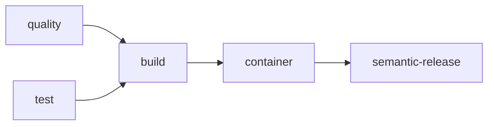
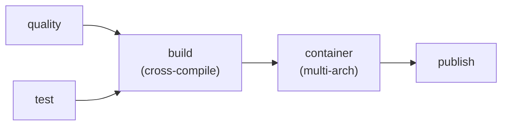

# hyperi-ci

One CLI for all your CI. Python, Rust, TypeScript, Go — same tool locally
and in GitHub Actions. No bash scripts, no composite actions, no submodules.

## Why Use This

**You get:**
- One command before every push: `hyperi-ci check`
- Same quality/test/build runs locally as in CI — no "works on my machine"
- Automatic versioning via semantic-release (just use conventional commits)
- Publishing when you're ready: `hyperi-ci release v1.3.0`
- Commit message validation that actually helps ("Computer says no.")

**Your repo gets:**
- A 5-line GitHub Actions workflow (calls our reusable workflow)
- A Makefile with `make check`, `make quality`, `make test`, `make build`
- Semantic-release config that just works
- A commit hook that catches bad messages before they hit CI

## Install

```bash
uv tool install hyperi-ci
```

## Set Up a Project

```bash
cd my-project
hyperi-ci init              # Auto-detects language, generates everything
git config core.hooksPath .githooks   # Activate commit validation hook
```

This creates `.hyperi-ci.yaml`, `Makefile`, `.github/workflows/ci.yml`,
`.releaserc.yaml`, and `.githooks/commit-msg`. Commit and push.

## Daily Workflow

```bash
# 1. Write code
# 2. Check before pushing (mandatory)
hyperi-ci check              # Quality + test
hyperi-ci check --quick      # Quality only (fast)
hyperi-ci check --full       # Quality + test + build

# 3. Commit (hook validates your message format)
git commit -m "fix: resolve timeout in auth handler"

# 4. Push
git pull --rebase origin main
git push origin main

# 5. CI runs automatically — semantic-release tags a version if warranted
```

## Publishing a Release

Versions accumulate on main. You choose when to ship:

```bash
# See what's available
hyperi-ci release --list
  v1.5.0  (2026-03-27)
  v1.4.0  (2026-03-25)

# Ship it
hyperi-ci release v1.5.0
```

This triggers the full pipeline: quality, test, build (cross-compile), publish.
Creates a GitHub Release, uploads binaries to R2, publishes to registries
(PyPI, crates.io, npm — depending on language and config).

Not every version needs publishing. `v1.4.0` stays as a tag — ship it later
or skip it entirely.

## Commit Messages

Conventional commits are enforced by a git hook and CI. The format:

```
<type>: <description>
<type>(scope): <description>
```

Get it wrong and you'll hear about it:

```
Computer says no.

  Unknown commit type: "yolo"

  Did you mean one of these?
    style  — code formatting, linting, cosmetic changes
    spike  — experimental, throwaway investigation
```

**Types that bump the version:** `feat:` (minor), `fix:` (patch), `perf:`,
`hotfix:`, `security:`/`sec:` (all patch).

**Types that don't:** `docs`, `test`, `refactor`, `chore`, `ci`, `build`,
`deps`, `style`, `revert`, `wip`, `cleanup`, `data`, `debt`, `design`,
`infra`, `meta`, `ops`, `review`, `spike`, `ui`.

Full list: `hyperi-ci check-commit --list`

## Publish Channels

Control where artifacts go with one line in `.hyperi-ci.yaml`:

```yaml
publish:
  channel: release    # spike | alpha | beta | release
  target: oss         # internal | oss | both
```

### Channel behaviour

Pre-release channels (`spike`, `alpha`, `beta`) automatically publish to
**internal staging only** (JFrog PyPI/Cargo), regardless of the configured
`publish.target`. This keeps pre-GA packages private. The `release` channel
publishes to whatever target is configured.

| Channel | Registry publish | GH Release | R2 binaries | R2 path |
|---------|-----------------|------------|-------------|---------|
| `spike` | Internal only (JFrog staging) | Prerelease | Uploaded | `/{project}/spike/v1.3.0/` |
| `alpha` | Internal only (JFrog staging) | Prerelease | Uploaded | `/{project}/alpha/v1.3.0/` |
| `beta` | Internal only (JFrog staging) | Prerelease | Uploaded | `/{project}/beta/v1.3.0/` |
| `release` | Configured target | GA | Uploaded | `/{project}/v1.3.0/` |

### Graduating to GA

```
spike → alpha → beta → release
```

Each step is a one-line change to `publish.channel` in `.hyperi-ci.yaml`.
No code changes, no workflow changes.

When `channel` reaches `release` and `target` is `oss` or `both`, the
package is published to public registries (PyPI, crates.io, npmjs).
Standard pre-release version conventions protect consumers:

| Registry | Pre-release versions | Default install behaviour |
|----------|---------------------|-------------------------|
| PyPI | `1.0.0a1`, `1.0.0b1`, `1.0.0rc1` | `pip install pkg` skips pre-releases |
| crates.io | `1.0.0-alpha.1`, `1.0.0-beta.1` | `cargo add pkg` skips pre-releases |
| npmjs | dist-tag `alpha`/`beta` | `npm install pkg` gets `latest` only |

Pre-release versions are discoverable but never installed by default.
Consumers must explicitly opt in (`pip install --pre`, `cargo add pkg@1.0.0-alpha.1`,
`npm install pkg@alpha`).

## Commands

| Command | What it does |
|---------|-------------|
| `hyperi-ci check` | Pre-push validation (quality + test) |
| `hyperi-ci check --quick` | Quality only |
| `hyperi-ci check --full` | Quality + test + build |
| `hyperi-ci run quality` | Lint, format, type check, security audit |
| `hyperi-ci run test` | Tests with coverage |
| `hyperi-ci run build` | Build artifacts |
| `hyperi-ci run container` | Build and push container image to GHCR |
| `hyperi-ci init-contract --app-name <name>` | Scaffold a starter `ci/deployment-contract.json` (Tier 3 onboarding) |
| `hyperi-ci emit-artefacts <output-dir>` | Generate Dockerfile + chart + ArgoCD app from a deployment contract |
| `hyperi-ci release --list` | List unpublished version tags |
| `hyperi-ci release <tag>` | Trigger publish for a tag |
| `hyperi-ci check-commit --list` | Show all accepted commit types |
| `hyperi-ci detect` | Show detected language |
| `hyperi-ci config` | Show merged config |
| `hyperi-ci trigger [--watch]` | Trigger CI workflow |
| `hyperi-ci watch [--timeout SEC]` | Watch latest CI run (default 3600s; `--timeout 0` disables) |
| `hyperi-ci logs [--failed]` | Show CI run logs |
| `hyperi-ci init` | Scaffold a new project |
| `hyperi-ci upgrade` | Upgrade to latest version |

## How It Works

GitHub Actions handles orchestration. The CLI handles execution. Workflow
files stay small, and the same code path runs locally and in CI.

```
Your Project                        hyperi-ci
├── .github/workflows/ci.yml       ├── .github/workflows/
│   (5 lines — calls reusable)     │   ├── rust-ci.yml    (reusable)
├── .hyperi-ci.yaml                │   ├── python-ci.yml  (reusable)
├── .releaserc.yaml                │   ├── ts-ci.yml      (reusable)
├── .githooks/commit-msg           │   └── go-ci.yml      (reusable)
└── Makefile                       └── src/hyperi_ci/
                                       ├── cli.py         (entry point)
                                       ├── dispatch.py    (stage router)
                                       └── languages/     (per-language handlers)
```

**On push to main:**



**On publish dispatch:**



## Config

`.hyperi-ci.yaml` in the project root. Cascade (highest wins):

```
CLI flags -> ENV vars (HYPERCI_*) -> .hyperi-ci.yaml -> defaults.yaml -> hardcoded
```

```yaml
language: rust              # Auto-detected if omitted
publish:
  enabled: true
  target: both              # internal | oss | both
  channel: release          # spike | alpha | beta | release
build:
  strategies: [native]
  rust:
    targets:
      - x86_64-unknown-linux-gnu
      - aarch64-unknown-linux-gnu
quality:
  gitleaks: blocking
```

## Container Builds & Deployment Artefacts

Every app emits its container image, Helm chart, and ArgoCD `Application`
from a single language-agnostic JSON contract — `ci/deployment-contract.json`.
hyperi-ci's container stage regenerates these on every push and diff-checks
against the committed `ci/` to catch drift.

Three-tier producer model (auto-detected):

| Tier | Detected by | Producer |
|---|---|---|
| **Tier 1** (`rust`) | Cargo.toml + `hyperi-rustlib` dep | `<app> generate-artefacts` (rustlib) |
| **Tier 2** (`python`) | pyproject.toml + `hyperi-pylib` dep | `<app> generate-artefacts` (pylib) |
| **Tier 3** (`other`) | `ci/deployment-contract.json` only | `hyperi-ci emit-artefacts` |
| (none) | nothing | container stage no-ops silently |

All three tiers emit **byte-identical** output for the same JSON contract —
verified by the cross-tier parity test suite.

For Tier 3 onboarding: `hyperi-ci init-contract --app-name my-app` scaffolds
a starter `ci/deployment-contract.json`, then commit it and run
`hyperi-ci emit-artefacts ci/` to regenerate.

See [`docs/deployment-contract.md`](docs/deployment-contract.md) for the
user guide and [`docs/superpowers/specs/2026-04-30-deployment-contract-three-tier-design.md`](docs/superpowers/specs/2026-04-30-deployment-contract-three-tier-design.md)
for the full architecture.

Images push to GHCR (`ghcr.io/hyperi-io/<app>`). Tags:
- Push to main: `:sha-abc1234`
- Release: `:v1.13.5` + `:latest`
- Pre-release: `:v1.13.5-alpha`

Enable in `.hyperi-ci.yaml`:

```yaml
publish:
  container:
    enabled: auto    # auto | true | false
    platforms: [linux/amd64, linux/arm64]
```

## Languages

| Language | Quality | Test | Build | Publish |
|----------|---------|------|-------|---------|
| Python | ruff, ty, bandit, pip-audit | pytest | uv build | uv publish (PyPI / JFrog staging) |
| Rust | cargo fmt, clippy, audit, deny, **feature_matrix** | cargo test/nextest | cargo build (cross) | cargo publish (crates.io / JFrog staging) |
| TypeScript | eslint, prettier, tsc, npm audit | vitest/jest | npm/pnpm build | npm publish (npmjs / GH Packages) |
| Go | gofmt, go vet, golangci-lint, gosec | go test -race | go build (cross) | go proxy, gh release |

## Rust Feature Matrix Check

Rust projects automatically get a `cargo hack --each-feature --no-dev-deps check --lib`
pass during quality checks. This catches feature-gating bugs where a module behind
feature `X` uses a crate only declared by feature `Y` — without this check,
transitive deps from other features mask the bug until a downstream consumer
enables only `X`.

**Default behaviour** (always on, zero config): runs the bare-crate check
(`cargo check --no-default-features --lib`) plus the each-feature pass.

**Opt out** (requires a reason; CI fails if reason is missing):

```yaml
quality:
  rust:
    feature_matrix:
      enabled: false
      reason: "tracked in dfe-loader#87, remediating 2026-04-18"
```

**Edge cases** (rare; most projects need none of these):

```yaml
quality:
  rust:
    feature_matrix:
      exclude: ["_internal-debug"]                 # skip private features
      mutually_exclusive:                          # pairs that must not coexist
        - ["native-tls", "rustls"]
      also_check_no_default_features: true        # default true
      extra_args: ["--workspace"]                  # passed through to cargo hack
```

## Rust Documentation Hint

Quality stage emits a single concise warning if `cargo doc` finds rustdoc
issues (broken intra-doc links, bare URLs, invalid code blocks, etc).
**Non-blocking by design** — rustdoc hygiene is a ratchet, not a gate. The
warning points to:

- <https://doc.rust-lang.org/rustdoc/> — rustdoc tooling reference
- <https://rust-lang.github.io/api-guidelines/documentation.html> — C-DOCS
- `hyperi-ai/standards/languages/RUST.md` § Documentation — HyperI standard

To silence:

```yaml
quality:
  rust:
    rustdoc_hint:
      enabled: false
```

## Cross-Compilation

Rust projects with C/C++ dependencies (librdkafka, openssl, zstd) are
supported. The build handler auto-detects native `-dev` packages, downloads
cross-arch equivalents into a private sysroot, and sets all compiler/linker
environment variables. Configure targets in `.hyperi-ci.yaml`:

```yaml
build:
  rust:
    targets:
      - x86_64-unknown-linux-gnu
      - aarch64-unknown-linux-gnu
```

Main branch builds amd64 only (validation). Publish builds the full matrix.

## Design Principles

1. **No bash** — all CI logic is Python. `subprocess.run()` with list args.
2. **Semantic release** — push to main, versions happen automatically.
3. **uv for everything** — venv, sync, lock, tool install, build.
4. **Cross-platform** — Linux (CI) and macOS (dev).
5. **Self-hosting** — hyperi-ci uses itself for its own CI.

## Licence

Proprietary — HYPERI PTY LIMITED
