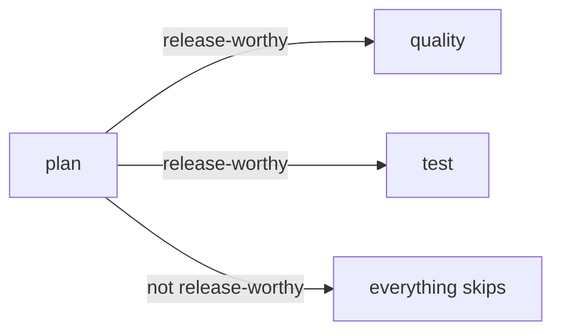
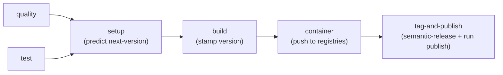

# hyperi-ci

One CLI for all your CI. Python, Rust, TypeScript, Go — same tool locally
and in GitHub Actions. No bash scripts, no composite actions, no submodules.

## What's New in v2.0

**Version-first single-run pipeline.** A `Release: true` git trailer on
your head commit is the single signal that a push is a release. The CI
run predicts the next version up front, stamps it into Cargo.toml /
VERSION / pyproject.toml / package.json **before** the build, then tags
+ uploads to all configured registries — all in one workflow. No second
"catch-up" build, no version-stamp drift between binary and tag.

**Tag-on-publish.** A git tag exists iff the artefact is in the
registry. Aligns with kubernetes / rust / python OSS conventions. No
more orphan tags from "tag every fix:, publish later" mode.

**100% FOSS pipeline.** Every artefact publishes to public registries:
crates.io, PyPI, npm, GHCR, GitHub Releases, and Cloudflare R2
(`downloads.hyperi.io`). The legacy `publish.target` knob is accepted
in `.hyperi-ci.yaml` for backward compatibility but **ignored at
runtime** — JFrog publishing was removed in v2.1.4. The only switch
left to flip for full open-source visibility is making the source
repos themselves public.

See [docs/migration/onboarding.md](docs/migration/onboarding.md) for the v1 → v2
migration. Pre-v2.1.4 docs that mention JFrog targets, the
`destinations_internal` block, or `target: internal` are historical
only — those code paths have been removed.

## Why Use This

**You get:**

- One command before every push: `hyperi-ci check`
- Same quality / test / build runs locally as in CI — no "works on my machine"
- Automatic versioning via semantic-release (just use conventional commits)
- One-shot release: `hyperi-ci push --release` (single CI run, single tag, single registry upload)
- Commit message validation that actually helps ("Computer says no.")

**Your repo gets:**

- A 5-line GitHub Actions workflow (calls our reusable workflow)
- A Makefile with `make check`, `make quality`, `make test`, `make build`
- Semantic-release config that just works
- A commit hook that catches bad messages before they hit CI

## Preventative, Not Detective

hyperi-ci is the preventative layer: gitleaks blocks a secret before
the push, commit validation blocks a bad message before it lands,
quality gates block a broken build before it merges. GitHub's native
security features (secret scanning alerts, CodeQL code scanning,
Dependabot) are the detective layer - they find what already landed,
or what arrived from upstream in repos hyperi-ci never runs on
(external forks, mirrors). Run both: hyperi-ci stops you making the
mess, the GitHub side catches the mess you inherited.

## Install

```bash
uv tool install hyperi-ci
```

## Set Up a Project

```bash
cd my-project
hyperi-ci init                          # Auto-detects language, generates everything
git config core.hooksPath .githooks     # Activate commit validation hook
```

This creates `.hyperi-ci.yaml`, `Makefile`, `.github/workflows/ci.yml`,
and `.githooks/commit-msg`. Commit and push. No `.releaserc` is scaffolded -
version bumps follow semantic-release's own default rules (a repo commits a
`.releaserc.json` only for a genuine exception).

## Daily Workflow

```bash
# 1. Write code
# 2. Check before pushing (mandatory)
hyperi-ci check                         # Quality + test
hyperi-ci check --quick                 # Quality only (fast)
hyperi-ci check --full                  # Quality + test + build
hyperi-ci check --strict                # Also fail on warn-tier findings (zero warnings)

# 3. Commit (hook validates your message format)
git commit -m "fix: resolve timeout in auth handler"

# 4. Push (ships nothing -- no tag, no release)
hyperi-ci push

# That's it. Quality and test run if the pushed range is release-worthy.
# Nothing compiles, no image is built, no tag, no registry is touched.
```

## Releasing

You opt in to a release explicitly. Two ways:

### Primary: `hyperi-ci push --release`

```bash
git commit -m "fix: handle empty tenant id"
hyperi-ci push --release        # --publish still works
```

This amends your head commit with the `Release: true` git trailer, then
pushes. The single CI run:

1. Reads the trailer in setup → declares this a release run
2. Runs `npx semantic-release --dry-run` to predict the next version (e.g. v1.5.4)
3. Stamps that version into Cargo.toml + VERSION before build
4. Builds (binary now embeds CARGO_PKG_VERSION = 1.5.4)
5. Builds + pushes container image to GHCR (multi-arch)
6. Runs `npx semantic-release` for real → creates tag, CHANGELOG commit
7. Uploads binaries to GitHub Release + R2; publishes to crates.io / PyPI / npm

One workflow run, one tag, one release.

### Forced bump: ship a release with no release-worthy commits

Sometimes the work you want to ship is a docs-only PR, a refactor, or
just a "force a rebuild" — none of which warrant a semver bump under
conventional-commits rules. To avoid having to invent a fake `fix:`
commit:

```bash
hyperi-ci push --bump-patch        # +0.0.1 even with docs:/chore: commits
hyperi-ci push --bump-minor        # +0.1.0
```

Either flag implies `--release`. Under the hood, the tool adds an empty
`fix(release): force patch bump` (or `feat(release): force minor bump`)
commit on top of HEAD with the `Release: true` trailer. semantic-release
sees that and cuts the version. Honest git history: the marker commit
explicitly states "this is a forced bump."

Major bumps are deliberately excluded from this flag — they require a
human-written `BREAKING CHANGE:` footer per HyperI commit-type discipline.

### Secondary: re-release an existing tag

If a previous release run failed mid-way (e.g. registry timeout) and you
want to retry without re-tagging:

```bash
hyperi-ci release v1.5.4         # `publish` still works
```

This dispatches a `workflow_dispatch` event for the tag and runs
build → container → publish from the existing tagged source.

```bash
hyperi-ci release --list         # see unreleased tags
```

### What pushes WITHOUT `--release`

A plain `hyperi-ci push` ships nothing and builds nothing -- `run-build` is
release-only, so no cargo compile and no container job runs at all. Quality
and test run when the pushed range is release-worthy (it carries a `feat:`,
`fix:` or `perf:`), and skip entirely when it is not.

So the default state of `main` is "landed, and tested if it was
release-worthy" -- not "built and ready to ship". You release explicitly by
running `hyperi-ci push --release` on the next conventional commit.

## Commit Messages

Conventional commits are enforced by a git hook and CI. The format:

```
<type>: <description>
<type>(scope): <description>
```

Get it wrong and you'll hear about it:

```
Computer says no.

  Unknown commit type: "yolo"

  Did you mean one of these?
    style  — code formatting, linting, cosmetic changes
    spike  — experimental, throwaway investigation
```

**Types that bump the version:** `feat:` (minor), `fix:` (patch), `perf:`,
`hotfix:`, `security:` / `sec:` (all patch).

**Types that don't:** `docs`, `test`, `refactor`, `chore`, `ci`, `build`,
`deps`, `style`, `revert`, `wip`, `cleanup`, `data`, `debt`, `design`,
`infra`, `meta`, `ops`, `review`, `spike`, `ui`.

Full list: `hyperi-ci check-commit --list`

## Release Channels

Control where artifacts go with one line in `.hyperi-ci.yaml`:

```yaml
release:
  channel: release    # alpha | beta | release
```

The namespace was `publish:` and still works -- a `publish:` block folds into
`release:` at load time and names each key it moved. Nothing has to change to
keep building.

### Release destinations

Every artefact publishes to the OSS registry stack:

| Artefact type | Destination |
|---|---|
| Containers | GHCR (`ghcr.io/<org>`) |
| Rust crates | crates.io |
| Python packages | PyPI |
| npm packages | npmjs.com |
| Binaries (per-tag) | GitHub Releases |
| Binaries (web-downloadable) | Cloudflare R2 (`downloads.hyperi.io`) |
| Helm charts | OCI under GHCR |

The `publish.target` config field is still accepted in `.hyperi-ci.yaml` for
backward compatibility — values like `internal` or `both` are read,
preserved on the `CIConfig` object, and **silently routed to the OSS
destination map**. JFrog publishing was removed in v2.1.4. It is a different
thing from the `publish-target` workflow input, which is still live. The only
remaining toggle for full FOSS visibility is making the source repos
themselves public on GitHub.

### Channel behaviour

Pre-release channels (`alpha`, `beta`) flag GH Releases as
prerelease and prefix R2 paths. Stable releases require `channel: release`.

| Channel | GH Release | R2 path |
|---|---|---|
| `alpha` | Prerelease | `/{project}/alpha/v1.3.0/` |
| `beta`  | Prerelease | `/{project}/beta/v1.3.0/` |
| `release` | GA | `/{project}/v1.3.0/` + `/{project}/latest/` |

### Graduating to GA

```
alpha -> beta -> release
```

Each step is a one-line change to `release.channel` in `.hyperi-ci.yaml`.
No code changes, no workflow changes.

## Commands

| Command | What it does |
|---|---|
| `hyperi-ci check` | Pre-push validation (quality + test) |
| `hyperi-ci check --quick` | Quality only |
| `hyperi-ci check --full` | Quality + test + build |
| `hyperi-ci check --strict` | Also fail on warn-tier findings - see [docs/quality-gate.md](docs/quality-gate.md) |
| `hyperi-ci push` | Push -- ships nothing, quality + test if release-worthy |
| `hyperi-ci push --release` | Stamp `Release: true` trailer, push, single-run release |
| `hyperi-ci push --bump-patch` | Force +0.0.1 release even with no-bump commits |
| `hyperi-ci push --bump-minor` | Force +0.1.0 release even with no-bump commits |
| `hyperi-ci push --no-ci` | Push with `[skip ci]` (skip CI entirely) |
| `hyperi-ci release <tag>` | Retroactive: dispatch a release on an existing tag |
| `hyperi-ci release --list` | List unreleased version tags |
| `hyperi-ci run quality\|test\|build\|generate\|container\|publish` | Run a single stage locally |
| `hyperi-ci init-contract --app-name <name>` | Scaffold `ci/deployment-contract.json` (Tier 3) |
| `hyperi-ci emit-artefacts <output-dir>` | Generate Dockerfile + chart + ArgoCD app from contract |
| `hyperi-ci stitch <dir>` | Compose a deployment topology into an umbrella Helm chart |
| `hyperi-ci init-gitops <dir>` | Scaffold a new gitops monorepo |
| `hyperi-ci init-topology <name>` | Scaffold a new topology in existing gitops repo |
| `hyperi-ci check-commit --list` | Show all accepted commit types |
| `hyperi-ci detect` | Show detected language |
| `hyperi-ci config` | Show merged config |
| `hyperi-ci trigger [--watch]` | Trigger CI workflow |
| `hyperi-ci watch [RUN_ID] [--workflow NAME]` | Watch HEAD's own CI run (default 3600s; `--timeout 0` disables) |
| `hyperi-ci logs [RUN_ID] [--workflow NAME] [--failed]` | Show CI run logs for HEAD's own run |
| `hyperi-ci init` | Scaffold a new project |
| `hyperi-ci update` | Update to the channel's release (see `autoupdate`) |
| `hyperi-ci autoupdate [status\|channel live\|stable\|freeze\|unfreeze]` | Show/set how the CLI updates itself |

`watch` and `logs` resolve the run built from the commit at HEAD, pinned
to the workflow declared in the project's `.github/workflows/ci.yml` -
never "whichever ran last". Name another with `--workflow`; where the
choice is still ambiguous they refuse and list the candidates.

`hyperi-ci release` is the canonical verb. `hyperi-ci publish` still works and
warns. An earlier notice deprecated `release` for removal; that was the wrong
way round and is withdrawn -- `release` is the name that stays.

Every old spelling keeps working: the `Publish: true` trailer, a `publish:`
config block, `push --publish`, and `hyperi-ci publish`. Each warns and names
its replacement. No project has to change anything to keep building.

## How It Works

```
Your Project                          hyperi-ci
├── .github/workflows/ci.yml          ├── .github/
│   (5 lines — calls reusable)        │   ├── workflows/
├── .hyperi-ci.yaml                   │   │   ├── rust-ci.yml         (per-language)
├── .githooks/commit-msg              │   │   ├── python-ci.yml       (per-language)
└── Makefile                          │   │   ├── go-ci.yml           (per-language)
                                      │   │   ├── ts-ci.yml           (per-language)
                                      │   │   └── _release-tail.yml   (shared: container + publish)
                                      │   └── actions/
                                      │       └── predict-version/    (shared composite)
                                      └── src/hyperi_ci/
                                          ├── cli.py                  (entry point)
                                          ├── dispatch.py             (stage router)
                                          ├── push.py                 (push --release)
                                          ├── publish/                (binaries + retro dispatch)
                                          ├── container/              (docker build/push)
                                          ├── deployment/             (contract / artefact gen)
                                          └── languages/              (per-language stage handlers)
```

### Pipeline (push to main, no `Release: true` trailer)


```mermaid
flowchart LR
    P[plan] -->|release-worthy| Q[quality]
    P -->|release-worthy| T[test]
    P -->|not release-worthy| S[everything skips]
```

No build, no container, no tag, no registry upload. A release-worthy merge is
TESTED, not shipped -- `run-build` is release-only, so nothing compiles and no
image is produced until you release.

### Pipeline (push to main with `Release: true` trailer, OR workflow_dispatch)


```mermaid
flowchart LR
    Q[quality] --> S["setup<br/>(predict next-version)"]
    T[test] --> S
    S --> B["build<br/>(stamp version)"]
    B --> C["container<br/>(push to registries)"]
    C --> TP["tag-and-publish<br/>(semantic-release + run publish)"]
```

One workflow, one tag, one release.

## Config

`.hyperi-ci.yaml` in the project root. Cascade (highest wins):

```
CLI flags -> ENV vars (HYPERCI_*) -> .hyperi-ci.yaml -> defaults.yaml -> hardcoded
```

```yaml
language: rust              # Auto-detected if omitted
release:                    # was `publish:` -- still accepted, warns
  enabled: true
  target: oss               # legacy no-op, any value routes to OSS
  channel: release          # alpha | beta | release
build:
  strategies: [native]
  rust:
    targets:
      - x86_64-unknown-linux-gnu
      - aarch64-unknown-linux-gnu
quality:
  gitleaks: blocking
```

## Container Builds & Deployment Artefacts

Every app emits its container image, Helm chart, and ArgoCD `Application`
from a single language-agnostic JSON contract — `ci/deployment-contract.json`.
The Build stage regenerates these via `hyperi-ci run generate`, and the
Quality stage drift-checks the committed `ci/` against the contract.

Three-tier producer model (auto-detected):

| Tier | Detected by | Producer |
|---|---|---|
| **Tier 1** (`rust`) | Cargo.toml + `scalo` dep | `<app> generate-artefacts` (scalo) |
| **Tier 2** (`python`) | pyproject.toml + `scalo` dep | `<app> generate-artefacts` (scalo) |
| **Tier 3** (`other`) | `ci/deployment-contract.json` only | `hyperi-ci emit-artefacts` |
| (none) | nothing | container stage no-ops silently |

All three tiers emit **byte-identical** output for the same JSON contract —
verified by the cross-tier parity test suite.

For Tier 3 onboarding: `hyperi-ci init-contract --app-name my-app`
scaffolds a starter `ci/deployment-contract.json`, then commit it and
run `hyperi-ci emit-artefacts ci/` to regenerate.

See [`docs/deployment/contract.md`](docs/deployment/contract.md) for the
user guide.

Images push to GHCR (`ghcr.io/hyperi-io/<app>`). Tags:

- Push to main with `Release: true`: `:vX.Y.Z` + `:latest` + `:sha-abc1234`
- workflow_dispatch on tag: same tag set on the existing tagged source

Enable in `.hyperi-ci.yaml`:

```yaml
release:
  container:
    enabled: auto    # auto | true | false
    platforms: [linux/amd64, linux/arm64]
```

## Languages

| Language | Quality | Test | Build | Publish |
|---|---|---|---|---|
| Python | ruff, ty, bandit, pip-audit | pytest | uv build | uv publish (PyPI) |
| Rust | cargo fmt, clippy, audit, deny, **feature_matrix** | cargo test/nextest | cargo build (cross) | cargo publish (crates.io) |
| TypeScript | eslint, prettier, tsc, npm audit | vitest/jest | npm/pnpm build | npm publish (npmjs / GH Packages) |
| Go _(beta)_ | gofmt, go vet, golangci-lint, gosec | go test -race | go build (cross) | go proxy, gh release |

> **Go support is beta** — functional but not battle-tested to the same
> degree as Rust, Python, and TypeScript. Verify results carefully on
> production pipelines.

Per-language version stamping (release runs only):

| Language | Stamps |
|---|---|
| Rust | `Cargo.toml` `[package].version` (and `[workspace.package].version` for workspaces) + `VERSION` |
| Python | `pyproject.toml` `[project].version` + `VERSION` |
| Go | `VERSION` (consumed via `-ldflags "-X main.Version=..."`) |
| TypeScript | `package.json` (via `npm version --no-git-tag-version`) + `VERSION` |

## Rust Feature Matrix Check

Rust projects automatically get a `cargo hack --each-feature --no-dev-deps check --lib`
pass during quality checks. This catches feature-gating bugs where a module behind
feature `X` uses a crate only declared by feature `Y` — without this check,
transitive deps from other features mask the bug until a downstream consumer
enables only `X`.

**Default behaviour** (always on, zero config): runs the bare-crate check
(`cargo check --no-default-features --lib`) plus the each-feature pass.

**Opt out** (requires a reason; CI fails if reason is missing):

```yaml
quality:
  rust:
    feature_matrix:
      enabled: false
      reason: "tracked in dfe-loader#87, remediating 2026-04-18"
```

## Cross-Compilation

Rust projects with C/C++ dependencies (librdkafka, openssl, zstd) are
supported. The build handler auto-detects native `-dev` packages, downloads
cross-arch equivalents into a private sysroot, and sets all compiler/linker
environment variables. Configure targets in `.hyperi-ci.yaml`:

```yaml
build:
  rust:
    targets:
      - x86_64-unknown-linux-gnu
      - aarch64-unknown-linux-gnu
```

Push to main without `Release: true` builds amd64 only (validation).
Release runs build the full matrix.

## Design Principles

1. **Version-first** — predict version up front, stamp before build. No catch-up rebuild.
2. **Tag-on-publish** — git tags exist iff the artefact is in the registry.
3. **No silent skips** — fail loud on broken handoffs (missing artefacts, missing handlers, etc.).
4. **No bash** — all CI logic is Python. `subprocess.run()` with list args.
5. **Semantic release** — push to main with `Release: true` triggers a single-run release.
6. **uv for everything** — venv, sync, lock, tool install, build.
7. **Cross-platform** — Linux (CI) and macOS (dev).
8. **Self-hosting** — hyperi-ci uses itself for its own CI.

## Licence

This software is licensed under the Business Source License 1.1 (BUSL-1.1).
See [LICENSE](LICENSE) for terms and [COMMERCIAL.md](COMMERCIAL.md) for commercial
use; each version converts to Apache 2.0 three years after its release.
(c) 2026 HYPERI PTY LIMITED.
