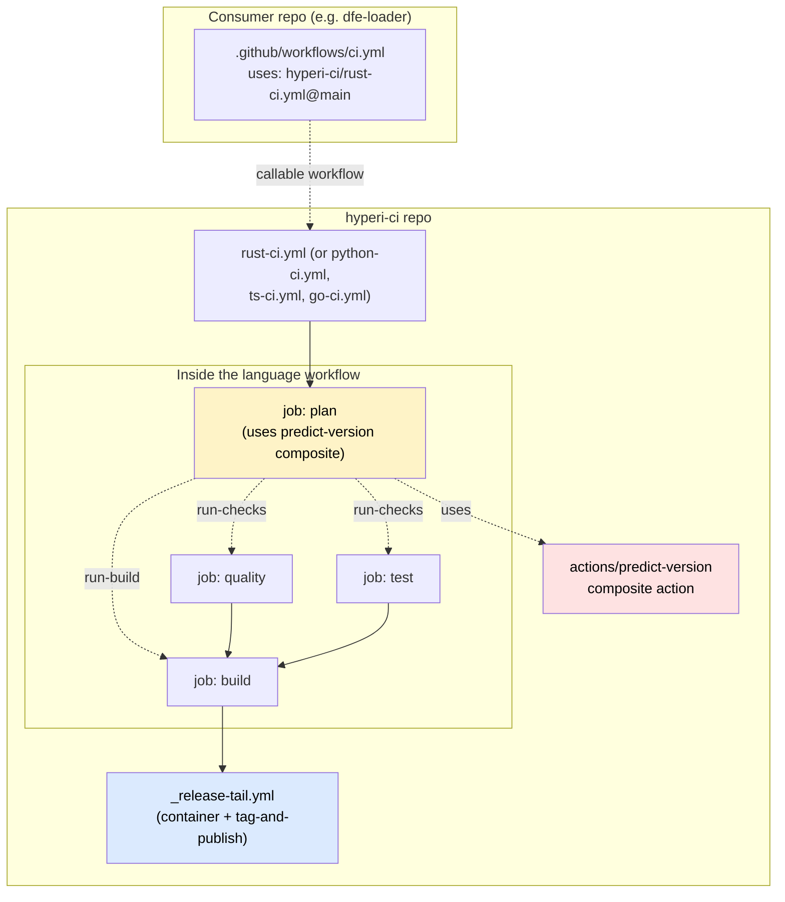
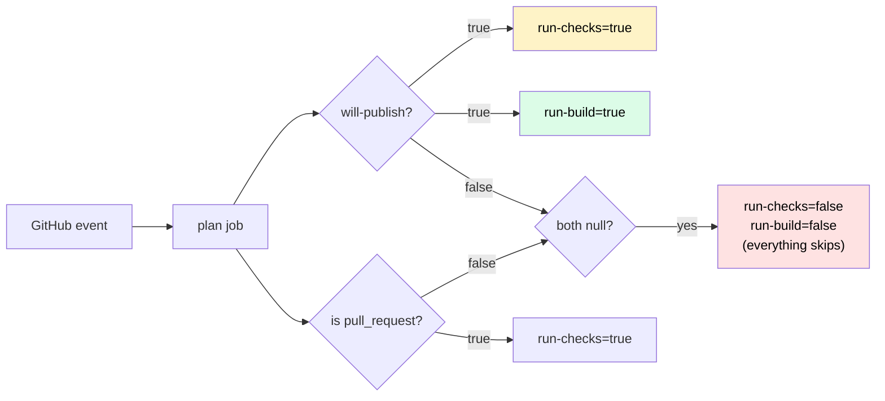

# hyperi-ci Architecture

> **Reading order:** start here, then [README.md](../README.md) for usage,
> then [STATE.md](../STATE.md) for current decisions and constraints.
> Plans for in-flight work live under `docs/superpowers/plans/`.

## What hyperi-ci is

A single CLI tool (`hyperi-ci`) plus a small set of GitHub Actions
reusable workflows that consumer projects (rust, python, typescript,
go) call from a thin `ci.yml`. The CLI handles language-aware
quality / test / build / publish dispatching; the workflows handle
GitHub-side orchestration: predict-and-gate, container build, tag,
publish.

## Workflow architecture (KISS, post-2026-05-08)

Two levels of indirection. No deeper.

## The contract every language workflow follows

Each `<lang>-ci.yml` is a `workflow_call` reusable workflow with the
same five jobs, in the same order, gating on the same plan outputs.
The internal implementation of quality/test/build is language-specific
(language-specific tools, toolchain setup, cache keys) — that's the
only place language-divergence is allowed.

| Job | needs | if condition | Purpose |
|---|---|---|---|
| `plan` | (none — runs first) | (none — always runs) | Decide if this is a publish-worthy run; emit gate outputs |
| `quality` | `[plan]` | `run-checks == 'true'` | Lint / typecheck / security scan |
| `test` | `[plan]` | `run-checks == 'true'` | Unit + integration tests |
| `build` | `[plan, quality, test]` | `run-build == 'true'` | Compile binaries / wheels / packages |
| `release-tail` | `[plan, build]` | (own gates inside) | Container + tag-and-publish via shared workflow |

### Gate output semantics (computed in `plan`)

| Output | True when | Effect |
|---|---|---|
| `run-checks` | `will-publish == 'true'` OR `event_name == 'pull_request'` | Run quality + test |
| `run-build` | `will-publish == 'true'` | Run build + container + publish |
| `will-publish` | Push to main with `Publish: true` trailer, OR workflow_dispatch | The underlying release-worthy signal |
| `next-version` | `will-publish` AND push event | Predicted semver from semantic-release dry-run |
| `build-matrix` | always | Single-arch for validate-only, multi-arch for publish |

**Why two derived gates:** PR runs need quality + test (review feedback)
but never run build/container/publish. chore: / docs: pushes to main
need NO heavy compute. The two outputs encode both rules.

## What gets skipped when

| Push type | plan | quality | test | build | container | tag-and-publish |
|---|---|---|---|---|---|---|
| `chore: …` to main | ✅ | ❌ | ❌ | ❌ | ❌ | ❌ |
| `docs: …` to main | ✅ | ❌ | ❌ | ❌ | ❌ | ❌ |
| `feat:` / `fix:` to main (no Publish trailer) | ✅ | ❌ | ❌ | ❌ | ❌ | ❌ |
| `feat:` / `fix:` to main + `Publish: true` trailer | ✅ | ✅ | ✅ | ✅ | ✅ | ✅ |
| Pull request | ✅ | ✅ | ✅ | ❌ | ❌ | ❌ |
| `workflow_dispatch` with tag (retroactive publish) | ✅ | ✅ | ✅ | ✅ | ✅ | ✅ |

The "no Publish trailer" row is by design: tag-on-publish doctrine.
A commit lands on main → no tag, no artefacts. Operator types
`hyperi-ci push --publish` (or amends `Publish: true` then re-pushes)
to opt in.

## Maintenance-burden policy

This is a small team. Pinning every reusable-workflow ref to a SHA
adds maintenance overhead with little real security benefit for
same-org refs. The policy:

| Ref kind | Strategy | Rationale |
|---|---|---|
| Same-org reusable workflow (`hyperi-io/hyperi-ci/.github/workflows/X.yml`) | `@main` | Same org, same repo, threat model is "honest mistake on main"; mitigated by hyperi-ci's own CI gates |
| Same-org composite action (`hyperi-io/hyperi-ci/.github/actions/X`) | `@main` | Same as above |
| Third-party action (`actions/checkout`, `docker/login-action`, `dtolnay/rust-toolchain`, etc.) | SHA-pinned via Renovate | Action hijack is a real threat; SHA-pinning is the documented mitigation |
| Inline 5-10 line steps repeated across language workflows | **Inlined** (not extracted to composite actions) | Composite-action indirection costs more than the 5 lines saved; drift caught by gate-consistency lint test |

**No `_ci.yml` or `_setup.yml` indirection.** Web research (astral-sh/uv,
tokio-rs/tokio, vercel/turborepo) shows mature multi-language repos
keep CI logic flat with a plan job + gates, not chained reusable
workflows.

## What's shared vs. what's duplicated (deliberately)

| Concern | Shared? | Where |
|---|---|---|
| Predict-and-gate logic | YES | `actions/predict-version/action.yml` composite action |
| Release tail (container + tag-and-publish) | YES | `_release-tail.yml` reusable workflow |
| Toolchain setup, dep install, build commands | NO | Inline per-language inside each workflow |
| Plan job structure | DUPLICATED inline | ~30 lines × 4 = 120 lines duplicated; cheaper than the abstraction would cost |
| Gate `if:` strings | DUPLICATED inline | Identical strings across 4 files; **lint-tested** by `tests/unit/test_workflow_consistency.py` |

## Why this is right (per 2026 community evidence)

- [astral-sh/uv ci.yml](https://github.com/astral-sh/uv/blob/main/.github/workflows/ci.yml) — same plan-job pattern in production; one of the largest Rust+Python OSS projects
- [tokio-rs/tokio ci.yml](https://github.com/tokio-rs/tokio/blob/master/.github/workflows/ci.yml) — flat, no reusable-workflow chains
- [vercel/turborepo workflows](https://github.com/vercel/turborepo/tree/main/.github/workflows) — separate files per concern, none chained internally
- ["GitHub Actions Is Slowly Killing Your Engineering Team"](https://www.iankduncan.com/engineering/2026-02-05-github-actions-killing-your-team/) — explicit warning against generic-abstraction-layer reusable workflows
- [Composite-action path resolution discussion #26245](https://github.com/orgs/community/discussions/26245) — confirms the cross-repo `./` problem is unsolved as of May 2026

## Future portability (aspirational)

We may move from GitHub + GitHub Actions to Codeberg (git) +
Buildkite (CI) when budget and time allow. Not on the near-term
roadmap, but it shapes design today:

- The `hyperi-ci` Python CLI owns the work — quality, test, build,
  publish. The reusable workflows are thin runner glue around it.
  Porting to Buildkite means rewriting the glue, not the CLI.
- Handler code (`src/hyperi_ci/languages/<lang>/*.py`) avoids
  GitHub-only assumptions: no `${{ ... }}` template syntax leaking
  into Python, no GHCR-only auth flows hardcoded in publish handlers.
- The plan job + gate-output pattern translates directly to
  Buildkite's dynamic pipelines.

The shared CI tool keeps the cost of switching CI vendors bounded.

## Pre-2026-05-08 archaeology

Before this consolidation, `_setup.yml` existed as a shared first-job
reusable workflow, and a planned `_ci.yml` orchestrator was sketched
in conversation. Both were dropped because they added indirection
without earning it. Git history before the 2026-05-08 KISS commits
shows the older shape if anyone needs to reconstruct context.
