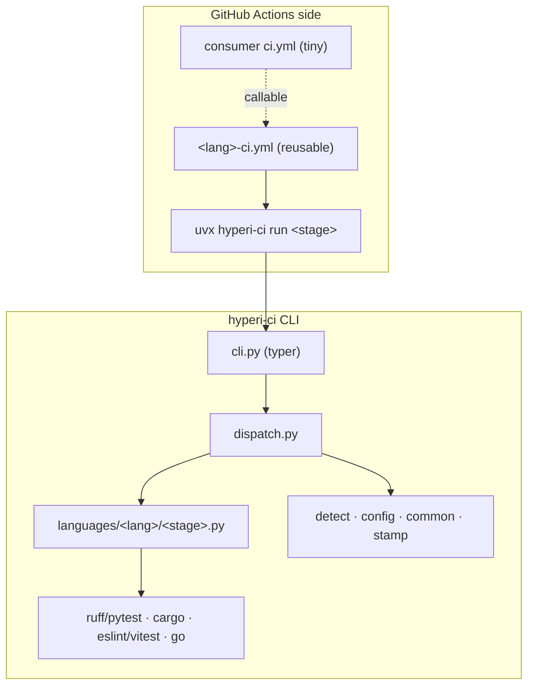
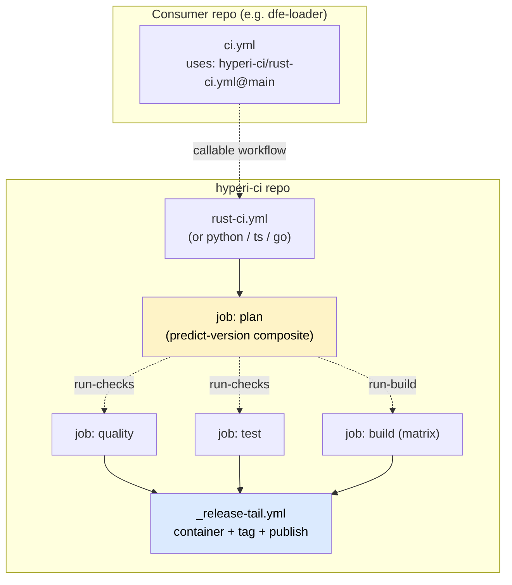
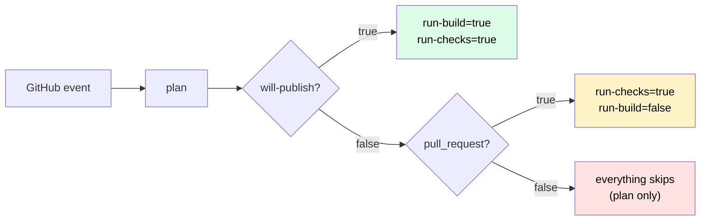

# hyperi-ci architecture

> Start here, then [FLOW.md](FLOW.md) for the push→release lifecycle.

## What it is

A single Python CLI (`hyperi-ci`) plus a thin set of GitHub Actions reusable
workflows. It replaced a legacy system (~100 shell scripts, 50+ composite
actions, a six-layer dispatch hierarchy) with one tool that runs identically
on a laptop and in CI, across Rust, Python, TypeScript and Go.

Two sides, one job each:

- **CLI side** does the work — lint, test, build, publish — via `subprocess`
  to language tools. No bash logic; 70% of old-CI failures were bash syntax.
- **GitHub Actions side** does orchestration only — job ordering, matrix,
  caching, secrets, the predict-and-gate, container build, tag, publish.



**Why the split:** workflow files stay tiny (no YAML logic); tool invocation is
tested locally before CI; a new check is a Python change, not workflow YAML;
the same code path runs everywhere, so "works locally, fails in CI" largely
disappears. It also bounds the cost of one day moving off GitHub Actions
(→ Buildkite): rewrite the glue, keep the CLI.

## Workflow model — two levels, no deeper



Level 1 = the consumer's `ci.yml` calling `<lang>-ci.yml@main`. Level 2 = that
language workflow calling the shared `_release-tail.yml` and the composites.
No `_setup.yml`/`_ci.yml` orchestrator chains. Web research (astral-sh/uv,
tokio-rs/tokio, vercel/turborepo) shows mature multi-language repos keep CI
flat with a plan job + gates, not chained reusable workflows.

## The job contract every language follows

Each `<lang>-ci.yml` is a `workflow_call` reusable workflow with the same jobs,
same order, gating on the same `plan` outputs. Only the *internals* of
quality/test/build differ per language (tools, toolchain, cache keys) — that is
the single place language divergence is allowed.

| Job | needs | if | Purpose |
|---|---|---|---|
| `plan` | — | always | Decide if this run is publish-worthy; emit gate outputs |
| `quality` | `[plan]` | `run-checks` | Lint / typecheck / security scan |
| `test` | `[plan]` | `run-checks` | Unit + integration tests |
| `build` | `[plan, quality, test]` | `run-build` | Compile binaries / wheels / packages, stamp version, upload `dist/` |
| `release-tail` | `[plan, build]` | own gates | Container + tag-and-publish, via shared `_release-tail.yml` |

### Gate outputs (computed in `plan`)

| Output | True when | Effect |
|---|---|---|
| `will-publish` | push to main with `Publish: true` trailer, OR `workflow_dispatch` | The underlying release signal |
| `run-checks` | `will-publish` OR `pull_request` | Run quality + test |
| `run-build` | `will-publish` | Run build + container + publish |
| `next-version` | `will-publish` AND push | Predicted semver from semantic-release dry-run |
| `build-matrix` | always | Single-arch for validate-only, multi-arch for publish |

**Two derived gates** because PR runs need quality+test (review feedback) but
never build/publish, and `chore:`/`docs:` pushes to main need no heavy compute.



### What runs when

| Push type | plan | quality | test | build | container | tag+publish |
|---|---|---|---|---|---|---|
| `chore:` / `docs:` to main | ✓ | ✗ | ✗ | ✗ | ✗ | ✗ |
| `feat:`/`fix:` to main, no `Publish:` trailer | ✓ | ✗ | ✗ | ✗ | ✗ | ✗ |
| `feat:`/`fix:` to main + `Publish: true` | ✓ | ✓ | ✓ | ✓ | ✓ | ✓ |
| Pull request | ✓ | ✓ | ✓ | ✗ | ✗ | ✗ |
| `workflow_dispatch` (retroactive publish) | ✓ | ✓ | ✓ | ✓ | ✓ | ✓ |

Tag-on-publish doctrine: a commit landing on main produces no tag and no
artefacts. The operator opts in with `hyperi-ci push --publish` (adds the
`Publish: true` trailer). See [FLOW.md](FLOW.md).

## What's shared vs duplicated — and the rule

The rule: **language-agnostic and identical across languages → shared; anything
that needs a per-language carve-out → stays in the language SME's domain in its
complete form.** Shared pieces must help the SME, never hobble them.

| Concern | Shared? | Where |
|---|---|---|
| Predict-and-gate (version oracle + gate outputs) | YES | `actions/predict-version` composite |
| Toolchain + dep install (uv, language runtime) | YES | `actions/setup-runtime` composite |
| OSV vulnerability scan | YES | `actions/setup-osv-scanner` composite |
| semantic-release toolchain + default config | YES | `actions/setup-semantic-release` composite |
| Release tail (container + tag + publish) | YES | `_release-tail.yml` reusable workflow |
| Version stamping (VERSION file) | YES | CLI `stamp-version` (central), see below |
| Build commands, cache keys, `_run_tool` carve-outs | NO | Inline per language in `<lang>-ci.yml` + handlers |
| Plan-job structure, gate `if:` strings | DUPLICATED inline | small and identical across the four workflows; cheaper than the abstraction — drift caught by `tests/unit/test_workflow_consistency.py` |

**When we extract a composite vs inline:** when the shared steps are more than a
few lines *and* identical across languages (runtime setup, the OSV scan, the
semantic-release toolchain). A short repeated snippet stays inlined — composite
indirection would cost more than it saves, and the consistency lint catches
drift. This is a refinement of the earlier "inline everything" stance: the four
composites above earned extraction; nothing smaller has.

### Central vs language-specific (the VERSION example)

Version writing is identical regardless of language, so it is central:
`stamp-version` writes the `VERSION` file, then delegates only the
*manifest* edit (Cargo.toml `[package]`, pyproject `[project]`, package.json)
to a per-language `stamp_manifest`. The release version itself resolves once,
the same way everywhere — `HYPERCI_VERSION` env → `VERSION` file
(`common.resolve_release_version`) — so build, container and publish never
disagree. See [FLOW.md](FLOW.md) §3.

## Same-org refs stay `@main` — made safe by a gate

Third-party actions are SHA-pinned (`/deps` script + `config/versions.yaml`,
7-day cooldown). Our **own** reusable workflows and composites reference their
siblings at `@main`, deliberately — pinning them would freeze the dev loop. A
consumer SHA-pinning the *caller* still floats those `@main` internals, so a
breaking interface change on `main` could break pinned consumers retroactively.
We stop that **at source** with an interface backward-compat gate in our own
Quality job, not with a frozen graph. Full rationale, the trilemma, and the
branch-protection precondition: [dependencies/WORKFLOW-PINNING.md](dependencies/WORKFLOW-PINNING.md).
Third-party pinning policy: [dependencies/DEPS-PINNING.md](dependencies/DEPS-PINNING.md).

## CLI surface

```
hyperi-ci run <stage>      quality | test | build | publish
hyperi-ci check [--quick|--full]   pre-push: quality(+test)(+native build)
hyperi-ci push [--publish]         commit + push, opt-in Publish: true trailer
hyperi-ci release <tag>            dispatch a GA/optimised release run
hyperi-ci publish                  run the publish stage
hyperi-ci stamp-version <v>        write VERSION + manifest (central)
hyperi-ci init                     scaffold ci.yml, .hyperi-ci.yaml, Makefile, .releaserc
hyperi-ci detect | config          show detected language / merged config
hyperi-ci trigger | watch | logs   drive GitHub Actions from the terminal
hyperi-ci install-toolchains | install-native-deps | install-deps   runner/CI dep install
hyperi-ci init-contract | emit-artefacts | overlay-render | stitch | init-gitops | init-topology   deployment artefacts
hyperi-ci upgrade                  self-upgrade the installed tool
```

### Dispatch

`hyperi-ci run quality` → `detect.py` identifies the language (file markers or
`.hyperi-ci.yaml` / `HYPERI_CI_LANGUAGE`) → `config.py` merges configuration →
`dispatch.py` imports `hyperi_ci.languages.<lang>.<stage>` and calls
`run(config, extra_env) -> int`.

```
src/hyperi_ci/languages/<lang>/{quality,test,build,publish}.py
```

### Configuration cascade

```
CLI flags → ENV (HYPERCI_*) → .hyperi-ci.yaml → config/defaults.yaml → hardcoded
```

`.hyperi-ci.yaml` is the per-project SSOT (language, build targets, publish).
Three config homes with non-overlapping boundaries:

| Home | Holds | Managed by |
|---|---|---|
| `config/*.yaml` (`org`, `defaults`, `runners`, `versions`, `toolchains`, `native-deps`) | CI logic, routing, registry URLs, runner labels, pinned versions | PR + review; unit-tested |
| GitHub **Vars** | platform infra: `GH_RUNNER_*`, `PUBLISH_TARGET` | UI |
| GitHub **Secrets** | credentials: `CRATES_TOKEN`, `NPM_TOKEN`, `R2_ACCESS_KEY_ID`/`R2_SECRET_ACCESS_KEY`, `CONTAINER_MGT_APP_PRIVATE_KEY`, `GIT_TOKEN` | UI, encrypted, scoped |

Rule: affects CI logic/routing → `config/`. Platform infra → Vars. Credential →
Secrets.

## Publish routing

Everything publishes to the OSS registry stack. **JFrog was removed in v2.1.4**:
the legacy `publish.target` field (`internal` / `oss` / `both`) is still accepted
in downstream `.hyperi-ci.yaml` for back-compat but ignored at runtime — every
value routes to the same OSS destination map (`config.publish_destinations()`).

| Artefact | Destination |
|---|---|
| Python wheel/sdist | pypi.org |
| Rust crate | crates.io |
| npm package | npmjs.com |
| Container | GHCR (`ghcr.io/hyperi-io`) |
| Binaries (Rust/Go) | GitHub Releases + Cloudflare R2 (`downloads.hyperi.io`) for GA |
| Go module | go-proxy (by tag) |

`publish.channel` controls **prerelease vs GA**, not destination:
`spike`/`alpha`/`beta` ship as GitHub prereleases (and gate the Rust build-opt
tiers — see [languages/RUST.md](languages/RUST.md)); `release` is GA. Detail +
mermaid: [FLOW.md](FLOW.md) §5–6. JFrog history: [migration/JFROG.md](migration/JFROG.md).

## Container builds

The `release-tail` builds and pushes an OCI image to GHCR for **apps**. Three
auto-detected modes:

| Mode | Language | Dockerfile source |
|---|---|---|
| **contract** | Rust + scalo | generated from the binary's `container-manifest.json` |
| **template** | Python, TypeScript | built-in uv / pnpm templates |
| **custom** | any | repo's own `Dockerfile` + injected OCI labels |

Push-to-main builds single-arch (`:sha-…`); publish builds multi-arch
(`:vX` + `:latest`). Auth via the `hyperi-container-mgt` GitHub App. Artefact
generation from the contract: [deployment/CONTRACT.md](deployment/CONTRACT.md).

**App-only, resolved before Docker (issue #33).** `publish.container.enabled` is
`auto` (default) | `true` | `false`. Under `auto` the stage builds only when it
finds a signal — a Dockerfile, or a Rust binary using scalo's contract.
**Libraries (a Rust crate, a Python package) have no signal and ship no
container.** The decision is resolved *before* Docker Buildx boots, so a library
never pulls buildkit from Docker Hub nor logs in to GHCR.

**Container failure never blocks the publish (issue #33).** Tag & Publish is
decoupled from the Container job (`always()`): a transient container/registry
hiccup surfaces as a red run but the crate/PyPI/npm + GitHub Release still ships
and the tag is still cut. The container image is a secondary artefact; the
package is the point of the release.

## Runner modes (summary)

| Mode | Runners | Cache | Toolchain |
|---|---|---|---|
| `self-hosted` | ARC on the DevEx cluster | persistent NFS sccache/ccache | pre-baked in the image |
| `free` | GitHub `ubuntu-latest` | none between runs | installed per-job |

Resolved highest-wins: workflow input `runner-mode` → var `GH_RUNNER_MODE` →
`GH_RUNNER_*` labels → `ubuntu-latest`. `free` mode lets any org use the
workflows with no self-hosted infra. Multi-arch uses **native runners per arch**
(amd64 on ARC, arm64 on `ubuntu-24.04-arm`), not cross-compilation. Full
detail — tiers, cache, dep-install SSOT, cross-compile (dormant):
[runtime/RUNNERS.md](runtime/RUNNERS.md).

## Design principles

1. **No bash.** All logic is Python; `subprocess.run([...])` with list args.
2. **One version oracle.** semantic-release dry-run in `plan` predicts the
   version every stage stamps; the real run tags **HEAD** so the tag is always
   reachable (no orphaning).
3. **uv for everything** — venv, sync, lock, tool install, build.
4. **Cross-platform** — `pathlib`, `shutil.which`, `sys.platform`; Linux (CI)
   and macOS (dev).
5. **Self-hosting** — hyperi-ci runs its own pipeline through its own workflow.
6. **KISS** — a battle-tested tool that's good enough beats bespoke CI code.
   Over-engineered CI kills small teams; we reject custom machinery (see #31).

## Repo layout

```
.github/
  workflows/   ci.yml (self-host) · {python,rust,ts,go}-ci.yml · _release-tail.yml
  actions/     predict-version · setup-runtime · setup-osv-scanner · setup-semantic-release
src/hyperi_ci/
  cli.py · dispatch.py · detect.py · config.py · common.py · stamp.py · init.py
  container/   stage · labels · templates · manifest · compose · build
  languages/   python · rust · typescript · golang   (quality|test|build|publish)
config/        defaults · org · runners · versions · toolchains/ · native-deps/
scripts/       update-versions.py (/deps) · check-workflow-interfaces.py (#31 gate)
templates/     pgo-workload/ · testenv/
docs/          this tree
.releaserc.yaml · VERSION · pyproject.toml · uv.lock
```
