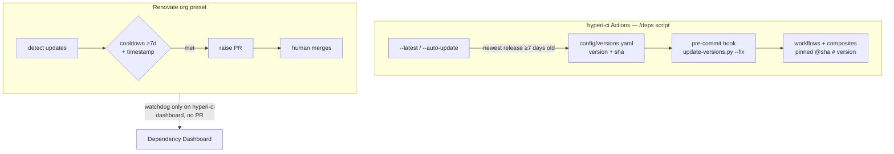

# CI Dependency Policy

hyperi-ci is the SSOT and controller for HyperI's dependency-update policy
across every repo. This documents what's pinned, by what, and why.

## Two systems, clear split

| Dependency | Owner | How | Cooldown |
|---|---|---|---|
| GitHub Actions (on hyperi-ci) | `scripts/update-versions.py` + `config/versions.yaml` | SHA-pinned at commit time via the pre-commit hook | 7 days, enforced by the script |
| GitHub Actions (other repos) | Renovate org preset | SHA digest pin (`helpers:pinGitHubActionDigests`) | 7 days |
| cargo / pip / npm / docker (all repos) | Renovate org preset | version PRs | 7 days |

- The org Renovate preset lives in `hyperi-io/renovate-config` but is
  governed from here — change the policy by editing that preset, document
  it in this file.
- On hyperi-ci the script owns Actions, so Renovate is a **passive
  watchdog** there: it still detects Action updates and lists them on the
  Dependency Dashboard (an independent second opinion) but raises no PR
  unless a human ticks the box. Set by `renovate.json`
  (`dependencyDashboardApproval` on `github-actions`).

## Hard rules

- **PR-only, always.** Nothing auto-merges to main — any repo, any
  ecosystem, including CVE fixes. A human reviews and merges every PR.
  (`:automergeDisabled` in the org preset.)
- **7-day cooldown.** An update waits until its release is a week old and
  the release timestamp is verified (`minimumReleaseAge: 7 days` +
  `minimumReleaseAgeBehaviour: timestamp-required`). This blocks
  fast-moving supply-chain attacks — a poisoned release is usually yanked
  inside that window.
- **CVEs skip the cooldown, not the review.** Vulnerability fixes get a PR
  immediately (`minimumReleaseAge: 0`) but still need a human merge.
- **SHA over tag.** A tag can be force-moved; a commit SHA can't. Actions
  pin to `owner/repo@<sha> # <version>`.
- **Same-org packages skip the cooldown.** We publish those ourselves; our
  own CI gates govern the risk, not external-attacker cooldown logic.

## Flow

## /deps — the script

`scripts/update-versions.py` is the local dependency command for this repo.

- `--check` — show drift between `versions.yaml` and the pinned refs (default).
- `--apply` — rewrite workflows + composites to match the SSOT.
- `--fix` — `--apply` + non-zero exit when it changed something (pre-commit).
- `--latest` — report the newest release of each Action that's ≥7 days old.
- `--auto-update` — bump `versions.yaml` to those, test on the `ci-test-*`
  projects, commit or revert.

It scans both `.github/workflows/*.yml` and `.github/actions/*/action.yml`
— the full pipeline, not just top-level workflows.

## Reusable-workflow pinning — gate-only (issue #31)

`/deps` SHA-pins **third-party** actions. hyperi-ci's **own** reusable workflows
reference their siblings + composites at `@main`, so a consumer that SHA-pins
the caller still floats the internals — a breaking change on `main` can
retroactively break pinned consumers.

We **deliberately keep `@main` internals** and prevent the breakage **at source**
with a static interface gate (`scripts/check-workflow-interfaces.py`, run in
Quality): it fails our CI if a sibling interface regresses vs the last release.
We rejected a "frozen graph" that would have replaced semantic-release with
bespoke release machinery — **KISS; a battle-tested tool that's good enough beats
custom code.** Full rationale + the trilemma + what we consciously accept:
[the decision record](specs/2026-05-29-issue31-workflow-pinning.md).

**Precondition:** the gate is source-side, so it only *blocks* a regression when
**branch protection is on + Quality is a required check + merges are PR-only**.
Re-enable branch protection on `main` when dev settles.

_Last reviewed: 29 May 2026._
