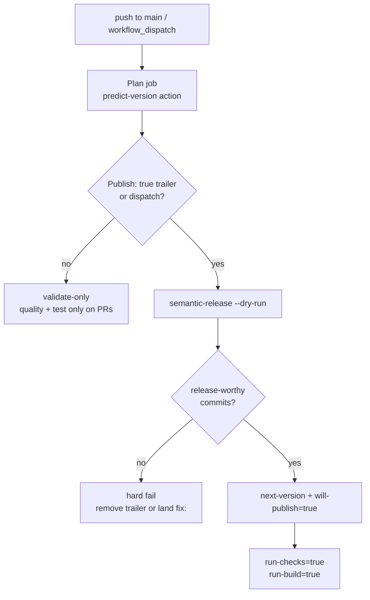
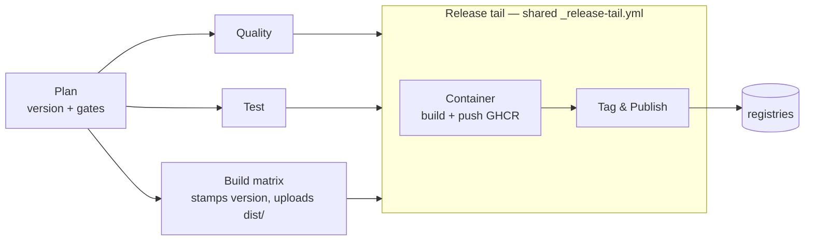
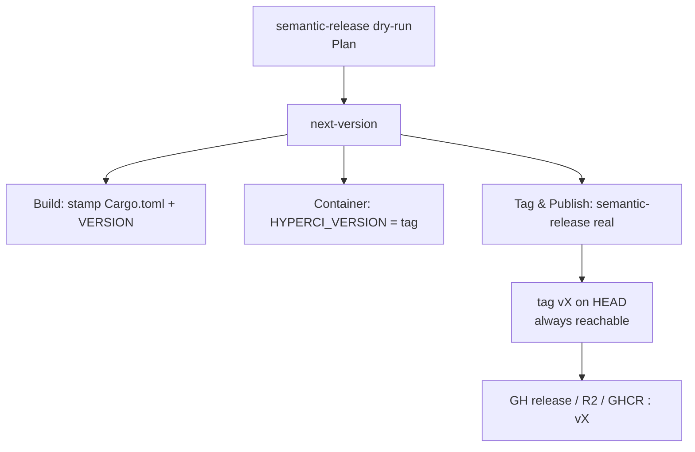
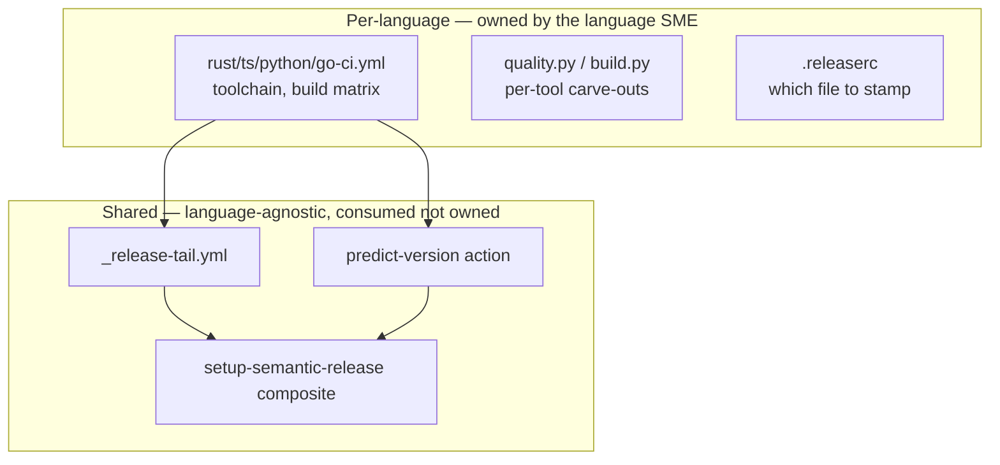
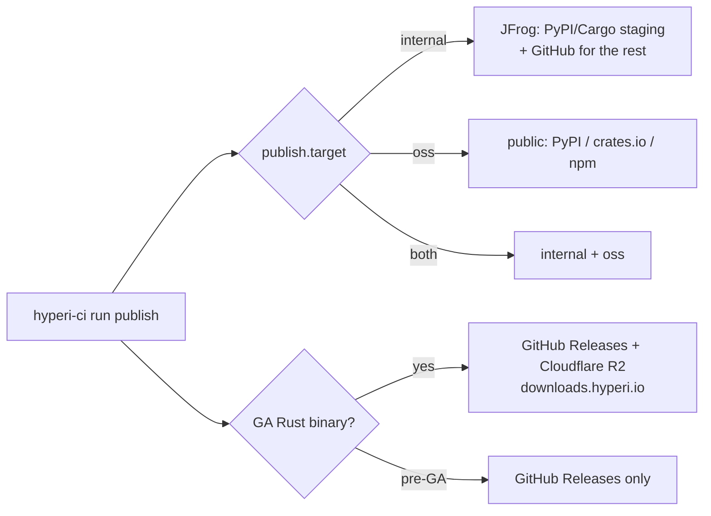

# CI Flow

How a push or dispatch becomes a release. Version-first, single run: one
semantic-release computation drives every stage.

## 1. Trigger and gate

One signal — `will-publish` — gates the whole pipeline.

- `will-publish` = dispatch, or a `Publish: true` trailer on HEAD.
- `next-version` comes from `semantic-release --dry-run` — same config the real
  tag step uses, so they cannot disagree.
- No trailer on a push to main → validate-only (no tag, no publish).

## 2. Pipeline and job dependencies

- Quality / Test / Build run in parallel after Plan.
- Release tail runs only when `will-publish=true`; Container before Tag & Publish.

## 3. Version — one oracle, used everywhere

- Build stamps the binary, Container tags the image, Tag & Publish creates the
  git tag — all the same `next-version`.
- semantic-release tags **HEAD** (not a CI-authored commit), so the tag is
  always reachable and the next run computes the correct next version.
- `@semantic-release/git` is dropped — see `.releaserc` for the why.

## 4. What is done where — and why

| Layer | Owns | Why here |
|---|---|---|
| Per-language workflow + handlers | toolchains, build matrix, `_run_tool` carve-outs (e.g. cargo-audit transient skip), version stamping target | legitimately differs per language; the SME needs full control |
| `predict-version`, `setup-semantic-release`, `_release-tail` | trigger gate, version oracle, semantic-release toolchain, container + tag + publish orchestration | identical across languages; shared so a fix lands once, not 4× |

Rule: shared pieces must help the SME, never hobble them. Anything needing a
per-language carve-out stays in the SME's domain.

## 5. Publish routing

`publish.target` (and `publish.channel`) decide destinations.

- Container / Helm / npm / binaries / Go publish to GitHub regardless of target.
- `publish.channel` (spike/alpha/beta) forces internal — pre-GA never reaches
  public registries.
