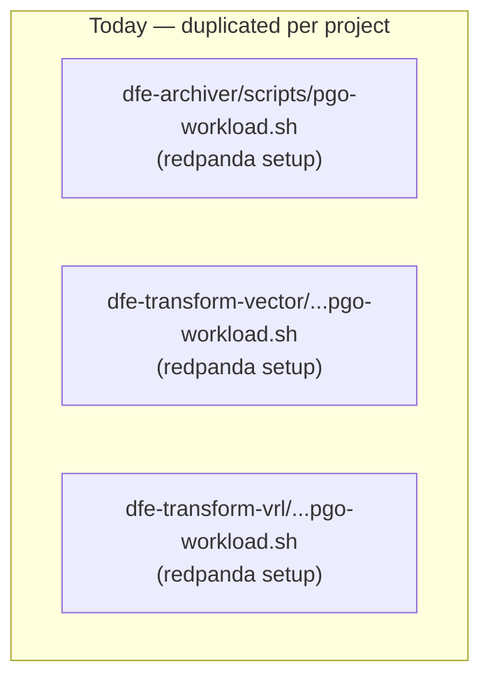
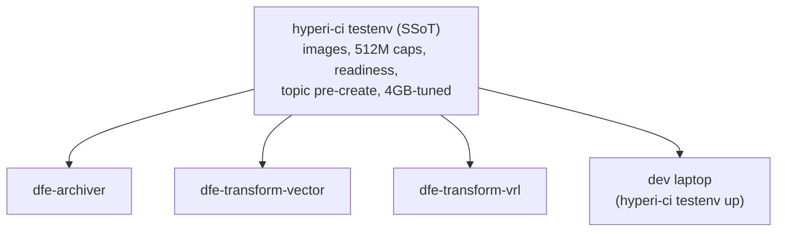

# CI Message Broker: Kafka → Redpanda

> **Status:** learnings captured during the 2026-05 canary-release campaign
> (dfe-archiver / dfe-transform-vector / dfe-transform-vrl). Will be folded
> into the docs rewrite and is the seed for a centralised `hyperi-ci testenv`
> (see [Forward: centralise as SSoT](#forward-centralise-as-ssot)).

Kafka is core to most of DFE, so its CI test-broker story matters everywhere.
This documents why CI uses **Redpanda** (not Apache Kafka), the exact setup,
and the gotchas — so projects stop re-solving them independently.

## Why Redpanda, not Apache Kafka, in CI

The **hard deck for every CI runner job is 4GB** (the default GitHub-hosted
OSS-runner size; HyperI is moving to OSS to use free runners — see
[the 4GB envelope](#the-4gb-envelope)).

- **Apache Kafka** runs on the JVM: a 1.5–2.5GB heap. On a 4GB runner that
  starves the workload-under-test (a PGO-instrumented binary + load driver),
  causing OOM kills.
- **Redpanda** is a C++/Seastar reimplementation of the Kafka wire protocol.
  In `dev-container` mode with `--memory 512M` it fits comfortably, leaving
  headroom for the build + binary + driver inside 4GB.

Same Kafka wire protocol → **application code and the broker endpoint are
unchanged**; only the CI fixture differs.

## Canonical Redpanda CI setup

```bash
# Start: dev-container mode, single core, hard 512M cap, advertised on host.
docker run -d --rm \
    -p 19092:9092 \
    docker.redpanda.com/redpandadata/redpanda:v26.1.9 \
    redpanda start \
        --mode dev-container \
        --smp 1 \
        --memory 512M \
        --kafka-addr PLAINTEXT://0.0.0.0:9092 \
        --advertise-kafka-addr PLAINTEXT://localhost:19092
```

`--mode dev-container` bundles `--overprovisioned`, `--reserve-memory 0M`,
`--check=false`, `--unsafe-bypass-fsync` — i.e. throughput-irrelevant safety
checks off, minimal reserved memory. The explicit `--memory 512M` is the
budget cap.

**Readiness** — gate on the admin API, never a bare TCP-open probe (the port
opens before the broker serves):

```bash
docker exec "$CID" rpk cluster health | grep -q "Healthy:.*true"
```

## Gotchas (the expensive-to-learn bits)

### 1. The image entrypoint auto-prepends `rpk`

`docker run <redpanda-image> topic create events ...` actually execs
`/usr/bin/rpk topic create events ...` — the entrypoint prepends `rpk` for any
non-`redpanda` first arg. So:

- ✅ `<image> topic create events ...`  → runs `rpk topic create ...`
- ❌ `<image> rpk topic create events ...` → runs `rpk rpk topic create ...` (wrong)

Don't add `rpk` yourself for the one-shot client form. (The in-container
`docker exec <cid> rpk ...` form *does* need `rpk` — different invocation.)

### 2. No topic auto-create on consumer SUBSCRIBE

Redpanda auto-creates a topic on **produce**, but **not** when a consumer
subscribes. Apache Kafka auto-created on subscribe, which masked an ordering
bug: a consumer-first service (e.g. dfe-archiver) subscribes to a topic that
doesn't exist yet → never reaches ready → the load driver (which starts only
after the service is ready) never produces → deadlock.

**Fix: pre-create topics** before starting the consumer:

```bash
# --network host so the client reaches the *advertised* localhost:19092
# (an in-container client follows the advertised address, which only
# resolves on the host).
docker run --rm --network host <image> topic create events -p 3 -X brokers=localhost:19092
```

Pre-create is mandatory for any consumer-first workload. Topic names are
project-specific; everything else is generic.

### 3. Advertised-address resolution

A one-shot admin client must reach the **advertised** listener
(`localhost:19092`). Run it `--network host` so `localhost` resolves to the
runner, not the client container.

## The 4GB envelope

Every CI job — **including integration tests** — must run within **4GB** and
**must not require any external service** (no remote ClickHouse, no remote
Kafka). Remote services are a *local-dev* speed convenience only (Docker is too
slow for fast local iteration); CI is always self-contained.

CI **may** exploit larger runners (the LARGE ARC runners are ~free on the
already-paid-for DevEx cluster) as an opportunistic speedup — but nothing in CI
may *require* more than 4GB or any external dependency. Design for the 4GB
free-runner floor.

Rough budget on a 4GB runner during a PGO workload:

| Component | Budget |
|---|---|
| Redpanda (`--memory 512M`) | ~0.5 GB |
| PGO-instrumented binary + buffers | ~1–1.5 GB |
| Load driver + OS + docker | ~1 GB |
| Headroom | remainder |

## Current state (the duplication problem)

The setup above is **copy-pasted** into each canary project's
`scripts/pgo-workload.sh` (dfe-archiver, dfe-transform-vector,
dfe-transform-vrl). The same Redpanda bugs (topic pre-create, readiness,
entrypoint form) had to be fixed in each. That triplication is the smell the
next section addresses.



## Forward: centralise as SSoT

Make hyperi-ci the single source of truth for CI test services — a
`hyperi-ci testenv` subcommand that owns the canonical Redpanda (and later
ClickHouse) definitions, used **identically locally and in CI**:



- Generic infra (images, caps, readiness, lifecycle) lives once in hyperi-ci.
- Per-project data = only **topics** (Redpanda) and **schema** (ClickHouse).
- Phase 1: Redpanda (proven at 512M — kills the triplication).
- Phase 2: ClickHouse — gated on proving a *meaningful* instance fits ≤~1.5GB
  alongside everything else, plus a clean schema-bootstrap story
  (likely from `dfe-schemas`). Local dev keeps a remote-CH escape hatch for
  speed; CI always uses the self-contained canned one.

A full design belongs in a `docs/superpowers/specs/` spec before building.
