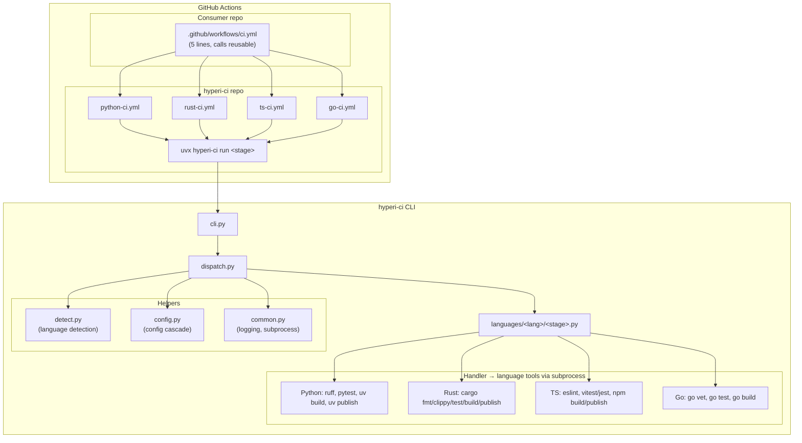
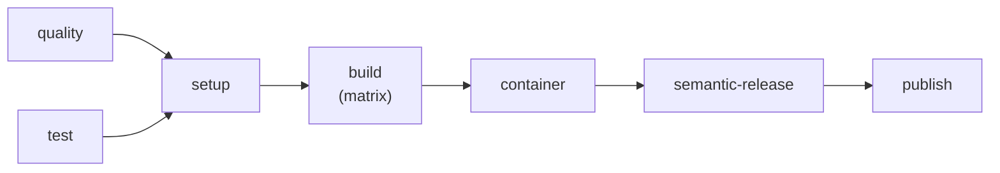
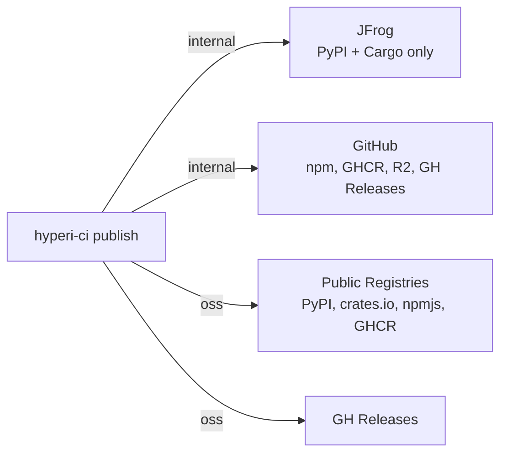
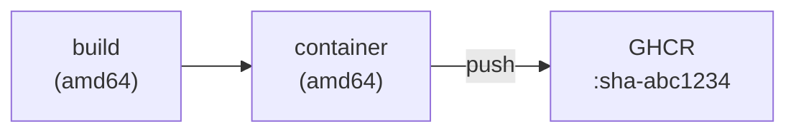
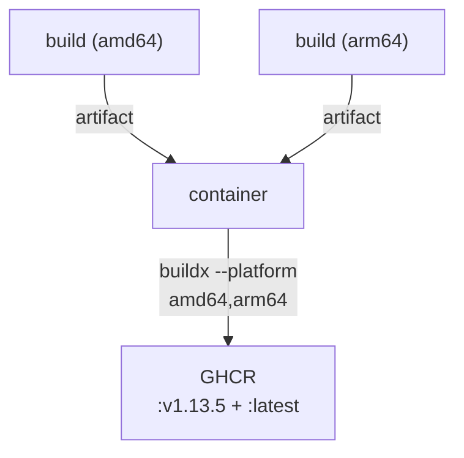
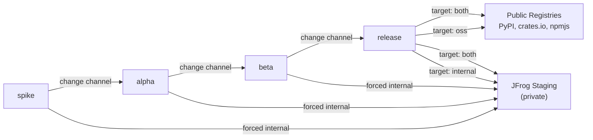

# HyperI CI — Architecture and Design

## Overview

HyperI CI is a polyglot CI/CD tool that replaces a legacy system of ~100
shell scripts, 50+ composite actions, and a six-layer dispatch hierarchy
with a single Python CLI. It supports Python, Rust, TypeScript, and Go
projects. The same tool runs identically on developer laptops and in
GitHub Actions.

The system has two sides that work together:

1. **GitHub Actions side** — reusable workflow templates that orchestrate
   CI pipeline stages (quality, test, build, release)
2. **CLI side** — `hyperi-ci` Python tool that executes each stage's
   actual logic (linting, testing, building, publishing)



## GitHub Actions Side

### Reusable Workflow Templates

Four language-specific reusable workflows live in
`.github/workflows/` in the hyperi-ci repo itself:

| Workflow | Language | Toolchain Setup |
|----------|----------|-----------------|
| `python-ci.yml` | Python | `astral-sh/setup-uv@v7`, `uv python install` |
| `rust-ci.yml` | Rust | `dtolnay/rust-toolchain@master` (clippy, rustfmt) |
| `ts-ci.yml` | TypeScript | `actions/setup-node@v6`, detect package manager |
| `go-ci.yml` | Go | `actions/setup-go@v6` (go-version-file) |

### Job Structure

Every reusable workflow has this job structure:



1. **quality** — runs `uvx hyperi-ci run quality`
2. **test** (matrix) — runs `uvx hyperi-ci run test`
3. **setup** (needs quality + test) — generates build matrix JSON
4. **build** (needs setup, matrix) — runs `uvx hyperi-ci run build`
   - Uses `runs-on: ${{ matrix.runner }}` — each arch builds natively
   - Skipped on fork PRs
5. **container** (needs build) — runs `uvx hyperi-ci run container`
   - Builds and pushes container image to GHCR
   - Only runs if `container.enabled: true` in `.hyperi-ci.yaml`
   - Skips entirely (no Docker setup) if disabled
   - Three modes: contract (Rust), template (Python/Node), custom (own Dockerfile)
   - See "Container Builds" section below
6. **release** (needs build + container, main push) — runs `semantic-release`
   - Creates git tag + GitHub release, writes `VERSION` file
7. **publish** (needs build + container, workflow_dispatch) — runs `uvx hyperi-ci run publish`
   - Skipped if `VERSION` file absent (non-publishable projects)
   - Publish step MUST use `hyperi-ci run build` not raw `uv build` — the
     build handler injects standard sdist exclusions (AI agent dirs, submodules)

### Consumer Project Setup

A consumer project needs three files, all generated by `hyperi-ci init`:

**`.github/workflows/ci.yml`** — 5 lines:
```yaml
name: CI
on: { push: { branches: [main] }, pull_request: { branches: [main] } }
jobs:
  ci:
    uses: hyperi-io/hyperi-ci/.github/workflows/python-ci.yml@main
    secrets: inherit
```

**`.hyperi-ci.yaml`** — project configuration (language, build targets,
publish settings).

**`Makefile`** — wraps CLI for local use:
```makefile
quality:
	hyperi-ci run quality
test:
	hyperi-ci run test
build:
	hyperi-ci run build
```

### Workflow Inputs

All workflows accept common inputs:

| Input | Default | Purpose |
|-------|---------|---------|
| `publish-target` | `"internal"` | Where artifacts go: `internal`, `oss`, or `both` |
| `test-matrix` | `'["ubuntu-latest", "macos-latest"]'` | OS matrix for test job |

Plus language-specific inputs (e.g. `python-version`, `rust-toolchain`,
`node-version`, `go-version-file`).

### Fork Safety

Fork PRs run quality and test only — no build, no publish, no secrets.
GitHub's built-in "Require approval for first-time contributors" handles
the approval gate. No custom code needed.

## CLI Side

### Entry Point

```
hyperi-ci run <stage>     Run CI stage (setup, quality, test, build, publish)
hyperi-ci check           Pre-push validation (quality + test)
hyperi-ci check --full    Pre-push with build (native target only)
hyperi-ci check --quick   Quality checks only
hyperi-ci init            Generate project scaffolding
hyperi-ci detect          Show detected language
hyperi-ci config          Show merged configuration
hyperi-ci trigger         Trigger GitHub Actions workflow
hyperi-ci watch           Watch a run to completion
hyperi-ci logs            Fetch and filter run logs
```

### Stage Dispatch

When `hyperi-ci run quality` is invoked:

1. **detect.py** identifies the project language from file markers
   (`Cargo.toml` → rust, `pyproject.toml` → python, etc.) or from
   `.hyperi-ci.yaml` / `HYPERI_CI_LANGUAGE` env var override
2. **config.py** loads and merges configuration (defaults → project
   config → env vars)
3. **dispatch.py** imports `hyperi_ci.languages.<lang>.<stage>` and
   calls its `run(config, extra_env)` function

```python
# Handler interface — every language/stage module exports this
def run(config: CIConfig, extra_env: dict[str, str] | None = None) -> int:
    """Run the stage. Returns 0 on success."""
```

### Language Handlers

```
src/hyperi_ci/languages/
├── python/
│   ├── quality.py    ruff check, ruff format, ty, bandit, pip-audit
│   ├── test.py       pytest with coverage
│   ├── build.py      uv build (wheel + sdist), Nuitka (native binary)
│   └── publish.py    uv publish → PyPI or JFrog (private staging)
├── rust/
│   ├── quality.py    cargo fmt, clippy, cargo audit, cargo deny
│   ├── test.py       cargo nextest / cargo test
│   ├── build.py      cargo build --release (multi-target, cross-compile)
│   └── publish.py    cargo publish → crates.io or JFrog (private staging)
├── typescript/
│   ├── quality.py    eslint, prettier, tsc, npm audit
│   ├── test.py       vitest / jest (auto-detected), Playwright E2E
│   ├── build.py      npm run build / pnpm build
│   └── publish.py    npm publish → npmjs or GH Packages
└── golang/
    ├── quality.py    gofmt, go vet, golangci-lint, gosec, govulncheck
    ├── test.py       go test -race -cover
    ├── build.py      go build (multi-target cross-compile, CGO support)
    └── publish.py    go proxy (automatic), gh release upload (binaries)
```

### Configuration Cascade

Priority (highest wins):

```
CLI flags → ENV vars (HYPERCI_*) → .hyperi-ci.yaml → src/hyperi_ci/config/defaults.yaml → hardcoded
```

The `.hyperi-ci.yaml` in each project is the single source of truth for
project-specific settings. `src/hyperi_ci/config/defaults.yaml` in the hyperi-ci
package provides sensible defaults for all languages.

### Config Schema

```python
@dataclass
class CIConfig:
    language: str
    publish_target: str          # "internal", "oss", or "both"
    _raw: dict[str, Any]         # Full merged config for nested access

    def get(key: str) -> Any     # Dot-notation access: "quality.python.ruff"
    def destination_for(type)    # Publish routing: ["jfrog-pypi"] or ["pypi"]
```

### Publish Target Routing

A single config value (`publish.target`) controls where artifacts go:

| Target | Python | Rust | TypeScript | Containers | Binaries | Go |
|--------|--------|------|------------|------------|----------|-----|
| `internal` | JFrog PyPI | JFrog Cargo | GH Packages npm | GHCR (private) | R2 | go-proxy |
| `oss` | pypi.org | crates.io | npmjs.com | GHCR (public) | GH Releases | go-proxy |
| `both` | Both | Both | Both | GHCR | Both | go-proxy |

JFrog is used **only** for private Python and Rust package staging (pre-GA).
All other artifact types use GitHub. See `docs/JFROG-MIGRATION.md`.



Set via GitHub org/repo variable `PUBLISH_TARGET`, which maps to
`HYPERCI_PUBLISH_TARGET` env var in workflows.

Organisation-specific URLs (JFrog domain, registry paths) are in
`config/org.yaml` and loaded into `OrgConfig`:

```python
@dataclass
class OrgConfig:
    jfrog_domain: str        # "hypersec.jfrog.io"
    pypi_publish_url: str    # Derived: "{base}/api/pypi/hyperi-pypi-local"
    cargo_publish_url: str   # Derived: "{base}/api/cargo/hyperi-cargo-local"
    ghcr_registry: str       # "ghcr.io"
    github_org: str          # "hyperi-io"
    # ... etc
```

### Container Builds

The `container` stage builds and pushes OCI container images to GHCR.
Three modes, auto-detected from language and project structure:

| Mode | Language | Dockerfile Source |
|------|----------|------------------|
| **contract** | Rust + rustlib | Generated from `container-manifest.json` (binary emits contract) |
| **template** | Python, TypeScript | Generated from built-in templates (uv, pnpm patterns) |
| **custom** | Any | Uses repo's own `Dockerfile`, injects OCI labels |

**Push to main (single-arch):**



**Publish dispatch (multi-arch release):**



Enable in `.hyperi-ci.yaml`:

```yaml
container:
  enabled: true
  # mode auto-detected: contract (Rust), template (Python/Node), custom (Dockerfile)
```

Registry auth uses the `hyperi-container-mgt` GitHub App (packages:write).

### Binary Publish: What Gets Uploaded

Binary destinations (`r2-binaries`, `github-releases`) receive
only compiled binaries and their SHA-256 checksum files. No README, CHANGELOG,
LICENSE, or other documentation files are included.

**Why:** This matches industry convention. HashiCorp, Rust, Go, and every major
project's download site serves binaries + checksums + signatures only.
Documentation lives in the source repository — GitHub renders README
automatically, and semantic-release populates the release description with
changelog content. Uploading markdown files to a binary download site adds
clutter without value, since consumers downloading binaries already know the
project and can find docs at the repo.

| Destination | Contents | Documentation |
|---|---|---|
| GitHub Releases | Binaries + checksums | Release description (auto-generated by semantic-release) + repo README |
| Cloudflare R2 (`downloads.hyperi.io`) | Binaries + checksums | Link back to GitHub repo from R2 index Worker |
| JFrog Artifactory | Binaries + checksums | JFrog package metadata |

The upload logic is in `src/hyperi_ci/publish_binaries.py`. The `_collect_artifacts()`
function reads everything from `dist/` — language-specific build handlers are
responsible for placing only binaries and checksums there.

### Binary Naming Convention

All compiled binaries follow a unified naming pattern regardless of source language:

```
{name}-{os}-{arch}[.exe]
```

| Element | Values | Example |
|---|---|---|
| `name` | Project binary name | `dfe-receiver` |
| `os` | `linux`, `darwin`, `windows` | `linux` |
| `arch` | `amd64`, `arm64` | `amd64` |

**Examples:**
```
dfe-receiver-linux-amd64
dfe-receiver-linux-arm64
dfe-loader-linux-amd64
```

**Version is in the path, not the filename.** The R2 and GitHub Release directory
structure carries the version:

```
dfe-receiver/v1.13.11/dfe-receiver-linux-amd64
dfe-receiver/v1.13.11/dfe-receiver-linux-arm64
dfe-receiver/v1.13.11/checksums.sha256
dfe-receiver/latest/dfe-receiver-linux-amd64
```

**Why this convention:**

- **`os-arch` shorthand over Rust target triples** — our consumers are ops/infra
  people deploying server-side binaries. `linux-amd64` matches Docker, Kubernetes,
  containerd, and HashiCorp naming. Full Rust triples (`x86_64-unknown-linux-gnu`)
  are appropriate for developer tools (ripgrep, uv) but not for deployment artefacts.
- **No version in filename** — avoids the `dfe-receiver-release-linux-amd64` bug
  where `GITHUB_REF_NAME` (the branch name) leaked into filenames. Version in the
  path is sufficient and enables stable download URLs that don't change per-release:
  `downloads.hyperi.io/dfe-receiver/latest/dfe-receiver-linux-amd64`.
- **Consistent across languages** — both Rust and Go build handlers produce the
  same naming format. Consumers don't need to know or care what language built
  the binary.

Ref: [dfe-receiver#6](https://github.com/hyperi-io/dfe-receiver/issues/6)

## Configuration Boundaries: org.yaml vs GitHub Vars vs Secrets

Configuration lives in three places with clear, non-overlapping boundaries:

### 1. `config/org.yaml` — CI Logic and Routing (version-controlled)

Everything that affects CI behaviour, artifact routing, or registry URLs.
Changes go through PRs with review. Testable in unit tests.

| What | Examples |
|------|---------|
| Registry URLs | JFrog domain, PyPI publish URL, npm registry |
| Destination mappings | `python: jfrog-pypi`, `python: pypi` |
| Org identifiers | GitHub org, GHCR org, JFrog prefix |
| Publish defaults | Default target, binary repo name |
| Deprecated patterns | Old CI repo URLs for migration detection |

### 2. GitHub Vars — Platform Infrastructure (UI-managed)

Runner labels and GitHub-specific infrastructure config that varies by
org or repo. Rarely changes. Not testable in unit tests (platform-specific).

| Variable | Scope | Purpose |
|----------|-------|---------|
| `GH_RUNNER_DEFAULT` | org | Default self-hosted runner label |
| `GH_RUNNER_RUST` | org | Runner for Rust jobs (may need more resources) |
| `GH_RUNNER_PYTHON` | org | Runner for Python jobs |
| `GH_RUNNER_TYPESCRIPT` | org | Runner for TypeScript jobs |
| `GH_RUNNER_GOLANG` | org | Runner for Go jobs |
| `PUBLISH_TARGET` | org/repo | Override publish target per repo |

### 3. GitHub Secrets — Credentials (UI-managed, encrypted)

Authentication tokens. Never in code, never in vars. Scoped to the
minimum set of repos that need them via `selected` visibility.

| Secret | Visibility | Purpose |
|--------|-----------|---------|
| `JFROG_TOKEN` | all | JFrog Artifactory access token (JWT) |
| `JFROG_USERNAME` | all | JFrog account email (for PyPI basic auth) |
| `NPM_TOKEN` | selected | npmjs.com publish token |
| `CRATES_TOKEN` | selected | crates.io publish token |
| `GIT_TOKEN` | selected | Cross-repo access (workflow dispatch) |

> **Why `JFROG_USERNAME`?** JFrog's PyPI upload API requires basic auth
> (`--username` + `--password`), not PyPI's `__token__` convention. The
> username must be the JFrog account email (`artifactory@hypersec.io`).
> See `docs/CI-LESSONS.md` → Python → JFrog PyPI Publish Auth.

### Decision Rule

> If it affects CI logic or routing → `org.yaml` (reviewable, testable).
> If it's platform infrastructure → GitHub Vars (UI-managed).
> If it's a credential → GitHub Secrets (encrypted, scoped).

### Version Pinning: `config/versions.yaml`

All tool and action versions are documented in `config/versions.yaml`
as a single source of truth. When updating a version, change the SSOT
file first, then grep and update the workflow files to match.

Versions are pinned at major (actions) or minor (runtimes) level.
Runtime versions (e.g. Python 3.12) are deliberate choices — don't
auto-bump without testing. Action versions (e.g. checkout@v6) should
track latest major.

### What Does NOT Go in GitHub Vars

- Registry URLs (use `org.yaml` — version-controlled, testable)
- Destination mappings (use `src/hyperi_ci/config/defaults.yaml` — part of config cascade)
- Tool versions (use `config/versions.yaml` — reviewable)

## How They Work Together

### Local Development

Developer runs `hyperi-ci check` for pre-push validation, or
individual stages via `make quality` / `hyperi-ci run test`.
The CLI detects language, loads config, and invokes language tools
via subprocess. No GitHub Actions involvement.

#### The `check` Command

`hyperi-ci check` runs a tiered subset of the CI pipeline locally,
giving ~95% confidence before pushing:

| Flag | Stages | Use Case |
|------|--------|----------|
| *(default)* | quality + test | Standard pre-push validation |
| `--quick` | quality only | Fast lint check |
| `--full` | quality + test + build | Full local validation |

**Key behaviour:** When `--full` includes the build stage, it sets
`local=True` in the dispatcher which suppresses cross-compilation
targets. Only the native host target is built. Cross-compilation
requires CI-specific toolchains (cross-compilers, sysroots) that
are not expected on developer machines — those failures are caught
in CI, not locally.

The command stops on first failure and returns that stage's exit
code. This matches CI behaviour where later stages are skipped
if earlier ones fail.

### CI Pipeline

1. Developer pushes to branch or opens PR
2. GitHub Actions triggers consumer's `ci.yml`
3. Consumer workflow calls reusable template (e.g. `python-ci.yml@main`)
4. Reusable workflow sets up language toolchain + uv
5. Each job runs `uvx hyperi-ci run <stage>`
6. `hyperi-ci` CLI does the actual work — same code path as local
7. On main push: semantic-release analyses commits, creates tag, triggers
   publish via `hyperi-ci run publish`

### Key Insight

GitHub Actions handles **orchestration** (job ordering, matrix, caching,
secrets, permissions). The CLI handles **execution** (what tools to run,
how to invoke them, what flags to pass). This separation means:

- Workflow files stay small (no bash logic in YAML)
- Language tool invocation is tested locally before CI
- Adding a new quality check = Python code change, not workflow YAML
- Same behaviour everywhere — no "works locally but fails in CI"

## Runner Modes

CI supports two execution modes: **self-hosted** (ARC runners on the
DevEx cluster) and **free** (GitHub-hosted `ubuntu-latest`).

| Mode | Runners | Cache | Toolchain |
|------|---------|-------|-----------|
| `self-hosted` | ARC runners (DevEx cluster) | Persistent NFS sccache/ccache | Pre-installed in runner image |
| `free` | GitHub-hosted `ubuntu-latest` (4 vCPU, 16 GB) | None between runs | Installed per-job via setup actions |

When `mode` is `free`, `GH_RUNNER_*` org variables are ignored and
all jobs run on `ubuntu-latest`. This means any GitHub organisation
can use hyperi-ci's reusable workflows without self-hosted
infrastructure — builds just take longer without the persistent cache
and pre-installed toolchain.

### How Runner Mode Is Resolved

Mode is controlled at three levels (highest wins):

1. **Workflow input `runner-mode`** — consumer repo passes it explicitly
   in their `ci.yml` (per-repo control)
2. **GitHub variable `GH_RUNNER_MODE`** — set at org or repo level
   (org-wide default)
3. **Fallback** — if neither is set, `GH_RUNNER_*` vars are checked,
   ultimately falling back to `ubuntu-latest`

Every `runs-on` expression in the reusable workflows evaluates:

```
(inputs.runner-mode || vars.GH_RUNNER_MODE) == 'free'
  → 'ubuntu-latest'
  → inputs.runner-<job> || vars.GH_RUNNER_<LANG> || vars.GH_RUNNER_DEFAULT || 'ubuntu-latest'
```

Consumer project examples:

```yaml
# Free mode (explicit)
jobs:
  ci:
    uses: hyperi-io/hyperi-ci/.github/workflows/rust-ci.yml@main
    with:
      runner-mode: free
    secrets: inherit

# Self-hosted mode (default — uses GH_RUNNER_* org vars)
jobs:
  ci:
    uses: hyperi-io/hyperi-ci/.github/workflows/rust-ci.yml@main
    secrets: inherit
```

The `src/hyperi_ci/config/defaults.yaml` documents the intended org-wide default
(`runners.mode: self-hosted`) but actual enforcement is at the
workflow expression level via `GH_RUNNER_MODE` and `runner-mode`.

### uv Caching

The `setup-uv` action's `enable-cache` is only enabled in `python-ci.yml`
where there are actual Python dependencies to cache (`uv.lock`,
`pyproject.toml`). In non-Python workflows (Rust, TypeScript, Go), uv
is used solely as a delivery mechanism for `uvx hyperi-ci` — there is
no Python project to cache, so caching is disabled to avoid spurious
"no cache files found" warnings.

### Split-Runner Architecture (Multi-Arch Builds)

Multi-arch builds use **native runners per architecture** instead of
cross-compilation. Each architecture builds on its own runner type:

| Architecture | Runner | Source |
|-------------|--------|--------|
| x86_64 (amd64) | ARC self-hosted (16cpu) | `vars.GH_RUNNER_RUST` / `vars.GH_RUNNER_DEFAULT` |
| aarch64 (arm64) | GitHub `ubuntu-24.04-arm` | `vars.GH_RUNNER_ARM64` / `'ubuntu-24.04-arm'` |

Runner selection is defined in `config/runners.yaml` (SSOT).

**Why not cross-compile?** Cross-compilation with C/C++ dependencies
(librdkafka, zlib, openssl) requires a private sysroot with transitive
dependency resolution. This is fragile — each new native dependency
breaks differently. Native builds on arm64 runners eliminate the entire
problem class. The sysroot code is retained dormant in `build.py` for
edge cases (e.g. RISC-V) but is never triggered when all builds are native.

**When does arm64 build?** Only on the `release` branch (GA releases).
All other branches (including `main`) build x64 only. This keeps
dev-cycle builds fast and avoids arm64 runner costs for non-release work.

| Branch | Architectures | Purpose |
|--------|--------------|---------|
| Feature branches | x64 only | Development, PR validation |
| `main` | x64 only | Dev pre-releases (`v1.15.0-dev.1`) |
| `release` | x64 + arm64 | GA releases (`v1.15.0`) |

This applies universally across all languages, not just Rust:

| Language | x64 Build | arm64 Build (release only) |
|----------|-----------|---------------------------|
| Rust | Native on ARC | Native on `ubuntu-24.04-arm` |
| Go | Native on ARC | Native on `ubuntu-24.04-arm` |
| Python (wheel) | Single runner (arch-independent) | N/A |
| Python (Nuitka) | Native on ARC | Native on `ubuntu-24.04-arm` |
| TypeScript | Single runner (arch-independent) | N/A |

### Release Channels

Single-branch model with channel-based publish routing:

| Channel | Registry Publish | GH Release | R2 Path |
|---------|-----------------|------------|---------|
| `spike` | Internal only (JFrog staging) | Prerelease | `/{project}/spike/v1.0.0/` |
| `alpha` | Internal only (JFrog staging) | Prerelease | `/{project}/alpha/v1.0.0/` |
| `beta` | Internal only (JFrog staging) | Prerelease | `/{project}/beta/v1.0.0/` |
| `release` | Configured target (internal/oss/both) | GA | `/{project}/v1.0.0/` |

Pre-release channels (`spike`, `alpha`, `beta`) automatically force
`publish_target` to `internal`, regardless of the configured target.
This keeps pre-GA packages on JFrog staging (private PyPI/Cargo) without
appearing on public registries.



**Workflow:**
1. Set `publish.channel: spike` in `.hyperi-ci.yaml` — push, test internally
2. Graduate through `alpha` → `beta` → `release` by changing one line
3. At `release` channel, `publish.target` controls public vs private

**Release Merge automation:** The `hyperi-ci release-merge` CLI command handles the
recurring version file conflicts that arise because semantic-release bumps versions
independently on each branch. No workflow file needed in consumer projects. If `gh`
CLI is not available, the command prints manual git commands as a fallback.

The `.releaserc.yaml` configuration:
```yaml
branches:
  - name: main
    prerelease: dev
  - release
```

**Publish gating:** The Publish job only runs on the `release` branch.
Dev pre-releases on `main` get GitHub Releases (binary downloads) but
skip registry publishing (JFrog, crates.io, PyPI, npm).

### Self-Hosted Mode (ARC Runners)

When `GH_RUNNER_*` variables point to ARC runner labels, CI runs on
self-hosted runners deployed to the DevEx Kubernetes cluster. Four
runner tiers are available:

| Tier | CPUs | RAM | maxRunners | Typical Use |
|------|------|-----|------------|-------------|
| 2cpu | 2 | 4Gi | 20 | Lint, test, publish, semantic-release |
| 4cpu | 4 | 8Gi | 10 | Python, Node.js builds, small Rust crates |
| 8cpu | 8 | 16Gi | 5 | Medium Rust/C++ builds, integration tests |
| 16cpu | 16 | 28Gi | 3 | Large Rust/C++ release builds, ClickHouse |

Runners are **ephemeral** — each pod is destroyed after one job and the
scale sets idle at zero. The runner image (built from
`hyperi-infra/containers/arc-runner/Dockerfile`) includes the full
toolchain: LLVM/Clang 19+20, GCC, Rust stable+nightly, Python 3.12+uv,
Node.js 22, Go, mold linker, and security scanners.

### Persistent Build Cache (Rust, C/C++)

Compilation caches persist across ephemeral runner pods via a shared
NFS-backed PersistentVolume. This is the primary mechanism for keeping
Rust and C++ builds fast — without it, every job would start from a
cold compile.

**Infrastructure** (defined in `hyperi-infra`):

- **250Gi NFS PV** on NVMe SSD (`storage.devex.hyperi.io:/nas/ssd/runner-cache`)
- **PVC** `runner-cache-pvc` in `arc-runners` namespace, mounted at `/mnt/cache`
- **NFS tuned for cache workloads**: `async` (speed over durability for
  disposable data), `soft` + `timeo=30` (fail-fast, no D-state hangs),
  `nolock`, 1MB I/O blocks, 60s attribute cache

**Cache environment variables** (set on all runner tiers):

| Variable | Value | Purpose |
|----------|-------|---------|
| `SCCACHE_DIR` | `/mnt/cache/sccache` | sccache compilation cache (NFS) |
| `SCCACHE_CACHE_SIZE` | `100G` | Max cache size (LRU eviction) |
| `SCCACHE_IDLE_TIMEOUT` | `0` | Keep sccache daemon alive for job duration |
| `CCACHE_DIR` | `/mnt/cache/ccache` | ccache C/C++ compilation cache (NFS) |
| `CCACHE_MAXSIZE` | `100G` | Max cache size |
| `RUSTC_WRAPPER` | `sccache` | Route all rustc invocations through sccache |
| `CARGO_INCREMENTAL` | `0` | Disabled — incompatible with sccache |
| `CARGO_REGISTRIES_CRATES_IO_PROTOCOL` | `sparse` | Faster registry metadata |
| `LDFLAGS` | `-fuse-ld=mold` | mold linker (replaces slow ld.bfd) |

**Package manager caches** (Cargo registry, uv, pip, npm) use local
`emptyDir` volumes — their metadata-heavy I/O patterns perform poorly
over NFS and they re-populate quickly.

### Why This Matters

Without the persistent cache, a clean Rust build of a project with C
dependencies (e.g. librdkafka via `rdkafka-sys`) takes 15–20 minutes.
With a warm sccache, the same build completes in 1–3 minutes. C++
projects (e.g. ClickHouse contributor builds) see similar improvements
with ccache.

The cache is disposable — if the NFS volume is lost or corrupted, the
only impact is slower first builds while caches repopulate. No data
integrity requirements, which is why NFS `async` mode is used.

### Configuration Files (in `hyperi-infra`)

| File | Purpose |
|------|---------|
| `k8s/runner-cache-pv.yaml` | PV/PVC definition (NFS mount options) |
| `k8s/arc-runner-set-values.yaml` | Base Helm values (volumes, env, auth) |
| `k8s/arc-runner-{2,4,8,16}cpu.yaml` | Per-tier resource limits and scaling |
| `containers/arc-runner/Dockerfile` | Runner image with full toolchain |
| `ansible/playbooks/k8s-arc-runners.yml` | Helm deployment playbook |
| `ansible/roles/storage_server/` | NFS server config and SSD cache dirs |

## Cross-Compilation (Legacy — Dormant)

**Note:** With the split-runner architecture, cross-compilation is no
longer used for standard multi-arch builds. The sysroot code below is
retained in `build.py` but only activates when a build target differs
from the host architecture — which never happens with native runners.

For projects with C/C++ dependencies (e.g. librdkafka via `rdkafka`
crate with `cmake-build` feature), the build handler uses a **private
sysroot approach** ported from the old CI. This avoids installing
cross-arch `-dev` packages system-wide (many are NOT Multi-Arch safe
and would replace the native versions, breaking the native build).

### How it works

1. **Target ordering** — builds native target first, then cross targets,
   to avoid Multi-Arch package conflicts.

2. **Cross-compiler installation** — installs only the cross-compiler
   toolchain system-wide (`gcc-aarch64-linux-gnu`, `g++-aarch64-linux-gnu`,
   `libc6-dev:arm64`) as these ARE Multi-Arch safe.

3. **Private sysroot** — auto-detects native `-dev` packages with
   pkg-config files, resolves their cross-arch equivalents + transitive
   library dependencies (breadth-first, up to 20 levels deep), downloads
   `.deb` files, and extracts to `/tmp/cross-sysroot/<arch>/`. No sudo
   needed for this step. Handles usrmerge and GNU LD script path patching.

4. **Linker wrapper** — creates a wrapper script at
   `<sysroot>/bin/<triple>-gcc` that:
   - Forces `-fuse-ld=bfd` (mold can't cross-compile)
   - Adds `-L` flags for sysroot library directories
   - Adds `-Wl,-rpath-link` for transitive `.so` dependency resolution

5. **Environment variables** set per cross target:
   - `CC_<TARGET>`, `CXX_<TARGET>`, `AR_<TARGET>` — cross-compiler
   - `CARGO_TARGET_<TARGET>_LINKER` — linker wrapper path
   - `CFLAGS_<target>`, `CXXFLAGS_<target>` — `-fuse-ld=bfd` + sysroot includes
   - `PKG_CONFIG_PATH`, `PKG_CONFIG_SYSROOT_DIR`, `PKG_CONFIG_ALLOW_CROSS`
   - `CMAKE_PREFIX_PATH` — for cmake-based `-sys` crates
   - `LDFLAGS`, `CFLAGS`, `CXXFLAGS` cleared to prevent host flag leakage

See `docs/CI-LESSONS.md` for the full rationale and known gotchas.

## Developer Commands

Three commands for interacting with GitHub Actions from the terminal:

| Command | Purpose |
|---------|---------|
| `hyperi-ci trigger` | Dispatch a workflow run, optionally watch it |
| `hyperi-ci watch` | Poll a run to completion with exponential backoff |
| `hyperi-ci logs` | Download and filter run logs (by job, step, pattern) |

These wrap the `gh` CLI and replace the old bash scripts that did the
same thing in ~300 lines each.

## Init Command

`hyperi-ci init` replaces the old 1020-line `attach.sh`. It:

1. Detects language (or accepts `--language` override)
2. Reads existing project files to set smart defaults:
   - Python: detects build backend (hatch, setuptools, poetry, flit)
   - Rust: detects workspace vs single crate
   - TypeScript: detects package manager (pnpm, yarn, npm)
3. Generates `.hyperi-ci.yaml`, `Makefile`, `.github/workflows/ci.yml`,
   and `.releaserc.yaml`
4. Skips files that already exist (unless `--force`)
5. Detects deprecated config files (`.hypersec-ci.yaml`) and warns

## Design Principles

1. **No bash** — all logic is Python. `subprocess.run()` with list args
   only. 70% of old CI failures were bash syntax issues.

2. **Two-channel semantic release** — `main` produces dev pre-releases
   (x64 only, fast feedback). Merge PR to `release` for GA releases
   (x64 + arm64, published to all registries). No manual version bumps.

3. **uv for everything** — venv, sync, lock, tool install, build.

4. **Cross-platform** — Linux (CI) and macOS (dev). Uses `pathlib`,
   `shutil.which()`, `sys.platform` — no hardcoded paths.

5. **Self-hosting** — hyperi-ci uses itself for its own CI pipeline.

## File Layout

```
hyperi-ci/
├── .github/workflows/
│   ├── ci.yml                 Self-hosting CI
│   ├── python-ci.yml          Reusable template
│   ├── rust-ci.yml            Reusable template
│   ├── ts-ci.yml              Reusable template
│   └── go-ci.yml              Reusable template
├── src/hyperi_ci/
│   ├── __init__.py            Package root, __version__
│   ├── cli.py                 Typer CLI entry point
│   ├── config.py              CIConfig, OrgConfig, loader
│   ├── detect.py              Language detection
│   ├── dispatch.py            Stage dispatcher
│   ├── common.py              Logging, subprocess, GH Actions helpers
│   ├── init.py                Project scaffolding
│   ├── init_release.py        Release branch setup (init-release command)
│   ├── gh.py                  GitHub CLI helpers
│   ├── trigger.py             Workflow trigger command
│   ├── watch.py               Run watch command
│   ├── logs.py                Log fetch command
│   ├── container/
│   │   ├── stage.py           Container stage handler (mode detection, orchestration)
│   │   ├── labels.py          OCI label generation
│   │   ├── templates.py       Python + Node Dockerfile templates
│   │   ├── manifest.py        Parse container-manifest.json (contract mode)
│   │   ├── compose.py         Compose Dockerfile from contract (contract mode)
│   │   └── build.py           Docker buildx build + push
│   └── languages/
│       ├── python/            quality, test, build, publish
│       ├── rust/              quality, test, build, publish
│       ├── typescript/        quality, test, build, publish
│       └── golang/            quality, test, build, publish
├── config/
│   ├── defaults.yaml          Default settings for all languages
│   ├── org.yaml               Organisation URLs (JFrog, GitHub, GHCR)
│   ├── runners.yaml           Runner SSOT per architecture
│   └── versions.yaml          Action/runtime version SSOT
├── test-projects/
│   ├── ci-test-rust-app/      Rust binary with C/C++ deps (librdkafka, aarch64 cross)
│   ├── ci-test-python-app/
│   ├── ci-test-ts-app/
│   └── ci-test-go-app/
├── tests/
│   └── unit/                  82 unit tests
├── docs/
│   └── DESIGN.md              This file
├── VERSION                    Source of truth for version
├── pyproject.toml             Package config
├── uv.lock                    Locked dependencies
└── .releaserc.yaml            Semantic release config
```
