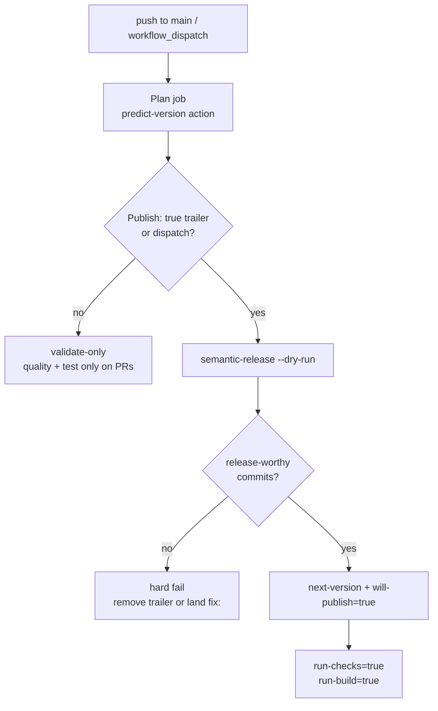
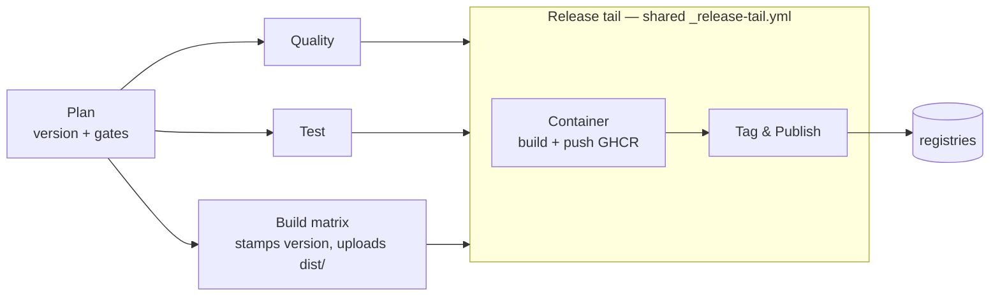
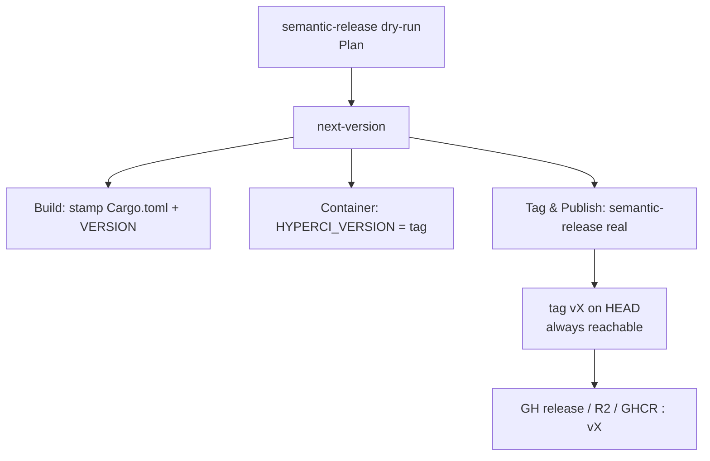
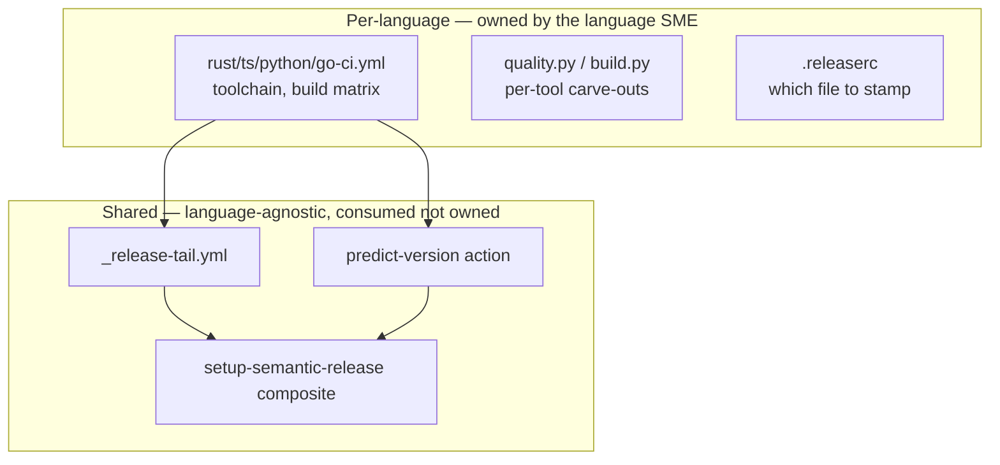
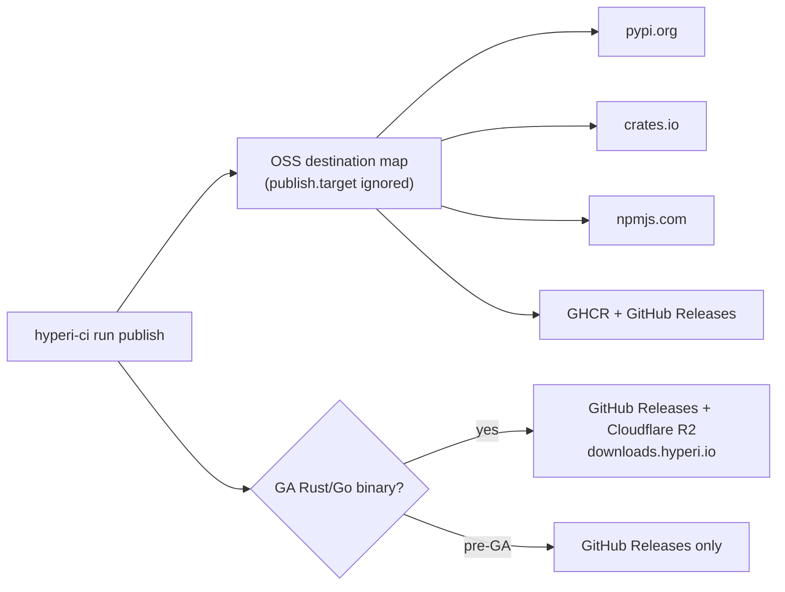
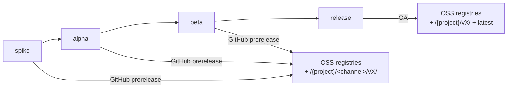

# CI Flow

How a push or dispatch becomes a release. Version-first, single run: one
semantic-release computation drives every stage.

## 1. Trigger and gate

One signal — `will-publish` — gates the whole pipeline.



- `will-publish` = dispatch, or a `Publish: true` trailer on HEAD.
- `next-version` comes from `semantic-release --dry-run` — same config the real
  tag step uses, so they cannot disagree.
- No trailer on a push to main → validate-only (no tag, no publish).

## 2. Pipeline and job dependencies



- Quality / Test / Build run in parallel after Plan.
- Release tail runs only when `will-publish=true`; Container before Tag & Publish.

## 3. Version — one oracle, used everywhere



- Build stamps the binary, Container tags the image, Tag & Publish creates the
  git tag — all the same `next-version`.
- semantic-release tags **HEAD** (not a CI-authored commit), so the tag is
  always reachable and the next run computes the correct next version.
- `@semantic-release/git` is dropped — see `.releaserc` for the why.

## 4. What is done where — and why



| Layer | Owns | Why here |
|---|---|---|
| Per-language workflow + handlers | toolchains, build matrix, `_run_tool` carve-outs (e.g. cargo-audit transient skip), version stamping target | legitimately differs per language; the SME needs full control |
| `predict-version`, `setup-semantic-release`, `_release-tail` | trigger gate, version oracle, semantic-release toolchain, container + tag + publish orchestration | identical across languages; shared so a fix lands once, not 4× |

Rule: shared pieces must help the SME, never hobble them. Anything needing a
per-language carve-out stays in the SME's domain.

## 5. Publish routing

Everything goes to the OSS registry stack. **JFrog was removed in v2.1.4** — the
legacy `publish.target` field (`internal`/`oss`/`both`) is still read for
back-compat but every value routes to the same OSS destination map.



- One artefact type → one destination; there is no private/internal path.
- `publish.channel` controls prerelease vs GA (next section), not destination.

## 6. Release channels

One-branch model. `publish.channel` graduates a project by one line in
`.hyperi-ci.yaml`; it sets prerelease-vs-GA and gates the Rust build-opt tiers —
it does **not** change publish destination (all channels publish OSS).



| Channel | Release kind | Rust build-opt | R2 path |
|---|---|---|---|
| `spike` / `alpha` | GitHub prerelease | none (fast feedback) | `/{project}/<channel>/vX/` |
| `beta` | GitHub prerelease | jemalloc + fat LTO | `/{project}/<channel>/vX/` |
| `release` | GA | + PGO/BOLT (opt-in) | `/{project}/vX/` + `latest` |

- `.releaserc` carries `branches: [{name: main, prerelease: dev}, release]`:
  `main` produces dev pre-releases (x64, fast feedback); merging to `release`
  cuts GA (x64 + arm64).
- `hyperi-ci release-merge` resolves the recurring VERSION-file conflict that
  arises when semantic-release bumps independently on each branch — no consumer
  workflow file needed. Tier detail: [languages/RUST.md](languages/RUST.md).

## 7. Binary publish — what's uploaded and how it's named

Binary destinations (GitHub Releases, Cloudflare R2) receive **only
compiled binaries + their SHA-256 checksums** — no README/CHANGELOG/LICENSE.
This matches industry convention (HashiCorp, Rust, Go): docs live in the repo;
semantic-release populates the release description. `_collect_artifacts()` reads
everything from `dist/`, so build handlers place only binaries + checksums there.

Unified naming across languages — `{name}-{os}-{arch}[.exe]`, **version in the
path, not the filename**:

```
dfe-receiver/vX/dfe-receiver-linux-amd64
dfe-receiver/vX/dfe-receiver-linux-arm64
dfe-receiver/vX/checksums.sha256
dfe-receiver/latest/dfe-receiver-linux-amd64
```

- `os-arch` shorthand (`linux-amd64`) matches Docker/K8s/HashiCorp, not Rust
  target triples — our consumers are ops deploying server-side binaries.
- Version in the path (not the filename) gives stable download URLs and avoids
  the branch-name-leaks-into-filename class of bug.
- Both Rust and Go handlers emit the same format — consumers don't care what
  language built the binary.
