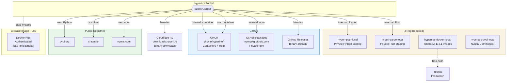

# JFrog Migration Plan (HISTORICAL — JFrog removed in v2.1.4)

> **Status: complete. JFrog publishing was removed in v2.1.4.**
>
> This document is a historical artefact from the v1 → v2 transition,
> when JFrog was being *reduced* to a smaller role. With v2.1.4 the
> reduction completed: **all JFrog publishing code, config, and
> workflow steps were deleted**. Every artefact now publishes to the
> OSS registry stack (GHCR / crates.io / PyPI / npm / GitHub Releases
> / Cloudflare R2). Downstream `.hyperi-ci.yaml` files that still set
> `publish.target: internal` or `publish.target: both` are accepted —
> the field is read for back-compat — but its value is **silently
> routed to the OSS destination map**. There is no JFrog publishing
> path in the codebase anymore.
>
> Document kept for historical context. Do not treat as a current
> reference.

Reduce JFrog to two roles: Telstra artifact delivery and private package
staging (PyPI + Cargo). Move everything else to GitHub (GHCR, GitHub
Packages, public registries, Docker Hub direct auth).

**Decision date:** 2026-03-31

## Architecture (After Migration)



---

## Current State

### JFrog Storage (~75 GB)

| Repository | Size | Purpose | Verdict |
|---|---|---|---|
| `hypersec-docker-local` | 52.3 GB | Legacy DFE 1.x + Telstra images | **Keep (Telstra)** |
| `hypersec-pypi-local` | 7.4 GB | Nuitka-Commercial + legacy packages | **Keep (Nuitka license)** |
| `hyperi-docker-local` | 6.6 GB | ci-runner + dfe-loader container | **Migrate to GHCR** |
| `hyperi-binaries` | 2.0 GB | dfe-loader binary artifacts | **Delete (already on R2 + GH Releases)** |
| `hypersec-terraform` | 1.3 GB | Terraform state backend | **Keep (or move to S3 later)** |
| `hyperi-pypi-local` | 0.4 GB | dfe-engine, hyperi-pylib, dfecli | **Keep (private staging)** |
| `hyperi-cargo-local` | 29.6 MB | Private Rust crates | **Keep (private staging)** |
| `hyperi-npm-local` | 0.9 MB | npm packages | **Migrate to GH Packages npm** |
| `hyperi-helm-local` | 12 files | Helm charts | **Migrate to GHCR OCI** |
| Remote caches | ~1.2 GB | Docker Hub, PyPI, npm proxies | **Delete (use Docker Hub auth)** |

### Active Telstra Pulls (non-negotiable)

| Image | Repo | Last Pulled | User | Status |
|---|---|---|---|---|
| `utils/topic-partion-scaler` | hypersec-docker-local | 2026-03-30 | anonymous | **Active production** |
| `utils/helmfile` | hypersec-docker-local | 2026-01-12 | telstra-prod | **Active** |
| `xdr-data-engine` | hypersec-docker-local | 2025-11-06 | telstra-prod | Likely still deployed |
| `xdr-control-plane-backend` | hypersec-docker-local | 2025-10-02 | telstra-prod | Possibly running |
| `xdr-control-plane-frontend` | hypersec-docker-local | 2025-09-08 | telstra-prod | Possibly running |

Pulled by Telstra K8s clusters directly from `hypersec.jfrog.io`. Changing
the pull URL requires Telstra to update deployment manifests. Do not touch.

---

## What Stays on JFrog

### 1. Telstra DFE 2.1 Artifacts

`hypersec-docker-local` — read-only, no CI changes needed. These images
were built by the old CI system (`hyperi-io/ci`), not `hyperi-ci`.

**Action:** Do nothing. When Telstra decommissions DFE 2.1, delete the repo.

**Cleanup opportunity:** Set a retention policy to delete tags older than
12 months (except Telstra-active tags). Reclaim most of 52 GB.

### 2. Private Package Staging (PyPI + Cargo)

JFrog remains the private staging registry for pre-GA packages. Neither
PyPI nor crates.io offer private/paid tiers — once published, packages
are public with no visibility controls.

**Kept repos:**

| Repository | Purpose | Used by |
|---|---|---|
| `hyperi-pypi-local` | Private Python packages before public PyPI | dfe-engine, new Python projects |
| `hyperi-pypi` (virtual) | Aggregates local + pypi.org | Consumer `pip install` |
| `hyperi-cargo-local` | Private Rust crates before public crates.io | New Rust libraries |
| `hyperi-cargo-virtual` | Aggregates local + crates.io | Consumer `cargo add` |

**Pre-GA workflow (channel-driven):**

Pre-release channels (`spike`, `alpha`, `beta`) automatically force
registry publish to internal destinations only (JFrog staging), regardless
of the configured `publish.target`. This is enforced in `dispatch.py`.

```
1. Set channel: spike, target: oss  → JFrog staging only (channel overrides target)
2. Graduate: alpha → beta           → still JFrog staging only
3. Graduate: release                → now target kicks in → publishes to PyPI/crates.io
```

One-line change per graduation. No workflow changes. No secret changes.

**publish.target routing (updated):**

| Target | PyPI | Cargo | npm | Containers | Helm | Binaries | Go |
|---|---|---|---|---|---|---|---|
| `internal` | JFrog | JFrog | GH Packages | GHCR (private) | GHCR OCI | R2 + GH Releases | go-proxy |
| `oss` | pypi.org | crates.io | npmjs.com | GHCR (public) | GHCR OCI | GH Releases | go-proxy |
| `both` | Both | Both | Both | GHCR | GHCR OCI | Both | go-proxy |

Only Python and Rust use JFrog for `internal`. Everything else goes
through GitHub regardless of target.

### 3. Nuitka-Commercial + Terraform

| Repository | Purpose | Exit condition |
|---|---|---|
| `hypersec-pypi-local` | Nuitka-Commercial license delivery (auto-synced) | Drop Nuitka or find alt delivery |
| `hypersec-terraform` | Terraform state backend (1.3 GB, 577 files) | Migrate to S3 / OpenTofu Cloud |

---

## What Moves to GitHub

### Containers → GHCR

| Image | From | To |
|---|---|---|
| `ci-runner` | `hypersec.jfrog.io/hyperi-docker-local/ci-runner` | `ghcr.io/hyperi-io/ci-runner` |
| `dfe-loader` | `hypersec.jfrog.io/hyperi-docker-local/dfe-loader` | `ghcr.io/hyperi-io/dfe-loader` |
| `dfe-openvpn` | `hypersec.jfrog.io/hypersec-docker-local/dfe-openvpn` | `ghcr.io/hyperi-io/dfe-openvpn` |
| Future DFE containers | Would have gone to JFrog | `ghcr.io/hyperi-io/<name>` |

GHCR containers are private by default. Make public when ready for OSS.
Auth via `GITHUB_TOKEN` — no org secrets needed.

### Helm Charts → GHCR OCI

From `oci://hypersec.jfrog.io/hyperi-helm-local` to
`oci://ghcr.io/hyperi-io/charts`. Already configured in defaults.yaml.

### npm → GitHub Packages

GitHub Packages supports private npm with `@hyperi` scope. Direct
replacement for `hyperi-npm-local`.

```
npm config set @hyperi:registry https://npm.pkg.github.com
```

Private packages visible only to org members. When ready for OSS, switch
to npmjs.com.

### Binaries → Already Done

Already on Cloudflare R2 (`downloads.hyperi.io`) + GitHub Releases.
`hyperi-binaries` on JFrog is redundant — delete it.

### Go Modules → Already Done

Go modules proxy automatically via `proxy.golang.org`. `hyperi-go-local`
on JFrog was never meaningfully used — delete it.

### Docker Hub Pulls → Direct Auth (replacing JFrog proxies)

JFrog currently proxies Docker Hub via `dockerhub-remote` to avoid
anonymous rate limits (100 pulls/6hr). Replace with authenticated Docker
Hub pulls using existing org account.

**Secrets changes:**

Widen `DOCKERHUB_USERNAME` and `DOCKERHUB_TOKEN` from `container-publishers`
to `ci-consumers` so all CI jobs can authenticate pulls.

**Workflow step** (add to all 4 reusable workflows):

```yaml
- name: Docker Hub login
  if: env.DOCKERHUB_USERNAME != ''
  uses: docker/login-action@v3
  with:
    username: ${{ secrets.DOCKERHUB_USERNAME }}
    password: ${{ secrets.DOCKERHUB_TOKEN }}
```

GitHub-hosted runners share IP pools. Without auth, Docker Hub rate limits
hit frequently. This is better than the JFrog proxy — no middleman, no
cache staleness.

PyPI/npm/crates.io proxy repos are not needed — those registries have no
meaningful rate limits.

---

## JFrog Repos: Delete List

After migration, delete these repos to reduce storage and cost:

### Local repos (delete)

| Repo | Size | Reason |
|---|---|---|
| `hyperi-docker-local` | 6.6 GB | Containers moved to GHCR |
| `hyperi-binaries` | 2.0 GB | Already on R2 + GH Releases |
| `hyperi-npm-local` | 0.9 MB | Moved to GH Packages npm |
| `hyperi-helm-local` | ~0 | Moved to GHCR OCI |
| `hyperi-go-local` | 0 | Unused |
| `hyperi-maven-local` | 0 | Unused |
| `hypersec-cargo-local` | 2.1 MB | Unused (hypersec crates never published) |
| `hypersec-npm-local` | 0 | Unused |
| `hypersec-go-local` | 0 | Unused |
| `hypersec-maven-local` | 0 | Unused |
| `hypersec-binaries` | 136 MB | Legacy, superseded by R2 |
| `hypersec-download` | 0 | Unused |
| `hypersec-debian-local` | 562 MB | Legacy |
| `hyperi-debian-local` | 0 | Unused |
| `citests-binaries` | 14 MB | CI test fixture |
| `citests-pypi` | 0 | CI test fixture |
| `downloads` | 274 MB | Superseded by R2 |
| `edgestream-hub-testing` | 0.1 MB | Legacy |
| `images` | 0 | Legacy |
| `xdr-data-engine` (generic) | 950 MB | Legacy |
| `auto-trashcan` | 14 MB | Cleanup |

### Remote proxy repos (delete all)

| Repo | Reason |
|---|---|
| `dockerhub-remote` + cache (174 MB) | Replaced by Docker Hub auth |
| `ghcr-remote` | Direct GHCR access |
| `google-remote` | Direct access |
| `quay-remote` + cache | Direct access |
| `pypi-remote` + cache (146 MB) | Direct access (no rate limits) |
| `npm-remote` + cache (191 MB) | Direct access (no rate limits) |
| `hypersec-cargo-remote` + cache | Direct access |
| `hypersec-go-remote` | Direct access |
| `hypersec-terraform-remote` | Direct access |
| `maven-remote` | Direct access |
| `debian-remote` | Direct access |
| All `helm-remote-*` repos (8 repos) | Direct access |
| `dummy-artifactory-synced` | Legacy |

### Virtual repos (delete)

Delete all `*-virtual` repos for types we no longer proxy:

| Repo | Reason |
|---|---|
| `hyperi-docker` | Containers on GHCR |
| `hyperi-generic` | Binaries on R2 |
| `hyperi-go-virtual` | Direct go-proxy |
| `hyperi-helm-virtual` | Helm on GHCR |
| `hyperi-maven` | Unused |
| `hyperi-npm` | npm on GH Packages |
| `hyperi-debian-virtual` | Unused |
| `hyperi-terraform-virtual` | Keep if Terraform stays |
| `hypersec-docker` | Keep (Telstra pulls via virtual) |
| `hypersec-generic` | Delete after binaries confirmed on R2 |
| `hypersec-go-virtual` | Unused |
| `hypersec-helm-virtual` | Keep if Telstra uses Helm |
| `hypersec-maven` | Unused |
| `hypersec-npm` | Unused |
| `hypersec-debian-virtual` | Delete |
| `hypersec-cargo-virtual` | Keep only if crate staging needed |

### Keep (final JFrog footprint)

| Repo | Type | Purpose |
|---|---|---|
| `hypersec-docker-local` | Local | Telstra container images |
| `hypersec-docker` | Virtual | Telstra pull endpoint |
| `hyperi-pypi-local` | Local | Private Python staging |
| `hyperi-pypi` | Virtual | Aggregates local + pypi.org |
| `hyperi-cargo-local` | Local | Private Rust crate staging |
| `hyperi-cargo-virtual` | Virtual | Aggregates local + crates.io |
| `hyperi-cargo-public-local` | Local | OSS crates (if needed) |
| `hypersec-pypi-local` | Local | Nuitka-Commercial |
| `hypersec-pypi` | Virtual | Nuitka install endpoint |
| `hypersec-terraform` | Local | Terraform state |
| `hypersec-helm-virtual` | Virtual | Only if Telstra uses Helm |

**Estimated storage after cleanup:** ~62 GB (mostly Telstra Docker layers).
With Docker retention policy: potentially under 20 GB.

---

## Migration Plan

### Phase 1: Docker Hub Direct Auth (Week 1)

Remove dependency on JFrog remote proxy repos for base image pulls.

- [ ] Widen `DOCKERHUB_USERNAME` and `DOCKERHUB_TOKEN` scope to `ci-consumers`
- [ ] Add `docker/login-action` step to all 4 reusable workflows
- [ ] Update `config/secrets-access.yaml`
- [ ] Run `sync-secrets-access.py --apply`
- [ ] Test CI runs pull base images without JFrog proxy

### Phase 2: Containers + Helm to GHCR (Week 1-2)

- [ ] Move `ci-runner` image build to push to `ghcr.io/hyperi-io/ci-runner`
- [ ] Move `dfe-loader` container to push to `ghcr.io/hyperi-io/dfe-loader`
- [ ] Move `dfe-openvpn` to `ghcr.io/hyperi-io/dfe-openvpn`
- [ ] Move Helm charts to `oci://ghcr.io/hyperi-io/charts`
- [ ] Update ARC runner pod specs if they reference JFrog ci-runner image
- [ ] Add GHCR login step to workflows that push containers:
  ```yaml
  - name: GHCR login
    uses: docker/login-action@v3
    with:
      registry: ghcr.io
      username: ${{ github.actor }}
      password: ${{ secrets.GITHUB_TOKEN }}
  ```
- [ ] Set GHCR packages to private (default) — make public per-package when OSS
- [ ] Test container publish end-to-end

### Phase 3: npm to GitHub Packages (Week 2)

- [ ] Configure `@hyperi` npm scope to point to GH Packages
- [ ] Update `typescript/publish.py`: replace `_publish_jfrog()` with GH Packages
- [ ] Add GH Packages npm as `destinations_internal.npm: ghcr-npm`
- [ ] Test `npm install @hyperi/pkg` from GH Packages private registry
- [ ] When ready for OSS, publish to npmjs.com (existing flow unchanged)

### Phase 4: Update publish.target routing (Week 2-3)

Narrow JFrog's role in `destinations_internal` to PyPI + Cargo only.

- [ ] Update `src/hyperi_ci/config/defaults.yaml`:
  ```yaml
  destinations_internal:
    python: jfrog-pypi        # KEEP — private staging
    cargo: jfrog-cargo        # KEEP — private staging
    npm: ghcr-npm             # CHANGED — GitHub Packages
    container: ghcr           # CHANGED — GHCR (private)
    helm: ghcr-charts         # CHANGED — GHCR OCI
    binaries: r2-binaries     # UNCHANGED — Cloudflare R2
    go: go-proxy              # CHANGED — direct
  ```
- [ ] Update `config/org.yaml`: add `dockerhub` section, mark jfrog repos deprecated
- [ ] Update `config.py` `OrgConfig`: keep JFrog fields for PyPI/Cargo only
- [ ] Update `publish_binaries.py`: remove `_publish_jfrog_binaries()`
- [ ] Remove `_publish_jfrog()` from `golang/publish.py` (if it exists)
- [ ] Keep `_publish_jfrog()` in `python/publish.py` and `rust/publish.py`
- [ ] Update consumer `.hyperi-ci.yaml` files as needed

### Phase 5: Reduce JFrog Secrets Scope (Week 3)

`JFROG_TOKEN` stays but is needed by fewer repos — only those that publish
private Python or Rust packages.

- [ ] Create new group in `secrets-access.yaml`:
  ```yaml
  # Repos that publish private packages to JFrog staging
  jfrog-staging:
    - dfe-engine          # Private Python (pre-GA)
    - dfe-core            # Private Python (pre-GA)
    # Add new repos here only if they need private staging
  ```
- [ ] Change `JFROG_TOKEN` visibility from `ci-consumers` to `jfrog-staging`
- [ ] Change `JFROG_USERNAME` visibility from `ci-consumers` to `jfrog-staging`
- [ ] Remove `JFROG_ACCESS_TOKEN` (redundant with `JFROG_TOKEN`)
- [ ] Run `sync-secrets-access.py --apply`
- [ ] Remove `JFROG_TOKEN` env from workflow files that don't need it
  (keep only in `python-ci.yml` and `rust-ci.yml`, guarded by `if` condition)

### Phase 6: JFrog Repo Cleanup (Week 4+)

- [ ] Delete all repos listed in "Delete List" above
- [ ] Delete all remote proxy repos and their caches
- [ ] Delete unused virtual repos
- [ ] Set Docker retention policy on `hypersec-docker-local`
- [ ] Delete legacy org secrets from GitHub:
  - `JFROG_ACCESS_TOKEN`
  - `TF_TOKEN_HYPERSEC_JFROG_IO` (only if Terraform migrated)
  - Legacy secrets listed in `secrets-access.yaml` comments
- [ ] Evaluate JFrog plan downgrade (Enterprise -> Pro)

---

## Secrets: Before and After

### Remove

| Secret | Current Use | Why |
|---|---|---|
| `JFROG_ACCESS_TOKEN` | Redundant with JFROG_TOKEN | Consolidate |
| Legacy secrets (7 listed in secrets-access.yaml) | Dead | Clean up |

### Narrow scope

| Secret | Current Scope | New Scope | Why |
|---|---|---|---|
| `JFROG_TOKEN` | ci-consumers (20+ repos) | jfrog-staging (2-3 repos) | Only private PyPI/Cargo |
| `JFROG_USERNAME` | ci-consumers | jfrog-staging | Only private PyPI |

### Widen scope

| Secret | Current Scope | New Scope | Why |
|---|---|---|---|
| `DOCKERHUB_USERNAME` | container-publishers | ci-consumers | All CI needs auth pulls |
| `DOCKERHUB_TOKEN` | container-publishers | ci-consumers | All CI needs auth pulls |

### Keep unchanged

| Secret | Use |
|---|---|
| `DOCKERHUB_PASSWORD` | Docker Hub push (container-publishers) |
| `PYPI_TOKEN` | PyPI publish (python-publishers) |
| `NPM_TOKEN` | npmjs publish (npm-publishers) |
| `CRATES_TOKEN` | crates.io publish (rust-publishers) |
| `CARGO_REGISTRY_TOKEN` | crates.io publish (Rust workflow) |
| `R2_ACCESS_KEY_ID` | Cloudflare R2 binary uploads |
| `R2_SECRET_ACCESS_KEY` | Cloudflare R2 binary uploads |
| `GITHUB_TOKEN` | GHCR push (automatic) |

---

## Config Changes

### defaults.yaml (before/after)

```yaml
# BEFORE
publish:
  target: internal
  destinations_internal:
    python: jfrog-pypi
    npm: jfrog-npm
    cargo: jfrog-cargo
    container: jfrog-docker
    helm: jfrog-helm
    binaries: r2-binaries
    go: jfrog-go
  destinations_oss:
    python: pypi
    npm: npmjs
    cargo: crates-io
    container: ghcr
    helm: ghcr-charts
    binaries: github-releases
    go: go-proxy

# AFTER
publish:
  target: internal
  destinations_internal:
    python: jfrog-pypi          # Private staging (KEPT)
    cargo: jfrog-cargo          # Private staging (KEPT)
    npm: ghcr-npm               # GitHub Packages (MOVED)
    container: ghcr             # GHCR private (MOVED)
    helm: ghcr-charts           # GHCR OCI (MOVED)
    binaries: r2-binaries       # Unchanged
    go: go-proxy                # Direct (MOVED)
  destinations_oss:
    python: pypi                # Unchanged
    npm: npmjs                  # Unchanged
    cargo: crates-io            # Unchanged
    container: ghcr             # Unchanged
    helm: ghcr-charts           # Unchanged
    binaries: github-releases   # Unchanged
    go: go-proxy                # Unchanged
```

### org.yaml (before/after)

```yaml
# BEFORE
jfrog:
  domain: hypersec.jfrog.io
  org_prefix: hyperi
  repos:
    pypi: hyperi-pypi
    pypi_local: hyperi-pypi-local
    npm: hyperi-npm
    go: go-local
    binaries: hyperi-binaries
    cargo_virtual: hyperi-cargo-virtual
    cargo_local: hyperi-cargo-local
    docker: hyperi-docker
    docker_local: hyperi-docker-local
    helm: hyperi-helm
    helm_local: hyperi-helm-local

# AFTER
jfrog:
  domain: hypersec.jfrog.io
  org_prefix: hyperi
  # Reduced to private staging only. All other artifact types use GitHub.
  repos:
    pypi: hyperi-pypi
    pypi_local: hyperi-pypi-local
    cargo_virtual: hyperi-cargo-virtual
    cargo_local: hyperi-cargo-local

ghcr:
  registry: ghcr.io
  org: hyperi-io
  charts_url: oci://ghcr.io/hyperi-io/charts

dockerhub:
  # Authenticated pulls only — NOT a publish target
  registry: docker.io
```

---

## Risk Assessment

| Risk | Impact | Mitigation |
|---|---|---|
| Telstra pulls break | **High** — production outage | Do not touch hypersec-docker-local or its virtual repo |
| JFrog staging needed for new private package | **None** — JFrog PyPI + Cargo remain | Workflow unchanged for Python/Rust |
| Docker Hub rate limits without JFrog proxy | **Medium** — CI failures | Phase 1 adds DOCKERHUB auth before deleting proxies |
| ARC runners reference JFrog ci-runner image | **Medium** — runners fail to start | Update pod specs in Phase 2 before deleting repo |
| npm private packages visible publicly | **Low** | GH Packages npm is private by default |
| Lost build artifacts on deleted repos | **None** | All active artifacts exist on R2, GH Releases, or public registries |

---

## What Changes Per Artifact Type

| Artifact | Before (internal) | After (internal) | After (oss) |
|---|---|---|---|
| Python packages | JFrog PyPI | JFrog PyPI (unchanged) | PyPI (unchanged) |
| Rust crates | JFrog Cargo | JFrog Cargo (unchanged) | crates.io (unchanged) |
| npm packages | JFrog npm | **GH Packages npm** | npmjs (unchanged) |
| Containers | JFrog Docker | **GHCR (private)** | GHCR (public) |
| Helm charts | JFrog Helm OCI | **GHCR OCI** | GHCR OCI |
| Binaries | R2 + JFrog generic | **R2 only** | GH Releases |
| Go modules | JFrog Go | **go-proxy (direct)** | go-proxy |
| Base image pulls | JFrog Docker Hub proxy | **Docker Hub direct (authed)** | Same |

---

## What We Gain

1. **Reduced JFrog surface** — from 12 repos to 4 (PyPI local/virtual + Cargo local/virtual)
2. **Fewer secrets** — `JFROG_TOKEN` scoped to 2-3 repos instead of 20+
3. **No proxy dependency** — CI pulls directly from registries, faster and simpler
4. **GITHUB_TOKEN auth** — GHCR containers + GH Packages npm need no org secrets
5. **Simpler publish code** — remove JFrog paths from npm, container, Helm, binary, Go handlers
6. **JFrog exit readiness** — when Telstra decommissions + private packages go public, cancel JFrog with zero migration work
7. **Docker Hub auth** — explicit, reliable, no cache staleness from proxy layer

## What We Keep

1. **Private package staging** — pre-GA Python and Rust packages stay private on JFrog until ready for public registries
2. **Telstra continuity** — zero disruption to production container pulls
3. **Nuitka-Commercial** — license delivery unchanged
4. **Terraform state** — untouched (separate migration if desired)

## Exit Conditions (full JFrog cancellation)

All three must be true:

1. Telstra DFE 2.1 decommissioned or re-pointed to another registry
2. No active private Python/Rust packages on JFrog (all promoted to public)
3. Nuitka-Commercial delivery moved (or Nuitka dropped)

When all three are met, delete remaining repos and cancel JFrog subscription.
