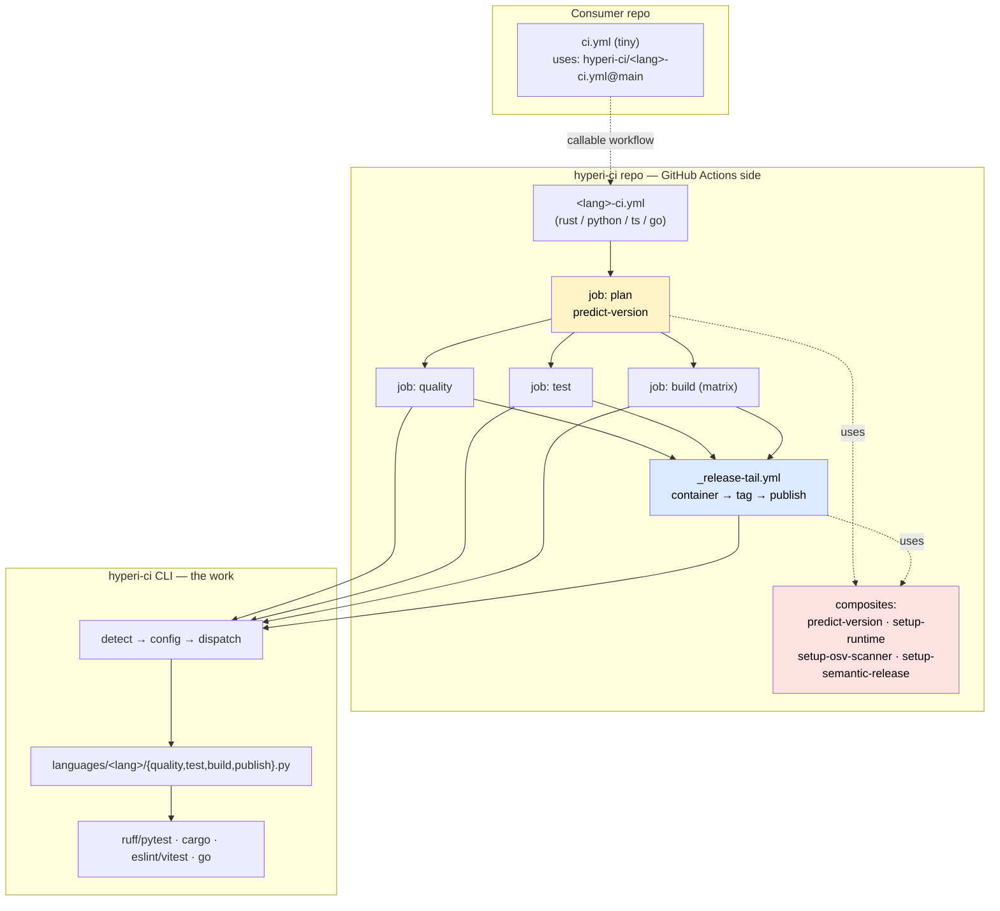

# hyperi-ci docs

One CLI (`hyperi-ci`) plus a thin set of GitHub Actions reusable workflows.
Consumers add a tiny `ci.yml` that calls `<lang>-ci.yml@main`; everything
language-aware — quality, test, build, publish — runs in the CLI, identically
on a laptop and in CI. The workflows do GitHub-side orchestration only:
predict-and-gate, container build, tag, publish.

This is the index. Read [ARCHITECTURE.md](ARCHITECTURE.md) for how the two
sides fit, [FLOW.md](FLOW.md) for how a push becomes a release, and
[migration/ONBOARDING.md](migration/ONBOARDING.md) to move a repo onto it.

---

## The deal

| Add this to a repo | And you get | Without |
|---|---|---|
| `ci.yml` calling `<lang>-ci.yml@main` (+ `secrets: inherit`) | plan-and-gate, quality, test, multi-arch build, container, tag, publish | Writing any pipeline YAML beyond a few lines |
| `.hyperi-ci.yaml` | language detection, publish routing, build tiers, container mode | A bespoke CI config schema per repo |
| nothing else | semantic-release tagging, version stamping, SHA-pinned deps, fork safety, ARC/free runner choice | Wiring semantic-release, Renovate, runner labels yourself |
| `hyperi-ci check` locally | the same quality+test path CI runs — ~95% confidence pre-push | "works locally, fails in CI" |

The CLI owns the work; the workflows are runner glue around it. That keeps the
cost of switching CI vendors (GitHub → Buildkite, one day) bounded to the glue.

---

## 10,000-foot view

Solid arrows are run-order / data flow. Dashed arrows are "calls / uses".

---

## Where to read what

### Start here

- [ARCHITECTURE.md](ARCHITECTURE.md) — the two sides (workflows + CLI), the
  two-level workflow model, the job contract, what's shared vs duplicated, why
- [FLOW.md](FLOW.md) — push/dispatch → gate → version → build → tag → publish,
  one semantic-release computation driving every stage
- [migration/ONBOARDING.md](migration/ONBOARDING.md) — put a repo on hyperi-ci

### Dependencies & supply chain

- [dependencies/DEPS-PINNING.md](dependencies/DEPS-PINNING.md) — `/deps` script
  + `config/versions.yaml` SHA-pin Actions; Renovate as PR-only watchdog;
  7-day cooldown; the hard rules
- [dependencies/WORKFLOW-PINNING.md](dependencies/WORKFLOW-PINNING.md) — why our
  own reusable workflows stay `@main`, the interface gate that makes that safe,
  and the decision record for issue #31 (the trilemma + what we accept)

### Languages

- [languages/RUST.md](languages/RUST.md) — channel-gated optimisation (jemalloc
  + LTO, PGO, BOLT), local hygiene, troubleshooting
- [languages/PYTHON.md](languages/PYTHON.md) — uv, wheel/sdist, Nuitka, PyPI
  publish, the eager-import and sdist-exclude gotchas
- [languages/TYPESCRIPT.md](languages/TYPESCRIPT.md) — npm/yarn/pnpm detection,
  Corepack, `install-deps`
- [languages/GO.md](languages/GO.md) — go vet/test/build, go-proxy + GH-release
  binaries

### Runtime & build environment

- [runtime/RUNNERS.md](runtime/RUNNERS.md) — ARC vs free mode, runner tiers,
  the dep-install SSOT (`install-toolchains` / `install-native-deps`), the
  NFS sccache/ccache cache, split-runner multi-arch, cross-compile (dormant)
- [runtime/PGO-BOLT.md](runtime/PGO-BOLT.md) — how to write a PGO workload script
- [runtime/TESTENV.md](runtime/TESTENV.md) — Redpanda / ClickHouse compose
  patterns for integration tests inside the 4 GB CI deck

### Deployment artefacts

- [deployment/CONTRACT.md](deployment/CONTRACT.md) — the deployment contract a
  binary emits; how container/Helm/ArgoCD artefacts are generated
- [deployment/CONTRACT-IDENTITY.md](deployment/CONTRACT-IDENTITY.md) — contract
  identity annotation scheme
- [deployment/TIERS.md](deployment/TIERS.md) — three-tier deployment rollout

### Migration & history

- [migration/JFROG.md](migration/JFROG.md) — historical: JFrog removed in v2.1.4;
  all artefacts now publish to the OSS stack
- [migration/CODEBERG-SECRETS-AND-CI.md](migration/CODEBERG-SECRETS-AND-CI.md)
  — Codeberg + Buildkite portability notes (aspirational)
- [LESSONS.md](LESSONS.md) — the war stories: every gotcha that cost a
  re-dispatch, by language and subsystem

### Workflow artefacts (not user docs)

- [superpowers/](superpowers/) — in-flight design specs and execution plans
  (gitignored; never published)

---

## Project facts

- **Package:** [hyperi-ci](https://pypi.org/project/hyperi-ci/) (PyPI)
- **Runtime dep:** [scalo](https://pypi.org/project/scalo/)
  (successor to the deprecated hyperi-pylib; a broken scalo would break
  CI for every repo)
- **Languages:** Rust, Python, TypeScript, Go
- **Self-hosting:** hyperi-ci runs its own CI through its own reusable workflow
- **Used by:** dfe-engine, dfe-receiver, dfe-loader, dfe-archiver, dfe-fetcher,
  scalo-rs, scalo-py, the dfe-transform-* canaries
