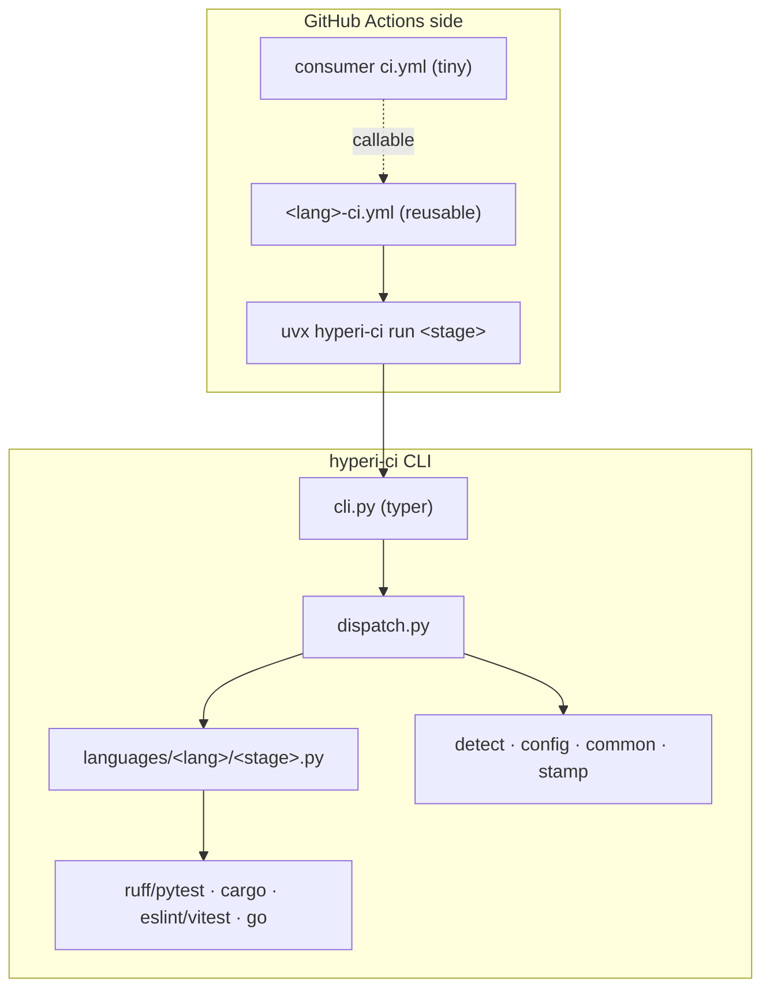
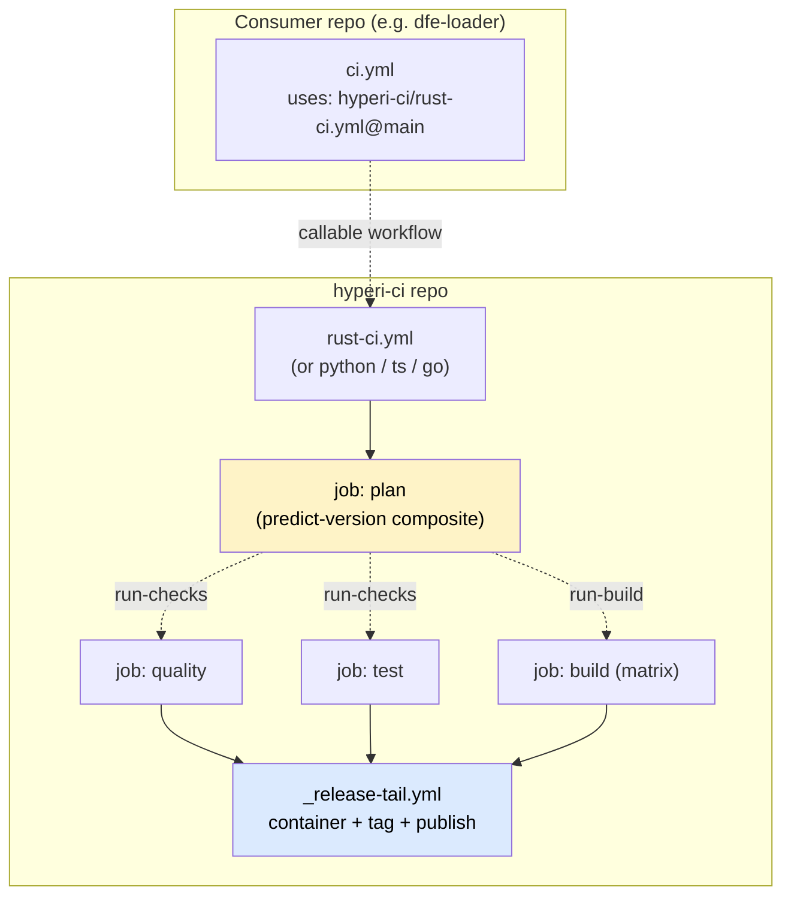
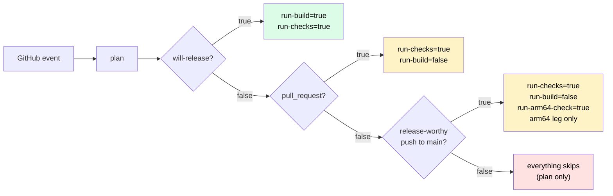

# hyperi-ci architecture

> Start here, then [flow.md](flow.md) for the push -> release lifecycle.

## What it is

A single Python CLI (`hyperi-ci`) plus a thin set of GitHub Actions reusable
workflows. It replaced a legacy system (~100 shell scripts, 50+ composite
actions, a six-layer dispatch hierarchy) with one tool that runs identically
on a laptop and in CI, across Rust, Python, TypeScript and Go.

Two sides, one job each:

- **CLI side** does the work - lint, test, build, publish - via `subprocess`
  to language tools. No bash logic; 70% of old-CI failures were bash syntax.
- **GitHub Actions side** does orchestration only - job ordering, matrix,
  caching, secrets, the predict-and-gate, container build, tag, publish.



**Why the split:** workflow files stay tiny (no YAML logic); tool invocation is
tested locally before CI; a new check is a Python change, not workflow YAML;
the same code path runs everywhere, so "works locally, fails in CI" largely
disappears. It also bounds the cost of one day moving off GitHub Actions
( -> Buildkite): rewrite the glue, keep the CLI.

## Workflow model - two levels, no deeper



Level 1 = the consumer's `ci.yml` calling `<lang>-ci.yml@main`. Level 2 = that
language workflow calling the shared `_release-tail.yml` and the composites.
No `_setup.yml`/`_ci.yml` orchestrator chains. Web research (astral-sh/uv,
tokio-rs/tokio, vercel/turborepo) shows mature multi-language repos keep CI
flat with a plan job + gates, not chained reusable workflows.

## The job contract every language follows

Each `<lang>-ci.yml` is a `workflow_call` reusable workflow with the same jobs,
same order, gating on the same `plan` outputs. Only the *internals* of
quality/test/build differ per language (tools, toolchain, cache keys) - that is
the single place language divergence is allowed.

| Job | needs | if | Purpose |
|---|---|---|---|
| `plan` | - | always | Decide whether this run is a release; emit gate outputs |
| `commit-check` | - | push-to-main OR `pull_request` | Conventional-commit **landing gate** - fatal on push to main (validates what lands), advisory on PRs. NOT `run-checks`-gated (see below) |
| `quality` | `[plan]` | `run-checks` | Lint / typecheck / security scan |
| `test` | `[plan]` | `run-checks` | Tests at the plan's `test-tier`, named `Test (<tier>, <runner>)`; a full run passes `--tier full` |
| `build` | `[plan, quality, test]` | `run-build` | Compile binaries / wheels / packages, stamp version, upload `dist/` |
| `release-tail` | `[plan, build]` | own gates | Container + tag-and-release, via shared `_release-tail.yml` |
| `gate` | `[plan, quality, test, build]` | always | `hyperi-ci gate-check`: fails when a required job did not pass, and names the test tier. The context a ruleset should require (issue #177) |

`commit-check` is deliberately **independent of `plan` / `run-checks`**: that
gate skips the quality job on non-release-worthy merges to main, so a bad
conventional-commit message could otherwise land unvalidated. It is a cheap
git-log + regex check (no compile/publish), fatal on the push that actually
reaches main and advisory on PRs (branch commits may be squashed away - only
the squash subject lands). Feature-branch pushes skip it, preserving the
chore-skip fast path. Logic: `hyperi_ci.quality.commit_validation.run`; the
local `hyperi-ci check` runs the same validation over `origin/main..HEAD`.

What drove the split: dfe-ui#81 red-flagged nine `feat:` WIP commits on one of
Kaz's branches, none of which reached main. The gate was right that they were
mislabelled and wrong about which commits mattered -- it validated throwaway
branch commits while the squash subject that actually landed went unchecked. A
second gap sits behind it: a team merging through the GitHub UI never invokes
`hyperi-ci push`, so the local bump guard never runs and the PR-time check is
their only one. Validating what LANDS covers both, and is merge-method
agnostic. The accepted cost is that it is post-hoc -- the bad message is on
main by the time it fails, so the fix is a follow-up commit rather than a
rejected push.

### Gate outputs (computed in `plan`)

| Output | True when | Effect |
|---|---|---|
| `will-release` | push to **main** with `Release: true` trailer, OR `workflow_dispatch` carrying `tag` or `from-head: true` | The underlying release signal. A trailer on a non-main ref is ignored LOUDLY (`::warning::`) - main is the sole release path (branch-mode decision 1). A dispatch carrying neither is validate-only and warns that nothing was released. A `schedule` run is never a release, whatever HEAD's trailer says |
| `run-checks` | `will-release`, OR a **release-worthy push to main** (the pushed range carries a `feat:` / `fix:` / `perf:`; a range that cannot be resolved counts as worthy, so the gate fails open), OR `pull_request`, OR `workflow_dispatch`, OR `schedule` | Run quality + test. A release-worthy merge is TESTED, never shipped - `run-build` stays release-only |
| `test-tier` | `full` on `schedule`, when the `test-tier` input is `full`, when the project's own `test.tier` is `full`, or on `will-release` with `full-required-for-release`; else `core` | The tier the Test job runs. Nothing lowers it, so a caller forwarding `core` on every event cannot lower a scheduled or opted-in release run. An unknown value, from the input or the project, fails Plan |
| `full-required-for-release` | the project sets `test.full.required_for_release: true` | A release runs `full`. The Gate fails a release handed any other tier. Off by default |
| `run-build` | `will-release`, OR `workflow_dispatch`, OR `pull_request` with the `branch-build` opt-in | Run build + container (the release tail stays `will-release`-only) |
| `run-arm64-check` | a **release-worthy push to main** on a Rust project that ships `aarch64-unknown-linux-gnu` and has not set `build.rust.arm64_on_main: false` | Run the Build job with an arm64-ONLY matrix. Read by `rust-ci.yml` alone; the release tail does not run, so this compiles one leg and ships nothing |
| `next-version` | `will-release` AND push | Predicted semver from semantic-release dry-run |
| `python-version` | always | The interpreter every job builds and tests on: a pegged `.python-version`, else the `requires-python` FLOOR, else the `versions.yaml` default. The floor, because testing above it hides the bug it exists to catch - a 3.14-only feature in a repo that promises 3.12 |
| `build-matrix` | always | Both arches whenever `run-build` is true, so a validate-only dispatch and a branch-mode PR build arm64 too. `run-arm64-check` alone yields the arm64 leg by itself. A project that lists `build.rust.targets` in `.hyperi-ci.yaml` gets legs for those targets only, so one that cannot build arm64 still releases amd64 |

A push to a release branch with NO trailer is validate-only, which is correct and reads exactly like a release run. The gate asks `unreleased.py` what the last `v*` tag does not include and raises a `::warning::` naming the count, the tag and its age; it stays quiet when nothing releasable is waiting, and says separately when there is no tag to measure against.

The `_release-tail.yml` **input** is still named `will-publish`, as is the
`publish-target` input on each `<lang>-ci.yml`. GitHub validates reusable-workflow
inputs before any of our code runs and hard-errors on an undeclared one, so a
deprecation warning can never reach them. They keep their names.

**Two derived gates** because PR runs need quality+test (review feedback) but
never build or release, and `chore:`/`docs:` pushes to main need no heavy compute.

### Branch-mode (opt-in PR build + dev images)

`branch-build: "true"` (workflow input, or the `HYPERCI_BRANCH_BUILD` repo
variable) makes pull_request runs also build + container-validate - the FULL
pipeline short of publishing. Separately, `release.container.dev_push: true`
in `.hyperi-ci.yaml` makes that PR container push a **dev image**: mutable
`branch-<slug>` (pointer) + immutable `branch-<slug>-sha-<short>` (pin),
GHCR only, never a version tag, `latest`, or a bare `sha-<short>` - the GA
namespace stays untouched, which is what makes pruning safe. Dev images are
ephemeral: projects with `dev_push` add a tiny cron workflow calling the
shared `_ghcr-prune.yml` (dataaxiom/ghcr-cleanup-action, multi-arch-safe),
which globs `branch-*` / `dev-sha-*` plus untagged layers. Dev images are a
different artifact class from a GA release - main + an explicit release remains
the ONLY path to PyPI / crates.io / R2 / GA container tags. Mode resolution
(release / dev / validate) is one SSOT: `hyperi_ci.release_mode`, shared by
the container, helm, and argocd stages (helm/argocd treat dev as validate).
Design: `docs/plans/2026-07-branch-mode/PLAN.md`.



### What runs when

| Push type | plan | commit-check | quality | test | build | container | tag+publish |
|---|---|---|---|---|---|---|---|
| `chore:` / `docs:` to main | yes | yes | no | no | no | no | no |
| `feat:`/`fix:` to main, no `Release:` trailer | yes | yes | yes | yes | arm64 only, Rust | no | no |
| `feat:`/`fix:` to main + `Release: true` | yes | yes | yes | yes | yes | yes | yes |
| Pull request | yes | yes advisory | yes | yes | no | no | no |
| Pull request + `branch-build` opt-in | yes | yes advisory | yes | yes | yes | yes validate / dev push | no |
| `workflow_dispatch` with `tag` / `from-head` (release) | yes | no | yes | yes | yes | yes | yes |
| `workflow_dispatch`, bare (validate-only) | yes | no | yes | yes | yes | yes validate | no |
| `schedule` (a caller's cron) | yes | no | yes | yes, full tier | no | no | no |
| push to a feature branch | yes | no | no | no | no | no | no |

### Test tiers

`core` is what a PR and a push run. `full` adds every test the project deselects or ignores by default, and runs on a `schedule`, on a run given `test-tier: full`, and in a project whose own `test.tier` is `full`. Plan resolves the tier once (`hyperi_ci.plan_tier`, loaded by path from the composite, reading every config spelling `load_config` accepts). The Test job passes `--tier full` on a full run and nothing on a core run, so a core run leaves the project's own `test.tier` in charge.

A release runs `core`, as it did before tiers, and the Gate says so. A project opts its releases into `full`:

```yaml
# .hyperi-ci.yaml
test:
  full:
    required_for_release: true   # releases run full
```

The Gate job has no checkout, so Plan reads this key and passes it as the `full-required-for-release` output. A caller reaches `test-tier: full` on a dispatch only once its own `ci.yml` declares the input and forwards it. `hyperi-ci init` scaffolds both, and `hyperi-ci audit-callers` notes a caller without it rather than counting it as drift. A `schedule` and a dispatch that publishes nothing each get their own concurrency group, so neither can cancel a release on main or be cancelled by a push.

Three things enforce a full release, and the Gate is none of them. Plan forces `full` when the project opts in. The Test job passes `--tier full`, which a CLI without the flag rejects, so a full run never quietly runs core. Build needs Test, and the release tail needs Build. The Gate runs beside the release tail and cannot stop it: it names the tier in its reason line, and fails the run after the fact if an opted-in release was handed anything but `full`.

Tag-on-publish doctrine: a commit landing on main produces no tag and no
artefacts. The operator opts in with `hyperi-ci push --release` (adds the
`Release: true` trailer). See [flow.md](flow.md).

### arm64 parity

arm64 legs once keyed off `will-release`, so the first execution of arm64 code was the run meant to ship it. A BOLT refusal over Cortex-A53 veneers was found mid-publish on dfe-receiver, and the fix for it could not be exercised except by attempting another release (issue #249). Two changes narrow that:

- **Arch breadth follows `run-build`.** A validate-only `workflow_dispatch` and a branch-mode PR build both arches, so arm64 is reachable on demand without publishing anything.
- **`run-arm64-check` builds the arm64 leg alone on a release-worthy merge to main**, where a regression is still attributable to the change that caused it. Rust only; `rust-ci.yml` is the sole reader.

Neither runs PGO or BOLT. Both build below the release tier (`channel` resolves to alpha when the run does not publish), so they catch arm64 compile and link defects, and a BOLT-stage defect like #249's still first runs in a release.

The red line is unchanged: a merge that ships nothing still compiles nothing. `run-build` does not widen, a non-bumping merge runs no build job at all, and the release tail is gated on `run-build` so the parity build runs no container and publishes nothing.

A Rust project opts out with `build.rust.arm64_on_main: false` in `.hyperi-ci.yaml`. The default is on wherever `build.rust.targets` names `aarch64-unknown-linux-gnu` or names nothing (which means every target); it is inert elsewhere.

## What's shared vs duplicated - and the rule

The rule: **language-agnostic and identical across languages -> shared; anything
that needs a per-language carve-out -> stays in the language SME's domain in its
complete form.** Shared pieces must help the SME, never hobble them.

| Concern | Shared? | Where |
|---|---|---|
| Predict-and-gate (version oracle + gate outputs) | YES | `actions/predict-version` composite |
| Toolchain + dep install (uv, language runtime) | YES | `actions/setup-runtime` composite |
| OSV vulnerability scan | YES | `actions/setup-osv-scanner` composite |
| semantic-release toolchain + default config | YES | `actions/setup-semantic-release` composite |
| Release tail (container + tag + publish) | YES | `_release-tail.yml` reusable workflow |
| Version stamping (VERSION file) | YES | CLI `stamp-version` (central), see below |
| Build commands, cache keys, `_run_tool` carve-outs | NO | Inline per language in `<lang>-ci.yml` + handlers |
| Plan-job structure, gate `if:` strings | DUPLICATED inline | small and identical across the four workflows; cheaper than the abstraction - drift caught by `tests/unit/test_workflow_consistency.py` |

**When we extract a composite vs inline:** when the shared steps are more than a
few lines *and* identical across languages (runtime setup, the OSV scan, the
semantic-release toolchain). A short repeated snippet stays inlined - composite
indirection would cost more than it saves, and the consistency lint catches
drift. This is a refinement of the earlier "inline everything" stance: the four
composites above earned extraction; nothing smaller has.

### Central vs language-specific (the VERSION example)

Version writing is identical regardless of language, so it is central:
`stamp-version` writes the `VERSION` file, then delegates only the
*manifest* edit (Cargo.toml `[package]`, pyproject `[project]`, package.json)
to a per-language `stamp_manifest`. The release version itself resolves once,
the same way everywhere - `HYPERCI_VERSION` env -> `VERSION` file
(`common.resolve_release_version`) - so build, container and publish never
disagree. See [flow.md](flow.md) section 3.

`VERSION` is a stamp TARGET, not a version the project maintains. The value is
derived from the git tags (semantic-release, in `predict-version`), written on the
runner before packaging, and never committed back -- the other half of
tag-on-publish: the released version IS the git tag. So the committed value is
whatever it was last stamped to by hand, in every repo on hyperi-ci, and it goes
stale immediately. It bites only where someone runs a package from its own
checkout, which is why `hyperi-ci --version` names the checkout path when the
install is editable.

## Same-org refs stay `@main` - made safe by a gate

Third-party actions are SHA-pinned (`/deps` script + `src/hyperi_ci/config/versions.yaml`,
7-day cooldown). Our **own** reusable workflows and composites reference their
siblings at `@main`, deliberately - pinning them would freeze the dev loop. A
consumer SHA-pinning the *caller* still floats those `@main` internals, so a
breaking interface change on `main` could break pinned consumers retroactively.
We stop that **at source** with an interface backward-compat gate in our own
Quality job, not with a frozen graph. Full rationale, the trilemma, and the
branch-protection precondition: [dependencies/WORKFLOW-PINNING.md](dependencies/workflow-pinning.md).
Third-party pinning policy: [dependencies/DEPS-PINNING.md](dependencies/deps-pinning.md).

That gate covers the workflow INTERFACE -- inputs, outputs, secrets -- and cannot see the version split underneath it. A consumer resolves the YAML at `@main`, so a push is live instantly; the runner installs `uvx hyperi-ci` from PyPI, so CLI code is live only once a release finishes. A commit whose workflow needs new CLI behaviour is broken until that release lands, and hyperi-ci's own release run is the first caller of the workflow it is shipping.

**A workflow change on main must work against the CLI already released to PyPI.** Ship the capability as its own commit, release it, then switch the workflow on in a second commit. The reverse order is safe: CLI code needing a new workflow input finds it already there.

## CLI surface

```
hyperi-ci run <stage>      quality | test | build | release
hyperi-ci check [--quick|--full|--strict]  pre-push: quality(+test)(+build); --strict fails on warn-tier findings
hyperi-ci push [--release]         commit + push, opt-in Release: true trailer
hyperi-ci release [<tag>]          release/retry HEAD, or re-release an existing tag
hyperi-ci stamp-version <v>        write VERSION + manifest (central)
hyperi-ci init                     scaffold ci.yml, .hyperi-ci.yaml, Makefile, githooks
hyperi-ci detect | config          show detected language / merged config
hyperi-ci trigger | watch | rerun | logs   drive GitHub Actions from the terminal
hyperi-ci install-toolchains | install-native-deps | install-deps   runner/CI dep install
hyperi-ci init-contract | emit-artefacts | overlay-render | stitch | init-gitops | init-topology   deployment artefacts
hyperi-ci update                  self-upgrade the installed tool
hyperi-ci autoupdate               channel (live|stable) / enable / freeze -- see self-update.md
```

### Dispatch

`hyperi-ci run quality` -> `detect.py` identifies the language (file markers or
`.hyperi-ci.yaml` / `HYPERI_CI_LANGUAGE`) -> `config.py` merges configuration ->
`dispatch.py` imports `hyperi_ci.languages.<lang>.<stage>` and calls
`run(config, extra_env) -> int`.

```
src/hyperi_ci/languages/<lang>/{quality,test,build,release}.py
```

### Configuration cascade

```
CLI flags → ENV (HYPERCI_*) → .hyperi-ci.yaml → config/defaults.yaml → hardcoded
```

`.hyperi-ci.yaml` is the per-project SSOT (language, build targets, release).
Three config homes with non-overlapping boundaries:

| Home | Holds | Managed by |
|---|---|---|
| `config/*.yaml` (`org`, `defaults`, `runners`, `versions`, `toolchains`, `native-deps`) | CI logic, routing, registry URLs, runner labels, pinned versions | PR + review; unit-tested |
| GitHub **Vars** | platform infra: `GH_RUNNER_*`, `PUBLISH_TARGET` | UI |
| GitHub **Secrets** | credentials: `CRATES_TOKEN`, `NPM_TOKEN`, `R2_ACCESS_KEY_ID`/`R2_SECRET_ACCESS_KEY`, `CONTAINER_MGT_APP_PRIVATE_KEY`, `GIT_TOKEN` | UI, encrypted, scoped |

Rule: affects CI logic/routing -> `config/`. Platform infra -> Vars. Credential ->
Secrets.

## Release routing

Everything publishes to the OSS registry stack. The legacy
`release.target` config field (`internal` / `oss` / `both`) is still
accepted in downstream `.hyperi-ci.yaml` for back-compat but ignored at runtime -
every value routes to the same OSS destination map
(`config.publish_destinations()`). It is a different thing from the
`publish-target` workflow input, which is live and still read.

The config namespace is `release:`. A `publish:` block still works: it folds into
`release:` at load time and each moved key is named in a warning.

| Artefact | Destination |
|---|---|
| Python wheel/sdist | pypi.org |
| Rust crate | crates.io |
| npm package | npmjs.com |
| Container | GHCR (`ghcr.io/hyperi-io`) |
| Binaries (Rust/Go) | GitHub Releases + Cloudflare R2 (`downloads.hyperi.io`) for GA |
| Go module | go-proxy (by tag) |

`release.channel` controls **prerelease vs GA**, not destination:
`alpha`/`beta` ship as GitHub prereleases; `release` is GA. It does NOT gate the
Rust build-opt tiers - `_resolve_build_channel` in `languages/rust/build.py`
never reads it, and the tier follows whether the run releases
([languages/RUST.md](languages/rust.md)). Detail + mermaid: [flow.md](flow.md)
section 5-6. Registry migration record, and the artifact repos still
serving production: [migration/JFROG.md](migration/jfrog.md).

## Container builds

The `release-tail` builds and pushes an OCI image to GHCR for **apps**. Three
auto-detected modes:

| Mode | Language | Dockerfile source |
|---|---|---|
| **contract** | Rust + scalo | generated from the binary's `container-manifest.json` |
| **template** | Python, TypeScript | built-in uv / pnpm templates |
| **custom** | any | repo's own `Dockerfile` + injected OCI labels |

Push-to-main builds single-arch (`:sha-…`); a release builds multi-arch
(`:vX` + `:latest`). Auth via the `hyperi-container-mgt` GitHub App. Artefact
generation from the contract: [deployment/CONTRACT.md](deployment/contract.md).

**App-only, resolved before Docker (issue #33).** `release.container.enabled` is
`auto` (default) | `true` | `false`. Under `auto` the stage builds only when it
finds a signal - a Dockerfile, or a Rust binary using scalo's contract.
**Libraries (a Rust crate, a Python package) have no signal and ship no
container.** The decision is resolved *before* Docker Buildx boots, so a library
never pulls buildkit from Docker Hub nor logs in to GHCR.

**Container failure never blocks the release (issue #33).** Tag & Release is
decoupled from the Container job (`always()`): a transient container/registry
hiccup surfaces as a red run but the crate/PyPI/npm + GitHub Release still ships
and the tag is still cut. The container image is a secondary artefact; the
package is the point of the release.

## Runner modes (summary)

| Mode | Runners | Cache | Toolchain |
|---|---|---|---|
| `self-hosted` | ARC on the DevEx cluster | persistent NFS sccache/ccache | pre-baked in the image |
| `free` | GitHub `ubuntu-latest` | none between runs | installed per-job |

Resolved highest-wins: workflow input `runner-mode` -> var `GH_RUNNER_MODE` ->
`GH_RUNNER_*` labels -> `ubuntu-latest`. `free` mode lets any org use the
workflows with no self-hosted infra. Multi-arch uses **native runners per arch**
(amd64 on ARC, arm64 on `ubuntu-24.04-arm`), not cross-compilation. Full
detail - tiers, cache, cross-compile (dormant) - is
[runtime/runners.md](runtime/runners.md), and the dep-install SSOT is
[runtime/runner-image.md](runtime/runner-image.md).

## Design principles

1. **No bash.** All logic is Python; `subprocess.run([...])` with list args.
2. **One version oracle.** semantic-release dry-run in `plan` predicts the
   version every stage stamps; the real run tags **HEAD** so the tag is always
   reachable (no orphaning).
3. **uv for everything** - venv, sync, lock, tool install, build.
4. **Cross-platform** - `pathlib`, `shutil.which`, `sys.platform`; Linux (CI)
   and macOS (dev).
5. **Self-hosting** - hyperi-ci runs its own pipeline through its own workflow.
6. **KISS** - a maintained third-party tool that's good enough beats bespoke CI code.
   Over-engineered CI kills small teams; we reject custom machinery (see #31).

## Repo layout

```
.github/
  workflows/   ci.yml (self-host) · {python,rust,ts,go}-ci.yml · _release-tail.yml
  actions/     predict-version · setup-runtime · setup-semantic-release
               setup-osv-scanner · setup-go-tools · setup-rust-tools
               setup-nextest                                          (pinned tool installs)
src/hyperi_ci/
  cli.py · dispatch.py · detect.py · config.py · common.py · stamp.py · init.py
  config/      defaults · org · versions · deprecated-files · toolchains/ · native-deps/
  container/   stage · labels · templates · manifest · compose · build
  languages/   python · rust · typescript · golang   (quality|test|build|release)
config/        fixtures · dynamic-config-keys · retired-interfaces   (repo-root, not shipped in the wheel)
scripts/       update-versions.py (/deps) · check-workflow-interfaces.py (#31 gate)
templates/     pgo-workload/ · testenv/
docs/          this tree
VERSION · pyproject.toml · uv.lock
```
