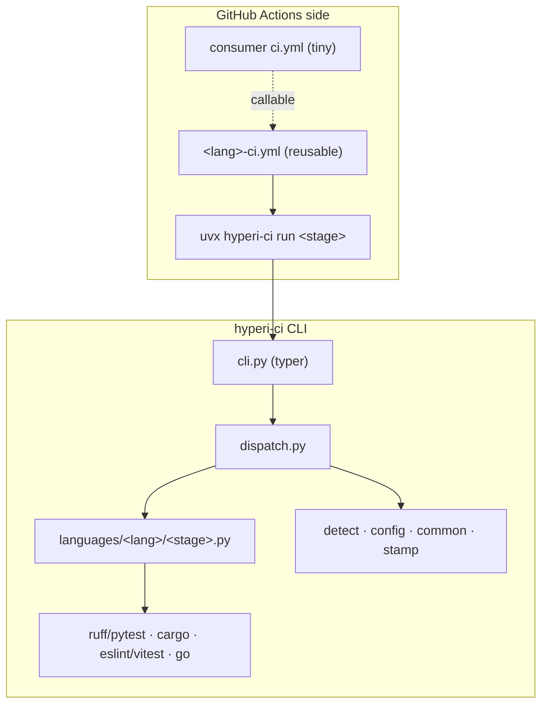
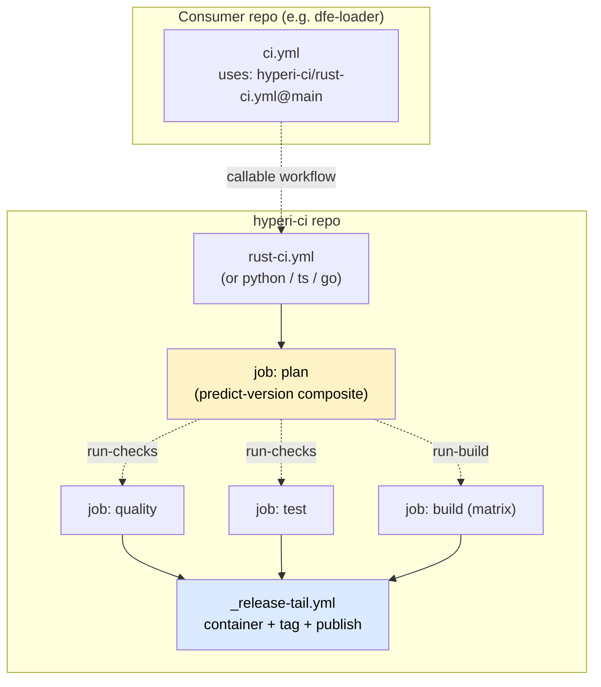

# hyperi-ci architecture

> Start here, then [flow.md](flow.md) for the push -> release lifecycle.

## What it is

A single Python CLI (`hyperi-ci`) plus a thin set of GitHub Actions reusable
workflows. It replaced a legacy system (~100 shell scripts, 50+ composite
actions, a six-layer dispatch hierarchy) with one tool that runs identically
on a laptop and in CI, across Rust, Python, TypeScript and Go.

Two sides, one job each:

- **CLI side** does the work - lint, test, build, publish - via `subprocess`
  to language tools. No bash logic; 70% of old-CI failures were bash syntax.
- **GitHub Actions side** does orchestration only - job ordering, matrix,
  caching, secrets, the predict-and-gate, container build, tag, publish.


```mermaid
flowchart TB
    subgraph GHA["GitHub Actions side"]
        ci["consumer ci.yml (tiny)"]
        lang["&lt;lang&gt;-ci.yml (reusable)"]
        uvx["uvx hyperi-ci run &lt;stage&gt;"]
        ci -.callable.-> lang --> uvx
    end
    subgraph CLI["hyperi-ci CLI"]
        cli["cli.py (typer)"] --> dispatch["dispatch.py"]
        dispatch --> handlers["languages/&lt;lang&gt;/&lt;stage&gt;.py"]
        dispatch --> helpers["detect · config · common · stamp"]
        handlers --> tools["ruff/pytest · cargo · eslint/vitest · go"]
    end
    uvx --> cli
```

**Why the split:** workflow files stay tiny (no YAML logic); tool invocation is
tested locally before CI; a new check is a Python change, not workflow YAML;
the same code path runs everywhere, so "works locally, fails in CI" largely
disappears. It also bounds the cost of one day moving off GitHub Actions
( -> Buildkite): rewrite the glue, keep the CLI.

## Workflow model - two levels, no deeper


```mermaid
flowchart TB
    subgraph Consumer["Consumer repo (e.g. dfe-loader)"]
        CC["ci.yml<br/>uses: hyperi-ci/rust-ci.yml@main"]
    end
    subgraph HCI["hyperi-ci repo"]
        L["rust-ci.yml<br/>(or python / ts / go)"]
        P["job: plan<br/>(predict-version composite)"]
        Q["job: quality"]
        T["job: test"]
        B["job: build (matrix)"]
        RT["_release-tail.yml<br/>container + tag + publish"]
    end
    CC -.callable workflow.-> L
    L --> P
    P -. run-checks .-> Q
    P -. run-checks .-> T
    P -. run-build .-> B
    Q --> RT
    T --> RT
    B --> RT
    style P fill:#fef3c7,color:#000
    style RT fill:#dbeafe,color:#000
```

Level 1 = the consumer's `ci.yml` calling `<lang>-ci.yml@main`. Level 2 = that
language workflow calling the shared `_release-tail.yml` and the composites.
No `_setup.yml`/`_ci.yml` orchestrator chains. Web research (astral-sh/uv,
tokio-rs/tokio, vercel/turborepo) shows mature multi-language repos keep CI
flat with a plan job + gates, not chained reusable workflows.

## Workflow internals: job contract and composites

Each `<lang>-ci.yml` is a `workflow_call` reusable workflow with the same jobs,
same order, gating on the same `plan` outputs. Only the *internals* of
quality/test/build differ per language (tools, toolchain, cache keys) - that is
the single place language divergence is allowed. The full job list, the gate
outputs the `plan` job computes, what runs for which trigger (including
branch-mode, a merge queue and arm64 parity) and the test-tier gate are in
[ci-job-contract.md](ci-job-contract.md).

Language-agnostic and identical-across-languages logic is a shared composite;
anything needing a per-language carve-out stays inline in the language's own
workflow. Our own reusable workflows reference each other at `@main` rather
than a pinned SHA, made safe by an interface backward-compat gate rather than
a frozen graph. The rule, the VERSION-stamping example, and the gate's
mechanics: [workflow-composites.md](workflow-composites.md).

## CLI surface

```text
hyperi-ci run <stage>      quality | test | build | release; test takes --tier core|full
hyperi-ci check [--quick|--full|--strict|--tier full]  pre-push: quality(+test)(+build); --strict fails on warn-tier findings; --tier full runs the ignored tests too
hyperi-ci push [--release]         commit + push, opt-in Release: true trailer
hyperi-ci release [<tag>]          release/retry HEAD, or re-release an existing tag
hyperi-ci stamp-version <v>        write VERSION + manifest (central)
hyperi-ci release-prepare <v> --out <dir> [--phase stamp|package|all]   stamp + run the release's repo code (semver checks, packing) with no credentials; `run release` with HYPERCI_RELEASE_PREPARED=<dir> then only uploads
hyperi-ci release-verify           fail before tagging when the prepared release names another version or language
hyperi-ci init                     scaffold ci.yml, .hyperi-ci.yaml, Makefile, githooks
hyperi-ci detect | config          show detected language / merged config
hyperi-ci trigger | watch | rerun | logs   drive GitHub Actions from the terminal
hyperi-ci install-toolchains | install-native-deps | install-deps   runner/CI dep install
hyperi-ci init-contract | emit-artefacts | overlay-render | stitch | init-gitops | init-topology   deployment artefacts
hyperi-ci update                  self-upgrade the installed tool
hyperi-ci autoupdate               channel (live|stable) / enable / freeze -- see self-update.md
```

### Dispatch

`hyperi-ci run quality` -> `detect.py` identifies the language (file markers or
`.hyperi-ci.yaml` / `HYPERI_CI_LANGUAGE`) -> `config.py` merges configuration ->
`dispatch.py` imports `hyperi_ci.languages.<lang>.<stage>` and calls
`run(config, extra_env) -> int`.

```text
src/hyperi_ci/languages/<lang>/{quality,test,build,release}.py
```

### Configuration cascade

```text
CLI flags → ENV (HYPERCI_*) → .hyperi-ci.yaml → config/defaults.yaml → hardcoded
```

`.hyperi-ci.yaml` is the per-project SSOT (language, build targets, release).
Three config homes with non-overlapping boundaries:

| Home | Holds | Managed by |
|---|---|---|
| `config/*.yaml` (`org`, `defaults`, `runners`, `versions`, `toolchains`, `native-deps`) | CI logic, routing, registry URLs, runner labels, pinned versions | PR + review; unit-tested |
| GitHub **Vars** | platform infra: `GH_RUNNER_*`, `PUBLISH_TARGET` | UI |
| GitHub **Secrets** | credentials: `CRATES_TOKEN`, `NPM_TOKEN`, `R2_ACCESS_KEY_ID`/`R2_SECRET_ACCESS_KEY`, `CONTAINER_MGT_APP_PRIVATE_KEY`, `GIT_TOKEN` | UI, encrypted, scoped |

Rule: affects CI logic/routing -> `config/`. Platform infra -> Vars. Credential ->
Secrets.

## Release routing

Everything publishes to the OSS registry stack. The legacy
`release.target` config field (`internal` / `oss` / `both`) is still
accepted in downstream `.hyperi-ci.yaml` for back-compat but ignored at runtime -
every value routes to the same OSS destination map
(`config.publish_destinations()`). It is a different thing from the
`publish-target` workflow input, which is live and still read.

The config namespace is `release:`. A `publish:` block still works: it folds into
`release:` at load time and each moved key is named in a warning.

| Artefact | Destination |
|---|---|
| Python wheel/sdist | pypi.org |
| Rust crate | crates.io |
| npm package | npmjs.com |
| Container | GHCR (`ghcr.io/hyperi-io`) |
| Binaries (Rust/Go) | GitHub Releases + Cloudflare R2 (`downloads.hyperi.io`) for GA |
| Go module | go-proxy (by tag) |

`release.channel` controls **prerelease vs GA**, not destination:
`alpha`/`beta` ship as GitHub prereleases; `release` is GA. It does NOT gate the
Rust build-opt tiers - `_resolve_build_channel` in `languages/rust/build.py`
never reads it, and the tier follows whether the run releases
([languages/RUST.md](languages/rust.md)). Detail + mermaid: [flow.md](flow.md)
section 5-6. Registry migration record, and the artifact repos still
serving production: [migration/JFROG.md](migration/jfrog.md).

## Container builds

The release-tail auto-detects three Dockerfile modes (contract / template /
custom), resolves app-vs-library before Docker boots, and scopes the Docker
Hub login to the container job alone. A container failure blocks the release
only where a container is the deliverable. Full detail, including the build-arg
placeholders and why Tag & Release runs no repo code, is
[container-builds.md](container-builds.md).

## Runner modes (summary)

| Mode | Runners | Cache | Toolchain |
|---|---|---|---|
| `self-hosted` | ARC on the DevEx cluster | persistent NFS sccache/ccache | pre-baked in the image |
| `free` | GitHub `ubuntu-latest` | none between runs | installed per-job |

Resolved highest-wins: workflow input `runner-mode` -> var `GH_RUNNER_MODE` ->
`GH_RUNNER_*` labels -> `ubuntu-latest`. `free` mode lets any org use the
workflows with no self-hosted infra. Multi-arch uses **native runners per arch**
(amd64 on ARC, arm64 on `ubuntu-24.04-arm`), not cross-compilation. Full
detail - tiers, cache, cross-compile (dormant) - is
[runtime/runners.md](runtime/runners.md), and the dep-install SSOT is
[runtime/runner-image.md](runtime/runner-image.md).

## Design principles and repo layout

1. **No bash.** All logic is Python; `subprocess.run([...])` with list args.
2. **One version oracle.** semantic-release dry-run in `plan` predicts the
   version every stage stamps; the real run tags **HEAD** so the tag is always
   reachable (no orphaning).
3. **uv for everything** - venv, sync, lock, tool install, build.
4. **Cross-platform** - `pathlib`, `shutil.which`, `sys.platform`; Linux (CI)
   and macOS (dev).
5. **Self-hosting** - hyperi-ci runs its own pipeline through its own workflow.
6. **KISS** - a maintained third-party tool that's good enough beats bespoke CI code.
   Over-engineered CI kills small teams; we reject custom machinery (see #31).

```text
.github/
  workflows/   ci.yml (self-host) · {python,rust,ts,go}-ci.yml · _release-tail.yml
  actions/     predict-version · setup-runtime · setup-semantic-release
               setup-osv-scanner · setup-go-tools · setup-rust-tools
               setup-nextest                                          (pinned tool installs)
src/hyperi_ci/
  cli.py · dispatch.py · detect.py · config.py · common.py · stamp.py · init.py
  config/      defaults · org · versions · deprecated-files · toolchains/ · native-deps/
  container/   stage · labels · templates · manifest · compose · build
  languages/   python · rust · typescript · golang   (quality|test|build|release)
config/        fixtures · dynamic-config-keys · retired-interfaces   (repo-root, not shipped in the wheel)
scripts/       update-versions.py (/deps) · check-workflow-interfaces.py (#31 gate)
templates/     pgo-workload/ · testenv/
docs/          this tree
VERSION · pyproject.toml · uv.lock
```
