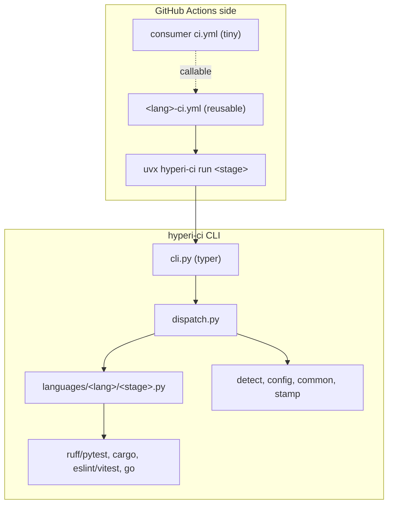
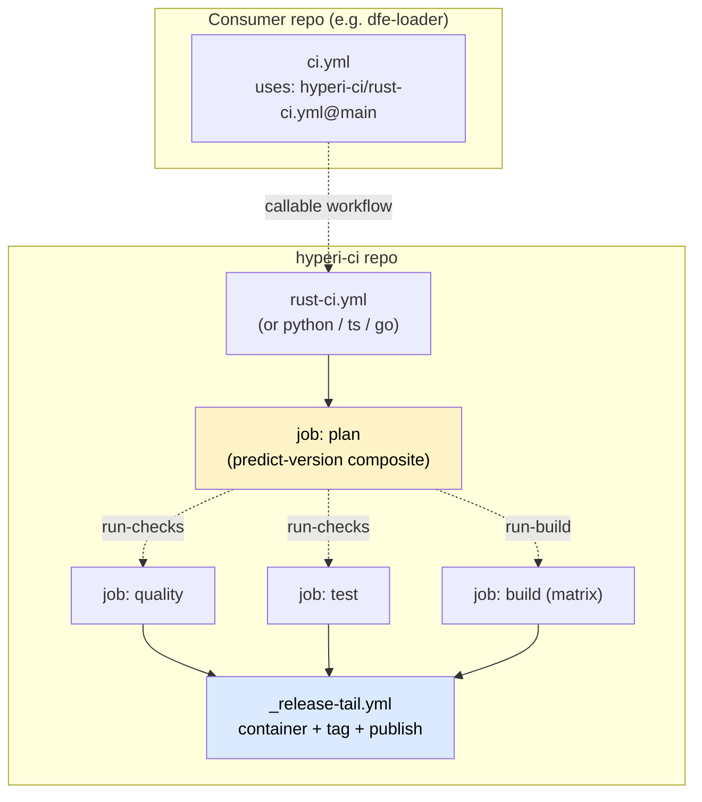
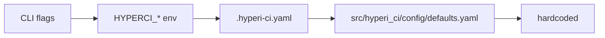

# hyperi-ci architecture

> Start here, then [flow.md](flow.md) for the push -> release lifecycle.

## What it is

A single Python CLI (`hyperi-ci`) plus a thin set of GitHub Actions reusable workflows. It runs the same way on a laptop and in CI, for Rust, Python, TypeScript and Go. It replaced about 100 shell scripts, 50+ composite actions and a six-layer dispatch hierarchy.

Two sides, one job each:

- **CLI side** does the work - lint, test, build, publish - via `subprocess` to language tools. No bash logic; 70% of old-CI failures were bash syntax.
- **GitHub Actions side** does orchestration only - job ordering, matrix, caching, secrets, the predict-and-gate, container build, tag, publish.


```mermaid
flowchart TB
    subgraph GHA["GitHub Actions side"]
        ci["consumer ci.yml (tiny)"]
        lang["&lt;lang&gt;-ci.yml (reusable)"]
        uvx["uvx hyperi-ci run &lt;stage&gt;"]
        ci -.callable.-> lang --> uvx
    end
    subgraph CLI["hyperi-ci CLI"]
        cli["cli.py (typer)"] --> dispatch["dispatch.py"]
        dispatch --> handlers["languages/&lt;lang&gt;/&lt;stage&gt;.py"]
        dispatch --> helpers["detect, config, common, stamp"]
        handlers --> tools["ruff/pytest, cargo, eslint/vitest, go"]
    end
    uvx --> cli
```

Why the split:

- Workflow files stay tiny, with no logic in YAML.
- A new check is a Python change, tested locally before CI sees it.
- The same code path runs everywhere, so "works locally, fails in CI" mostly goes away.
- Moving off GitHub Actions (to Buildkite, say) means rewriting the glue and keeping the CLI.

## Workflow model - two levels, no deeper


```mermaid
flowchart TB
    subgraph Consumer["Consumer repo (e.g. dfe-loader)"]
        CC["ci.yml<br/>uses: hyperi-ci/rust-ci.yml@main"]
    end
    subgraph HCI["hyperi-ci repo"]
        L["rust-ci.yml<br/>(or python / ts / go)"]
        P["job: plan<br/>(predict-version composite)"]
        Q["job: quality"]
        T["job: test"]
        B["job: build (matrix)"]
        RT["_release-tail.yml<br/>container + tag + publish"]
    end
    CC -.callable workflow.-> L
    L --> P
    P -. run-checks .-> Q
    P -. run-checks .-> T
    P -. run-build .-> B
    Q --> RT
    T --> RT
    B --> RT
    style P fill:#fef3c7,color:#000
    style RT fill:#dbeafe,color:#000
```

Level 1 is the consumer's `ci.yml` calling `<lang>-ci.yml@main`. Level 2 is that language workflow calling the shared `_release-tail.yml` and the composites. There are no `_setup.yml` / `_ci.yml` orchestrator chains. Mature multi-language repos (astral-sh/uv, tokio-rs/tokio, vercel/turborepo) keep CI flat the same way: a plan job and gates.

## Workflow internals: job contract and composites

Each `<lang>-ci.yml` is a `workflow_call` reusable workflow with the same jobs, in the same order, gated on the same `plan` outputs. Only the internals of quality, test and build differ per language: tools, toolchain, cache keys. [ci-job-contract.md](ci-job-contract.md) has the full job list, the gate outputs and what runs for which trigger.

Language-agnostic logic that is identical across languages is a shared composite. Anything needing a per-language carve-out stays inline in that language's workflow. Our reusable workflows reference each other at `@main`, not a pinned SHA, and an interface backward-compat gate makes that safe. The rule and the gate: [workflow-composites.md](workflow-composites.md).

## CLI surface

```text
hyperi-ci run <stage>      setup | quality | test | build | release; test takes --tier core|full
hyperi-ci check [--quick|--full|--strict|--tier full]  pre-push: quality(+test)(+build); --strict fails on warn-tier findings; --tier full runs the ignored tests too
hyperi-ci push [--release]         commit + push, opt-in Release: true trailer
hyperi-ci release [<tag>]          release/retry HEAD, or re-release an existing tag
hyperi-ci stamp-version <v>        write VERSION + manifest (central)
hyperi-ci release-prepare <v> --out <dir> [--phase stamp|package|all]   stamp + run the release's repo code (semver checks, packing) with no credentials; `run release` with HYPERCI_RELEASE_PREPARED=<dir> then only uploads
hyperi-ci release-verify           fail before tagging when the prepared release names another version or language
hyperi-ci publish-charts           package and push committed Helm charts to an OCI registry
hyperi-ci chart assemble --image <ref>   build a thin chart from release.helm.contract (opt-in; the release tail does not call it yet)
hyperi-ci vendor sync | check      mirror files from another repo at a pinned ref (opt-in `vendor:` block)
hyperi-ci deps [drift|gaps|show]   dependency surfaces, floor drift and Renovate gaps
hyperi-ci lint-docs | lint-iac     run the doc checks, or the chart/manifest/tofu/ansible/compose linters, on a directory
hyperi-ci init                     scaffold ci.yml, .hyperi-ci.yaml, Makefile, githooks
hyperi-ci detect | config          show detected language / merged config
hyperi-ci trigger | watch | rerun | logs   drive GitHub Actions from the terminal
hyperi-ci install-toolchains | install-native-deps | install-deps   runner/CI dep install
hyperi-ci update                   self-upgrade the installed tool
hyperi-ci autoupdate               channel (live|stable) / enable / freeze -- see self-update.md
```

### Dispatch

`hyperi-ci run quality` runs `detect.py` to identify the language, from file markers or `.hyperi-ci.yaml` / `HYPERI_CI_LANGUAGE`. `config.py` merges configuration. `dispatch.py` then imports `hyperi_ci.languages.<lang>.<stage>` and calls `run(config, extra_env) -> int`.

```text
src/hyperi_ci/languages/<lang>/{quality,test,build,release}.py
```

## Configuration cascade

Highest wins:


```mermaid
flowchart LR
    A["CLI flags"] --> B["HYPERCI_* env"] --> C[".hyperi-ci.yaml"] --> D["src/hyperi_ci/config/defaults.yaml"] --> E["hardcoded"]
```

`load_config()` in `config.py` builds it from the bottom up: shipped defaults, then the project file, then `HYPERCI_*` variables. A variable maps to a key path by splitting on `_`, so `HYPERCI_QUALITY_PYTHON_RUFF` sets `quality.python.ruff`. CLI flags such as `check --strict` work by exporting a `HYPERCI_*` variable.

A key `defaults.yaml` ships as a mapping takes only a mapping in the project file. Left empty (`release:`) it warns and the shipped mapping applies. Any other value (`release: false`) fails the load and names the fix, here `release: {enabled: false}`, because read past, every key below it would keep its shipped default.

`.hyperi-ci.yaml` is the per-project source of truth: language, build targets, release. Org-wide settings (GitHub org, GHCR, R2) are a separate file, `src/hyperi_ci/config/org.yaml`, read by `load_org_config()` and not part of the cascade.

Three config homes, each with one job:

| Home | Holds | Managed by |
|---|---|---|
| `src/hyperi_ci/config/*.yaml` (`org`, `defaults`, `versions`, `toolchains`, `native-deps`) | CI logic, routing, registry URLs, runner labels, pinned versions | PR + review; unit-tested |
| GitHub **Vars** | platform infra: `GH_RUNNER_MODE`, the `GH_RUNNER_*` labels | UI |
| GitHub **Secrets** | credentials: `CARGO_REGISTRY_TOKEN`, `NPM_TOKEN`, `PYPI_TOKEN`, `R2_ACCESS_KEY_ID` / `R2_SECRET_ACCESS_KEY`, `GH_APP_PRIVATE_KEY`, `DOCKERHUB_USERNAME` / `DOCKERHUB_TOKEN` | UI, encrypted, scoped |

Rule: CI logic or routing goes in `config/`, platform infra in Vars, a credential in Secrets.

## Release routing and containers

Everything publishes to the OSS registry stack. The destination map, the channels and the Rust build tier are in [flow.md](flow.md) sections 5 and 6.

The release tail builds an image only from the repo's own Dockerfile, and a repo without one ships no container. It decides app-vs-library before Docker boots, and only the Container job logs in to Docker Hub. GHCR auth is the job's `GITHUB_TOKEN`.

A container failure blocks the release only where a container is the deliverable. Full detail, including the build-arg placeholders and why Tag & Release runs no repo code: [container-builds.md](container-builds.md).

## Runner modes (summary)

| Mode | Runners | Cache | Toolchain |
|---|---|---|---|
| `self-hosted` | ARC on the DevEx cluster | persistent NFS sccache/ccache | pre-baked in the image |
| `free` | GitHub `ubuntu-latest` | none between runs | installed per-job |

Resolved highest-wins: workflow input `runner-mode`, then var `GH_RUNNER_MODE`, then the `GH_RUNNER_*` labels, then `ubuntu-latest`. `free` mode lets any org use the workflows with no self-hosted infra.

Multi-arch uses **native runners per arch** (amd64 on ARC, arm64 on `ubuntu-24.04-arm`), not cross-compilation. Tiers, cache and the dormant cross-compile path: [runtime/runners.md](runtime/runners.md). The dep-install source of truth: [runtime/runner-image.md](runtime/runner-image.md).

## Design principles and repo layout

1. **No bash.** All logic is Python; `subprocess.run([...])` with list args.
2. **One version oracle.** semantic-release dry-run in `plan` predicts the version every stage stamps. The real run tags **HEAD**, so the tag is always reachable.
3. **uv for everything** - venv, sync, lock, tool install, build.
4. **Cross-platform** - `pathlib`, `shutil.which`, `sys.platform`; Linux (CI) and macOS (dev).
5. **Self-hosting** - hyperi-ci runs its own pipeline through its own workflow.
6. **KISS** - a maintained third-party tool that is good enough beats bespoke CI code. Over-engineered CI kills small teams, so we reject custom machinery (see #31).

```text
.github/
  workflows/   ci.yml (self-host), {python,rust,ts,go}-ci.yml, _release-tail.yml
  actions/     predict-version, setup-runtime, setup-semantic-release,
               setup-osv-scanner, setup-go-tools, setup-rust-tools,
               setup-nextest                                          (pinned tool installs)
src/hyperi_ci/
  cli.py, dispatch.py, detect.py, config.py, common.py, stamp.py, init.py
  config/      defaults, org, versions, deprecated-files, toolchains/, native-deps/
  container/   stage, binary_stage, build, cgroup, detect, labels, registry
  release/     assemble, binaries, charts, dispatch
  languages/   python, rust, typescript, golang   (quality|test|build|release)
config/        fixtures, dynamic-config-keys, retired-interfaces   (repo-root, not shipped in the wheel)
scripts/       update-versions.py (/deps), check-workflow-interfaces.py (#31 gate), rehearse-branch.py, sweep-fleet.py, negative-cases.py, fixture-git.py
templates/     pgo-workload/, testenv/
docs/          this tree
VERSION, pyproject.toml, uv.lock
```
