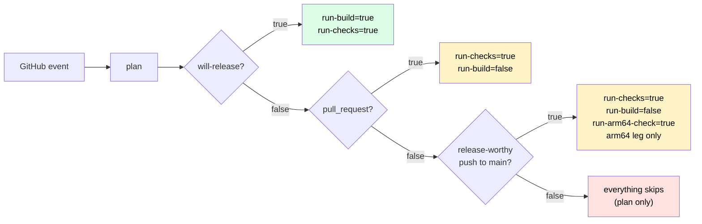

<!--
Project:   HyperI CI
File:      docs/ci-job-contract.md
Purpose:   What job runs for which trigger, and the gate outputs that decide it

License:   BUSL-1.1 -- HYPERI PTY LIMITED
Copyright: (c) 2026 HYPERI PTY LIMITED
-->

# CI job contract

The jobs every `<lang>-ci.yml` runs, in order, and what gates each one on or off. Use it to look up what runs for a given event. [architecture.md](architecture.md) has the overview.

## Jobs

Each `<lang>-ci.yml` is a `workflow_call` reusable workflow with the same jobs, in the same order, gated on the same `plan` outputs. Only the internals of quality, test and build differ per language (tools, toolchain, cache keys).

| Job | needs | if | Purpose |
|---|---|---|---|
| `plan` | - | always | Decide whether this run is a release; emit gate outputs |
| `commit-check` | - | push to main, `pull_request` or `merge_group` | Conventional-commit **landing gate**: fatal for what lands, advisory for branch commits on a PR. NOT `run-checks`-gated (next section) |
| `quality` | `[plan]` | `run-checks` | Lint / typecheck / security scan |
| `test` | `[plan]` | `run-checks` | Tests at the plan's `test-tier`, named `Test (<tier>, <runner>)`; a full run passes `--tier full` |
| `build` | `[plan, quality, test]` | `run-build` | Compile binaries / wheels / packages, stamp version, upload `dist/` |
| `release-tail` | `[plan, build]` | own gates | Container, prepare and tag-and-release, via shared `_release-tail.yml` |
| `gate` | `[plan, quality, test, build]` | always | `hyperi-ci gate-check`: fails when a required job did not pass, and names the test tier. The context a ruleset should require (issue #177) |

## `commit-check`: the landing gate

`commit-check` is independent of `plan` and `run-checks`. That gate skips the quality job on a merge to main that is not release-worthy, so a bad commit message could otherwise land unvalidated. It is a git-log + regex check with no compile, so it costs seconds.

It is fatal on the push that reaches main and on a `merge_group`. On a PR it is advisory for branch commits, which a squash may throw away. Feature-branch pushes skip it.

Logic: `hyperi_ci.quality.commit_validation.run`. A local `hyperi-ci check` runs the same validation over `origin/main..HEAD`.

Validating what LANDS works whatever the merge method. A team merging through the GitHub UI never runs `hyperi-ci push`, so the local bump guard never fires and this check is its only one. The cost is that it is after the fact: a bad message is already on main, and the fix is a follow-up commit.

On a `pull_request` the line a squash merge would land is validated too, and a bad one is fatal. The check assumes GitHub's default squash subject, `COMMIT_OR_PR_TITLE`, which every hyperi-io repo uses. A one-commit PR lands that commit's message, which is fatal while the title is only advised on. Any other PR lands its title.

- The landing subject is measured with the `(#N)` GitHub appends, as main's push run sees it.
- A `feat:` title is confirmed only by an `Allow-Feat: true` trailer in a branch commit. The squash body is built from the commit messages, and the PR description never lands.
- The job token cannot read the repo's merge settings, so the squash-subject assumption is not checked per repo.
- The PR is read live from the API, because the event payload is frozen at trigger time and a re-run replays it. With no token or no API answer it uses the payload's PR and warns.

## Gate outputs (computed in `plan`)

| Output | True when | Effect |
|---|---|---|
| `will-release` | push to **main** with a `Release: true` trailer, OR a `workflow_dispatch` carrying `tag`, OR `from-head: true` dispatched on main | The release signal. A trailer on a non-main ref is ignored with a `::warning::`. Dispatch-ref rules: [releasing.md](releasing.md#which-ref-a-from-head-dispatch-releases-from). A `schedule` run is never a release |
| `run-checks` | `will-release`, OR a **release-worthy push to main** (a `feat:` / `fix:` / `perf:` in the pushed range; an unresolvable range counts as worthy), OR `pull_request`, `merge_group`, `workflow_dispatch` or `schedule` | Run quality + test. A release-worthy merge is TESTED, never shipped |
| `test-tier` | `full` on `schedule`, when the `test-tier` input is `full`, when the project's `test.tier` is `full`, or on `will-release` with `full-required-for-release`; else `core` | The tier the Test job runs. Nothing lowers it. An unknown value fails Plan |
| `full-required-for-release` | the project sets `test.full.required_for_release: true` | A release runs `full`, and the Gate fails a release handed any other tier. Off by default |
| `run-build` | `will-release`, OR `workflow_dispatch`, OR `pull_request` with the `branch-build` opt-in | Run build + container (the release tail stays `will-release`-only) |
| `run-arm64-check` | a **release-worthy push to main** on a Rust project that ships `aarch64-unknown-linux-gnu` and has not set `build.rust.arm64_on_main: false` | Build an arm64-ONLY matrix. Only `rust-ci.yml` reads it, and the release tail does not run |
| `next-version` | `will-release` | The version this run releases: the semantic-release dry-run, the forced version on a forced dispatch, or the tag's own version on a `tag` dispatch |
| `python-version` | always | A pegged `.python-version`, else the `requires-python` FLOOR, else the `versions.yaml` default ([languages/python.md](languages/python.md)) |
| `build-matrix` | always | Both arches whenever `run-build` is true. `run-arm64-check` alone yields only the arm64 leg. `build.rust.targets` limits the legs to the listed targets |

There are two run gates because a PR needs quality + test but no build, and a `chore:` / `docs:` push to main needs neither.

A release-worthy push to main with NO trailer is validate-only. Plan asks `unreleased.py` what the last `v*` tag does not include, and warns with the count, the tag and its age.

The `_release-tail.yml` input keeps the name `will-publish`, and each `<lang>-ci.yml` keeps `publish-target`. GitHub hard-errors on an undeclared reusable-workflow input before any of our code runs.

## Branch-mode (opt-in PR build + dev images)

`branch-build: "true"` (workflow input, or the `HYPERCI_BRANCH_BUILD` repo variable) makes pull_request runs build and container-validate too. That is the full pipeline short of publishing.

`release.container.dev_push: true` in `.hyperi-ci.yaml` then pushes a **dev image** from the PR:

- a mutable `branch-<slug>` pointer and an immutable `branch-<slug>-sha-<short>` pin, on GHCR only
- never a version tag, `latest` or a bare `sha-<short>`, so the GA namespace stays untouched and pruning is safe
- pruned by a small cron workflow in the project calling the shared `_ghcr-prune.yml` (dataaxiom/ghcr-cleanup-action), which globs `branch-*` / `dev-sha-*` plus untagged layers

Main plus an explicit release remains the ONLY path to PyPI, crates.io, R2 and GA container tags. `hyperi_ci.release_mode` resolves the mode (release / dev / validate) for the container stage.



## What runs when

| Push type | plan | commit-check | quality | test | build | container | tag+publish |
|---|---|---|---|---|---|---|---|
| `chore:` / `docs:` to main | yes | yes | no | no | no | no | no |
| `feat:`/`fix:` to main, no `Release:` trailer | yes | yes | yes | yes | arm64 only, Rust | no | no |
| `feat:`/`fix:` to main + `Release: true` | yes | yes | yes | yes | yes | yes | yes |
| Pull request | yes | yes advisory | yes | yes | no | no | no |
| Pull request + `branch-build` opt-in | yes | yes advisory | yes | yes | yes | yes validate / dev push | no |
| `workflow_dispatch` with `tag` / `from-head` (release) | yes | no | yes | yes | yes | yes | yes |
| `workflow_dispatch`, bare (validate-only) | yes | no | yes | yes | yes | yes validate | no |
| `schedule` (a caller's cron) | yes | no | yes | yes, full tier | no | no | no |
| push to a feature branch | yes | no | no | no | no | no | no |

## Under a merge queue

hyperi-ci's own `ci.yml`, the `<lang>-ci.yml` workflows and `hyperi-ci init`'s scaffolded caller all trigger on `merge_group`, so a consumer can turn a queue on. A queue tests the squash commit main will fast-forward to, on a temporary `gh-readonly-queue/main/pr-<n>-<sha>` branch. It merges only once every required check reports, so a workflow that never triggers, or a required job that skips, stalls the queue or merges untested.

| Job | Under `merge_group` | Why |
|---|---|---|
| `plan` | runs, `will-release=false`, `run-build=false` | The ref is not main, so the gate is validate-only whatever the squash message carries |
| `commit-check` | runs, FATAL, range `merge_group.base_sha..head_sha` | That commit is what lands, so the landing gate fires before the landing |
| `quality`, `test` | run | `predict-version` sets `run-checks=true` for `merge_group`, as for a PR, since a skipped required check counts as passing |
| `Fixture rehearsal` | skipped | Its record names the PR head commit, and the queue commit is a new SHA. The PR already passed it |
| `build`, `release-tail` | skipped | `run-build` is false, so nothing compiles, tags, publishes or commits back |
| `gate` | runs | Fails on any failed job |

The concurrency group keys on `github.ref`, unique per queue entry, so a queue run neither cancels nor is cancelled by a run on main or on the PR. A queue that requires only `Quality` merges past a red Test or a red commit check, so require `Gate` and `Commit messages` alongside it.

## Test tiers (CI gate level)

`core` is what a PR and a push run. `full` adds every test the project deselects or ignores by default. It runs on a `schedule`, on a run given `test-tier: full`, and in a project whose own `test.tier` is `full`.

Plan resolves the tier once (`hyperi_ci.plan_tier`, loaded by path from the composite, reading every config spelling `load_config` accepts). The Test job passes `--tier full` on a full run and nothing on a core run, so a core run leaves the project's own `test.tier` in charge.

A release runs `core`, and the Gate says so. A project opts its releases into `full`:

```yaml
# .hyperi-ci.yaml
test:
  full:
    required_for_release: true   # releases run full
```

The Gate job has no checkout, so Plan reads this key and passes it on as the `full-required-for-release` output. A caller reaches `test-tier: full` on a dispatch only once its own `ci.yml` declares and forwards the input. `hyperi-ci init` scaffolds both, and `hyperi-ci audit-callers` notes a caller without it rather than counting it as drift.

Three things enforce a full release, and the Gate is none of them:

1. Plan forces `full` when the project opts in.
2. The Test job passes `--tier full`, which a CLI without the flag rejects, so a full run never quietly runs core.
3. Build needs Test, and the release tail needs Build.

The Gate runs beside the release tail and cannot stop it. It names the tier in its reason line, and fails the run after the fact if an opted-in release was handed anything but `full`.

A commit landing on main produces no tag and no artefacts. The operator opts in with `hyperi-ci push --release`, which adds the `Release: true` trailer. See [flow.md](flow.md).

## arm64 parity

With arm64 legs keyed off `will-release`, arm64 code first runs in the release meant to ship it. That is how a BOLT refusal over Cortex-A53 veneers was found mid-publish on dfe-receiver, with a fix only another release attempt could exercise (issue #249). Two rules narrow that:

- **Arch breadth follows `run-build`.** A validate-only `workflow_dispatch` and a branch-mode PR build both arches, so arm64 is reachable on demand without publishing anything.
- **`run-arm64-check` builds the arm64 leg alone on a release-worthy merge to main**, where a regression is still attributable to the change that caused it. Rust only, and `rust-ci.yml` is the sole reader.

Neither runs PGO or BOLT, because `channel` resolves to alpha when the run does not publish. They catch arm64 compile and link defects, and a BOLT-stage defect like #249's still first runs in a release.

A merge that ships nothing still compiles nothing. `run-build` does not widen, a non-bumping merge runs no build job, and the release tail is gated on `run-build`, so the parity build runs no container and publishes nothing.

A Rust project opts out with `build.rust.arm64_on_main: false` in `.hyperi-ci.yaml`. The default is on wherever `build.rust.targets` names `aarch64-unknown-linux-gnu` or names nothing (every target), and inert elsewhere.

## See also

- [architecture.md](architecture.md) -- the two-sides overview this page gates into
- [container-builds.md](container-builds.md) -- the release-tail's container job
- [workflow-composites.md](workflow-composites.md) -- why some of this is a composite and some is inline
- [test-tiers.md](test-tiers.md) -- the core/full tier mechanics this page's gate output selects
- [flow.md](flow.md) -- the release sequence these gates feed
