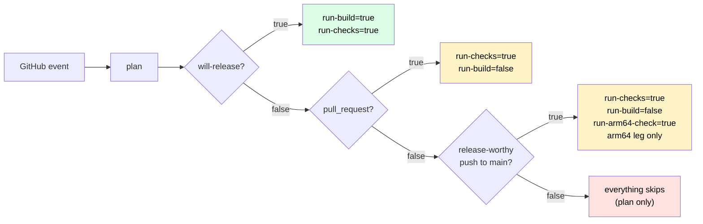

<!--
Project:   HyperI CI
File:      docs/ci-job-contract.md
Purpose:   What job runs for which trigger, and the gate outputs that decide it

License:   BUSL-1.1 -- HYPERI PTY LIMITED
Copyright: (c) 2026 HYPERI PTY LIMITED
-->

# CI job contract

The jobs every `<lang>-ci.yml` runs, in order, and what gates each one on or off. Use it to look up what runs for a given event. [architecture.md](architecture.md) has the overview.

## Jobs

Each `<lang>-ci.yml` is a `workflow_call` reusable workflow with the same jobs,
same order, gating on the same `plan` outputs. Only the *internals* of
quality/test/build differ per language (tools, toolchain, cache keys) - that is
the single place language divergence is allowed.

| Job | needs | if | Purpose |
|---|---|---|---|
| `plan` | - | always | Decide whether this run is a release; emit gate outputs |
| `commit-check` | - | push-to-main OR `pull_request` | Conventional-commit **landing gate** - fatal on push to main (validates what lands); on PRs advisory for branch commits, fatal for the line a squash would land. NOT `run-checks`-gated (see below) |
| `quality` | `[plan]` | `run-checks` | Lint / typecheck / security scan |
| `test` | `[plan]` | `run-checks` | Tests at the plan's `test-tier`, named `Test (<tier>, <runner>)`; a full run passes `--tier full` |
| `build` | `[plan, quality, test]` | `run-build` | Compile binaries / wheels / packages, stamp version, upload `dist/` |
| `release-tail` | `[plan, build]` | own gates | Container, prepare and tag-and-release, via shared `_release-tail.yml` |
| `gate` | `[plan, quality, test, build]` | always | `hyperi-ci gate-check`: fails when a required job did not pass, and names the test tier. The context a ruleset should require (issue #177) |

`commit-check` is deliberately **independent of `plan` / `run-checks`**: that
gate skips the quality job on non-release-worthy merges to main, so a bad
conventional-commit message could otherwise land unvalidated. It is a cheap
git-log + regex check (no compile/publish), fatal on the push that actually
reaches main and advisory on PRs (branch commits may be squashed away - only
the squash subject lands). Feature-branch pushes skip it, preserving the
chore-skip fast path. Logic: `hyperi_ci.quality.commit_validation.run`; the
local `hyperi-ci check` runs the same validation over `origin/main..HEAD`.

What drove the split: dfe-ui#81 red-flagged nine `feat:` WIP commits on one of
Kaz's branches, none of which reached main. The gate was right that they were
mislabelled and wrong about which commits mattered -- it validated throwaway
branch commits while the squash subject that actually landed went unchecked. A
second gap sits behind it: a team merging through the GitHub UI never invokes
`hyperi-ci push`, so the local bump guard never runs and the PR-time check is
their only one. Validating what LANDS covers both, and is merge-method
agnostic. The accepted cost is that it is post-hoc -- the bad message is on
main by the time it fails, so the fix is a follow-up commit rather than a
rejected push.

On a `pull_request` the line a squash merge would land is validated as well, and a bad one is fatal. The check assumes GitHub's default squash subject, `COMMIT_OR_PR_TITLE`, which every hyperi-io repo uses: a one-commit PR lands that commit's message, which is fatal while the title is only advised on, and any other PR lands its title. The landing subject is measured with the `(#N)` GitHub appends to it, as main's push run sees it. A `feat:` title is confirmed only by an `Allow-Feat: true` trailer in a branch commit, because the squash body is built from the commit messages and the PR description never lands. The job token cannot read the repo's merge settings, so the assumption is not checked per repo. The PR is read live from the API with the job token, since the event payload is frozen at trigger time and a re-run replays it. With no token or no API answer it uses the payload's PR and warns.

## Gate outputs (computed in `plan`)

| Output | True when | Effect |
|---|---|---|
| `will-release` | push to **main** with `Release: true` trailer, OR `workflow_dispatch` carrying `tag`, OR `from-head: true` dispatched on main | The underlying release signal. A trailer on a non-main ref is ignored LOUDLY (`::warning::`) - main is the sole release path (branch-mode decision 1). A from-head dispatch follows the same rule (issue #471): on a declared prerelease branch only `bump=auto` releases, and on any other ref it is validate-only and warns. A `tag` dispatch releases from any ref. A dispatch carrying neither is validate-only and warns that nothing was released. A `schedule` run is never a release, whatever HEAD's trailer says |
| `run-checks` | `will-release`, OR a **release-worthy push to main** (the pushed range carries a `feat:` / `fix:` / `perf:`; a range that cannot be resolved counts as worthy, so the gate fails open), OR `pull_request`, OR `workflow_dispatch`, OR `schedule` | Run quality + test. A release-worthy merge is TESTED, never shipped - `run-build` stays release-only |
| `test-tier` | `full` on `schedule`, when the `test-tier` input is `full`, when the project's own `test.tier` is `full`, or on `will-release` with `full-required-for-release`; else `core` | The tier the Test job runs. Nothing lowers it, so a caller forwarding `core` on every event cannot lower a scheduled or opted-in release run. An unknown value, from the input or the project, fails Plan |
| `full-required-for-release` | the project sets `test.full.required_for_release: true` | A release runs `full`. The Gate fails a release handed any other tier. Off by default |
| `run-build` | `will-release`, OR `workflow_dispatch`, OR `pull_request` with the `branch-build` opt-in | Run build + container (the release tail stays `will-release`-only) |
| `run-arm64-check` | a **release-worthy push to main** on a Rust project that ships `aarch64-unknown-linux-gnu` and has not set `build.rust.arm64_on_main: false` | Run the Build job with an arm64-ONLY matrix. Read by `rust-ci.yml` alone; the release tail does not run, so this compiles one leg and ships nothing |
| `next-version` | `will-release` | The version this run releases: semantic-release dry-run on a push or a from-head `auto` dispatch, the forced version on a from-head `patch` / `minor` / `X.Y.Z`, and the tag's own version (minus the `v`) on a `tag` dispatch |
| `python-version` | always | The interpreter every job builds and tests on: a pegged `.python-version`, else the `requires-python` FLOOR, else the `versions.yaml` default. The floor, because testing above it hides the bug it exists to catch - a 3.14-only feature in a repo that promises 3.12 |
| `build-matrix` | always | Both arches whenever `run-build` is true, so a validate-only dispatch and a branch-mode PR build arm64 too. `run-arm64-check` alone yields the arm64 leg by itself. A project that lists `build.rust.targets` in `.hyperi-ci.yaml` gets legs for those targets only, so one that cannot build arm64 still releases amd64 |

A push to a release branch with NO trailer is validate-only, which is correct and reads exactly like a release run. The gate asks `unreleased.py` what the last `v*` tag does not include and raises a `::warning::` naming the count, the tag and its age; it stays quiet when nothing releasable is waiting, and says separately when there is no tag to measure against.

The `_release-tail.yml` **input** is still named `will-publish`, as is the
`publish-target` input on each `<lang>-ci.yml`. GitHub validates reusable-workflow
inputs before any of our code runs and hard-errors on an undeclared one, so a
deprecation warning can never reach them. They keep their names.

**Two derived gates** because PR runs need quality+test (review feedback) but
never build or release, and `chore:`/`docs:` pushes to main need no heavy compute.

## Branch-mode (opt-in PR build + dev images)

`branch-build: "true"` (workflow input, or the `HYPERCI_BRANCH_BUILD` repo
variable) makes pull_request runs also build + container-validate - the FULL
pipeline short of publishing. Separately, `release.container.dev_push: true`
in `.hyperi-ci.yaml` makes that PR container push a **dev image**: mutable
`branch-<slug>` (pointer) + immutable `branch-<slug>-sha-<short>` (pin),
GHCR only, never a version tag, `latest`, or a bare `sha-<short>` - the GA
namespace stays untouched, which is what makes pruning safe. Dev images are
ephemeral: projects with `dev_push` add a tiny cron workflow calling the
shared `_ghcr-prune.yml` (dataaxiom/ghcr-cleanup-action, multi-arch-safe),
which globs `branch-*` / `dev-sha-*` plus untagged layers. Dev images are a
different artifact class from a GA release - main + an explicit release remains
the ONLY path to PyPI / crates.io / R2 / GA container tags. Mode resolution
(release / dev / validate) is one SSOT: `hyperi_ci.release_mode`, read by the
container stage.
Design: `docs/plans/2026-07-branch-mode/PLAN.md`.



## What runs when

| Push type | plan | commit-check | quality | test | build | container | tag+publish |
|---|---|---|---|---|---|---|---|
| `chore:` / `docs:` to main | yes | yes | no | no | no | no | no |
| `feat:`/`fix:` to main, no `Release:` trailer | yes | yes | yes | yes | arm64 only, Rust | no | no |
| `feat:`/`fix:` to main + `Release: true` | yes | yes | yes | yes | yes | yes | yes |
| Pull request | yes | yes advisory | yes | yes | no | no | no |
| Pull request + `branch-build` opt-in | yes | yes advisory | yes | yes | yes | yes validate / dev push | no |
| `workflow_dispatch` with `tag` / `from-head` (release) | yes | no | yes | yes | yes | yes | yes |
| `workflow_dispatch`, bare (validate-only) | yes | no | yes | yes | yes | yes validate | no |
| `schedule` (a caller's cron) | yes | no | yes | yes, full tier | no | no | no |
| push to a feature branch | yes | no | no | no | no | no | no |

## Under a merge queue

hyperi-ci's own `ci.yml` triggers on `merge_group`, and so do the `<lang>-ci.yml` workflows and `hyperi-ci init`'s scaffolded caller, so a consumer can turn a queue on. A queue tests the squash commit main will fast-forward to, on a temporary `gh-readonly-queue/main/pr-<n>-<sha>` branch, and merges only once every required check reports. A workflow that never triggers, or a required job that skips, stalls the queue or merges untested.

| Job | Under `merge_group` | Why |
|---|---|---|
| `plan` | runs, `will-release=false`, `run-build=false` | The ref is not main, so the gate is validate-only whatever the squash message carries |
| `commit-check` | runs, FATAL, range `merge_group.base_sha..head_sha` | That commit is what lands, so the landing gate fires before the landing rather than after |
| `quality`, `test` | run | `predict-version` sets `run-checks=true` for `merge_group`, as for a PR, since a skipped required check counts as passing |
| `Fixture rehearsal` | skipped | Its record names the PR head commit, and the queue commit is a new SHA nobody can rehearse. The PR already passed it |
| `build`, `release-tail` | skipped | `run-build` is false, so nothing compiles, tags, publishes or commits back |
| `gate` | runs | Fails on any failed job |

The concurrency group keys on `github.ref`, which is unique per queue entry, so a queue run neither cancels nor is cancelled by a run on main or on the PR. A queue that requires only `Quality` merges past a red Test or a red commit check. Require `Gate` and `Commit messages` alongside it.

## Test tiers (CI gate level)

`core` is what a PR and a push run. `full` adds every test the project deselects or ignores by default, and runs on a `schedule`, on a run given `test-tier: full`, and in a project whose own `test.tier` is `full`. Plan resolves the tier once (`hyperi_ci.plan_tier`, loaded by path from the composite, reading every config spelling `load_config` accepts). The Test job passes `--tier full` on a full run and nothing on a core run, so a core run leaves the project's own `test.tier` in charge.

A release runs `core`, as it did before tiers, and the Gate says so. A project opts its releases into `full`:

```yaml
# .hyperi-ci.yaml
test:
  full:
    required_for_release: true   # releases run full
```

The Gate job has no checkout, so Plan reads this key and passes it as the `full-required-for-release` output. A caller reaches `test-tier: full` on a dispatch only once its own `ci.yml` declares the input and forwards it. `hyperi-ci init` scaffolds both, and `hyperi-ci audit-callers` notes a caller without it rather than counting it as drift. A `schedule` and a dispatch that publishes nothing each get their own concurrency group, so neither can cancel a release on main or be cancelled by a push.

Three things enforce a full release, and the Gate is none of them. Plan forces `full` when the project opts in. The Test job passes `--tier full`, which a CLI without the flag rejects, so a full run never quietly runs core. Build needs Test, and the release tail needs Build. The Gate runs beside the release tail and cannot stop it: it names the tier in its reason line, and fails the run after the fact if an opted-in release was handed anything but `full`.

Tag-on-publish doctrine: a commit landing on main produces no tag and no
artefacts. The operator opts in with `hyperi-ci push --release` (adds the
`Release: true` trailer). See [flow.md](flow.md).

## arm64 parity

arm64 legs once keyed off `will-release`, so the first execution of arm64 code was the run meant to ship it. A BOLT refusal over Cortex-A53 veneers was found mid-publish on dfe-receiver, and the fix for it could not be exercised except by attempting another release (issue #249). Two changes narrow that:

- **Arch breadth follows `run-build`.** A validate-only `workflow_dispatch` and a branch-mode PR build both arches, so arm64 is reachable on demand without publishing anything.
- **`run-arm64-check` builds the arm64 leg alone on a release-worthy merge to main**, where a regression is still attributable to the change that caused it. Rust only; `rust-ci.yml` is the sole reader.

Neither runs PGO or BOLT. Both build below the release tier (`channel` resolves to alpha when the run does not publish), so they catch arm64 compile and link defects, and a BOLT-stage defect like #249's still first runs in a release.

The red line is unchanged: a merge that ships nothing still compiles nothing. `run-build` does not widen, a non-bumping merge runs no build job at all, and the release tail is gated on `run-build` so the parity build runs no container and publishes nothing.

A Rust project opts out with `build.rust.arm64_on_main: false` in `.hyperi-ci.yaml`. The default is on wherever `build.rust.targets` names `aarch64-unknown-linux-gnu` or names nothing (which means every target); it is inert elsewhere.

## See also

- [architecture.md](architecture.md) -- the two-sides overview this page gates into
- [container-builds.md](container-builds.md) -- the release-tail's container job
- [workflow-composites.md](workflow-composites.md) -- why some of this is a composite and some is inline
- [test-tiers.md](test-tiers.md) -- the core/full tier mechanics this page's gate output selects
- [flow.md](flow.md) -- the release sequence these gates feed
