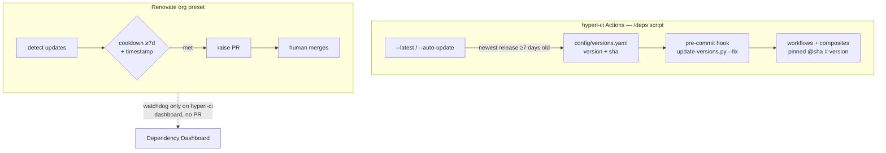

# Dependency pinning policy

hyperi-ci is the SSOT and controller for HyperI's dependency-update policy
across every repo. This documents what's pinned, by what, and why.

For our *own* reusable-workflow internals (which stay `@main` on purpose), see
[WORKFLOW-PINNING.md](WORKFLOW-PINNING.md).

## Two systems, clear split

| Dependency | Owner | How | Cooldown |
|---|---|---|---|
| GitHub Actions (on hyperi-ci) | `/deps` script (`scripts/update-versions.py`) + `config/versions.yaml` | SHA-pinned at commit time via the pre-commit hook | 7 days, enforced by the script |
| GitHub Actions (other repos) | Renovate org preset | SHA digest pin (`helpers:pinGitHubActionDigests`) | 7 days |
| **hyperi-ci reusable-workflow caller** (other repos) | **nobody — floats `@main`** | **NOT pinned. Carved out of digest pinning in the org preset** (`hyperi-io/renovate-config`) | n/a |
| cargo / pip / npm / docker (all repos) | Renovate org preset | version PRs | 7 days |

**Why the caller is exempt.** SHA-pinning protects against *third-party*
supply-chain risk. The hyperi-ci reusable workflow is our *own* CI tool —
pinning its version at the consumer just freezes consumers off CI fixes
(it stuck scalo-py on v2.6.1, dfe-receiver on v2.6.4). Consumers call
`<lang>-ci.yml@main` and always get latest; safety for `@main` is hyperi-ci's
internal interface gate (see [WORKFLOW-PINNING.md](WORKFLOW-PINNING.md), issue
#31), not a consumer pin. A deliberate pin (`@vN`, or `@sha` for a known
reason) is still allowed — the carve-out only stops Renovate *imposing* one.

- The org Renovate preset lives in `hyperi-io/renovate-config` but is governed
  from here — change the policy by editing that preset, then document it here.
- On hyperi-ci the script owns Actions, so Renovate is a **passive watchdog**:
  it still detects Action updates and lists them on the Dependency Dashboard (an
  independent second opinion) but raises no PR unless a human ticks the box. Set
  by `renovate.json` (`dependencyDashboardApproval` on `github-actions`).

## Hard rules

- **PR-only, always.** Nothing auto-merges to main — any repo, any ecosystem,
  including CVE fixes. A human reviews and merges every PR.
  (`:automergeDisabled` in the org preset.)
- **7-day cooldown.** An update waits until its release is a week old and the
  release timestamp is verified (`minimumReleaseAge: 7 days` +
  `minimumReleaseAgeBehaviour: timestamp-required`). This blocks fast-moving
  supply-chain attacks — a poisoned release is usually yanked inside that window.
- **CVEs skip the cooldown, not the review.** Vulnerability fixes get a PR
  immediately (`minimumReleaseAge: 0`) but still need a human merge.
- **SHA over tag.** A tag can be force-moved; a commit SHA can't. Actions pin to
  `owner/repo@<sha> # <version>`.
- **Same-org packages skip the cooldown.** We publish those ourselves; our own
  CI gates govern the risk, not external-attacker cooldown logic.

## Flow

## `/deps` — the script

`scripts/update-versions.py` is the local dependency command for this repo. It
scans **both** `.github/workflows/*.yml` and `.github/actions/*/action.yml` —
the full pipeline, not just top-level workflows.

| Flag | Does |
|---|---|
| `--check` (default) | show drift between `versions.yaml` and the pinned refs |
| `--apply` | rewrite workflows + composites to match the SSOT |
| `--fix` | `--apply` + non-zero exit when it changed something (pre-commit) |
| `--latest` | report the newest release of each Action that's ≥7 days old |
| `--auto-update` | bump `versions.yaml` to those, test on the `ci-test-*` projects, commit or revert |

`config/versions.yaml` is the SSOT: a nested `actions: {name: {version, sha}}`
map. **Never hand-edit a `uses:` ref** — the pre-commit hook reverts it to match
the SSOT. To change a pin, edit `versions.yaml` and let `--fix` rewrite the refs.

The "latest version that's ≥7 days old, pin *that* version's SHA now" rule means
we always adopt a release only after its cooldown, and we pin the immutable SHA
at adoption time rather than tracking a movable tag.

