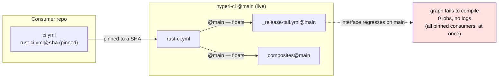
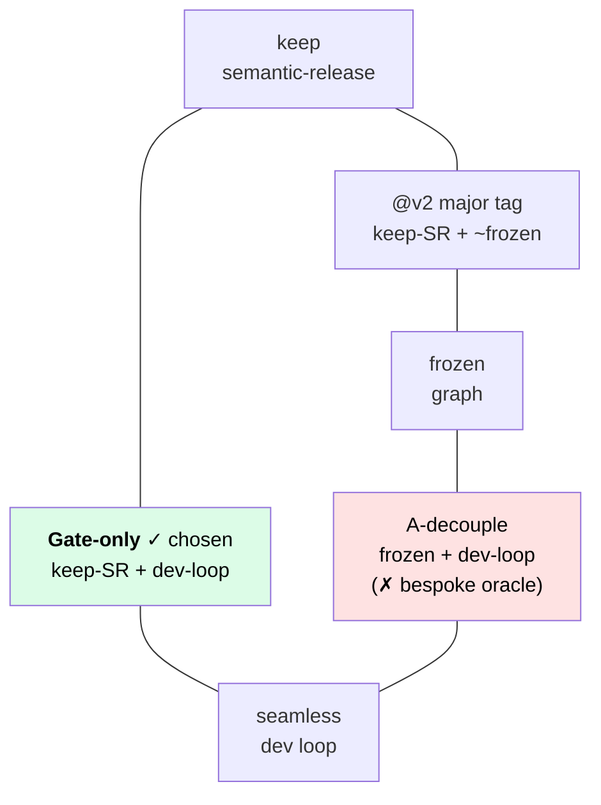
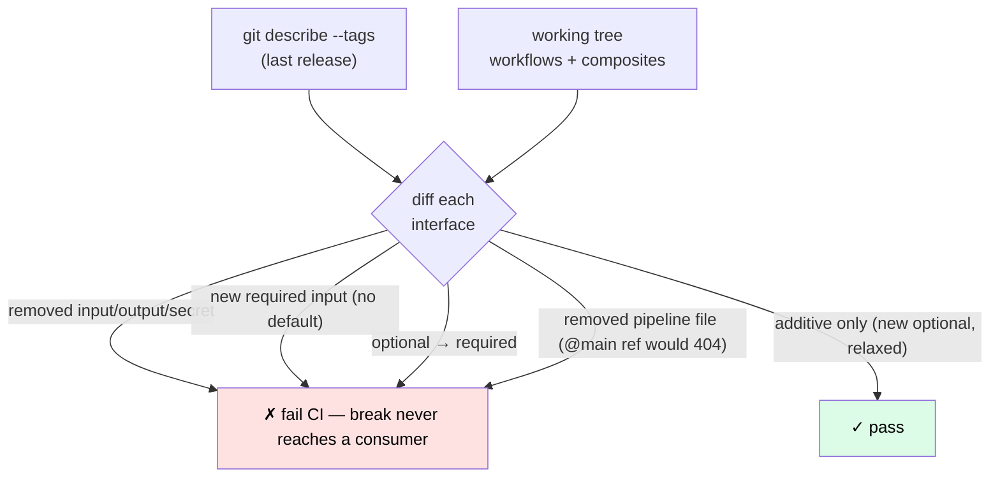

# Reusable-workflow pinning — gate-only (issue #31)

`/deps` SHA-pins **third-party** actions ([DEPS-PINNING.md](DEPS-PINNING.md)).
hyperi-ci's **own** reusable workflows reference their siblings + composites at
`@main`, on purpose. This is the decision record for why, what breaks if you
get it wrong, and the gate that makes `@main` safe.

**Status:** Accepted · 2026-05-29 · supersedes the "atomic frozen graph
(A-decouple)" proposal.

## The problem

The language reusable workflows (`rust-ci.yml`, `python-ci.yml`, …) call their
sibling composites + `_release-tail.yml` at `@main`. A consumer SHA-pins the
*caller* (via Renovate), but those internals resolve **live from `main`** at run
time. So a breaking interface change on `main` **retroactively breaks every
pinned consumer** at startup — 0 jobs, no logs. It bit hyperi-pylib once. The
pin is skin-deep: the *cost* of pinning without the *benefit*.

Same root cause as the old tag-orphaning bug: **coupling correctness to a
mutable git ref** (there, "tags reachable from HEAD"; here, "`@main` siblings").

## The trilemma — pick two

You can have any **two** of: keep semantic-release · a frozen (tamper-proof)
graph · a seamless dev loop.

| Option | keep semantic-release | frozen graph | seamless dev loop | cost |
|---|---|---|---|---|
| **Gate-only** ✓ | ✓ | ✗ | ✓ | none beyond a source-side gate (+ branch protection when it matters) |
| `@v2` major tag | ✓ | ~ band | ✗ | composite edits **inert on `main` until `v2` advances** |
| Freeze-on-main | ✓ | ✓ | ✗ | re-adds committed-back `@semantic-release/git` (orphaning) + inert edits |
| A-decouple | ✗ **bespoke oracle** | ✓ | ✓ | bespoke oracle + tagger + freezer replacing semantic-release's version+tag |

A-decouple is the only option giving a frozen graph *and* a seamless dev loop —
but only by replacing a battle-tested tool with custom code.

## Decision

**Gate-only.** Keep `@main` internals and semantic-release; prevent the breakage
**at source** with a static interface backward-compat gate
(`scripts/check-workflow-interfaces.py`) in hyperi-ci's own Quality job.

## Why

- **KISS. Over-engineered CI kills small teams — repeatedly.** A-decouple meant
  replacing semantic-release (proven) with bespoke release machinery — a custom
  version oracle + off-main `commit-tree` tagger + freezer — that we'd maintain
  and debug forever. A proven tool that's "good enough" wins.
- **The acute pain is already fixed at source.** The gate fails our CI when a
  sibling interface regresses → the break never ships. A frozen graph is not
  needed to *stop the breakage* — only to make the pin tamper-proof.
- **First-party context.** Consumers are hyperi-io's own repos; hyperi-ci is our
  own tool. The "frozen auditable graph" / tamper-resistance benefit matters far
  more for **third-party** deps (which `/deps` SHA-pins) than for our **own**
  internals — those are defended by org access control + the gate, not by pinning.
- **Reversible.** If tamper-resistance ever becomes a hard requirement, `@v2`
  adds a compatible-band frozen graph with a one-line tag-move — still no custom
  oracle.

## The gate

`scripts/check-workflow-interfaces.py`, run in the Quality job (with
`fetch-depth: 0`), diffs each reusable-workflow + composite interface in the
working tree against the **last release tag** and fails on a backward-incompatible
delta:

Additive changes (new optional input, relaxed required) pass. Tested in
`tests/unit/test_workflow_interfaces.py`. To make a deliberate major break, cut
it knowingly — the gate forces the choice to be explicit.

## Precondition — branch protection (deferred, by decision)

Gate-only is **source-side**: consumers consume `main` live, so the gate must
*block* a regression from reaching `main`. That needs `main` protected so a bad
commit can't land directly. **This is not multi-reviewer co-approval** — for a
small team that's friction without payoff. The minimal config is:

| Setting | Value | Why |
|---|---|---|
| Require a pull request before merging | on | blocks direct `git push` to `main` (the only way the gate can gate) |
| Required approvals | **0** | you self-merge — no second human needed |
| Require status checks → **Quality** | on | merge button disabled until the interface gate is green |

**Current policy (decided 2026-05-29): OFF.** For a 1–2 person team iterating in
bursts, the gate already *alarms* — any interface regression turns Quality red on
`main` within ~2 min and we fix-forward before a consumer happens to run. The
*barrier* (branch protection) only earns its keep when **more people push to
hyperi-ci**, or **consumers start running unattended / on a schedule we're not
watching**. Flip it on (PR-only + Quality-required + 0 approvals) at that point.
The one cost of turning it on: `hyperi-ci push --publish` direct-to-main becomes
push-branch → open PR → self-merge.

## The caller floats `@main` too (not just the internals)

Originally the consumer *caller* was SHA-pinned (by Renovate) while the
internals floated `@main` — the worst of both: a pinned caller that still broke
when `main` regressed, **and** consumers frozen off CI fixes (it stuck
hyperi-pylib on v2.6.1, dfe-receiver on v2.6.4). Since the gate already makes
`@main` safe, the caller is now `@main` too: `init` scaffolds
`<lang>-ci.yml@main`, and the org Renovate preset **carves the hyperi-ci caller
out of digest pinning** so it is never re-pinned (see
[DEPS-PINNING.md](DEPS-PINNING.md)). A deliberate `@vN`/`@sha` pin is still
allowed — the carve-out only stops Renovate *imposing* one.

## What we consciously accept

- Consumers run hyperi-ci's **latest** `main` (caller and internals both float);
  a bad `main` affects all at once — mitigated by the gate + the `ci-test-*`
  fixtures + fast fix-forward. This is the deliberate trade for always-latest CI.
- The gate catches **structural/interface** breaks, not behavioural; there is no
  tamper-proof audit graph for the orchestration.

## Consequences

- **Removed:** the A-decouple oracle + freezer + their CLI commands + tests
  (`src/hyperi_ci/release/`, `next-version`, `freeze-internals`) — never reached
  PyPI, so no consumer impact.
- **Kept:** semantic-release as the oracle + tagger, `@main` internals, the
  seamless dev loop, and the gate (hardened with the removed-file check).
- **Retained, unrelated:** `@semantic-release/github` — hyperi-ci now creates GH
  Releases again (its deletion had been a migration bug, not part of this
  decision).
