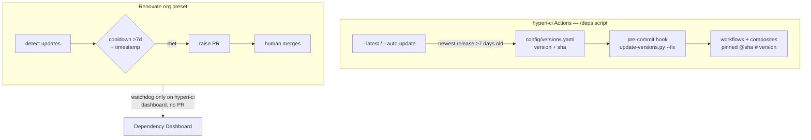

# Dependency pinning policy

hyperi-ci is the SSOT and controller for HyperI's dependency-update policy
across every repo. This documents what's pinned, by what, and why.

For our *own* reusable-workflow internals (which stay `@main` on purpose), see
[workflow-pinning.md](workflow-pinning.md).

## Two systems, clear split

| Dependency | Owner | How | Cooldown |
|---|---|---|---|
| GitHub Actions (on hyperi-ci) | `/deps` script (`scripts/update-versions.py`) + `config/versions.yaml` | SHA-pinned at commit time via the pre-commit hook | 7 days, enforced by the script |
| **External CLI tools** (gitleaks, osv-scanner) | same script + `config/versions.yaml` `tools:` | **tag-pinned** (see the exemption below), mirrored into source via a `# hyperi-ci:pin` marker | 7 days, enforced by the script |
| GitHub Actions (other repos) | Renovate org preset | SHA digest pin (`helpers:pinGitHubActionDigests`) | 7 days |
| **hyperi-ci reusable-workflow caller** (other repos) | **nobody - floats `@main`** | **NOT pinned. Carved out of digest pinning in the org preset** (`hyperi-io/renovate-config`) | n/a |
| cargo / pip / npm / docker (all repos) | Renovate org preset | version PRs | 7 days |

**Why the caller is exempt.** SHA-pinning protects against *third-party*
supply-chain risk. The hyperi-ci reusable workflow is our *own* CI tool -
pinning its version at the consumer just freezes consumers off CI fixes
(it stuck scalo-py on v2.6.1, dfe-receiver on v2.6.4). Consumers call
`<lang>-ci.yml@main` and always get latest; safety for `@main` is hyperi-ci's
internal interface gate (see [workflow-pinning.md](workflow-pinning.md), issue
#31), not a consumer pin. A deliberate pin (`@vN`, or `@sha` for a known
reason) is still allowed - the carve-out only stops Renovate *imposing* one.

- The org Renovate preset lives in `hyperi-io/renovate-config` but is governed
  from here - change the policy by editing that preset, then document it here.
- On hyperi-ci the script owns Actions, so Renovate is a **passive watchdog**:
  it still detects Action updates and lists them on the Dependency Dashboard (an
  independent second opinion) but raises no PR unless a human ticks the box. Set
  by `renovate.json` (`dependencyDashboardApproval` on `github-actions`).

## Hard rules

- **PR-only, always.** Nothing auto-merges to main - any repo, any ecosystem,
  including CVE fixes. A human reviews and merges every PR.
  (`:automergeDisabled` in the org preset.)
- **7-day cooldown.** An update waits until its release is a week old and the
  release timestamp is verified (`minimumReleaseAge: 7 days` +
  `minimumReleaseAgeBehaviour: timestamp-required`). This blocks fast-moving
  supply-chain attacks - a poisoned release is usually yanked inside that window.
- **CVEs skip the cooldown, not the review.** Vulnerability fixes get a PR
  immediately (`minimumReleaseAge: 0`) but still need a human merge.
- **SHA over tag.** A tag can be force-moved; a commit SHA can't. Actions pin to
  `owner/repo@<sha> # <version>`.
  - **Known exemption: external CLI tools pin by tag** (`tools:` in
    `versions.yaml`). We fetch a release *asset*, not a git ref, so a moved tag
    is not the threat - but an asset can be deleted and re-uploaded under the
    same tag, and no install path verifies a digest today. So tools are
    currently *less* protected than actions, not more. Closing that gap (a
    `sha256:` per asset, verified on download) is **#66**. Until then, treat the
    tool pins as reproducibility, not integrity.
- **Same-org packages skip the cooldown.** We publish those ourselves; our own
  CI gates govern the risk, not external-attacker cooldown logic.

## Flow



## `/deps` - the script

`scripts/update-versions.py` is the local dependency command for this repo. It
scans **both** `.github/workflows/*.yml` and `.github/actions/*/action.yml` -
the full pipeline, not just top-level workflows.

| Flag | Does |
|---|---|
| `--check` (default) | show drift between `versions.yaml` and the pinned refs |
| `--apply` | rewrite workflows + composites to match the SSOT |
| `--fix` | `--apply` + non-zero exit when it changed something (pre-commit) |
| `--latest` | report the newest release of each Action that's >=7 days old |
| `--auto-update` | bump `versions.yaml` to those, test on the `ci-test-*` projects, commit or revert |

`config/versions.yaml` is the SSOT. Two maps matter here:

- `actions: {name: {version, sha}}` - rewritten into `uses:` refs.
- `tools: {name: {version, repo, pin}}` - external CLI tools we install.

**Never hand-edit a `uses:` ref or a mirrored tool pin** - the pre-commit hook
reverts both to match the SSOT. To change a pin, edit `versions.yaml` and let
`--fix` rewrite it.

The "latest version that's >=7 days old, pin *that* version's SHA now" rule means
we always adopt a release only after its cooldown, and we pin the immutable SHA
at adoption time rather than tracking a movable tag. Tools follow the same
cooldown, but pin by tag (see the exemption above).

**The clamp follows semver's compatibility axis, which is not always the major.**
`--auto-update` never crosses it; that bump is a human edit.

| Pin | Clamp | Why |
|---|---|---|
| `1.x` and up | major | `gitleaks v8 -> v9` never auto-lands. That exact breaking-CLI change (`detect` removed) is what produced #64. |
| `0.x` | major **and** minor | Under [semver §4](https://semver.org/#spec-item-4) anything may change in 0.x, so `0.20 -> 0.21` **is** the breaking bump. `cargo-deny` (0.20.2) and `cargo-audit` (v0.22.2) are both 0.x - clamping only the major there would wave through the breaking axis while blocking the safe `1.0.0` move. |

The cooldown applies to **our own pins too**, not just to what `--auto-update`
picks: pinning a release younger than 7 days is the same policy breach whoever
types it.

### Tool pins live in source, and why

`config/` ships **outside** the wheel (`pyproject.toml`: `packages =
["src/hyperi_ci"]`), so runtime code cannot read `versions.yaml`. A tool version
is therefore *copied* into the file that uses it, and the copy is anchored with
an explicit marker:

```python
# hyperi-ci:pin tools.gitleaks
_GITLEAKS_VERSION = "v8.30.1"
```

```yaml
# hyperi-ci:pin tools.osv-scanner
default: v2.4.0
```

`--check` reports a pin that drifts from the SSOT, a marker that has gone
missing, **and** a `pin:` path that does not exist. All three are failures, not
warnings: a pattern silently matching zero lines is exactly how the gitleaks pin
sat 9 versions stale (v8.21.2 vs v8.30.1) while the check stayed green.

**Where it is enforced.** Two places, and both matter:

- `.github/workflows/ci.yml` -> the **Version SSOT gate** runs `--check` on
  every push. This is the backstop, and it is offline (local files only) so it
  cannot flake.
- `scripts/pre-commit-versions.sh` -> `--fix`, for the local tight loop.

The hook alone is NOT enforcement: it lives in `.git/hooks/`, which no fresh
clone and no runner ever has. The gate that catches drift has to be one nobody
needs to install.

Adding a tool: add the `tools:` entry (`version`, `repo`, `pin`), put the marker
above the line that carries the version, run `--check`. No script change needed -
the marker is generic.

