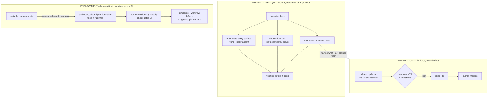

# Dependency pinning policy

hyperi-ci is the SSOT and controller for HyperI's dependency-update policy
across every repo. This documents what's pinned, by what, and why.

For our *own* reusable-workflow internals (which stay `@main` on purpose), see
[workflow-pinning.md](workflow-pinning.md).

## Two systems, clear split

Three things, really, and they sit at different points in time. `hyperi-ci
deps` is **preventative** - it runs on your machine BEFORE the change lands and
tells you what you are about to leave stale. Renovate is **remediation** - it
runs on the forge AFTER the fact and raises a PR for what already went stale.
`update-versions.py` is **enforcement** for this repo's own tool and runtime
pins, at push time. None of them replaces another, and "Renovate is configured" must never be
read as "the surfaces are covered" (see [the blind spots](#what-renovate-never-sees)).

| Dependency | Owner | How | Cooldown |
|---|---|---|---|
| GitHub Actions (every repo, hyperi-ci included) | Renovate org preset | SHA digest pin (`helpers:pinGitHubActionDigests`) | 7 days |
| **External CLI tools** (gitleaks, osv-scanner) | `/deps` script (`scripts/update-versions.py`) + `src/hyperi_ci/config/versions.yaml` `tools:` | **tag-pinned** with a `sha256` per release asset (see the exemption below), mirrored into composite actions via a `# hyperi-ci:pin` marker | 7 days, enforced by the script |
| **hyperi-ci reusable-workflow caller** (other repos) | **nobody - floats `@main`** | **NOT pinned. Carved out of digest pinning in the org preset** (`hyperi-io/renovate-config`) | n/a |
| cargo / pip / npm / docker (all repos) | Renovate org preset | version PRs | 7 days |
| **Everything else** (tox, nox, test-source image tags, `.tool-versions`, `.hyperi-ci.yaml`) | **nobody** | **`hyperi-ci deps` REPORTS it. Nothing pins it.** | n/a |
| **Your declared floor vs your own lock** | **nobody** | **`hyperi-ci deps drift`. Renovate has no equivalent** | n/a |

**Why the caller is exempt.** SHA-pinning protects against *third-party*
supply-chain risk. The hyperi-ci reusable workflow is our *own* CI tool -
pinning its version at the consumer just freezes consumers off CI fixes
(it stuck scalo-py on v2.6.1, dfe-receiver on v2.6.4). Consumers call
`<lang>-ci.yml@main` and always get latest; safety for `@main` is hyperi-ci's
internal interface gate (see [workflow-pinning.md](workflow-pinning.md), issue
\#31), not a consumer pin. A deliberate pin (`@vN`, or `@sha` for a known
reason) is still allowed - the carve-out only stops Renovate *imposing* one.

- The org Renovate preset lives in `hyperi-io/renovate-config` but is governed
  from here - change the policy by editing that preset, then document it here.
- hyperi-ci's `renovate.json` never pins its own `hyperi-io/hyperi-ci/...@main` refs. A major of `actions/create-github-app-token` waits for a Dependency Dashboard tick, because no PR runs the step that mints the release token.

## Hard rules

- **PR-only, always.** Nothing auto-merges to main - any repo, any ecosystem,
  including CVE fixes. A human reviews and merges every PR.
  (`:automergeDisabled` in the org preset.)
- **7-day cooldown.** An update waits until its release is a week old and the
  release timestamp is verified (`minimumReleaseAge: 7 days` +
  `minimumReleaseAgeBehaviour: timestamp-required`). This blocks fast-moving
  supply-chain attacks - a poisoned release is usually yanked inside that window.
- **CVEs skip the cooldown, not the review.** Vulnerability fixes get a PR
  immediately (`minimumReleaseAge: 0`) but still need a human merge.
- **SHA over tag.** A tag can be force-moved; a commit SHA can't. Actions pin to
  `owner/repo@<sha> # <version>`. Renovate writes that form, and
  `tests/unit/test_update_versions.py` fails a PR that adds a third-party ref on a bare tag.
  - **Known exemption: external CLI tools pin by tag** (`tools:` in
    `versions.yaml`). We fetch a release *asset*, not a git ref, so a moved tag
    is not the threat. An asset can be deleted and re-uploaded under the same
    tag, so each tool also carries a `sha256` per asset, and the install fails
    closed on a mismatch.
- **Same-org packages skip the cooldown.** We publish those ourselves; our own
  CI gates govern the risk, not external-attacker cooldown logic.

## Flow


```mermaid
flowchart TD
    subgraph PREV["PREVENTATIVE — your machine, before the change lands"]
      DEPS["hyperi-ci deps"] --> SURF["enumerate every surface<br/>found / inert / absent"]
      DEPS --> DRIFT["floor vs lock drift<br/>per dependency group"]
      DEPS --> GAPS["what Renovate never sees"]
      SURF --> YOU["you fix it before it ships"]
      DRIFT --> YOU
      GAPS --> YOU
    end
    subgraph SCRIPT["ENFORCEMENT -- hyperi-ci tool + runtime pins, in CI"]
      V["src/hyperi_ci/config/versions.yaml<br/>tools + runtimes"] --> H["update-versions.py --apply<br/>--check gates CI"]
      H --> W["composite + workflow defaults<br/># hyperi-ci:pin markers"]
      L["--stable / --auto-update"] -->|newest release 7+ days old| V
    end
    subgraph REN["REMEDIATION — the forge, after the fact"]
      D["detect updates<br/>incl. every uses: ref"] --> DD{"cooldown ≥7d<br/>+ timestamp"}
      DD -->|met| PR["raise PR"]
      PR --> HUMAN["human merges"]
    end
    GAPS -.->|names what REN cannot reach| REN
```

## `hyperi-ci deps` - the preventative half

`scripts/update-versions.py` enforces THIS repo's pipeline against
`src/hyperi_ci/config/versions.yaml`. `hyperi-ci deps` is that idea generalised: any repo,
any surface, discovering what is there instead of reading a hardcoded SSOT. It
runs locally and makes no network calls, so it is safe to run on every branch.

It exists because updating "the dependencies" reliably meant the package
resolver and nothing else. A repo would come out with current runtime pins and
a three-year-old test stack, because nothing ENUMERATED the surfaces, so nobody
thought to look past `pyproject.toml`. The enumeration is the fix.

| Command | Does | Exit |
|---|---|---|
| `hyperi-ci deps` (or `deps scan`) | everything in one call: surfaces + their state, every extracted pin, every dependency group with its declared constraint, drift, and the Renovate gaps | 0 |
| `hyperi-ci deps drift` | declared floor vs locked version, per group | **1 on drift** - it can gate |
| `hyperi-ci deps gaps` | present surfaces no enabled Renovate manager sees | 0 |
| `hyperi-ci deps show <surface>` | one surface, uncapped: every matched file, every pin with line numbers, declared vs locked | 0 |
| `--json` | machine-readable, same payload | |
| `--full` | lift the display cap on detail lists | |
| `--kind python\|rust\|node\|container\|ci\|...` | narrow a polyglot repo to one ecosystem | |

Surfaces are DATA: `src/hyperi_ci/config/dep-surfaces.yaml`. The file patterns
are vendored from Renovate's own `managerFilePatterns` defaults, so what we
match is what Renovate matches; each entry records its `renovate_manager:`
slug, or `null` plus a `gap:` note where no manager exists.

**Three states per surface, never two.** The middle one is the whole point:

| State | Means |
|---|---|
| `found` | files matched and versions came out |
| `inert` | files matched and NOTHING came out, or the manager has no file patterns at all. **Not clean - go and look.** |
| `absent` | nothing matched |

Collapsing `inert` into either neighbour is how a surface reads as covered
while being nothing of the sort.

**Multi-language by construction.** A repo is not "a Python repo" - ours are
Python and Rust and TypeScript and OpenTofu at once. Every manifest in the tree
is parsed in the same pass and every ecosystem reported separately, so a stale
Rust dev dependency cannot hide behind a current Python runtime pin. Language
toolchains (`cargo metadata`, `uv export`, `npm ls`) are probed with
`shutil.which` and used to ENRICH the result when present; a box without cargo
gets the file-parsed answer and no complaint.

### Floor drift - the thing nothing else checks

Renovate's `rangeStrategy: bump` only rewrites a floor when a NEW upstream
release triggers a PR. Nothing anywhere tells you your floor is already behind
your own lock:

```text
pytest          >=8.0.0   locked 9.0.3   major
pytest-asyncio  >=0.23.0  locked 1.3.0   major
mypy            >=1.0.0   locked 2.1.0   major
```

That repo installs and tests green every time - the lock resolves fine. The
floor is a lie about what it supports, and it stays a lie until someone reads
it. `deps drift` is the standing audit, reported per GROUP so a rotting `dev`
extra is visibly separate from runtime.

The 0.x rule: under
[semver section 4](https://semver.org/#spec-item-4) minor is the breaking axis
for 0.x, so `>=0.23` against a locked 0.40 is flagged the same as `>=1` against
a locked 2.

### What Renovate never sees

These are why a Renovate-configured repo still rots. All verified against
upstream, 2026-07-29:

| Surface | Why it is invisible |
|---|---|
| `tox.ini` | **No manager exists at all** - [renovatebot/renovate#2214](https://github.com/renovatebot/renovate/issues/2214), still open. A repo whose whole test matrix lives here has its entire test stack outside every bot's view. |
| `noxfile.py` | Deps are Python function ARGUMENTS, not a manifest. Nothing can read them. |
| `pip-compile` | Ships **ENABLED with EMPTY default file patterns**. Does nothing until someone sets `managerFilePatterns`. |
| `kubernetes` | Same - **enabled, empty patterns**. A manifest tree is indistinguishable from any other YAML. |
| `asdf` vs `mise` | **They do not overlap.** The asdf manager does not cover mise's TOML; the mise manager does not match `.tool-versions`. Driving mise from `.tool-versions` needs BOTH enabled. |
| container tag in test source | Renovate only sees an inline image tag with a `# renovate:` marker above it. Unmarked ones - nearly all of them - are invisible. |
| `.hyperi-ci.yaml` | A bespoke schema. No bot will ever read it. |
| composite `action.yml` | Same manager as workflows, but it lives anywhere in the tree. A repo whose workflows are current and whose composites are two years stale still reads as covered. |

An enabled-but-inert manager is worse than an absent one, because it reads as
covered. `deps gaps` names all of them, including the inert ones, and says
which of the three reasons applies.

### Making an in-source pin enforceable

The answer to an unmarked tag is the same marker `update-versions.py` already
uses - see [Tool pins live in source](#tool-pins-live-in-source-and-why):

```python
# hyperi-ci:pin tools.clickhouse
_CLICKHOUSE_IMAGE = "clickhouse/clickhouse-server:25.3.1"
```

`hyperi-ci deps` DISCOVERS marked pins in any repo (the `pin-marker` surface);
`update-versions.py` ENFORCES them against `src/hyperi_ci/config/versions.yaml` here. Both
read the same lines through `src/hyperi_ci/pin_marker.py`, so the convention
has one definition and the two cannot drift apart.

## `/deps` - the script

`scripts/update-versions.py` is the local dependency command for this repo. It
scans **both** `.github/workflows/*.yml` and `.github/actions/*/action.yml` -
the full pipeline, not just top-level workflows.

| Flag | Does |
|---|---|
| `--check` (default) | show drift between `versions.yaml` and its copies in the pipeline |
| `--apply` | rewrite workflows + composites to match the SSOT |
| `--stable` | the dry run of `--auto-update`: print the newest release >=7 days old that it would write, and write nothing |
| `--auto-update` | bump `versions.yaml` to those, validate locally, revert on failure. It does not commit and does not trigger remote CI |
| `--fail-on-drift` | with `--stable`, exit 1 when a pin is behind or could not be checked. `versions-audit.yml` runs `--stable --fail-on-drift` weekly |
| `--now` | waive the 7-day soak for a supervised manual run |

`--stable` is the SOAKED release, not the newest one - the same sense as the
`stable` channel in [self-update.md](../self-update.md). It also reports `runtimes:` drift (llvm against the latest llvm-project release, node against the latest LTS) as warnings. Runtimes never auto-bump, because a runtime major is a decision.

`src/hyperi_ci/config/versions.yaml` is the SSOT for tools, runtimes and the semantic-release install. It holds no `uses:` refs: those are Renovate's.

**Never hand-edit a mirrored tool pin** - the `--check` gate in CI fails on it. To change a pin, edit `versions.yaml` and let `--apply` rewrite it.

**Majors are included.** `--auto-update` takes the newest release past the cooldown, whatever its major. Every bump goes through a PR, and a tool whose flags changed shows up as a red quality stage on the `ci-test-*` fleet.

**Digests move with the version.** For a tool with `sha256:`, `--auto-update` finds each pinned asset in the current release by its digest, then writes the `digest` GitHub records for the same asset in the new release. If any asset has no digest, the tool is left for a hand bump. helm is always a hand bump, because its tarballs are served from get.helm.sh, not from the GitHub release.

The cooldown applies to **our own pins too**, not just to what `--auto-update`
picks: pinning a release younger than 7 days is the same policy breach whoever
types it.

### Tool pins live in source, and why

`versions.yaml` ships inside the wheel (`src/hyperi_ci/config/`), and Python
reads it through `hyperi_ci.versions`, so Python code carries no copy of a
version. A copy is needed only where GitHub parses the file before any of our
code runs: a composite action's `default:` or a workflow input's `default:`.
That copy is anchored with an explicit marker:

```yaml
# hyperi-ci:pin tools.osv-scanner
default: v2.4.0
```

`--check` reports a pin that drifts from the SSOT, a marker that has gone
missing, **and** a `pin:` path that does not exist. All three are failures, not
warnings: a pattern silently matching zero lines is exactly how the gitleaks pin
sat 9 versions stale (v8.21.2 vs v8.30.1) while the check stayed green.

**Where it is enforced.** `.github/workflows/ci.yml` -> the **Version SSOT
gate** runs `--check` on every push. It is offline (local files only), so it
cannot flake, and nobody has to install it.

Adding a tool: add the `tools:` entry (`version`, `repo`, `pin`), put the marker
above the line that carries the version, run `--check`. No script change needed -
the marker is generic.
