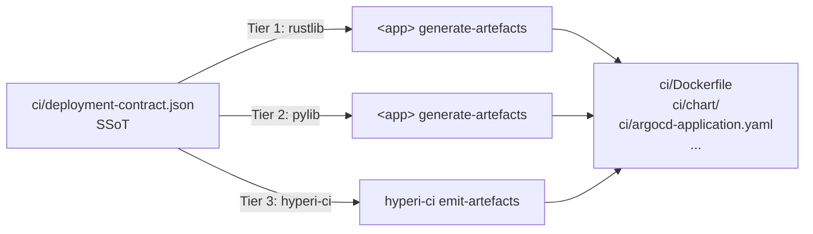

# Deployment Contract

User-facing reference for the three-tier deployment-contract model in
hyperi-ci. For the full design and implementation status see:

- Spec: [`docs/superpowers/specs/2026-04-30-deployment-contract-three-tier-design.md`](superpowers/specs/2026-04-30-deployment-contract-three-tier-design.md)
- Plan: [`docs/superpowers/plans/2026-04-30-deployment-contract-three-tier.md`](superpowers/plans/2026-04-30-deployment-contract-three-tier.md)

## TL;DR

Every HyperI app's deployment artefacts (Dockerfile, Helm chart,
ArgoCD `Application`, container manifest) come from a single
language-agnostic JSON contract — `ci/deployment-contract.json`. CI
regenerates these artefacts from the contract on every push, then
diff-checks against the committed `ci/` to catch drift.



All three tiers must emit **byte-identical** output for the same JSON
contract — verified by the cross-tier parity test suite.

## Picking your tier

| Repo | Tier | Producer |
|---|---|---|
| Rust app using `hyperi-rustlib` | 1 (`rust`) | `<app> generate-artefacts` |
| Python app using `hyperi-pylib` | 2 (`python`) | `<app> generate-artefacts` |
| Anything else (bash, TS, Go, ad-hoc) | 3 (`other`) | `hyperi-ci emit-artefacts` |
| Library / no container | n/a (`none`) | container stage skips silently |

`hyperi-ci` auto-detects this — you don't pick by hand. Detection
order, with the first match winning:

1. `Cargo.toml` containing `hyperi-rustlib` (any form: string, table,
   `.workspace = true`, extras) → Tier 1.
2. `pyproject.toml` containing `hyperi-pylib` (incl. extras like
   `hyperi-pylib[metrics]`) → Tier 2.
3. `ci/deployment-contract.json` exists → Tier 3.
4. None of the above → no contract; container stage no-ops.

## Tier 3 onboarding

For a repo that doesn't have a producer framework, scaffold a starter
contract:

```bash
hyperi-ci init-contract --app-name my-app
```

Writes `ci/deployment-contract.json` with sensible defaults derived
from the app name:

| Field | Default | Source |
|---|---|---|
| `app_name` | `my-app` | from `--app-name` |
| `binary_name` | `my-app` | from `--app-name` |
| `env_prefix` | `MY_APP` | hyphens→underscores, uppercased |
| `metric_prefix` | `my_app` | hyphens→underscores |
| `config_mount_path` | `/etc/my-app/my-app.yaml` | DFE convention |
| `metrics_port` | `9090` | DFE convention |
| `health.liveness_path` | `/healthz` | DFE convention |
| `health.readiness_path` | `/readyz` | DFE convention |
| `health.metrics_path` | `/metrics` | DFE convention |
| `image_registry` | `ghcr.io/hyperi-io` | cascade default |
| `base_image` | `ubuntu:24.04` | cascade default |
| `image_profile` | `production` | rustlib default |

App-name validation matches the org repo-naming convention:
lowercase, hyphen-separated, no underscores, 3–50 chars, starts with
a letter. `my_app` and `My-App` are rejected.

`--force` overwrites an existing file. Without `--force`, the command
errors instead of clobbering.

After scaffolding, edit the file to add real values (env-prefix
overrides, secrets groups, KEDA scaling, extra ports, OCI labels) and
commit it.

## Generating artefacts

```bash
hyperi-ci emit-artefacts ci/                              # in-place regen
hyperi-ci emit-artefacts ci-tmp/ --from ci/deployment-contract.json
hyperi-ci emit-artefacts /tmp/drift/ --from ci/deployment-contract.json
```

The output directory is created if missing. Each run produces (relative
to `output_dir`):

- `Dockerfile`
- `Dockerfile.runtime`
- `container-manifest.json`
- `argocd-application.yaml`
- `chart/` (Helm)
- `deployment-contract.schema.json`

> **Status:** the templating engine itself is deferred to Phase 2 of
> the implementation plan, blocked on hyperi-rustlib 2.8.0 shipping
> the `schemars`-derived JSON Schema export and the parity fixture
> suite. Until then, `emit-artefacts` exits with code 5
> (`EXIT_NOT_IMPLEMENTED`) after validating the contract — the
> validation, schema-version gate, and exit-code contract are stable.

## Schema versioning

Every contract has a `schema_version` field (currently `2`). Producers
stamp this on emit; consumers (this CLI, dfe-control-plane, ArgoCD
sync hooks) fail fast if the contract declares a version higher than
the consumer supports.

`MAX_SUPPORTED_SCHEMA_VERSION` is bumped in **lockstep** across:

- `hyperi-rustlib::deployment::contract::default_schema_version()`
- `hyperi-pylib`'s mirror module
- `hyperi-ci/src/hyperi_ci/deployment/contract.py`
- `hyperi-ci/config/defaults.yaml` under
  `deployment.max_supported_schema_version`

Bumping requires a coordinated release of all three. Add a new schema
version when:

- Adding a required field
- Removing a field
- Renaming a field
- Changing a field's type

You do **not** need to bump for adding an optional field with a default
— consumers ignore unknown fields gracefully when they're optional.

## Exit codes

`emit-artefacts`:

| Code | Meaning |
|---|---|
| 0 | success |
| 2 | contract file missing |
| 3 | contract invalid (parse error, schema violation, schema_version too new) |
| 4 | (reserved — future explicit schema-too-new differentiation) |
| 5 | generators not yet implemented (Phase 2) |
| 6 | (reserved — I/O write errors once Phase 2 lands) |

`init-contract`:

| Code | Meaning |
|---|---|
| 0 | success |
| 2 | invalid `--app-name` |
| 3 | contract already exists (use `--force` to overwrite) |
| 4 | I/O error writing the file |

## Cascade-driven defaults

Org-wide deployment defaults live in the YAML cascade rather than in
each app's contract source — flipping `deployment.image_registry` once
in `org.yaml` updates every app. Available keys:

```yaml
# .hyperi-ci.yaml or config/defaults.yaml
deployment:
  image_registry: ghcr.io/hyperi-io   # default; override e.g. for harbor
  base_image: ubuntu:24.04            # default; override for curated GHCR base
  argocd:
    repo_url: https://github.com/hyperi-io/{app}  # default
  max_supported_schema_version: 2     # mirrored from contract.py
```

Resolvers in `hyperi_ci.deployment.registry` (`image_registry_from_cascade`,
`base_image_from_cascade`, `argocd_repo_url_from_cascade`) mirror the
identical functions in `hyperi-rustlib::deployment::registry`. Apps that
delegate to these get the same answer in Rust and Python.

## See also

- [Container build pipeline spec](superpowers/specs/2026-04-01-container-build-pipeline-design.md) —
  parent design this extends
- [Three-tier producer model spec](superpowers/specs/2026-04-30-deployment-contract-three-tier-design.md) —
  the architecture
- [Implementation plan](superpowers/plans/2026-04-30-deployment-contract-three-tier.md) —
  phase status
