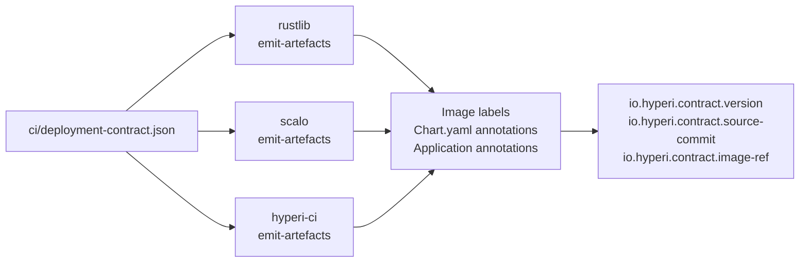

# Contract Identity Annotation Scheme — v1

**Applies to:** `hyperi-rustlib` (Tier 1), `scalo` (Tier 2), `hyperi-ci` (Tier 3).

The three deployment-contract producers stamp every artefact — container
image, Helm chart, ArgoCD `Application` — with a uniform, greppable
identity using **one key prefix, three fields, the same string everywhere**.

## Fields

Exactly three keys. All three are mandatory on every artefact; no blanks,
no omissions.

| Key                                | Meaning                                          | Format                                                            |
| ---------------------------------- | ------------------------------------------------ | ----------------------------------------------------------------- |
| `io.hyperi.contract.version`       | Contract **schema** version                      | Literal string `v1`                                               |
| `io.hyperi.contract.source-commit` | Git SHA of the **consumer app's** repo HEAD      | 40-char lowercase hex, no `sha256:` prefix                        |
| `io.hyperi.contract.image-ref`     | Intended pull reference for the container image  | `<registry>/<repo>:<tag>` or `<registry>/<repo>@sha256:<digest>`  |

Semantics:

- `version` is the **schema** version of the contract format, not the
  app's semver. Bumps only when the contract schema breaks.
- `source-commit` is the **consumer's** SHA (e.g. `dfe-receiver`'s
  commit), not the producer's (rustlib / scalo / hyperi-ci).
- `image-ref` is what a consumer pulls. Tag form pre-push, digest form
  preferred post-push where the digest is known at emit time.

## Where each appears

Same key string, three surfaces, three mechanisms:

| Artefact             | Carrier                                  | Example                                       |
| -------------------- | ---------------------------------------- | --------------------------------------------- |
| OCI image            | Image label (`docker buildx --label`)    | `--label io.hyperi.contract.version=v1`       |
| Helm chart           | `Chart.yaml` top-level `annotations:`    | `io.hyperi.contract.version: "v1"`            |
| ArgoCD `Application` | `metadata.annotations`                   | `io.hyperi.contract.version: "v1"`            |

The grep payoff: `grep -r 'io.hyperi.contract' .` finds every
contract-emitted artefact regardless of format.

## Normalization

- Keys: lowercase, dot-separated, no underscores, no slashes.
- `source-commit`: 40-char lowercase hex; no `sha256:` prefix (it is a
  git SHA, not a content hash).
- `image-ref`: never include `docker.io/library/` prefix even when the
  registry is Docker Hub; always include the registry host explicitly
  (no implicit `docker.io`).
- `version`: literal string `v1` (quote it in YAML so it does not get
  parsed as a number-with-prefix oddity).
- Empty value → producer MUST fail the emit, not write a blank
  annotation.

## image-ref: pre-push vs post-push

| When                                                       | Form                                                                 | Who writes it                                |
| ---------------------------------------------------------- | -------------------------------------------------------------------- | -------------------------------------------- |
| Pre-push (on the image itself, at build time)              | `ghcr.io/hyperi-io/<app>:<tag>` (tag form)                           | Producer (rustlib / scalo / hyperi-ci)       |
| Post-push (on Helm `Chart.yaml` + ArgoCD `Application`)    | `ghcr.io/hyperi-io/<app>@sha256:<digest>` (digest form **preferred**) | Push step, after registry returns the digest |

Rationale: an image cannot carry its own post-build digest in a label
(the digest is computed over the labels). Helm + ArgoCD are written
*after* the push, so they can use the immutable digest form — and
should, because that is what makes the `Application` reproducible.

## Producer parity

All three tiers must emit byte-identical key/value pairs for the same
logical input.

## Verification

Each producer ships a parity test that:

1. Renders all three artefacts from a shared fixture contract with a
   fixed `source-commit` and `image-ref`.
2. Asserts all three keys are present in each artefact.
3. Asserts values match the expected normalized form.
4. Compares output against a golden file shared across tiers — the
   golden file lives in `hyperi-ci/tests/fixtures/contract-parity/`
   and is consumed by rustlib + scalo parity tests.

## What this is NOT

- **Not a sync key.** ArgoCD still keys sync off
  `app.kubernetes.io/instance` + Application name. These annotations
  are identity, not control.
- **Not a replacement for OCI standard labels.**
  `org.opencontainers.image.{source,revision,version,created,title,vendor,licenses}`
  are still emitted on the image; this scheme is **additive**.
- **Not Helm `Chart.appVersion` / `Chart.version`.** Those carry
  semantic meaning to Helm consumers; `io.hyperi.contract.*` is
  identity-only.
- **Not a config knob.** Always emitted, never opt-out, never
  customisable. Auto-detect inputs (`git rev-parse HEAD` for
  source-commit; templater inputs for image-ref).

## Implementation notes per tier

**Tier 1 — rustlib (`hyperi-rustlib`):** add to the module that emits
the Dockerfile / Helm / Application. Tag form on image label; digest
form on Chart + Application when the push step writes them.
`source-commit` from `git2` or env (`GITHUB_SHA` in CI,
`git rev-parse HEAD` locally).

**Tier 2 — scalo (`scalo`):** mirror rustlib's logic in the
equivalent Python module. Same normalization. Same parity-test fixture.

**Tier 3 — hyperi-ci templater (`src/hyperi_ci/deployment/`):** add
three label entries to the Dockerfile template, three annotations to
the `Chart.yaml` template, three annotations to the `Application`
template. `source-commit` comes from the contract's commit field or
env.

## Open questions (defer until v2)

- Adding `io.hyperi.contract.app-name` — only if a cross-artefact
  correlation use case emerges that name + namespace cannot satisfy.
- Adding `io.hyperi.contract.profile` (production / canary / staging)
  — only if profile-specific gitops routing needs it.

Keep v1 to three fields. Resist additions until a real grep / audit
query is blocked.
