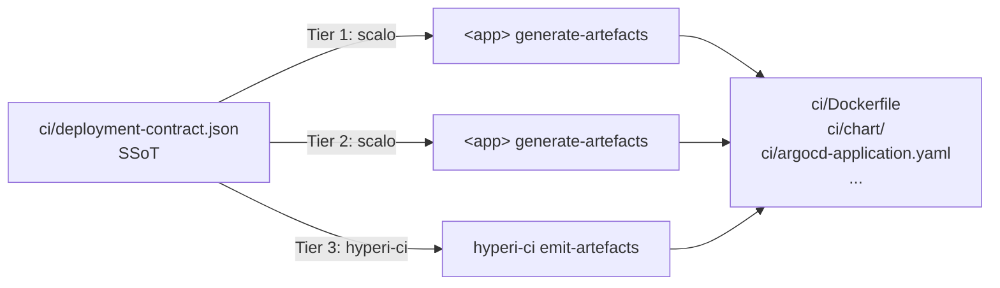

# Deployment Contract

User-facing reference for the three-tier deployment-contract model in
hyperi-ci.

For the cross-tier artefact identity annotation scheme see
[`deployment-contract-identity.md`](contract-identity.md).

## TL;DR

Every HyperI app's deployment artefacts (Dockerfile, Helm chart,
ArgoCD `Application`, container manifest) come from a single
language-agnostic JSON contract - `ci/deployment-contract.json`. CI
regenerates these artefacts from the contract on every push, then
diff-checks against the committed `ci/` to catch drift.



All three tiers must emit **byte-identical** output for the same JSON
contract - verified by the cross-tier parity test suite.

## Picking your tier

| Repo | Tier | Producer |
|---|---|---|
| Rust app using `scalo` | 1 (`rust`) | `<app> generate-artefacts` |
| Python app using `scalo` | 2 (`python`) | `<app> generate-artefacts` |
| Anything else (bash, TS, Go, ad-hoc) | 3 (`other`) | `hyperi-ci emit-artefacts` |
| Library / no container | n/a (`none`) | generate + container stages skip silently |

Most repos are that last row. Nothing here is opt-in work for a repo
that does not ship a container.

`hyperi-ci` auto-detects this - you don't pick by hand. Detection
order, with the first match winning:

1. `Cargo.toml` containing `scalo` (any form: string, table,
   `.workspace = true`, extras) AND the crate builds a binary
   (`[[bin]]`, `src/main.rs`, `src/bin/*.rs`, or a workspace member
   that does) AND the `scalo` dependency enables the `deployment`
   feature -> Tier 1.
2. `pyproject.toml` containing `scalo` (incl. extras like
   `scalo[metrics]`) AND a `[project.scripts]` console script is
   declared -> Tier 2.
3. `ci/deployment-contract.json` exists -> Tier 3.
4. None of the above -> no contract; generate + container stages no-op.

### Depending on scalo does not make you a producer

The extra requirements in steps 1-2 are the point, not a detail. Two
different things have to be true, and a repo can have the first without
the second:

- **It has something to run.** A repo can use scalo as a LIBRARY - for
  logging, config, secrets - without being a scalo ServiceApp. A VPN
  container that builds from its own Dockerfile is the worked example:
  it has the dep, but there is nothing to run `generate-artefacts` on.
- **That thing actually emits a contract.** In scalo-rs the contract
  emission is behind the `deployment` cargo feature. A binary built
  without it still HAS a `generate-artefacts` subcommand, and that
  subcommand still exits 0 - it just writes no `Dockerfile.runtime` and
  no `container-manifest.json`. Detecting the feature is what turns
  that into a clean skip instead of a container-stage failure several
  minutes later complaining about a missing `ci-tmp/`.

Either way the repo falls through to step 3, then step 4 - it skips,
and says why in the Build log:

```
Generate: detected tier 'none' - depends on scalo but declares no
[project.scripts] entry point (library consumer, not a
deployment-artefact producer)

Generate: detected tier 'none' - depends on scalo without the
'deployment' feature, so its generate-artefacts emits no contract
(not a deployment-artefact producer)
```

Note the fall-THROUGH: a scalo library consumer that also commits a
Tier 3 contract is a perfectly good Tier 3 repo, and gets dispatched
as one. What does NOT happen is falling through into the OTHER
language's tier - a Rust repo that fails the check is not then
dispatched to a Python tools subdir's entry point.

Two deliberate asymmetries, both load-bearing:

- **The feature check is Rust-only.** scalo-py's `deployment` extra is
  just a `pydantic` pin, not a code gate - dfe-engine emits contracts
  without declaring it, so testing for it would demote a real producer.
- **Unknown is permissive.** A member crate carrying a bare
  `scalo.workspace = true` inherits its feature list from the workspace
  root; where that cannot be resolved, detection assumes producer and
  lets the run fail loudly. A wrong skip is silent, so it is the worse
  direction to guess in.

### Overriding detection - `deployment.producer`

Auto-detection is a heuristic over two manifest formats, so there is an
override for both directions:

```yaml
deployment:
  producer: auto    # default
```

| Value | Behaviour | Use when |
|---|---|---|
| `auto` | Detection as above. | Default. Leave it alone. |
| `false` | Skip the generate stage (and its drift check) outright. | A library consumer that DOES ship a CLI of its own, so it looks like a producer but hand-maintains its deployment artefacts. |
| `true` | Force: the marker dep alone picks the tier. Fails loudly if no tier resolves at all. | A genuine producer whose shape detection can't see. |

`false` is the one to reach for when CI is generating artefacts you
don't want. `true` is rarely needed - if you find yourself needing it,
the detection rule is probably wrong and worth an issue.

## Tier 3 onboarding

For a repo that doesn't have a producer framework, scaffold a starter
contract:

```bash
hyperi-ci init-contract --app-name my-app
```

Writes `ci/deployment-contract.json` with sensible defaults derived
from the app name:

| Field | Default | Source |
|---|---|---|
| `app_name` | `my-app` | from `--app-name` |
| `binary_name` | `my-app` | from `--app-name` |
| `env_prefix` | `MY_APP` | hyphens -> underscores, uppercased |
| `metric_prefix` | `my_app` | hyphens -> underscores |
| `config_mount_path` | `/etc/my-app/my-app.yaml` | DFE convention |
| `metrics_port` | `9090` | DFE convention |
| `health.liveness_path` | `/healthz` | DFE convention |
| `health.readiness_path` | `/readyz` | DFE convention |
| `health.metrics_path` | `/metrics` | DFE convention |
| `image_registry` | `ghcr.io/hyperi-io` | cascade default |
| `base_image` | `ubuntu:24.04` | cascade default |
| `image_profile` | `production` | scalo default |

App-name validation matches the org repo-naming convention:
lowercase, hyphen-separated, no underscores, 3-50 chars, starts with
a letter. `my_app` and `My-App` are rejected.

`--force` overwrites an existing file. Without `--force`, the command
errors instead of clobbering.

After scaffolding, edit the file to add real values (env-prefix
overrides, secrets groups, KEDA scaling, extra ports, OCI labels) and
commit it.

## Generating artefacts

```bash
hyperi-ci emit-artefacts ci/                              # in-place regen
hyperi-ci emit-artefacts ci-tmp/ --from ci/deployment-contract.json
hyperi-ci emit-artefacts /tmp/drift/ --from ci/deployment-contract.json
```

The output directory is created if missing. Each run produces (relative
to `output_dir`):

- `Dockerfile`
- `Dockerfile.runtime`
- `container-manifest.json`
- `argocd-application.yaml`
- `chart/` (Helm)
- `deployment-contract.schema.json`

> **Status:** the templating engine itself is deferred to Phase 2 of
> the implementation plan, blocked on scalo 2.8.0 shipping
> the `schemars`-derived JSON Schema export and the parity fixture
> suite. Until then, `emit-artefacts` exits with code 5
> (`EXIT_NOT_IMPLEMENTED`) after validating the contract - the
> validation, schema-version gate, and exit-code contract are stable.

## Schema versioning

Every contract has a `schema_version` field (currently `2`). Producers
stamp this on emit; consumers (this CLI, dfe-control-plane, ArgoCD
sync hooks) fail fast if the contract declares a version higher than
the consumer supports.

`MAX_SUPPORTED_SCHEMA_VERSION` is bumped in **lockstep** across:

- `scalo::deployment::contract::default_schema_version()`
- `scalo`'s mirror module
- `hyperi-ci/src/hyperi_ci/deployment/contract.py`
- `hyperi-ci/config/defaults.yaml` under
  `deployment.max_supported_schema_version`

Bumping requires a coordinated release of all three. Add a new schema
version when:

- Adding a required field
- Removing a field
- Renaming a field
- Changing a field's type

You do **not** need to bump for adding an optional field with a default
 - consumers ignore unknown fields gracefully when they're optional.

## Exit codes

`emit-artefacts`:

| Code | Meaning |
|---|---|
| 0 | success |
| 2 | contract file missing |
| 3 | contract invalid (parse error, schema violation, schema_version too new) |
| 4 | (reserved - future explicit schema-too-new differentiation) |
| 5 | generators not yet implemented (Phase 2) |
| 6 | (reserved - I/O write errors once Phase 2 lands) |

`init-contract`:

| Code | Meaning |
|---|---|
| 0 | success |
| 2 | invalid `--app-name` |
| 3 | contract already exists (use `--force` to overwrite) |
| 4 | I/O error writing the file |

`hyperi-ci run generate` (layered on top of the `emit-artefacts` set):

| Code | Meaning |
|---|---|
| 0 | success, or a legitimate skip (not a producer, or `producer: false`) |
| 7 | producer missing - binary not built, entry point unresolvable, or `producer: true` with no tier |
| 8 | producer ran and failed, or the drift check found a difference |
| 9 | tier resolved to something this hyperi-ci can't dispatch |

## Cascade-driven defaults

Org-wide deployment defaults live in the YAML cascade rather than in
each app's contract source - flipping `deployment.image_registry` once
in `org.yaml` updates every app. Available keys:

```yaml
# .hyperi-ci.yaml or config/defaults.yaml
deployment:
  image_registry: ghcr.io/hyperi-io   # default; override e.g. for harbor
  base_image: ubuntu:24.04            # default; override for curated GHCR base
  argocd:
    repo_url: https://github.com/hyperi-io/{app}  # default
  max_supported_schema_version: 2     # mirrored from contract.py
  producer: auto                      # auto | true | false - see "Picking your tier"
```

Resolvers in `hyperi_ci.deployment.registry` (`image_registry_from_cascade`,
`base_image_from_cascade`, `argocd_repo_url_from_cascade`) mirror the
identical functions in `scalo::deployment::registry`. Apps that
delegate to these get the same answer in Rust and Python.

## See also

- [`deployment-contract-identity.md`](contract-identity.md) -
  cross-tier artefact identity annotation scheme
