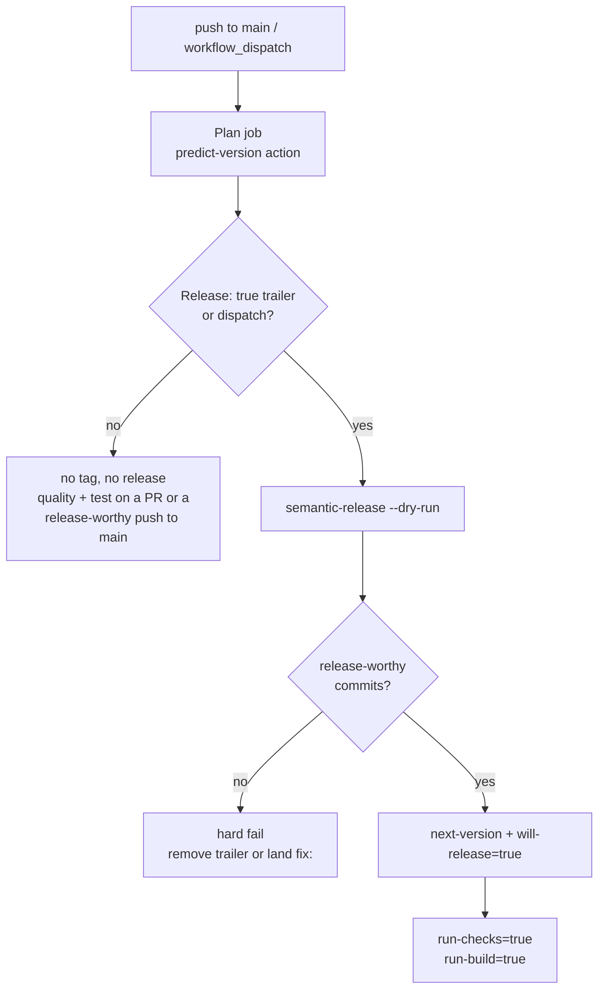
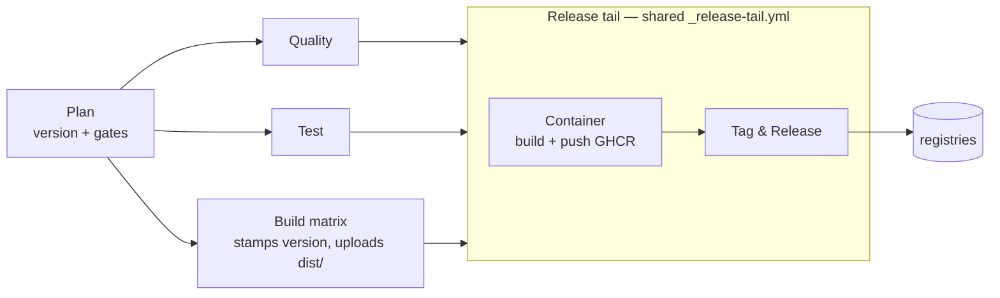
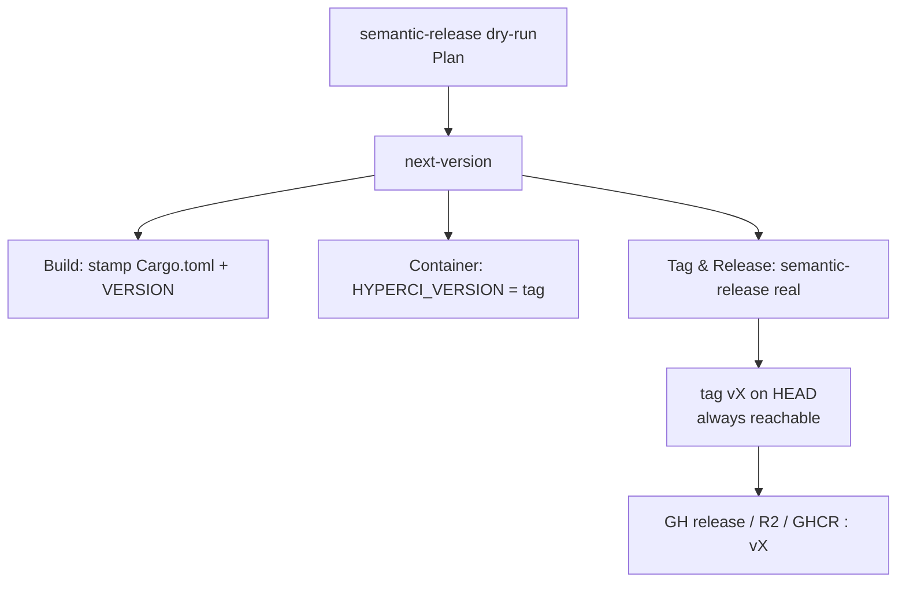
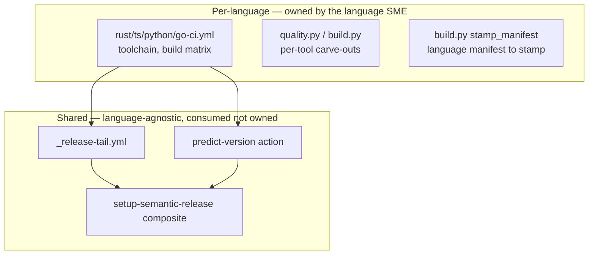
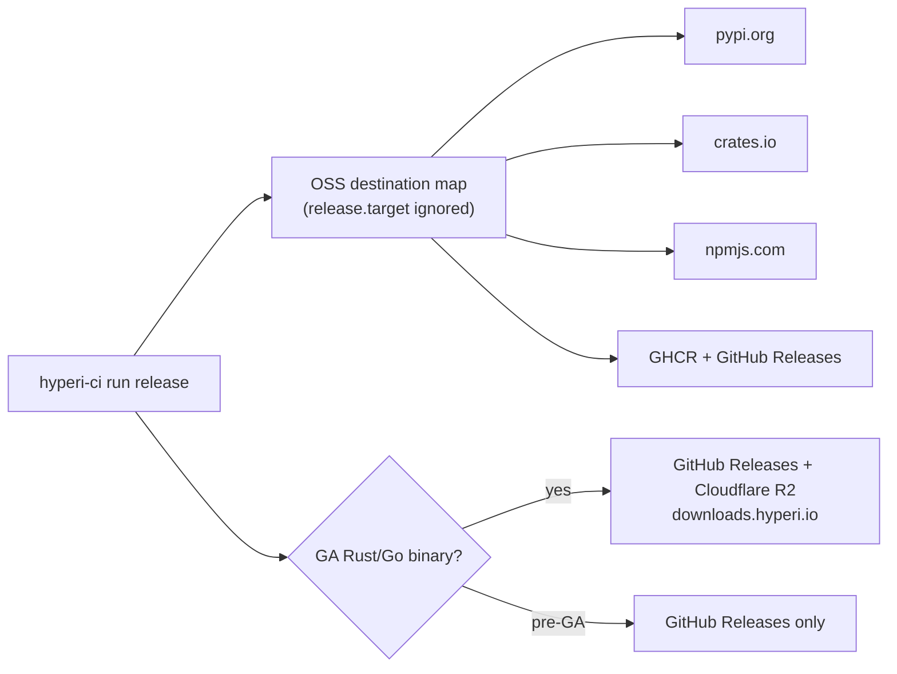
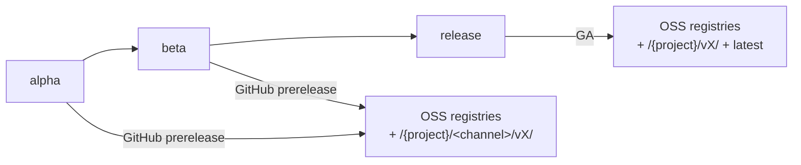
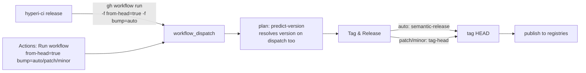

# CI Flow

How a push or dispatch becomes a release. Version-first, single run: one
semantic-release computation drives every stage.

## 1. Trigger and gate

One signal - `will-release` - gates the whole pipeline.



- `will-release` = dispatch, or a `Release: true` trailer on HEAD. The
  `Publish: true` trailer still counts, and warns.
- `next-version` comes from `semantic-release --dry-run` - same config the real
  tag step uses, so they cannot disagree.
- No trailer on a push to main -> no tag, no release. A release-worthy pushed
  range still runs quality + test; a `chore:` / `docs:` push runs neither.
- Arch breadth follows `run-build`, not `will-release`, so a validate-only
  dispatch and a branch-mode PR both build arm64 (issue #249).
- A release-worthy merge to main also builds the **arm64 leg alone**
  (`run-arm64-check`), catching an arm64 regression while it is still
  attributable. Rust only, and a project opts out with
  `build.rust.arm64_on_main: false`. It ships nothing: the release tail is
  gated on `run-build`, so a merge that ships nothing still compiles nothing.

## 2. Pipeline and job dependencies



- Quality / Test / Build run in parallel after Plan.
- The release tail runs when `run-build` is true, which keeps the arm64-parity
  build out of it; inside the tail, Tag & Release is `will-release`-only and
  runs after Container.

## 3. Version - one oracle, used everywhere



- Build stamps the binary, Container tags the image, Tag & Release creates the
  git tag - all the same `next-version`.
- semantic-release tags **HEAD** (not a CI-authored commit), so the tag is
  always reachable and the next run computes the correct next version.
- `@semantic-release/git` is dropped - hyperi-ci stamps the version itself
  (version-first), so there is no commit-back that could rewrite tags (issue #37).

## 4. What is done where - and why



| Layer | Owns | Why here |
|---|---|---|
| Per-language workflow + handlers | toolchains, build matrix, `_run_tool` carve-outs (e.g. cargo-audit transient skip), version stamping target | legitimately differs per language; the SME needs full control |
| `predict-version`, `setup-semantic-release`, `_release-tail` | trigger gate, version oracle, semantic-release toolchain, container + tag + publish orchestration | identical across languages; shared so a fix lands once, not 4x |

Rule: shared pieces must help the SME, never hobble them. Anything needing a
per-language carve-out stays in the SME's domain.

## 5. Release routing

Everything goes to the OSS registry stack. The legacy `release.target`
config field (`internal`/`oss`/`both`) is still read for
back-compat but every value routes to the same OSS destination map. It is not the
`publish-target` workflow input, which is live.



- One artefact type -> one destination; there is no private/internal path.
- `release.channel` controls prerelease vs GA (next section), not destination.
  The key was `publish.channel` and still works, with a warning.

## 6. Release channels

One-branch model. `release.channel` graduates a project by one line in
`.hyperi-ci.yaml`; it sets prerelease-vs-GA and the R2 path. It does **not**
change destination (all channels publish OSS), and it does **not** gate
the Rust build tier - `build.py` never reads it. The tier follows whether the
run releases: [languages/rust.md](languages/rust.md).



| Channel | Release kind | R2 path |
|---|---|---|
| `alpha` | GitHub prerelease | `/{project}/<channel>/vX/` |
| `beta` | GitHub prerelease | `/{project}/<channel>/vX/` |
| `release` | GA | `/{project}/vX/` + `latest` |

- `alpha` and `beta` publish: a GitHub prerelease plus an R2 channel path. That
  is a narrower destination set, not the absence of a release.
- Channel is set by `release.channel` in `.hyperi-ci.yaml`, not by a branch.
  semantic-release runs only on `main` and produces real versions (`1.3.0`, not
  `1.3.0-dev.8`) - there is no `release` branch and no dev pre-release track.
- Rust build-opt is skippable for a single run with the `skip-optimize`
  dispatch input, for when a fast pre-GA image beats an optimised one.
  See [languages/rust.md](languages/rust.md) - *Skipping optimisation for one run*.
- GA vs prerelease follows the channel: `alpha` / `beta` are GitHub
  prereleases, `release` is GA. The arch set does not - the arm64 leg is added
  when `will-release` is true, whatever the channel.

## 7. Binary publish - what's uploaded and how it's named

Binary destinations (GitHub Releases, Cloudflare R2) receive **only
compiled binaries + their SHA-256 checksums** - no README/CHANGELOG/LICENSE.
This matches industry convention (HashiCorp, Rust, Go): docs live in the repo;
semantic-release populates the release description. `_collect_artifacts()` reads
everything from `dist/`, so build handlers place only binaries + checksums there.

A project that needs one more file on the release lists it under
`release.assets`. Those attach to the GitHub Release itself, so they arrive
whatever `release.destinations.binaries` is — the binaries map routes built
artefacts, and a release asset is not one. They are also copied into `dist/`,
so the binary destinations carry them too. Use it for a file something
downstream pins, such as a catalogue reading `sources.yaml` off the release; a
listed file that is missing fails the release rather than shipping a broken pin.

```yaml
release:
  assets:
    - sources.yaml
```

Unified naming across languages - `{name}-{os}-{arch}[.exe]`, **version in the
path, not the filename**:

```
dfe-receiver/vX/dfe-receiver-linux-amd64
dfe-receiver/vX/dfe-receiver-linux-amd64.sha256
dfe-receiver/vX/dfe-receiver-linux-arm64
dfe-receiver/vX/dfe-receiver-linux-arm64.sha256
dfe-receiver/latest/dfe-receiver-linux-amd64
```

Checksums are per-binary (`{binary}.sha256`, issue #22) - an aggregated
`checksums.sha256` would last-write-wins when the multi-arch matrix jobs
upload to the same path. Concatenate the per-arch files if you need a
combined one.

- `os-arch` shorthand (`linux-amd64`) matches Docker/K8s/HashiCorp, not Rust
  target triples - our consumers are ops deploying server-side binaries.
- Version in the path (not the filename) gives stable download URLs and avoids
  the branch-name-leaks-into-filename class of bug.
- Both Rust and Go handlers emit the same format - consumers don't care what
  language built the binary.

## 8. Release / retry on demand (no junk `fix:`)

`hyperi-ci push --release` is the **primary** release path - one CI run, one
tag, one release, gated by the `Release: true` trailer. It assumes you have a
release-worthy commit on HEAD. Two situations break that assumption, and have
historically driven the "edit a single file and fake a `fix:` commit" workaround:

1. **"Jeez I need to retry this"** - a release run died before Tag & Release
   (transient hiccup, container flake, etc.). No tag was cut, so `hyperi-ci
   release vX` can't help (the tag doesn't exist) and `push --bump-patch`
   no-ops because VERSION on `main` already equals the target (#25 + #35).
2. **"Man I needed to release that"** - you want to release HEAD on demand
   (re-release docs/refactor-only work, or release a fresh HEAD without an
   intervening `Release: true` push).

The fix: **`hyperi-ci release` covers both** (#35). The CLI
is a thin trigger; the CI does the tagging and publishing, so it works under
branch protection and from the Actions UI too.



| Command | Action | When |
|---|---|---|
| `hyperi-ci release` | dispatch from-head + bump=auto - the CI resolves the version (semantic-release), tags HEAD, publishes | Finish a stuck release; release HEAD when there are release-worthy commits |
| `hyperi-ci release --bump patch\|minor` | dispatch from-head + forced bump - `tag-head` computes `last + bump`, tags HEAD via `gh api`, publishes | Release HEAD with no release-worthy commit (kills the junk-`fix:` ritual) |
| `hyperi-ci release <tag>` | dispatch existing tag - **idempotent retry** (publish handlers skip artefacts already in their registry; a GH Release no longer hard-blocks) | A partial release where the tag is cut but some registries missed |
| Actions UI -> Run workflow | same three modes via `tag` / `from-head` / `bump` inputs | No local checkout; one-click from the GitHub UI |

**Why the CI does the tagging:** one source of truth (the workflow), the
`GITHUB_TOKEN` cuts the tag (works under branch protection), and the CLI +
UI button are byte-identical operations. The plan job resolves the version
on dispatch too (`predict-version` runs semantic-release for `auto` or
last+bump for forced) so the build stamps the same version Tag & Release
will tag - no artefact-version drift.

> Caveat: `hyperi-ci push --release` (the primary path) still pre-flights via
> the same trailer/gate. `release <tag>` is the escape hatch, not a replacement.
> The old spellings -- `push --publish` and `hyperi-ci publish` -- still work and
> warn.

## 9. Release operating rules

### Do not dispatch a release while a merge is queued into that repo

A merge to `main` cancels the in-flight release run. The concurrency group is
`${{ github.workflow }}-${{ inputs.tag || github.ref }}` with
`cancel-in-progress: true`, so every push to `main` kills whatever the previous
one started -- the release tail included. Land the merges, then dispatch.

The cancelled run leaves no tag and no artefacts, so recovery is another
`hyperi-ci release`. The cost is the build time, which on a Tier 2 Rust
publish is 35-45 minutes per arch.

Issue #228 carries the measurements and the options; this is the operating
rule until one is chosen.

### `push --release` drops the trailer when HEAD is already upstream

`push --release` amends HEAD with the `Release: true` trailer and then
rebases. Where that commit is already on the remote, the rebase reports
`skipped previously applied commit` and takes the upstream copy, which has no
trailer. The push then says `Everything up-to-date` and no release runs.

Nothing is broken and nothing warns, so the tell is `Build: skipped` and
`Release tail: skipped` on a run you expected to publish. Use `hyperi-ci
release` instead, which dispatches from HEAD and needs no trailer commit.
