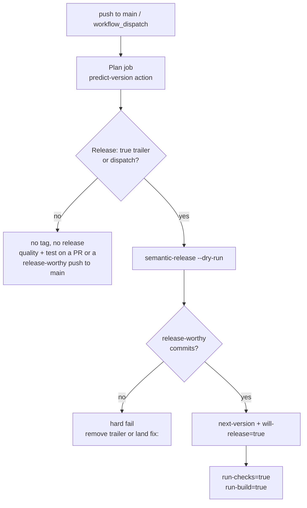
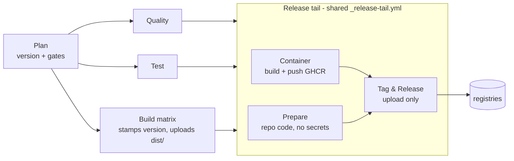
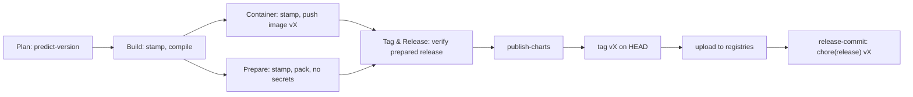
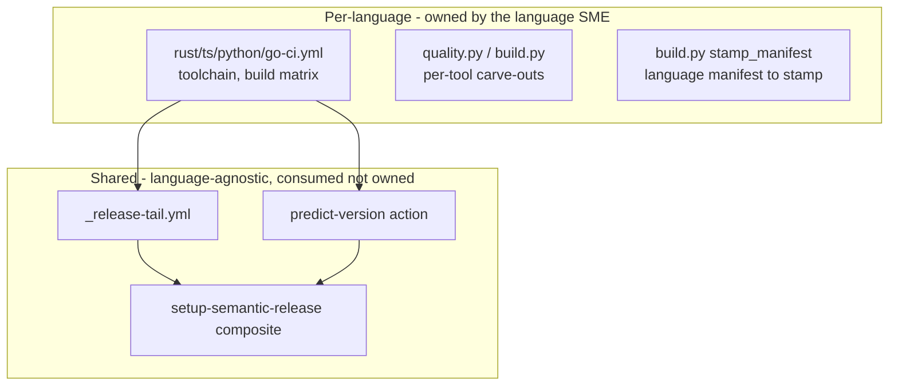
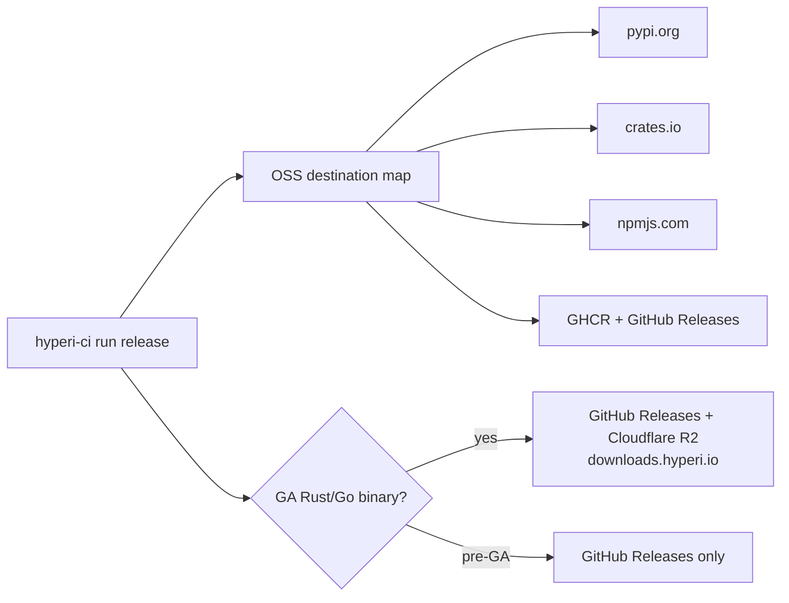
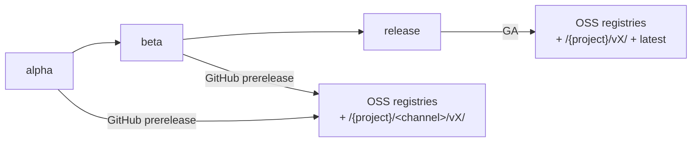

# CI Flow

How a push or dispatch becomes a release. One semantic-release computation, made before anything builds, drives every stage of a single run.

## 1. Trigger and gate

One signal - `will-release` - gates the whole pipeline.


```mermaid
flowchart TD
    A[push to main / workflow_dispatch] --> B[Plan job<br/>predict-version action]
    B --> C{Release: true trailer<br/>or dispatch?}
    C -->|no| V[no tag, no release<br/>quality + test on a PR or a<br/>release-worthy push to main]
    C -->|yes| D[semantic-release --dry-run]
    D --> E{release-worthy<br/>commits?}
    E -->|no| F[hard fail<br/>remove trailer or land fix:]
    E -->|yes| G[next-version + will-release=true]
    G --> H[run-checks=true<br/>run-build=true]
```

- `will-release` = a dispatch, or a `Release: true` trailer on HEAD. The `Publish: true` trailer still counts, and warns.
- `next-version` comes from `semantic-release --dry-run`, with the same config the real tag step uses, so the two cannot disagree.
- A push to main with no trailer cuts no tag. A release-worthy pushed range still runs quality + test, and a `chore:` / `docs:` push runs neither.
- Arch breadth follows `run-build`, not `will-release`, so a validate-only dispatch and a branch-mode PR both build arm64 (issue #249).
- A release-worthy merge to main also builds the **arm64 leg alone** (`run-arm64-check`), so an arm64 regression shows up while it is still attributable. Rust only, and `build.rust.arm64_on_main: false` opts out. The release tail is gated on `run-build`, so this leg ships nothing.

## 2. Pipeline and job dependencies


```mermaid
flowchart LR
    plan[Plan<br/>version + gates] --> quality[Quality]
    plan --> test[Test]
    plan --> build[Build matrix<br/>stamps version, uploads dist/]
    quality --> rt
    test --> rt
    build --> rt
    subgraph rt["Release tail - shared _release-tail.yml"]
      container[Container<br/>build + push GHCR] --> tagpub[Tag & Release<br/>upload only]
      prepare[Prepare<br/>repo code, no secrets] --> tagpub
    end
    tagpub --> reg[(registries)]
```

- Quality, Test and Build run in parallel after Plan.
- The release tail runs when `run-build` is true. Inside it, Prepare and Tag & Release run only when `will-release` is true, and Tag & Release waits for both Container and Prepare.

## 3. Version - one oracle, used everywhere


```mermaid
flowchart LR
    PV["Plan: predict-version"] --> B["Build: stamp, compile"]
    B --> C["Container: stamp, push image vX"]
    B --> P["Prepare: stamp, pack, no secrets"]
    C --> TR["Tag & Release: verify prepared release"]
    P --> TR
    TR --> HC["publish-charts"]
    HC --> TG["tag vX on HEAD"]
    TG --> UP["upload to registries"]
    UP --> RC["release-commit: chore(release) vX"]
```

- Build, Container and Prepare each run `stamp-version` with the same `next-version`, so the binary, the image tag and the git tag always agree.
- semantic-release tags **HEAD**, not a CI-authored commit, so the tag is always reachable and the next run computes the right next version.
- hyperi-ci stamps the version itself, so `@semantic-release/git` is not used. After the upload, `release-commit` adds an untagged `chore(release): vX [skip ci]` commit, so no tag can be rewritten (issue #37). See [versioning-commit-back.md](versioning-commit-back.md).

## 4. What is done where - and why


```mermaid
flowchart TB
    subgraph SME["Per-language - owned by the language SME"]
      W[rust/ts/python/go-ci.yml<br/>toolchain, build matrix]
      Q[quality.py / build.py<br/>per-tool carve-outs]
      RC[build.py stamp_manifest<br/>language manifest to stamp]
    end
    subgraph SHARED["Shared - language-agnostic, consumed not owned"]
      PV[predict-version action]
      SSR[setup-semantic-release composite]
      RT[_release-tail.yml]
    end
    W --> PV
    W --> RT
    RT --> SSR
    PV --> SSR
```

| Layer | Owns | Why here |
|---|---|---|
| Per-language workflow + handlers | toolchains, build matrix, per-call `run_gate_tool` options (e.g. cargo-audit's unreachable-DB retry, gofmt's listing as a finding), version stamping target | differs per language, and the SME needs full control |
| `predict-version`, `setup-semantic-release`, `_release-tail` | trigger gate, version oracle, semantic-release toolchain, container + tag + publish orchestration | identical across languages, so a fix lands once, not 4x |

Rule: shared pieces must help the SME, never hobble them. Anything needing a per-language carve-out stays in the SME's domain.

## 5. Release routing

Everything goes to the OSS registry stack, through one destination map (`CIConfig.publish_destinations()` in `config.py`). The config namespace is `release:`. A `publish:` block still works: it folds into `release:` at load time and each moved key is named in a warning.

The legacy `release.target` field (`internal` / `oss` / `both`) and the `publish-target` workflow input are read by nothing. The field warns until it is deleted. The input stays declared, because GitHub fails a caller that passes an undeclared input.


```mermaid
flowchart LR
    PUB[hyperi-ci run release] --> M["OSS destination map"]
    M --> PY[pypi.org]
    M --> CR[crates.io]
    M --> NPM[npmjs.com]
    M --> GH[GHCR + GitHub Releases]
    PUB --> GA{GA Rust/Go binary?}
    GA -->|yes| R2[GitHub Releases + Cloudflare R2<br/>downloads.hyperi.io]
    GA -->|pre-GA| GHO[GitHub Releases only]
```

| Artefact | Destination |
|---|---|
| Python wheel/sdist | pypi.org |
| Rust crate | crates.io |
| npm package | npmjs.com |
| Container | GHCR (`ghcr.io/hyperi-io`) |
| Binaries (Rust/Go) | GitHub Releases + Cloudflare R2 (`downloads.hyperi.io`) for GA |
| Go module | go-proxy (by tag) |

One artefact type goes to one destination, and there is no private path. `release.channel` sets prerelease vs GA (next section), not destination. Its old name, `publish.channel`, still works with a warning.

### Helm charts

Committed charts go to an OCI registry, off by default:

```yaml
release:
  helm:
    enabled: true
    charts: [deploy/helm/*]                      # dirs or globs from the repo root
    registry: oci://ghcr.io/hyperi-io/charts     # the default; a chart lands at <registry>/<name>
```

`hyperi-ci publish-charts` does the work, in Tag & Release before the tag, so a failed push cuts no tag. Charts are packaged at the release version in a scratch copy, `file://` dependencies included. A committed `appVersion` stays, a chart without one gets `v<version>`. A glob skips library charts, and a library chart named by its exact directory is published.

A version already in the registry is not re-pushed, because that would move its tag to a new digest, and the existing digest is reported instead. Digests go to the job summary and the GitHub Release body. A first push creates a private GHCR package, and making it public is manual.

`--charts` (repeatable), `--registry` and `--version` (verbatim) beat config. `--dry-run` pushes nothing. `--output json` prints `[{chart, version, digest, ref, signed}]`, and `signed` is always `false` because hyperi-ci has no signer:

```bash
hyperi-ci publish-charts --charts helm/charts/a --charts helm/charts/b --version 2.2.0-rc.14 --output json
```

#### Charts assembled from a deployment contract

A scalo app commits no chart. Set `contract` and `hyperi-ci chart assemble` builds a thin one on the scalo-service library chart:

```yaml
release:
  helm:
    enabled: true
    contract: emit          # run <app> generate-artefacts, or the path of a committed contract
    library: 0.1.0          # scalo-service version, pulled from <registry>/scalo-service
```

Any finding against the library's `schema/deployment-contract.v<schema_version>.schema.json` fails the step. The chart is the library's `skeleton/`, `files/contract.json`, a `Chart.yaml` naming the app, release version and image tag, and values built from the `config_schema` nodes marked `x-scalo-dial: big|small`, commented out so app defaults stand. Same inputs, same bytes.

`--image <repo>:<tag>@sha256:<digest>` is required. The chart's path, in a new temp dir or `--output-dir` outside the repo, is the one line on stdout. The release tail does not call it yet.

## 6. Release channels

There is one branch. `release.channel` in `.hyperi-ci.yaml` graduates a project with a one-line change. It sets prerelease vs GA and the R2 path. It does **not** change destination, and it does **not** pick the Rust build tier: `build.py` never reads it, and the tier follows whether the run releases ([languages/rust.md](languages/rust.md)).


```mermaid
flowchart LR
    A[alpha] --> B[beta] --> R[release]
    A & B -->|GitHub prerelease| PRE["OSS registries<br/>+ /{project}/&lt;channel&gt;/vX/"]
    R -->|GA| GA["OSS registries<br/>+ /{project}/vX/ + latest"]
```

| Channel | Release kind | R2 path |
|---|---|---|
| `alpha` | GitHub prerelease | `/{project}/<channel>/vX/` |
| `beta` | GitHub prerelease | `/{project}/<channel>/vX/` |
| `release` | GA | `/{project}/vX/` + `latest` |

- `alpha` and `beta` still publish: a GitHub prerelease plus an R2 channel path.
- semantic-release runs only on `main` and produces real versions (`1.3.0`, not `1.3.0-dev.8`). There is no `release` branch and no dev pre-release track. A declared prerelease branch is covered in [prereleases.md](prereleases.md).
- The `skip-optimize` dispatch input skips the Rust optimisation for one run, when a fast pre-GA image beats an optimised one. See [languages/rust-tier2.md](languages/rust-tier2.md) - *Skipping optimisation for one run*.
- The arch set does not follow the channel: the arm64 leg is added when `will-release` is true, whatever the channel.

## 7. Binary publish - what's uploaded and how it's named

GitHub Releases and Cloudflare R2 receive **only compiled binaries and their SHA-256 checksums**, no README, CHANGELOG or LICENSE. Docs live in the repo, and semantic-release writes the release description. `_collect_artifacts()` in `release/binaries.py` reads everything from `dist/`, so build handlers put only binaries and checksums there.

A project that needs one more file on the release lists it under `release.assets`. Those attach to the GitHub Release whatever `release.destinations.binaries` says, and are copied into `dist/` for the binary destinations too. A listed file that is missing fails the release rather than shipping a broken pin.

```yaml
release:
  assets:
    - sources.yaml
```

Naming is the same in every language: `{name}-{os}-{arch}`, with the **version in the path, not the filename**:

```text
dfe-receiver/vX/dfe-receiver-linux-amd64
dfe-receiver/vX/dfe-receiver-linux-amd64.sha256
dfe-receiver/vX/dfe-receiver-linux-arm64
dfe-receiver/vX/dfe-receiver-linux-arm64.sha256
dfe-receiver/latest/dfe-receiver-linux-amd64
```

- Checksums are per binary (`{binary}.sha256`, issue #22). One `checksums.sha256` would be last-write-wins when the multi-arch matrix jobs upload to the same path. Concatenate the per-arch files for a combined one.
- `os-arch` (`linux-amd64`) matches Docker, Kubernetes and HashiCorp rather than Rust target triples, because the consumers are ops deploying server binaries.
- A version in the path gives stable download URLs and keeps branch names out of filenames.

## 8. Release on demand and operating rules

`hyperi-ci release` releases HEAD, finishes a release that died before its tag, or re-publishes an existing tag, with no junk `fix:` commit. The commands, the dispatch-ref rules and the Actions UI form are in [releasing.md](releasing.md).

Do not dispatch a release while a merge is queued into the repo, and know when `push --release` silently drops its trailer. Both are in [releasing.md](releasing.md#operating-rules).
