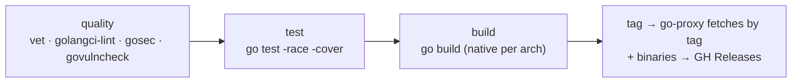

# Go CI guide

The simplest of the four language handlers — Go's toolchain does most of the
work, and there is no registry-publish step beyond the module proxy.

## Stages

| Stage | Tools |
|---|---|
| quality | `gofmt`, `go vet`, `golangci-lint`, `gosec`, `govulncheck` |
| test | `go test -race -cover` |
| build | `go build` (multi-target cross-compile, CGO supported) |
| publish | go module proxy (automatic on tag) + `gh release upload` for binaries |

## Notes

- **No registry push.** The Go module proxy serves modules by git tag — tagging
  a release is the publish. The handler additionally uploads compiled binaries to
  GitHub Releases (and R2 for GA binaries), same as Rust.
- **Cross-compile is native, not `GOOS`/`GOARCH` from one host.** Multi-arch
  builds run on native runners per architecture (see
  [runtime/RUNNERS.md](../runtime/RUNNERS.md)); CGO builds need the native
  toolchain anyway.
- **Binary naming** follows the unified convention shared with Rust:
  `{name}-{os}-{arch}`, version carried in the download path, not the filename.
  See [FLOW.md](../FLOW.md) §5.
