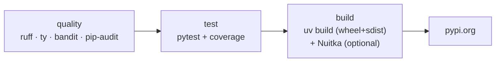

# Python CI guide

uv for everything — venv, sync, lock, tool install, build. The handlers wrap the
standard Python toolchain; the gotchas below are where Python diverges from the
other languages and have each cost a real failure.

## Stages

| Stage | Tools |
|---|---|
| quality | `ruff check`, `ruff format --check`, `ty` (typecheck), `bandit`, `pip-audit` |
| test | `pytest` with coverage |
| build | `uv build` (wheel + sdist); optional Nuitka native binary |
| publish | `uv publish` → pypi.org |

JFrog publishing was removed in v2.1.4 — Python publishes to public PyPI only.
A legacy `publish.target` in `.hyperi-ci.yaml` is read but ignored.

## Gotchas — read before debugging CI

### Publish must go through `hyperi-ci run build`, not raw `uv build`

Hatchling's sdist includes every git-tracked file. AI-agent directories
(`.claude/`, `.cursor/`, …) and org submodules produce "Invalid tar file" errors.
`build.py` injects standard sdist exclusions via a context manager. The publish
step **must** call `hyperi-ci run build`, never raw `uv build`.

### Don't reintroduce a private index (`UV_EXTRA_INDEX_URL`)

uv is first-match-wins across indices: an index that returns an empty `200` for a
package it doesn't host (the old JFrog behaviour) stops resolution dead — "no
versions found". We're OSS-only (a single public index), so this can't bite
today, but it's why the reusable workflows carry an in-code warning against
adding `UV_EXTRA_INDEX_URL` that mixes a private index with the public one.

### hyperi-ci pins hyperi-pylib exactly

hyperi-ci is the CI tool for every repo, so a broken pylib would break CI
everywhere. hyperi-ci pins `hyperi-pylib==<exact>` in its `pyproject.toml`. pylib
is on public PyPI; hyperi-ci's own CI uses `uv sync --no-sources` to resolve from
PyPI rather than a local editable path.

### Eager imports gate extras

pylib eager-imports optional native deps (e.g. psutil) in some paths — a bare
`hyperi-pylib` install can fail at import. Consumers needing those paths declare
the relevant extra (e.g. `hyperi-pylib[metrics]`) until pylib lazy-imports.

## Self-hosting

hyperi-ci is itself a Python project and runs its own pipeline through
`python-ci.yml`. The same handlers that build a consumer's wheel build
hyperi-ci's. Publishing hyperi-ci to PyPI is a `workflow_dispatch` (manual) step
— see [FLOW.md](../FLOW.md).
