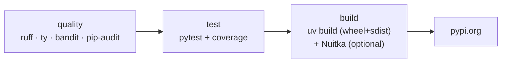

# Python CI guide

uv for everything - venv, sync, lock, tool install, build. The handlers wrap the
standard Python toolchain; the gotchas below are where Python diverges from the
other languages and have each cost a real failure.

## Stages

| Stage | Tools |
|---|---|
| quality | `ruff check`, `ruff format --check`, `ty` (typecheck), `bandit`, `pip-audit` |
| test | `pytest` with coverage |
| build | `uv build` (wheel + sdist); optional Nuitka native binary |
| publish | `uv publish` -> pypi.org |



JFrog publishing was removed in v2.1.4 - Python publishes to public PyPI only.
A legacy `publish.target` in `.hyperi-ci.yaml` is read but ignored.

## Which Python version CI uses

The project's own declaration, resolved once in the `plan` job and used by every
job after it:

| Order | Source | Notes |
|---|---|---|
| 1 | `.python-version` | A pegged file is someone writing the version down |
| 2 | `requires-python` in `pyproject.toml` | The **floor**, not the newest version satisfying it |
| 3 | The `python-version` workflow input | Only reached when the project declares neither |
| 4 | `runtimes.python` in `versions.yaml` | The fleet default |

The floor is the point. A repo declaring `>=3.12` that gets tested on 3.14 is
tested on an interpreter it does not support, and publishes a wheel whose own
advertised floor never ran. uv honours a pegged `.python-version` by itself but
resolves a floor to the NEWEST satisfying interpreter, so hyperi-ci computes the
floor and hands it over (`hyperi_ci.python_version`).

Nothing to set: declare `requires-python` and CI follows it.

**`ruff` needs no configuration either.** Ruff reads `requires-python` and
targets it, so a project that declares its floor gets lint and formatting for
that floor for free. An explicit `target-version` OVERRIDES it - set one only
to hold ruff BELOW the floor deliberately, as this repo does.

**`UV_PYTHON` is set on the dependency-install step only**, never workflow-wide.
It picks the interpreter for the project venv, which every later `uv run`
inherits. Workflow-wide it would also capture `uvx hyperi-ci` and force the CLI
onto the project's interpreter, which fails outright when the CLI's own
`requires-python` floor is higher.

Rust, Go and TypeScript workflows install the fleet default instead. The
interpreter there runs the hyperi-ci CLI; those projects have no Python of their
own to follow.

## Test parallelism

A hardcoded worker count is right on exactly one machine. `test.python.parallel`
opts a project into a count hyperi-ci derives from the host instead:

```yaml
test:
  python:
    parallel: true      # false (default) | true | auto | a worker count
```

`true` takes the smaller of the process affinity mask and the cgroup CPU quota,
capped at 16. The quota is the half that matters in CI: a 4-CPU ARC pod on a
32-core node reports 32 cores to `os.cpu_count()`, and pytest-xdist's own
`-n auto` reads that number, not the limit. On hyperi-ci's own 2598-test suite
this is 23.6s against 74.2s serial.

Off by default. A suite that binds a fixed port or writes a shared file is not
parallel-safe, and a CLI upgrade must not turn one red without a repo saying so.

- **Opt in:** `parallel: true`.
- **Opt back out:** `parallel: false` - the way a project with a parallel-unsafe
  suite records that it stays serial.
- **This run only:** `HYPERCI_TEST_WORKERS=4`, or `0` to force serial.
- **Already parallel:** a project that passes its own `-n` (in
  `test.python.args`, in `addopts` in `pyproject.toml` / `pytest.ini` /
  `tox.ini` / `setup.cfg`, or in `PYTEST_ADDOPTS`) keeps its own number, and so
  does one that sets `-p no:xdist`.

pytest-xdist must be in the project's dev dependencies. hyperi-ci probes the
resolved pytest for it (`pytest -VV`) and runs serial with a warning when it is
absent, so a project without the plugin is unaffected.

Coverage survives the split: pytest-cov collects each worker's data and combines
it before reporting, so `--cov-fail-under` measures the same thing it did
serially. Nothing extra goes in `.coveragerc`.

A single unsafe test does not cost a project the whole feature - mark the tests
that must share a worker with xdist's own `@pytest.mark.xdist_group` and run
`--dist loadgroup`.

## Gotchas - read before debugging CI

### Publish must go through `hyperi-ci run build`, not raw `uv build`

Hatchling's sdist includes every git-tracked file. AI-agent directories
(`.claude/`, `.cursor/`, ...) and org submodules produce "Invalid tar file" errors.
`build.py` injects standard sdist exclusions via a context manager. The publish
step **must** call `hyperi-ci run build`, never raw `uv build`.

### Don't reintroduce a private index (`UV_EXTRA_INDEX_URL`)

uv is first-match-wins across indices: an index that returns an empty `200` for a
package it doesn't host (the old JFrog behaviour) stops resolution dead - "no
versions found". We're OSS-only (a single public index), so this can't bite
today, but it's why the reusable workflows carry an in-code warning against
adding `UV_EXTRA_INDEX_URL` that mixes a private index with the public one.

### hyperi-ci floors scalo

hyperi-ci is the CI tool for every repo, so a broken scalo would break CI
everywhere. hyperi-ci declares `scalo>=<floor>` in its `pyproject.toml` and
commits `uv.lock`, so the lock holds the exact version and the floor only
moves when a new scalo API is adopted. scalo is on public PyPI, and
hyperi-ci's own CI uses `uv sync --no-sources` to resolve from PyPI rather
than a local editable path.

### The `[metrics]` extra is the service default

Since scalo 2.29.15 the `[metrics]` extra carries both prometheus_client and
the OTel SDK, and a service without it reports `backend=prometheus` while
`/metrics` returns 404. Services declare it. hyperi-ci is a CLI and takes
the opt-out: a bare `scalo` imports cleanly on 2.30.0 with no extras.

## Self-hosting

hyperi-ci is itself a Python project and runs its own pipeline through
`python-ci.yml`. The same handlers that build a consumer's wheel build
hyperi-ci's. Publishing hyperi-ci to PyPI is a `workflow_dispatch` (manual) step
 - see [flow.md](../flow.md).
