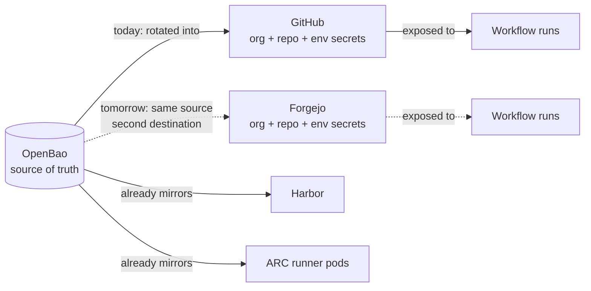
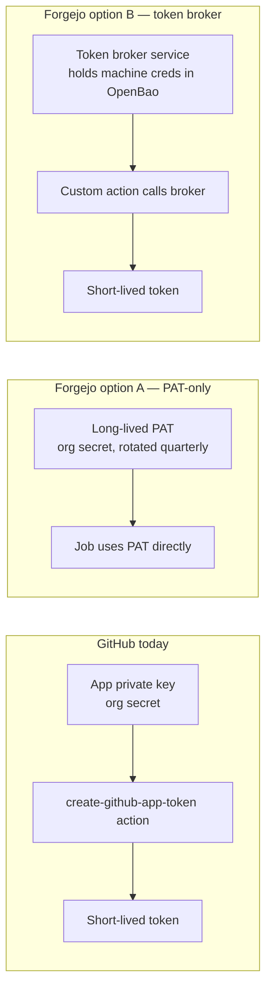
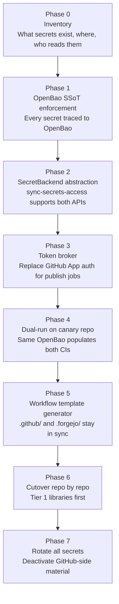

# Codeberg Migration — CI, Secrets, and Variables

> **Status:** companion to the Codeberg + Buildkite portability plan. Same caveat
> applies — this is **NOT happening anytime soon**. This document
> exists to make the secrets/CI rework concrete enough that we'd know
> what we're signing up for if a forcing function appeared.

The headline finding is that **source migration is trivial; everything
else is the cost.** Of "everything else", the secrets and CI surface is
the single largest item, and the one most likely to bite us silently
rather than loudly. This doc is where the detail lives.

The matured CI shifts the balance further in our favour: the
`hyperi-ci` CLI owns all the work, and the GitHub Actions side is now a
thin, well-bounded glue layer — four reusable workflows, one shared
`_release-tail.yml`, and a handful of composite actions. Porting means
rewriting that glue into `.forgejo/`, not the CLI. The harder, now-larger
item is the **reusable-workflow graph itself** (see §5).

## TL;DR

| Question | Answer |
|---|---|
| Are workflow files portable? | Mostly — Forgejo Actions is broadly act-compatible. |
| Are secret references portable? | Syntax yes (`${{ secrets.FOO }}`); semantics no. |
| Can we copy secret values across? | **No.** GitHub's API doesn't return plaintext. Every secret rotates. |
| Does the visibility model carry over? | **Partially.** Forgejo has org/user/repo/environment scopes; "private repos only" has no equivalent. |
| Is GitHub App auth portable? | **No.** PEM private keys don't mean anything on Forgejo. |
| What's the bright spot? | OpenBao is already the source of truth for most material — the destination CI doesn't need to read from the source CI. |

## The shape of the problem



We do **not** have to "copy secrets from GitHub to Codeberg" — we
can't, and we shouldn't. The realistic shape is "OpenBao writes
secrets into both CIs in parallel during dual-run, and into Codeberg
only after cutover."

That changes the problem from *export from GitHub* (impossible in
plaintext) to *re-derive into Forgejo from OpenBao* (which we already
do for ARC and Harbor).

## What we have on GitHub today

A precise inventory is part of the migration cost. Approximate shape:

| Bucket | What lives there | Visibility lever used |
|---|---|---|
| Org secrets (all repos) | R2 keys, JFrog token + username, generic publish creds | "All repositories" |
| Org secrets (private only) | Anything we don't want hyperi-ci (public) seeing | "Private repositories" |
| Org secrets (selected) | Per-product keys (e.g. dfe-* only) | "Selected repositories" |
| Org vars | App IDs, client IDs, public-but-config values | Same three-tier visibility |
| Repo secrets | Project-scoped tokens (PyPI per-project, etc.) | Implicitly per-repo |
| Environment secrets | Production deploy keys, staging creds | Bound to environment + branch protection |
| GitHub App secrets | `CONTAINER_MGT_APP_PRIVATE_KEY` (PEM) | Org-level, App-installed repos only |

The "private only" and "selected" levers are real load-bearing
controls. **They are why hyperi-ci can be a public repo without
leaking publish credentials to PRs from forks.**

## What Forgejo gives us

Forgejo's secret/variable model has four scopes:

| Scope | GitHub equivalent | Notes |
|---|---|---|
| Repo | Repo secret/var | Same |
| Org | Org secret/var | **No "private only" or "selected" sub-tier** at the org level |
| User | (none) | Useful for personal automation, not for our case |
| Environment | Environment secret | Similar; binds to branch policy |

Forgejo aliases `secrets.GITHUB_TOKEN` to its own job token for action
compatibility, so most third-party actions that expect that name keep
working without code changes. This compatibility shim is real but
shallow — anything that introspects token *format* (`ghp_…`,
`ghs_…`) breaks.

Visibility evolution: Forgejo has been adding org-level access
controls in releases over time. Treat the "no selected-repos at org
level" claim as accurate today, but worth re-checking at migration
planning time.

## Side-by-side feature mapping

| GitHub feature | Forgejo answer | Migration cost |
|---|---|---|
| `${{ secrets.FOO }}` reference syntax | Identical | None |
| `${{ vars.FOO }}` reference syntax | Identical | None |
| `secrets.GITHUB_TOKEN` | Aliased to `GITEA_TOKEN`/job token | Low — works for most actions |
| `secrets: inherit` in reusable workflows | Supported | Low — verify with parity tests |
| Org secret "All repos" | Native | None (semantic) |
| Org secret "Private repos only" | **Not native** | **High** — re-architect or move to repo |
| Org secret "Selected repos" | Possible via repo-level placement; thinner native | Medium — list-driven sync |
| Environment secrets | Native | Low |
| `gh secret set --org` | API-only; no first-class CLI parity | Medium — script port |
| Secret rotation API | Present (Forgejo API) | Low |
| Audit log of secret access | Limited | **High** for compliance work |
| GitHub App private key | No equivalent | **Hard gap** — replace with PAT or OAuth |
| `actions/create-github-app-token` | No direct equivalent | Replace with token-issuing service |
| Token format checks (`ghp_…`) | Forgejo tokens differ | Audit consumers |
| Secret masking in logs | Native | None |
| Dependabot secrets | No equivalent (Renovate-shaped flow) | Medium |

## Hard problems, in detail

### 1. The "private repos only" boundary

This is the single highest-stakes item. We rely on the GitHub-side
boundary so that hyperi-ci (public) cannot see, e.g., `JFROG_TOKEN`
when a workflow runs on a fork PR.

Forgejo doesn't have this lever at the org tier. The alternatives:

- **Move every "private only" org secret down to repo-level** on the
  repos that genuinely need it. Means more keys to rotate but the
  blast radius is correctly scoped. Driven from `secrets-access.yaml`
  the same way we already drive selective access.
- **Per-key tokens with downstream-enforced scope** — issue
  per-project JFrog tokens limited to the repo's namespace. Means a
  leak to a fork PR can only affect that project's namespace. Already
  good practice; not yet uniformly applied.
- **Run publish jobs only on protected branches/tags** with environment
  protection rules — Forgejo has environments. Job-level guard so
  even if a fork PR could see a secret reference, the job never
  executes with the secret attached.

The realistic answer is **all three together**, not just one.

### 2. GitHub Apps replacement

`hyperi-container-mgt` (App ID 3230495) issues short-lived tokens via
`actions/create-github-app-token`. Two replacement shapes:



Option A is fast and cheap. Option B preserves the short-lived-token
discipline GitHub Apps gave us. **Option B is the right answer for
anything that touches publish/registry credentials**; Option A is fine
for read-only metadata access.

The token broker doesn't have to be platform-specific — same broker
works for GitHub-hosted runs too, if we wanted to reduce App
dependency *while staying on GitHub*. This is a "good either way"
investment.

### 3. Token format coupling

Anything that detects `ghp_`, `ghs_`, `gho_` prefixes breaks. Most of
this is in third-party actions; some is in our own scripts (e.g.
`gh auth status` parsing). Audit before migration:

```bash
rg -n 'gh[psoru]_' src/ scripts/ .github/
rg -n 'GITHUB_TOKEN' src/ scripts/ .github/
rg -n 'starts.with..gh' src/ scripts/
```

Any hit is a candidate for abstraction (use a transport layer that
hands back an opaque token, not a string with a known prefix).

### 4. `gh secret set --org` and `secrets-access.yaml` sync

`scripts/sync-secrets-access.py` is the source-of-truth driver for
which secret reaches which repo. It currently shells to `gh`. To
support both backends:

- Extract a `SecretBackend` interface (list, set, delete, set-access)
- GitHub implementation = current `gh` calls
- Forgejo implementation = REST against `/api/v1/orgs/{org}/actions/secrets`
- Driver script picks backend by config, runs same YAML against either

Same shape works for org variables. This is a few hundred lines of
honest Python; not novel.

### 5. `secrets: inherit` in reusable workflows

Forgejo Actions supports `secrets: inherit`. The compatibility risk is
elsewhere: we use `uses: hyperi-io/hyperi-ci/.github/workflows/...`
across consumer repos. On Forgejo, that becomes
`uses: hyperi-io/hyperi-ci/.forgejo/workflows/...` and the resolution
cache works differently — the reusable workflow has to be on the
*same* Forgejo instance, not cross-instance, unless mirroring is set
up.

The surface to port is the **whole reusable-workflow graph**, not just
the four language workflows: the shared `_release-tail.yml` and the
composite actions under `.github/actions/` are all referenced `@main`
by deliberate design (see [WORKFLOW-PINNING.md](../dependencies/WORKFLOW-PINNING.md)).
Forgejo's cross-instance `@main` resolution amplifies exactly the
issue-#31 failure mode — a floating sibling that breaks pinned callers
— so the interface backward-compat gate (`check-workflow-interfaces.py`)
must run on the destination CI too. It is host-agnostic Python, so it
ports unchanged.

This is the single line that makes a clean cutover impossible: the
moment one consumer repo points at the Codeberg-hosted reusable
workflow, every other consumer repo on GitHub still pointing at the
GitHub copy is at risk of drift unless we keep both in sync.

The mitigation is mechanical: during dual-run, hyperi-ci's `.github/`
and `.forgejo/` directories are generated from a single template by
`hyperi-ci init`, with a CI check that they don't drift.

## The OpenBao realisation

The most important thing in this whole document:

> **We don't migrate secrets. We rotate them — and we already have a
> source of truth that knows the new values.**

For each category:

| Secret | Source of truth | Migration step |
|---|---|---|
| JFROG_TOKEN | `jf atc` → OpenBao `kv/services/jfrog` | Issue new token, write to Forgejo, deactivate old |
| R2 keys | Cloudflare dashboard → OpenBao `kv/services/cloudflare-r2` | Re-provision into Forgejo from OpenBao |
| PyPI tokens | pypi.org per-token | Issue new project-scoped token, set in Forgejo |
| crates.io tokens | crates.io per-token | Same |
| GitHub App private key | (only meaningful on GitHub) | Replaced by token broker — see option B |
| Container registry creds | Harbor robot accounts → OpenBao | Re-issue robot, set in Forgejo |
| semantic-release tokens | per-project | Re-issue per project |

The flow is the same one we use today to populate ARC runner pods and
Harbor — write a thin OpenBao→Forgejo populator alongside the existing
OpenBao→GitHub populator (if we have one, or alongside whatever we
use today, e.g. manual `gh secret set` invocations).

## What we'd need to build

Independently of any actual migration, the following are
**decoupling investments** that are good either way:

| Build item | Useful on GitHub? | Useful on Forgejo? |
|---|---|---|
| `SecretBackend` interface in `scripts/sync-secrets-access.py` | Yes (clarity) | Yes (required) |
| OpenBao→CI populator script (one-shot, idempotent) | Yes (replace ad-hoc `gh secret set`) | Yes (only path) |
| Token broker service (issues short-lived creds from OpenBao) | Yes (reduce App dependency) | Yes (only path) |
| `.github/` ↔ `.forgejo/` generator in `hyperi-ci init` (workflows + composite actions) | No until cutover | Required for dual-run |
| Inventory script (list every secret + var across the org) | Yes (we don't have this) | Yes (input to migration) |

The first three are worth doing **regardless of whether Codeberg ever
happens.**

## Phased plan focused on secrets and CI



Phases 0-3 are useful even if we never migrate — they reduce coupling
and improve security posture. **Those should be done.**

Phases 4-7 are only worth starting under a forcing function.

## What to do now

| Action | Why | Where |
|---|---|---|
| Inventory all org + repo secrets/vars | We don't have a clean list. Every migration plan starts here. | New script in `scripts/`, output to OpenBao for reference |
| Trace every secret to OpenBao | Anything that isn't traceable is a future migration tax | OpenBao `kv/services/` namespace |
| Refactor `sync-secrets-access.py` behind a `SecretBackend` interface | One-time lift, makes future dual-run cheap | `scripts/sync-secrets-access.py` |
| Stop introducing new GitHub App dependencies | Every new App is migration debt | `.hyperi-ci.yaml` review, RFC discipline |
| Audit code for hard-coded `gh*_` token format checks | Cheap to find now, expensive to find under time pressure | `rg` patterns above |
| Confirm `secrets-access.yaml` is the only place secret access is declared | If there are other ad-hoc grants, fold them in | `config/secrets-access.yaml` |

## What we should NOT do

- **Do not start writing `.forgejo/workflows/*.yml` speculatively.**
  They will rot. The reusable workflow surface is too large to
  maintain in parallel without a forcing function.
- **Do not stand up a Codeberg mirror "just in case".** It creates
  contributor confusion and another rotation surface for secrets if
  we end up populating it.
- **Do not migrate any secret to Forgejo before phase 4.** The
  populator path has to exist first.

## See also

- [Tier 3 deployment contract](../deployment/TIERS.md) —
  contract layer is host-agnostic
- [`config/secrets-access.yaml`](../../config/secrets-access.yaml) —
  current source of truth for repo↔secret mapping
- [`scripts/sync-secrets-access.py`](../../scripts/sync-secrets-access.py) —
  current driver, target of the `SecretBackend` refactor
- [Forgejo Actions secrets docs](https://forgejo.org/docs/latest/user/actions/#secrets)
