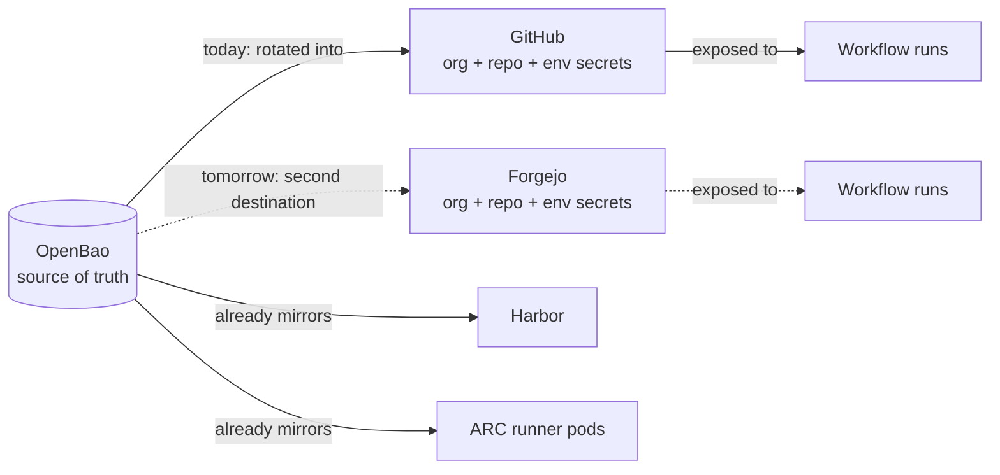
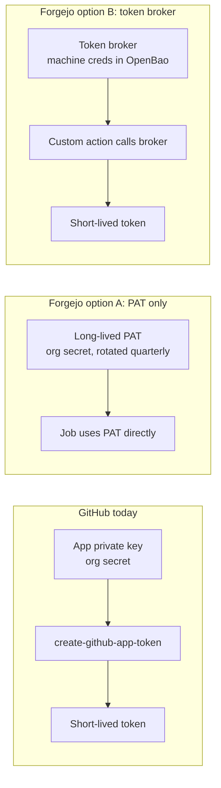
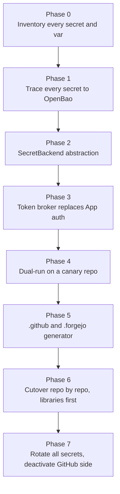

# Codeberg Migration - CI, Secrets, and Variables

> **Status:** companion to [codeberg.md](codeberg.md), and like it, NOT happening anytime soon. This makes the secrets and CI rework concrete enough to cost if a forcing function appears.

Moving the source is trivial. Secrets and CI are the largest part of the rest, and the part most likely to fail silently.

`hyperi-ci` the CLI does the work, and the Actions side is glue around it. That glue is four language workflows, `_release-tail.yml`, `_ghcr-prune.yml` and seven composite actions under `.github/actions/`. Porting rewrites the glue into `.forgejo/`, not the CLI. The harder item is the reusable-workflow graph itself.

## TL;DR

| Question | Answer |
|---|---|
| Are workflow files portable? | Mostly - Forgejo Actions is broadly act-compatible. |
| Are secret references portable? | Syntax yes (`${{ secrets.FOO }}`), semantics no. |
| Can we copy secret values across? | **No.** GitHub's API never returns plaintext, so every secret rotates. |
| Does the visibility model carry over? | **Partially.** Forgejo has org, user, repo and environment scopes, with no "private repos only". |
| Is GitHub App auth portable? | **No.** An App private key means nothing on Forgejo. |
| What's the bright spot? | OpenBao already holds most of the material, so the new CI never reads from the old one. |

## We rotate, we don't migrate



We can't copy secrets from GitHub. OpenBao writes them into both CIs during dual-run, and into Codeberg alone after cutover, the same job it already does for ARC and Harbor.

| Secret | Source of truth | Migration step |
|---|---|---|
| R2 keys | Cloudflare -> OpenBao `kv/services/cloudflare-r2` | Re-provision into Forgejo from OpenBao |
| PyPI tokens | pypi.org, per token | Issue a new project-scoped token, set in Forgejo |
| crates.io tokens | crates.io, per token | Same |
| Release bot App key | Only meaningful on GitHub | Replaced by a token broker (problem 2) |
| Container registry creds | Harbor robot accounts -> OpenBao | Re-issue the robot, set in Forgejo |

## Secrets on GitHub, and what Forgejo offers

A precise inventory is part of the migration cost. Approximate shape today:

| Bucket | What lives there | Visibility lever |
|---|---|---|
| Org secrets (all repos) | R2 keys, generic publish creds | "All repositories" |
| Org secrets (private only) | Anything hyperi-ci (public) must not see | "Private repositories" |
| Org secrets (selected) | Per-product keys (e.g. dfe-* only), the release bot App key `GH_APP_PRIVATE_KEY` | "Selected repositories" |
| Org vars | App client IDs (`GH_APP_CLIENT_ID`), public config values | Same three tiers |
| Repo secrets | Project-scoped tokens (PyPI per project, etc.) | Per repo |
| Environment secrets | Deploy keys, staging creds | Environment + branch protection |

The "private only" and "selected" levers are what let hyperi-ci be a public repo without leaking publish credentials to fork PRs.

| GitHub feature | Forgejo answer | Migration cost |
|---|---|---|
| `${{ secrets.FOO }}` / `${{ vars.FOO }}` | Identical | None |
| `secrets.GITHUB_TOKEN` | Aliased to the job token. Format checks (`ghp_...`) break | Low |
| `secrets: inherit` in reusable workflows | Supported | Low - verify with parity tests |
| Org secret "All repos" | Native | None |
| Org secret "Private repos only" | **Not native** | **High** - re-architect or move to repo |
| Org secret "Selected repos" | Repo-level placement | Medium - list-driven sync |
| Environment secrets | Native, bound to branch policy | Low |
| User-scope secrets | Native, no GitHub equivalent | Not needed |
| `gh secret set --org` | API only, no CLI parity | Medium - script port |
| Secret rotation API | Forgejo API | Low |
| Audit log of secret access | Limited | **High** for compliance work |
| GitHub App + `create-github-app-token` | No equivalent | **Hard gap** - PAT or token broker |
| Secret masking in logs | Native | None |
| Dependabot secrets | No equivalent (Renovate instead) | Medium |

Forgejo keeps adding org-level access controls. Re-check the missing "selected repos" tier at planning time.

## Hard problems

### 1. The "private repos only" boundary

The highest-stakes item. This boundary stops hyperi-ci (public) seeing `R2_SECRET_ACCESS_KEY` on a fork PR, and Forgejo has no org-tier equivalent. We need all three of these:

- **Move each "private only" org secret down to the repos that need it**, driven from `secrets-access.yaml`. More keys to rotate, but a leak reaches only those repos.
- **Per-project tokens scoped by the registry**, so a leak reaches one project's namespace. Not yet applied everywhere.
- **Publish jobs only on protected branches and tags**, behind Forgejo environment rules, so a fork PR job never runs with the secret attached.

### 2. GitHub App replacement

The release tail mints a short-lived release-bot token with `actions/create-github-app-token`. It pushes tags and the release commit past branch rulesets, and its pushes trigger workflows. `gate-audit.yml`, `fleet-sweep.yml` and `versions-audit.yml` use the same App.



Option A is fine for read-only metadata access. Option B keeps short-lived tokens, which publish and registry credentials need. A broker works for GitHub runs too, so it cuts App dependency even if we never move.

### 3. Token format coupling

Anything that detects the `ghp_`, `ghs_` or `gho_` prefixes breaks, mostly in third-party actions. Audit before migrating, and route each hit through a transport layer that hands back an opaque token:

```bash
rg -n 'gh[psoru]_' src/ scripts/ .github/
rg -n 'GITHUB_TOKEN' src/ scripts/ .github/
rg -n 'starts.with..gh' src/ scripts/
```

### 4. `secrets-access.yaml` sync

`scripts/sync-secrets-access.py` <!-- doc-paths: ignore --> decides which secret reaches which repo, and shells to `gh`. Give it a `SecretBackend` interface (list, set, delete, set-access), with a `gh` implementation and a REST one against `/api/v1/orgs/{org}/actions/secrets`. The driver picks one from config and runs the same YAML against either. Org variables take the same shape.

## The reusable-workflow graph

Every language workflow calls `_release-tail.yml` with `secrets: inherit`, which Forgejo supports. The risk is the `uses:` paths. `hyperi-io/hyperi-ci/.github/workflows/...` becomes `.forgejo/workflows/...`, and the called workflow must live on the same Forgejo instance unless mirroring is set up.

The language workflows, `_release-tail.yml` and the composites are all referenced `@main` by design: [workflow-pinning.md](../dependencies/workflow-pinning.md). A floating sibling breaking pinned callers is issue #31, and cross-instance `@main` resolution makes it worse. So `scripts/check-workflow-interfaces.py` must run on the destination CI too. It is host-agnostic Python and ports unchanged.

This rules out a clean cutover. Once one consumer points at the Codeberg copy, every consumer on the GitHub copy can drift. During dual-run, `hyperi-ci init` would generate `.github/` and `.forgejo/` from one template, with a CI check that they match.

## The plan



Phases 0-3 pay off even if we never migrate: less coupling, fewer long-lived credentials. **Do those now:**

| Action | Why |
|---|---|
| Inventory script listing every org and repo secret and var | No clean list exists, and every migration plan starts there |
| Trace every secret to OpenBao `kv/services/` | Anything untraceable is a future migration cost |
| `SecretBackend` refactor of `sync-secrets-access.py` | One-time lift that makes dual-run cheap |
| Idempotent OpenBao -> CI populator | Replaces ad-hoc `gh secret set` on GitHub, the only path on Forgejo |
| Token broker issuing short-lived creds from OpenBao | Less App dependency here, the only path there |
| No new GitHub App dependencies | Each new App is migration debt |
| Audit for hard-coded `gh*_` token checks | Cheap now, expensive under time pressure |
| Confirm `secrets-access.yaml` is the only place access is declared | Fold any ad-hoc grants into it |

Phases 4-7 wait for a forcing function. Until then:

- **Do not write `.forgejo/workflows/*.yml` speculatively.** The surface is too large to keep in parallel, and the copies rot.
- **Do not stand up a Codeberg mirror "just in case".** It confuses contributors and adds a secrets rotation target.
- **Do not migrate any secret to Forgejo before phase 4.** The populator has to exist first.

## See also

- [codeberg.md](codeberg.md) - the parent assessment
- `config/secrets-access.yaml` <!-- doc-paths: ignore --> in the private **hyperi-infra** repo - the repo <-> secret mapping, kept out of this public repo so the topology is not world-readable
- `scripts/sync-secrets-access.py` <!-- doc-paths: ignore --> in **hyperi-infra** - the driver, and the target of the `SecretBackend` refactor
- Forgejo Actions secrets docs: <https://forgejo.org/docs/latest/user/actions/#secrets>
