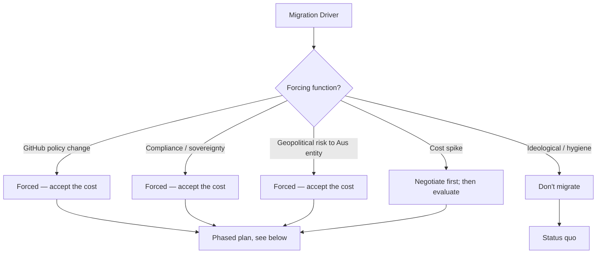
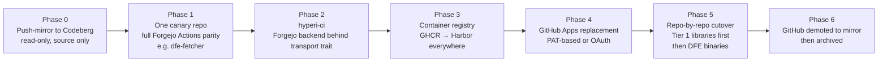

# Migrating off GitHub to Codeberg — Feasibility

> **Status:** **NOT happening anytime soon.** This document exists to
> capture the scope, blockers, and rough sequencing so that if the
> conversation comes up again — policy change at GitHub, sovereignty
> mandate, cost shock — we have a sober starting point instead of a
> Slack thread.

Codeberg ([codeberg.org](https://codeberg.org)) is a non-profit Forgejo
host based in Germany. Forgejo is the soft-fork of Gitea that drives
it. The platform is genuinely good — but the gap between "Codeberg can
host the git repos" and "Codeberg can replace the GitHub-shaped hole
in HyperI's toolchain" is large, and most of the cost lives on our
side, not theirs.

## TL;DR

| Question | Answer |
|---|---|
| Can Codeberg host the source? | Yes, trivially. |
| Can it replace the rest of the GitHub surface area? | Partially, with significant rework. |
| Effort to migrate hyperi-ci + DFE fleet? | Multi-quarter, multi-engineer. |
| Hard blockers today? | GitHub Apps, GHCR-equivalent at scale, semantic-release plugin maturity, fleet-wide `gh` CLI usage. |
| Soft blockers? | Runner capacity, ecosystem inertia, contributor discoverability. |
| Recommended posture? | Passive monitoring. Re-evaluate if a forcing function appears. |

## What we actually use GitHub for

Source code is the smallest part of the dependency. Everything below is
in scope for a real migration:

```mermaid
graph LR
    Source[Source Repos] --> GH[GitHub]
    Actions[Reusable Workflows<br/>rust-ci.yml, python-ci.yml, ...] --> GH
    ARC[ARC Runners<br/>self-hosted in K8s] --> GH
    Apps[GitHub Apps<br/>hyperi-container-mgt] --> GH
    GHCR[GHCR Image Registry<br/>ghcr.io/hyperi-io/*] --> GH
    Releases[Releases API<br/>tag → prerelease → assets] --> GH
    OrgSec[Org Secrets + Visibility Rules] --> GH
    GhCli[gh CLI<br/>used pervasively in hyperi-ci] --> GH
    Sem[semantic-release<br/>@semantic-release/github plugin] --> GH
    Issues[Issues + PRs + Branch Protection] --> GH
    Audit[Audit log + SSO + SAML] --> GH
```

Migration cost = **the sum of replacing every one of those edges**, not
just `git remote set-url`.

## Codeberg parity — what's actually there

| Capability | GitHub | Codeberg | Parity |
|---|---|---|---|
| Git hosting (HTTPS + SSH) | Yes | Yes | Full |
| PRs, issues, code review | Yes | Yes (Forgejo) | Close enough |
| Branch protection | Yes | Yes | Subset of rules |
| Reusable workflows | Yes (`uses:`) | Yes (Forgejo Actions) | Mostly compatible |
| Marketplace actions | Yes, vast | Mostly works via `actions/*` mirroring | Partial — third-party actions hit-and-miss |
| Self-hosted runners | ARC (K8s) | Forgejo Runner | Different controller; we'd port |
| Bring-your-own runner pool | Yes | Yes | Workable |
| **GitHub Apps** | Yes (hyperi-container-mgt etc.) | **No equivalent** | **Hard gap** |
| OAuth applications | Yes | Yes | Workable for some flows |
| **Container registry** | GHCR | **Disabled on codeberg.org** for storage reasons | **Hard gap unless self-host** |
| Package registries (PyPI, npm, Cargo) | Limited / via Releases | Forgejo supports, but **disabled on codeberg.org** | Hard gap |
| **Releases API** | Mature | Forgejo Releases (Gitea-shape) | Partial — schema differs |
| Org secrets + visibility | Yes (per-repo, public/private/selected) | Yes (Forgejo orgs) | Partial — visibility model thinner |
| `gh` CLI | Yes | `tea` or `forgejo` CLI | Different CLI; migration touches every script |
| `semantic-release` plugin | `@semantic-release/github` | `@semantic-release/gitea` | Maintained but smaller blast-radius testing |
| SSO / SAML | Yes (Enterprise) | **No** | Hard gap for compliance work |
| Audit log | Yes (Enterprise) | Limited | Hard gap for compliance work |
| Dependabot | Yes | Renovate via Forgejo App, no first-party Dependabot | Workable but rework |
| CodeQL | Yes | None | We'd lose this capability |
| Discoverability for contributors | Highest in industry | Niche | Soft cost, real |

## What this would force us to rebuild

### CI surface

`.github/workflows/*` → `.forgejo/workflows/*`. Forgejo Actions is
broadly act-compatible, but every reusable workflow needs a parity
pass:

- `rust-ci.yml`, `python-ci.yml`, `typescript-ci.yml`, `go-ci.yml` —
  reusable workflow `uses:` syntax differs in resolution.
- Any action calling `github.event.*`, `${{ github.token }}`, or the
  GitHub-only API surface needs an audit.
- ARC → Forgejo Runner: we already self-host runners on K8s, so the
  controller swap is mechanical, but the auto-scaling story (KEDA on
  workflow queue depth) needs re-derivation against Forgejo's API.

### `hyperi-ci` itself

The CLI is shot through with `gh` invocations:

| Command | What it shells out to |
|---|---|
| `hyperi-ci push --release` | `gh workflow run`, `gh run watch` |
| `hyperi-ci watch` | `gh run list`, `gh run view` |
| `hyperi-ci logs` | `gh run download`, `gh run view --log-failed` |
| `hyperi-ci trigger` | `gh workflow run` |
| `hyperi-ci release <tag>` | `gh release create`, `gh release upload` |
| Container/Helm/binary publish handlers | `gh release upload`, asset URLs |

Replacing `gh` means either:

1. **Add a Codeberg backend** — abstract `gh` behind a transport
   trait/interface and add a Forgejo implementation. Cleaner long-term,
   significant up-front cost. Likely 4-8 weeks of focused work plus a
   parity test suite.
2. **Drop into REST directly** — write a thin Forgejo client. Faster
   but accumulates `if codeberg: ... else: ...` everywhere.

Option 1 is the only honest path. It also makes hyperi-ci portable to
self-hosted Forgejo (Codeberg-the-instance ≠ Forgejo-the-software),
which is a separate strategic option.

### GitHub Apps replacement

`hyperi-container-mgt` (App ID 3230495) is the auth path for GHCR
pushes from CI. Codeberg has no GitHub-Apps-shaped construct. Options:

- **Personal Access Tokens at org level** — short-lived, rotated,
  injected as secrets. Workable but weaker than App-scoped permissions
  on lifetime, audit, and revocation.
- **Forgejo OAuth applications** — exist but the granular permission
  model is thinner than GitHub Apps. Better for human flows than CI.
- **Side-step entirely** — push containers to Harbor (already ours),
  not to Codeberg's package registry. This is the realistic answer
  because Codeberg doesn't enable the Forgejo Package Registry on
  their instance regardless.

### Container registry

`ghcr.io/hyperi-io/*` has no Codeberg equivalent. We already operate
Harbor at `harbor.devex.hyperi.io:8443` for ARC runner images — moving
all OCI traffic to Harbor is the obvious answer, and is independent of
the source-host migration. **This one we should probably do anyway**,
since GHCR coupling is gratuitous.

### Releases + binary distribution

Two sub-cases:

- **Source releases (PyPI, crates.io, public registries):** unaffected.
  These never touched GitHub.
- **Binary releases (`downloads.hyperi.io` via R2):** unaffected. R2
  pipeline is independent of GitHub Releases.
- **GitHub Releases as a binary mirror:** would move to Forgejo
  Releases. Schema differs — the `dfe-receiver`/`loader`/`archiver`
  publish handlers would need a Forgejo path. Rework, not a blocker.

### semantic-release

`@semantic-release/gitea` exists, is maintained, and works against
Forgejo. Lower battle-testing than `@semantic-release/github` but the
risk is acceptable. Our `.releaserc.yaml` files already deliberately
avoid `@semantic-release/github` (release creation is done by hyperi-ci
post-tag), which means the migration here is smaller than it looks.

## Cost-benefit



The **only** scenarios where the migration pencils out today are
forced ones. There is no productivity, cost, or capability story that
makes Codeberg-hosted DFE faster or cheaper to operate than the
existing GitHub-shaped pipeline.

## Hypothetical phasing

If a forcing function appeared, the path with least breakage:



**Order matters.** Doing P3 (Harbor everywhere) and P2 (hyperi-ci
backend) before any cutover means we can move repos without each
migration being a hero project.

## What we should do today

| Action | Rationale |
|---|---|
| **Nothing on the source side** | No driver, no win. |
| **Drop GHCR coupling, push to Harbor** | Independently good. Removes one of the biggest migration costs ahead of time. |
| **Stop using GitHub Apps for things a PAT could do** | Reduces the "oh god, the App" panic if we're ever forced. |
| **Keep `gh` calls confined to a small surface in hyperi-ci** | Already mostly true. Audit periodically. The fewer `gh` calls scattered across handlers, the cheaper a transport-trait refactor becomes. |
| **Track Forgejo Actions parity quarterly** | Gap is closing. Useful to know where the line is without committing to anything. |

## Risks of *staying*

For completeness — staying isn't free, just cheaper than leaving:

- GitHub policy / pricing changes are unilateral.
- GitHub Apps API is a vendor moat — depth of integration = depth of
  lock-in.
- Australian entity exposure to US sanctions / export-control
  decisions affecting GitHub access is non-zero.
- ARC runner controller is GitHub-specific; if GitHub deprecates the
  ARC API surface, we rework anyway.

These risks are real but not imminent. The right hedge is the
**"reduce coupling now, migrate only if forced"** posture above, not a
speculative migration.

## See also

- [Codeberg migration — CI, secrets, variables](codeberg-secrets-and-ci.md)
  — deep-dive on the single largest part of the cost. Read this if
  the migration ever becomes real.
- [hyperi-ci CI lessons](../CI-LESSONS.md) — pattern catalogue from the
  old CI; relevant when planning Forgejo Actions parity.
- [Tier 3 deployment contract](deployment-contract-tier3.md) — the
  contract abstraction is host-agnostic and would survive a migration
  unchanged.
- [Forgejo Actions docs](https://forgejo.org/docs/latest/user/actions/)
- [Codeberg docs](https://docs.codeberg.org/)
- [`@semantic-release/gitea`](https://github.com/saitho/semantic-release-gitea)
