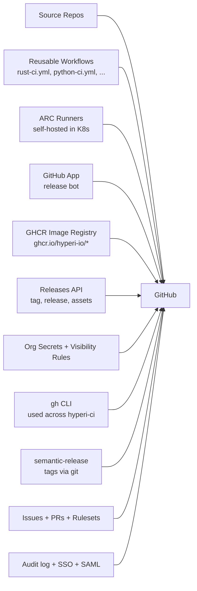
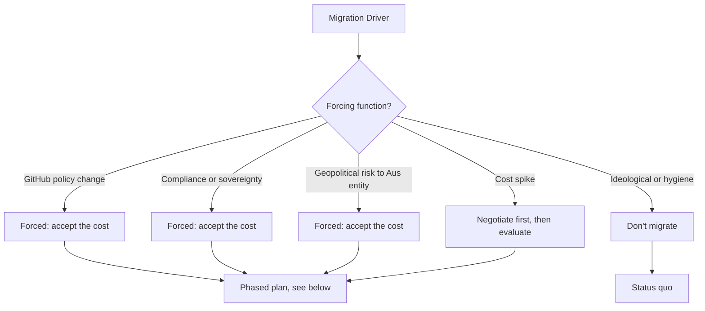
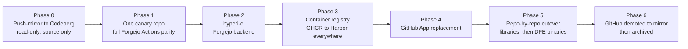

# Migrating off GitHub to Codeberg - Feasibility

> **Status:** NOT happening anytime soon. This records scope, blockers and sequencing, so a future forcing function (GitHub policy change, sovereignty mandate, cost shock) starts from here and not from a Slack thread.

Codeberg (<https://codeberg.org>) is a non-profit host in Germany running Forgejo, the soft-fork of Gitea. It can host our git repos today. Replacing the rest of the GitHub surface is the expensive part, and most of that cost is on our side.

## TL;DR

| Question | Answer |
|---|---|
| Can Codeberg host the source? | Yes, trivially. |
| Can it replace the rest of the GitHub surface? | Partially, with significant rework. |
| Effort to migrate hyperi-ci + the DFE fleet? | Multi-quarter, multi-engineer. |
| Hard blockers today? | GitHub Apps, fleet-wide `gh` CLI usage, SSO and audit log. |
| Soft blockers? | Runner capacity, registry storage limits, contributor discoverability. |
| Recommendation? | Watch only. Re-evaluate if a forcing function appears. |

## What we use GitHub for

Source code is the smallest part. Every edge below is in scope for a real migration:

```mermaid
graph LR
    Source[Source Repos] --> GH[GitHub]
    Actions["Reusable Workflows<br/>rust-ci.yml, python-ci.yml, ..."] --> GH
    ARC["ARC Runners<br/>self-hosted in K8s"] --> GH
    Apps["GitHub App<br/>release bot"] --> GH
    GHCR["GHCR Image Registry<br/>ghcr.io/hyperi-io/*"] --> GH
    Releases["Releases API<br/>tag, release, assets"] --> GH
    OrgSec[Org Secrets + Visibility Rules] --> GH
    GhCli["gh CLI<br/>used across hyperi-ci"] --> GH
    Sem["semantic-release<br/>tags via git"] --> GH
    Issues[Issues + PRs + Rulesets] --> GH
    Audit[Audit log + SSO + SAML] --> GH
```

Migration cost is the sum of replacing every one of those edges, not `git remote set-url`.

## Codeberg parity

| Capability | GitHub | Codeberg | Parity |
|---|---|---|---|
| Git hosting (HTTPS + SSH) | Yes | Yes | Full |
| PRs, issues, code review | Yes | Yes (Forgejo) | Close enough |
| Branch protection | Yes | Yes | Subset of rules |
| Reusable workflows | Yes (`uses:`) | Yes (Forgejo Actions) | Mostly compatible |
| Marketplace actions | Yes | Mostly via `actions/*` mirroring | Partial - third-party actions hit-and-miss |
| Self-hosted runners | ARC (K8s) | Forgejo Runner | Different controller; we'd port |
| **GitHub Apps** | Yes (release bot) | **No equivalent** | **Hard gap** |
| OAuth applications | Yes | Yes | Workable for some flows |
| Container registry | GHCR | Forgejo packages, storage-limited for large images | Partial - the job token cannot push, a user PAT can |
| Package registries (PyPI, npm, Cargo) | Not used - we publish to the public registries | Forgejo packages | Not needed |
| Releases API | Mature | Forgejo Releases (Gitea shape) | Partial - schema differs |
| Org secrets + visibility | Per-repo, public/private/selected | Forgejo orgs | Partial - thinner visibility model |
| `gh` CLI | Yes | `tea` or the `forgejo` CLI | Different CLI; touches every script |
| SSO / SAML | Yes (Enterprise) | **No** | Hard gap for compliance work |
| Audit log | Yes (Enterprise) | Limited | Hard gap for compliance work |
| Dependabot | Yes | Renovate, no first-party Dependabot | Workable but rework |
| CodeQL | Yes | None | We lose it |
| Contributor discoverability | Highest in industry | Niche | Soft cost |

The container registry row is as of 2026-10, from Codeberg's own tracker: <https://codeberg.org/Codeberg/Community/issues/2427> and <https://codeberg.org/Codeberg/Community/issues/2294>.

## What we would rebuild

### CI surface

`.github/workflows/*` becomes `.forgejo/workflows/*`. Forgejo Actions is broadly act-compatible, but each reusable workflow needs a parity pass:

- `rust-ci.yml`, `python-ci.yml`, `ts-ci.yml`, `go-ci.yml`, `_release-tail.yml` and `_ghcr-prune.yml` resolve `uses:` differently.
- Anything reading `github.event.*`, `${{ github.token }}` or a GitHub-only API needs an audit.
- ARC -> Forgejo Runner is a controller swap, since we already self-host on K8s. The ARC listener's autoscaling has to be re-derived against Forgejo's API.

The detail on secrets and the workflow graph is [codeberg-secrets-and-ci.md](codeberg-secrets-and-ci.md).

### `hyperi-ci` itself

The CLI shells out to `gh` in these places:

| Command or module | `gh` calls |
|---|---|
| `hyperi-ci watch` | `gh run list`, `gh run view` |
| `hyperi-ci logs` | `gh run view`, `gh api` for the job logs |
| `hyperi-ci trigger` | `gh workflow run` |
| `hyperi-ci release` | `gh workflow run`, `gh release view` |
| `tag-head` (release tail) | `gh api` to create the tag ref |
| Binary publish (`release/binaries.py`) | `gh release create`, `gh release upload` |

`hyperi-ci push --release` uses plain `git push` and no `gh`.

Two ways to replace `gh`:

1. **A Forgejo backend** behind a transport interface. Cleaner long-term, about 4-8 weeks plus a parity test suite.
2. **A thin Forgejo REST client** called directly. Faster, but `if codeberg: ... else: ...` spreads everywhere.

Option 1 is the only honest path. It also makes hyperi-ci portable to self-hosted Forgejo, since Codeberg the instance is not Forgejo the software.

### GitHub App replacement

The release tail mints a release-bot token with `actions/create-github-app-token` (`GH_APP_CLIENT_ID`, `GH_APP_PRIVATE_KEY`). It pushes tags and the release commit past branch rulesets, and its pushes trigger workflows. `gate-audit.yml`, `fleet-sweep.yml` and `versions-audit.yml` use the same App.

Forgejo has no App construct. Options:

- **An org-level PAT**, rotated and injected as a secret. Weaker than an App on lifetime, audit and revocation.
- **Forgejo OAuth applications**. Their permission model is thinner, and they suit human flows better than CI.
- **A token broker**, covered in [codeberg-secrets-and-ci.md](codeberg-secrets-and-ci.md).

### Container registry

GHCR pushes use the job's `GITHUB_TOKEN`. Codeberg's registry needs a user PAT and has limited room for large images. We already run Harbor at `harbor.devex.hyperi.io:8443` for ARC runner images, so moving all OCI traffic there is the answer. It is independent of the source host, and worth doing anyway.

### Releases + binary distribution

- **PyPI, crates.io, npm:** unaffected. They never touched GitHub.
- **`downloads.hyperi.io` via R2:** unaffected. That pipeline is independent of GitHub Releases.
- **GitHub Releases as a binary mirror:** moves to Forgejo Releases. The schema differs, so the binary publish path needs a Forgejo branch. Rework, not a blocker.

### semantic-release

The central config is tagger-only. It loads commit-analyzer, release-notes-generator, exec and changelog, and never `@semantic-release/github`. hyperi-ci creates the release after the tag, so the semantic-release side moves with the git remote.

## Cost-benefit

```mermaid
graph TD
    Driver[Migration Driver] --> P{Forcing function?}
    P -->|GitHub policy change| Force1["Forced: accept the cost"]
    P -->|Compliance or sovereignty| Force2["Forced: accept the cost"]
    P -->|Cost spike| Cost["Negotiate first, then evaluate"]
    P -->|Geopolitical risk to Aus entity| Force3["Forced: accept the cost"]
    P -->|Ideological or hygiene| Stay["Don't migrate"]

    Force1 --> Phased[Phased plan, see below]
    Force2 --> Phased
    Force3 --> Phased
    Cost --> Phased
    Stay --> Status[Status quo]
```

Only forced scenarios pencil out. No productivity, cost or capability case makes a Codeberg-hosted DFE cheaper to run than the current pipeline.

### Hypothetical phasing

If a forcing function appeared, the path with least breakage:

```mermaid
flowchart LR
    P0["Phase 0<br/>Push-mirror to Codeberg<br/>read-only, source only"] --> P1
    P1["Phase 1<br/>One canary repo<br/>full Forgejo Actions parity"] --> P2
    P2["Phase 2<br/>hyperi-ci<br/>Forgejo backend"] --> P3
    P3["Phase 3<br/>Container registry<br/>GHCR to Harbor everywhere"] --> P4
    P4["Phase 4<br/>GitHub App replacement"] --> P5
    P5["Phase 5<br/>Repo-by-repo cutover<br/>libraries, then DFE binaries"] --> P6
    P6["Phase 6<br/>GitHub demoted to mirror<br/>then archived"]
```

Doing Phase 2 and Phase 3 before any cutover means no single repo move is a hero project.

## What we should do today

| Action | Rationale |
|---|---|
| **Nothing on the source side** | No driver, no win. |
| **Push containers to Harbor, not GHCR** | Good on its own, and removes a large migration cost early. |
| **No new GitHub App use where a PAT would do** | Fewer Apps to replace if forced. |
| **Keep `gh` calls in a small set of modules** | Mostly true today (table above). The fewer there are, the cheaper a transport refactor. |
| **Check Forgejo Actions parity quarterly** | The gap is closing. Knowing where it sits commits us to nothing. |

## Risks of staying

Staying costs less than leaving, but not nothing:

- GitHub policy and pricing changes are unilateral.
- The deeper our GitHub App use, the deeper the lock-in.
- An Australian entity's exposure to US sanctions or export-control decisions affecting GitHub is non-zero.
- ARC is GitHub-specific. If GitHub retires its API, we rework anyway.

These are real but not imminent. The hedge is reducing coupling now and migrating only if forced.

## See also

- [codeberg-secrets-and-ci.md](codeberg-secrets-and-ci.md) - secrets and the CI workflow graph, the largest part of the cost
- [lessons.md](../lessons.md) - pattern catalogue from the old CI, for Forgejo Actions parity
- Forgejo Actions docs: <https://forgejo.org/docs/latest/user/actions/>
- Codeberg docs: <https://docs.codeberg.org/>
- `@semantic-release/gitea`: <https://github.com/saitho/semantic-release-gitea>
