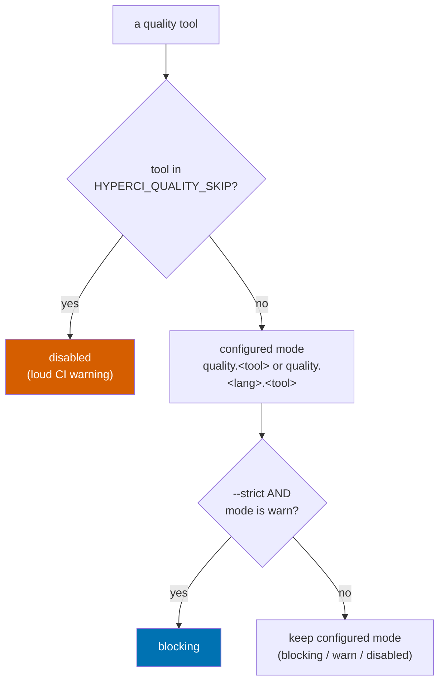

# Project:   HyperI CI
# File:      docs/quality-gate.md
# Purpose:   Reference for the quality stage - tools, modes, --strict, skip hatch
#
# License:   BUSL-1.1 - HYPERI PTY LIMITED
# Copyright: (c) 2026 HYPERI PTY LIMITED

# Quality gate

The quality stage runs a fixed set of tools and decides, per tool, whether a
finding is fatal. Two cross-language scanners (gitleaks, semgrep) run once at
the dispatch level; the rest run in the per-language handler. Each tool's
**effective mode** is resolved from config, an optional strict upgrade, and a
force-skip escape hatch, in that precedence.

Same code runs locally (`hyperi-ci check`) and in CI (`hyperi-ci run quality`).
The only difference is the local-vs-CI handling of a missing tool (below).

## Effective mode - how a tool's fate is decided

Bottom line: **skip beats strict beats configured mode.** A force-skip disables
the tool; otherwise strict upgrades a `warn` tool to `blocking`; otherwise the
configured mode stands.



Resolution lives in `src/hyperi_ci/languages/quality_common.py`
(`resolve_tool_mode`, `apply_strict`, `is_skipped`) and is shared by the
per-language handlers and the dispatch-level semgrep module, so the precedence
is identical everywhere.

## Modes

| Mode | Finding behaviour |
|---|---|
| `blocking` | A finding fails the stage (non-zero exit) |
| `warn` | A finding prints but does not fail |
| `disabled` | The tool does not run |

A tool may also fail the stage with **zero findings** when the tool itself
cannot do its job - a `blocking` scanner that is not actually scanning is not a
pass. Today that means gitleaks with a rule-less config (below); the mode still
governs severity, so `warn` downgrades it to a warning.

Set per project in `.hyperi-ci.yaml` under `quality.<lang>.<tool>` (or
`quality.<tool>` for the cross-language `gitleaks` / `semgrep`); defaults live in
`src/hyperi_ci/config/defaults.yaml`.

## Tools

| Tool | Scope | Where |
|---|---|---|
| gitleaks | cross-language secret scan | dispatch (`quality/gitleaks.py`) |
| semgrep | cross-language SAST (`--config auto`) | dispatch (`quality/semgrep.py`) |
| ruff (lint, format, docstrings) | Python | `languages/python/quality.py` |
| ty | Python types | Python handler |
| pip-audit, bandit, vulture | Python | Python handler |
| clippy, rustfmt, cargo-audit/deny, osv-scanner | Rust | `languages/rust/quality.py` |
| eslint, prettier, tsc, npm audit, osv-scanner | TypeScript | `languages/typescript/quality.py` |
| gofmt, govet, golangci-lint, gosec, govulncheck | Go | `languages/golang/quality.py` |

semgrep and gitleaks moved to the dispatch level because their rulesets are
language-agnostic - running them once avoids the drift where only one handler
passed shared excludes.

### gitleaks config

If your repo has a `.gitleaks.toml` (or `ci/.gitleaks.toml`), hyperi-ci passes
it with `--config`. **It must name a source of rules**, or gitleaks scans every
byte, matches nothing, and reports "no leaks found" - a green gate that checked
nothing. That is not hypothetical; it is what issue #64 turned out to be.

A config with allowlists but no `[[rules]]` and no `[extend]` **replaces** the
default ruleset with an empty one rather than narrowing it:

```toml
# BLIND - allowlist only, no rules, no extend. Every scan passes.
[[allowlists]]
paths = ['''testdata/''']
```

```toml
# CORRECT - keep the default rules, then narrow them.
[extend]
useDefault = true

[[allowlists]]
paths = ['''testdata/''']
```

hyperi-ci refuses to report success from a rule-less scan: `blocking` fails the
stage, `warn` warns. This check only inspects where the rules come FROM - it
cannot tell you a `[allowlist] paths = ['''.*''']` has neutered an otherwise
valid ruleset (tracked in #67), so a green gitleaks stage is not proof the
config is sane.

`GITLEAKS_CONFIG` / `GITLEAKS_CONFIG_TOML` are honoured by gitleaks itself. A
repo config passed via `--config` beats them, but with no repo config they take
over silently - so hyperi-ci warns when one is set and there is nothing to
override it. Prefer a committed `.gitleaks.toml`: it gets reviewed.

## --strict - a zero-warnings pre-push gate

`hyperi-ci check --strict` treats every `warn`-tier finding as `blocking`, so a
developer sees - and fixes or explicitly ignores - everything CI would surface
BEFORE the push, not after. It sets `HYPERCI_QUALITY_STRICT=1`, which
`apply_strict` reads.

`disabled` tools stay off (strict enforces warnings, it does not resurrect a
tool a project turned off). A tool that is not installed locally (and has no
`uv` fallback) is still warn-skipped even under `--strict` - strict enforces
what runs, not what your machine has; CI, where the tools are present, is the
backstop.

```bash
hyperi-ci check --strict --quick     # strict quality only, no tests
# -> non-zero if any tool has findings; fix or ignore each, then re-run
```

## HYPERCI_QUALITY_SKIP - the rare escape hatch

> **Note:** This is an EMERGENCY override, not the normal path. The reviewed,
> auditable way to silence a tool is the config (`quality.<tool>: disabled` or
> the `quality.ignore` list).

When a tool's false positive halts CI - a semgrep rule misfiring on a
dependency, an audit advisory with no fix yet - set `HYPERCI_QUALITY_SKIP` to
the tool name (comma-separated for several) to force it to `disabled` for the
blocked runs WITHOUT a config commit, then remove it once the real fix lands.

A force-skip is logged LOUDLY: a `warn()` line plus, in CI, a real GitHub
`::warning::` annotation that lands in the run summary (it does not hide inside
a collapsed log group) - so skipping a security scanner like gitleaks cannot
pass unnoticed.

In CI, set the `HYPERCI_QUALITY_SKIP` repo or org Actions variable; the four
reusable language workflows pass it through (empty variable = no-op). Only a
repo admin / org owner can set it.

```bash
# local one-off: skip semgrep for this run
HYPERCI_QUALITY_SKIP=semgrep hyperi-ci run quality
```

## Suppressing a specific rule (the reviewed path)

To silence one noisy rule permanently, use `quality.ignore` in `.hyperi-ci.yaml`
- it is committed, diffable, and carries a `reason`:

```yaml
quality:
  ignore:
    - tool: semgrep
      ids:
        - <full.rule.id>
      reason: "why this rule is noise here"
```

This is rule-scoped (not a path exclude), so the rest of the tool's coverage
stays active. `for_tool` in `src/hyperi_ci/quality/ignores.py` feeds these to
the tool's native ignore flag.

## Missing tool - local vs CI

A tool that is not installed and has no `uv`/`uvx` fallback:

- **In CI** (`CI` env set): a `blocking` tool FAILS - every tool must be
  present, and a silent skip would mask a coverage gap.
- **Locally**: it warn-skips and carries on, so `hyperi-ci check` still runs
  whatever IS installed and tells you what it skipped.

This matches the gitleaks stage's existing behaviour (`is_ci()` in
`src/hyperi_ci/common.py`).

When a tool IS missing, the message is actionable, not just "not found": a
single registry (`src/hyperi_ci/tools.py`) renders a Rust-style notice naming
what hyperi-ci needs the tool for and the exact install command(s) + docs URL.
`missing_tool_notice()` / `find_tool()` are used by gitleaks, semgrep, gh,
helm, aws, and the alint advisory below.

## Advisory (non-blocking) checks

Two hygiene nudges run in the quality stage. Neither can ever fail a build -
they surface a recommendation and carry on.

- **Deprecated-file check.** A packaged table
  (`src/hyperi_ci/config/deprecated-files.yaml`) maps a retired project file to
  the nudge shown if it is present (a `::warning::` in CI). Driver:
  `src/hyperi_ci/quality/deprecated_files.py`. Runs on `hyperi-ci check` and in
  CI. Currently flags a legacy `.releaserc.yaml`.
- **Repo-hygiene advisory (`alint`).** Optional, profile-aware repo hygiene via
  the external `alint` linter (missing `.gitignore` / `.editorconfig`, tracked
  build artefacts, absent lockfile, ...). hyperi-ci ships an opinionated default
  config (`src/hyperi_ci/config/alint/hyperi.alint.yml` - alint's own bundled
  baseline for our four languages, fact-gated) and passes it with `alint check
  -c`, so no per-repo `.alint.yml` is needed; a repo's own `.alint.yml` wins.
  Controlled by `quality.alint` (`auto` = run if installed else info-skip;
  `enabled` = warn if missing; `disabled` = off). alint is not a hyperi-ci
  dependency - it info-skips (with an install hint) when absent. Driver:
  `src/hyperi_ci/quality/repo_advisor.py`.
