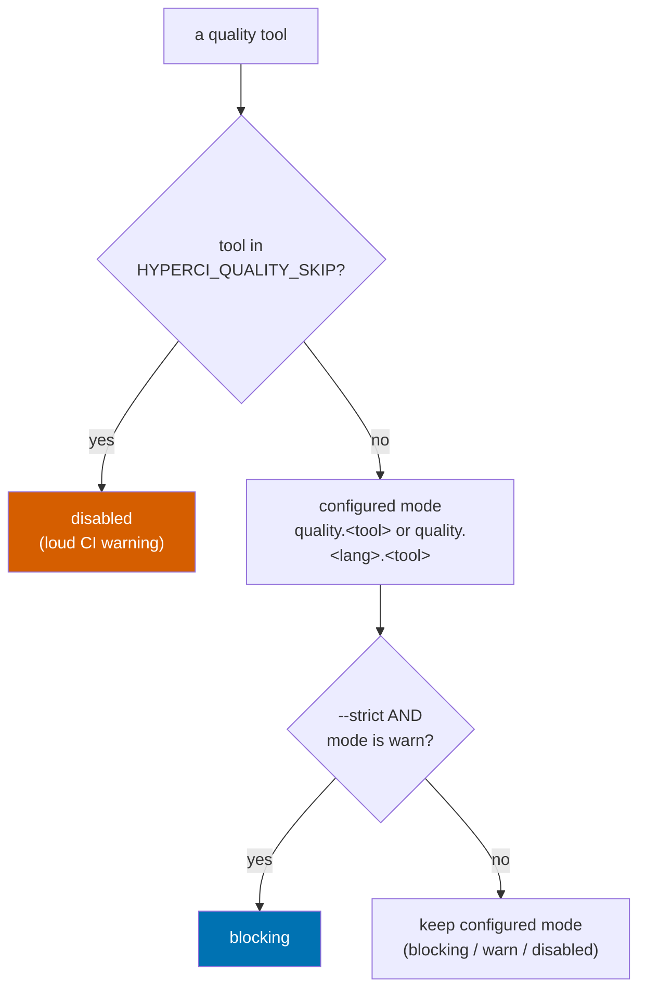

# Project:   HyperI CI
# File:      docs/quality-gate.md
# Purpose:   Reference for the quality stage - tools, modes, --strict, skip hatch
#
# License:   BUSL-1.1 - HYPERI PTY LIMITED
# Copyright: (c) 2026 HYPERI PTY LIMITED

# Quality gate

The quality stage runs a fixed set of tools and decides, per tool, whether a
finding is fatal. Two cross-language scanners (gitleaks, semgrep) run once at
the dispatch level; the rest run in the per-language handler. Each tool's
**effective mode** is resolved from config, an optional strict upgrade, and a
force-skip escape hatch, in that precedence.

Same code runs locally (`hyperi-ci check`) and in CI (`hyperi-ci run quality`).
The only difference is the local-vs-CI handling of a missing tool (below).

## Effective mode - how a tool's fate is decided

Bottom line: **skip beats strict beats configured mode.** A force-skip disables
the tool; otherwise strict upgrades a `warn` tool to `blocking`; otherwise the
configured mode stands.



Resolution lives in `src/hyperi_ci/languages/quality_common.py`
(`resolve_tool_mode`, `apply_strict`, `is_skipped`) and is shared by the
per-language handlers and the dispatch-level semgrep module, so the precedence
is identical everywhere.

## Modes

| Mode | Finding behaviour |
|---|---|
| `blocking` | A finding fails the stage (non-zero exit) |
| `warn` | A finding prints but does not fail |
| `disabled` | The tool does not run |

A tool may also fail the stage with **zero findings** when the tool itself
cannot do its job - a `blocking` scanner that is not actually scanning is not a
pass. Today that means gitleaks with a rule-less config (below); the mode still
governs severity, so `warn` downgrades it to a warning.

Set per project in `.hyperi-ci.yaml` under `quality.<lang>.<tool>` (or
`quality.<tool>` for the cross-language `gitleaks` / `semgrep`); defaults live in
`src/hyperi_ci/config/defaults.yaml`.

## Tools

| Tool | Scope | Where |
|---|---|---|
| gitleaks | cross-language secret scan | dispatch (`quality/gitleaks.py`) |
| semgrep | cross-language SAST (`--config auto`) | dispatch (`quality/semgrep.py`) |
| hadolint | Dockerfile lint GATE (shellcheck-on-`RUN`) | dispatch (`quality/hadolint.py`) |
| droast | Dockerfile ADVISORY (cache / dockerignore) | dispatch (`quality/droast.py`) |
| kubeconform | k8s manifest schema GATE | `lint-manifests` verb (`quality/kubeconform.py`) |
| kube-linter | k8s best-practice ADVISORY | `lint-manifests` verb (`quality/kube_linter.py`) |
| checkov | IaC security ADVISORY (k8s/helm/tf) | `lint-manifests` verb (`quality/checkov.py`) |
| ruff (lint, format, docstrings) | Python | `languages/python/quality.py` |
| ty | Python types | Python handler |
| pip-audit, bandit, vulture | Python | Python handler |
| clippy, rustfmt, cargo-audit/deny, osv-scanner | Rust | `languages/rust/quality.py` |
| eslint, prettier, tsc, npm audit, osv-scanner | TypeScript | `languages/typescript/quality.py` |
| gofmt, govet, golangci-lint, gosec, govulncheck | Go | `languages/golang/quality.py` |

semgrep and gitleaks moved to the dispatch level because their rulesets are
language-agnostic - running them once avoids the drift where only one handler
passed shared excludes.

### gitleaks config

If your repo has a `.gitleaks.toml` (or `ci/.gitleaks.toml`), hyperi-ci passes
it with `--config`. **It must name a source of rules**, or gitleaks scans every
byte, matches nothing, and reports "no leaks found" - a green gate that checked
nothing. That is not hypothetical; it is what issue #64 turned out to be.

A config with allowlists but no `[[rules]]` and no `[extend]` **replaces** the
default ruleset with an empty one rather than narrowing it:

```toml
# BLIND - allowlist only, no rules, no extend. Every scan passes.
[[allowlists]]
paths = ['''testdata/''']
```

```toml
# CORRECT - keep the default rules, then narrow them.
[extend]
useDefault = true

[[allowlists]]
paths = ['''testdata/''']
```

hyperi-ci refuses to report success from a rule-less scan: `blocking` fails the
stage, `warn` warns. This check only inspects where the rules come FROM - it
cannot tell you a `[allowlist] paths = ['''.*''']` has neutered an otherwise
valid ruleset (tracked in #67), so a green gitleaks stage is not proof the
config is sane.

`GITLEAKS_CONFIG` / `GITLEAKS_CONFIG_TOML` are honoured by gitleaks itself. A
repo config passed via `--config` beats them, but with no repo config they take
over silently - so hyperi-ci warns when one is set and there is nothing to
override it. Prefer a committed `.gitleaks.toml`: it gets reviewed.

## Container + k8s + IaC linting

Five tools cover three artefact classes, each with a **gate** (blocks) and an
**advisory** (warns, never blocks):

| Layer | Dockerfiles | k8s manifests | IaC |
|---|---|---|---|
| Gate (blocking) | hadolint | kubeconform | - |
| Advisory (warn) | droast | kube-linter | checkov (k8s/helm/kustomize/terraform) |

They deliver through two paths, because the target repos differ in kind:

- **Path A - the quality stage.** hadolint + droast auto-detect Dockerfiles
  inside `hyperi-ci run quality`, like gitleaks/semgrep. A repo with no
  Dockerfile just info-skips - no opt-out config needed.
- **Path B - the `lint-manifests` verb.** `hyperi-ci lint-manifests <dir>` runs
  kubeconform + kube-linter + checkov. Built for GitHub-Actions-native gitops /
  infra repos that have no `.hyperi-ci.yaml` and no language pipeline - the
  existing workflow calls the verb instead of adopting the whole pipeline. It
  renders Helm charts (`helm template`) for kubeconform, which validates
  RENDERED manifests.

### Gate semantics

hadolint gates on **error severity only**: a blocking hadolint fails on an
error-level finding (a broken `RUN` shell caught by ShellCheck), while
warning/info (DL3008 apt-pin, DL4006 pipefail, ...) surface but never fail.
kubeconform fails on a schema-invalid manifest. droast, kube-linter and checkov
are advisory by default and never fail the build (checkov can be escalated to
`blocking` per repo once its findings are tuned).

### How findings surface (the layered stack)

Every tool parses its output into one shared surface (`quality/findings.py`):

- **GitHub annotations** - a *bounded* set of inline pointers, errors first.
  GitHub caps annotations at 10 error + 10 warning per step and silently drops
  the rest; the whole quality stage is one step, so that budget is shared across
  all tools. When it is exhausted the log says "+N more, see summary".
- **Job summary** - the *complete* findings list as a markdown table
  (`$GITHUB_STEP_SUMMARY`), bounded at 1000 rows (well past any real run) with a
  truncation note, so it stays under GitHub's 1MiB/step ceiling. The
  authoritative record.
- **SARIF** - opt-in via `--sarif <path>` on the verb. Writing the file is
  always safe; UPLOADING it into code scanning needs GitHub Code Security (a
  paid add-on on private repos), so the *workflow* does the upload, gated to
  where it is enabled - hyperi-ci never uploads and never triggers the "must
  enable" error.

### Config

Modes are the usual `blocking` / `warn` / `disabled` under `quality.<tool>`
(cross-language, top-level - not per-language). `quality.<tool>` may also be a
**dict** carrying a `mode` plus tool options:

```yaml
quality:
  hadolint: blocking          # or warn / disabled
  droast: warn
  kubeconform:
    mode: blocking
    schema_locations:         # extra CRD schema locations for kubeconform
      - /path/to/crd-schemas
  checkov:
    mode: warn
    frameworks: [kubernetes, helm, terraform]
    skip: [CKV_K8S_35]        # skip check IDs (e.g. an ExternalSecret false positive)
    skip_paths: ['.*/vendor/.*']  # extra path regexes to exclude (on top of .worktrees / .tmp)
```

### Coverage caveats (a green gate is not full proof)

- kubeconform runs with `-ignore-missing-schemas`: a CRD with no schema anywhere
  is **skipped**, not validated. A curated CRD schema location (the datreeio
  catalogue is included by default) covers the common operators; the rest are
  reported skipped, not green-lit.
- For multi-source ArgoCD apps, the rendered manifest uses **in-repo default
  values only** - the real cluster manifest depends on an external overlay, so a
  passing kubeconform gate validates the chart-under-defaults, not the deployed
  result.

### Does this break existing projects?

No, by design - the failure surface is deliberately narrow:

- **No Dockerfile, no k8s, no `.tf` -> nothing runs.** hadolint/droast auto-detect
  Dockerfiles and info-skip a repo with none. The k8s/IaC tools only run when you
  explicitly call `lint-manifests`. A plain Rust/Python library sees zero change.
- **The k8s/IaC tools never run in the normal quality stage.** kubeconform,
  kube-linter and checkov are *only* reachable through the `lint-manifests` verb
  (Path B). Bumping hyperi-ci does not add them to any language project's CI - a
  gitops repo has to opt in by calling the verb.
- **The one gate that auto-runs (hadolint) fails on ERROR severity only.** Routine
  Dockerfile noise (DL3008 unpinned apt, DL4006 pipefail, base-image pinning) is
  warning-tier and is surfaced, not failed. Only a genuine defect - chiefly a
  broken `RUN` shell caught by embedded ShellCheck - fails the build.
- **A missing tool never breaks the local loop.** `hyperi-ci check` warn-skips a
  linter that is not installed; in CI hadolint auto-installs, and if that install
  itself fails the stage does not crash (it reports and, for a blocking gate,
  fails rather than falsely pass).
- **Everything is opt-out** per repo: `quality.hadolint: disabled` (or `warn`),
  and the same for each tool.

**The one real behaviour change:** a project that *has* a Dockerfile whose hadolint
finds an **error-severity** issue will newly fail CI where it previously had no
Dockerfile check at all. That is the intended gate (a broken `RUN` is a real bug),
but it is a change - so on first adoption, run `hyperi-ci run quality` locally, or
set `quality.hadolint: warn` for a migration window, fix the findings, then flip it
back to `blocking`.

### Adopting it on a new or external project

- **A language project (Python/Rust/Go/TS) that already uses hyperi-ci** - nothing
  to do. hadolint + droast light up automatically the next time `run quality`
  executes, *iff* the repo has a Dockerfile. Tune with `quality.hadolint` /
  `quality.droast` if needed.
- **A brand-new project** - onboard it with `hyperi-ci init` / `/onboard` as usual;
  the linting is part of the quality stage it scaffolds. No extra wiring.
- **A gitops / infra repo (Helm charts, k8s manifests, `.tf`)** - even one that is
  GitHub-Actions-native with no `.hyperi-ci.yaml` - add one step to its workflow:
  `hyperi-ci lint-manifests .`. It needs `helm` on the runner for the kubeconform
  schema gate (kube-linter/checkov still run without it). A CRD-heavy cluster repo
  will want `quality.kubeconform.schema_locations` for its operators and a
  `quality.checkov.skip` list for known false positives (e.g. External-Secrets
  `ExternalSecret` CRs). The gitops scaffold (`hyperi-ci init-gitops`) ships a
  `validate.yaml` that already calls the verb.
- **An external / third-party project you are migrating in** - start every tool at
  `warn` (advisory) so the first run is a report, not a wall of failures; triage
  the findings; then promote hadolint (and, if wanted, checkov) to `blocking` once
  the repo is clean. The auto-detect + opt-out model means adoption is incremental,
  never all-or-nothing.

## --strict - a zero-warnings pre-push gate

`hyperi-ci check --strict` treats every `warn`-tier finding as `blocking`, so a
developer sees - and fixes or explicitly ignores - everything CI would surface
BEFORE the push, not after. It sets `HYPERCI_QUALITY_STRICT=1`, which
`apply_strict` reads.

`disabled` tools stay off (strict enforces warnings, it does not resurrect a
tool a project turned off). A tool that is not installed locally (and has no
`uv` fallback) is still warn-skipped even under `--strict` - strict enforces
what runs, not what your machine has; CI, where the tools are present, is the
backstop.

```bash
hyperi-ci check --strict --quick     # strict quality only, no tests
# -> non-zero if any tool has findings; fix or ignore each, then re-run
```

## HYPERCI_QUALITY_SKIP - the rare escape hatch

> **Note:** This is an EMERGENCY override, not the normal path. The reviewed,
> auditable way to silence a tool is the config (`quality.<tool>: disabled` or
> the `quality.ignore` list).

When a tool's false positive halts CI - a semgrep rule misfiring on a
dependency, an audit advisory with no fix yet - set `HYPERCI_QUALITY_SKIP` to
the tool name (comma-separated for several) to force it to `disabled` for the
blocked runs WITHOUT a config commit, then remove it once the real fix lands.

A force-skip is logged LOUDLY: a `warn()` line plus, in CI, a real GitHub
`::warning::` annotation that lands in the run summary (it does not hide inside
a collapsed log group) - so skipping a security scanner like gitleaks cannot
pass unnoticed.

In CI, set the `HYPERCI_QUALITY_SKIP` repo or org Actions variable; the four
reusable language workflows pass it through (empty variable = no-op). Only a
repo admin / org owner can set it.

```bash
# local one-off: skip semgrep for this run
HYPERCI_QUALITY_SKIP=semgrep hyperi-ci run quality
```

## Suppressing a specific rule (the reviewed path)

To silence one noisy rule permanently, use `quality.ignore` in `.hyperi-ci.yaml`
- it is committed, diffable, and carries a `reason`:

```yaml
quality:
  ignore:
    - tool: semgrep
      ids:
        - <full.rule.id>
      reason: "why this rule is noise here"
```

This is rule-scoped (not a path exclude), so the rest of the tool's coverage
stays active. `for_tool` in `src/hyperi_ci/quality/ignores.py` feeds these to
the tool's native ignore flag.

## Missing tool - local vs CI

A tool that is not installed and has no `uv`/`uvx` fallback:

- **In CI** (`CI` env set): a `blocking` tool FAILS - every tool must be
  present, and a silent skip would mask a coverage gap.
- **Locally**: it warn-skips and carries on, so `hyperi-ci check` still runs
  whatever IS installed and tells you what it skipped.

This matches the gitleaks stage's existing behaviour (`is_ci()` in
`src/hyperi_ci/common.py`).

When a tool IS missing, the message is actionable, not just "not found": a
single registry (`src/hyperi_ci/tools.py`) renders a Rust-style notice naming
what hyperi-ci needs the tool for and the exact install command(s) + docs URL.
`missing_tool_notice()` / `find_tool()` are used by gitleaks, semgrep, gh,
helm, aws, and the alint advisory below.

## Advisory (non-blocking) checks

Two hygiene nudges run in the quality stage. Neither can ever fail a build -
they surface a recommendation and carry on.

- **Deprecated-file check.** A packaged table
  (`src/hyperi_ci/config/deprecated-files.yaml`) maps a retired project file to
  the nudge shown if it is present (a `::warning::` in CI). Driver:
  `src/hyperi_ci/quality/deprecated_files.py`. Runs on `hyperi-ci check` and in
  CI. Currently flags a legacy `.releaserc.yaml`.
- **Repo-hygiene advisory (`alint`).** Optional, profile-aware repo hygiene via
  the external `alint` linter (missing `.gitignore` / `.editorconfig`, tracked
  build artefacts, absent lockfile, ...). hyperi-ci ships an opinionated default
  config (`src/hyperi_ci/config/alint/hyperi.alint.yml` - alint's own bundled
  baseline for our four languages, fact-gated) and passes it with `alint check
  -c`, so no per-repo `.alint.yml` is needed; a repo's own `.alint.yml` wins.
  The default is primary-language-scoped: alint's root-only manifest/lockfile
  rules (`go-mod-exists`, `node-package-json-exists`, ...) are disabled for
  every ecosystem EXCEPT the repo's resolved language, because the bundled
  `has_<lang>` facts match nested monorepo packages and would otherwise demand
  a secondary ecosystem's manifest at the repo root (issue #75 - a TS monorepo
  with `packages/*/go.mod` got a red `go-mod-exists`). Per-file rules
  (Trojan-Source, hygiene) stay active for every ecosystem. Implemented as a
  generated single-file layer that `extends:` the shipped default - alint
  0.13's repeatable `-c` only honours the first file (0.14 rejects a second
  outright), so two `-c` layers do not compose. The layer carries
  `allow_out_of_root: true`: it and the packaged default both live outside
  the linted repo, which alint 0.14's `extends:` confinement would otherwise
  reject. Controlled by `quality.alint` (`auto` = run if installed else
  info-skip; `enabled` = warn if missing; `disabled` = off). alint is not a
  hyperi-ci dependency; locally it info-skips (with an install hint) when
  absent, while in CI a missing alint is fetched as the pinned prebuilt
  binary (`tools.alint` in `config/versions.yaml`, static musl, exec'd by
  path - no sudo) so the advisory actually runs on vanilla runners.
  Driver: `src/hyperi_ci/quality/repo_advisor.py`.
