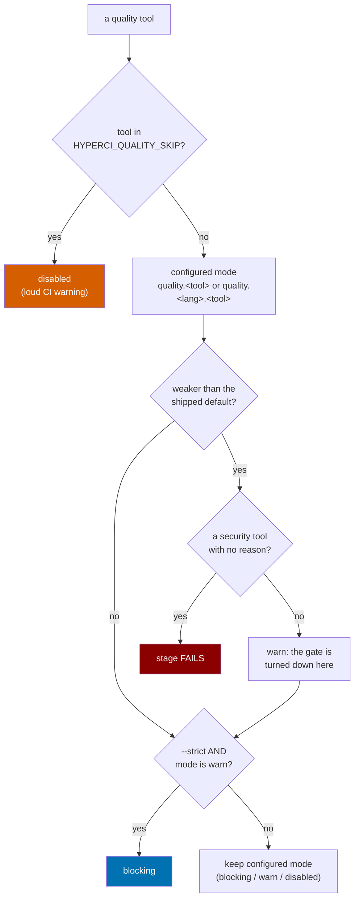

<!--
# Project:   HyperI CI

# File:      docs/quality-gate.md

# Purpose:   Reference for the quality stage - tools, modes, --strict, skip hatch

#

# License:   BUSL-1.1 - HYPERI PTY LIMITED

# Copyright: (c) 2026 HYPERI PTY LIMITED
-->

# Quality gate

The quality stage runs a fixed set of tools and decides, per tool, whether a
finding is fatal. Two cross-language scanners (gitleaks, semgrep) run once at
the dispatch level; the rest run in the per-language handler. Each tool's
**effective mode** is resolved from config, an optional strict upgrade, and a
force-skip escape hatch, in that precedence.

Same code runs locally (`hyperi-ci check`) and in CI (`hyperi-ci run quality`).
The only difference is the local-vs-CI handling of a missing tool (below).

## Effective mode - how a tool's fate is decided

Bottom line: **skip beats strict beats configured mode.** A force-skip disables
the tool; otherwise strict upgrades a `warn` tool to `blocking`; otherwise the
configured mode stands.


```mermaid
flowchart TB
    T["a quality tool"] --> SK{"tool in<br/>HYPERCI_QUALITY_SKIP?"}
    SK -->|yes| D["disabled<br/>(loud CI warning)"]:::skip
    SK -->|no| M["configured mode<br/>quality.&lt;tool&gt; or quality.&lt;lang&gt;.&lt;tool&gt;"]
    M --> TD{"weaker than the<br/>shipped default?"}
    TD -->|no| ST
    TD -->|yes| SEC{"a security tool<br/>with no reason?"}
    SEC -->|yes| F["stage FAILS"]:::fail
    SEC -->|no| W["warn: the gate is<br/>turned down here"] --> ST
    ST{"--strict AND<br/>mode is warn?"}
    ST -->|yes| B["blocking"]:::block
    ST -->|no| K["keep configured mode<br/>(blocking / warn / disabled)"]
    classDef skip fill:#D55E00,color:#fff
    classDef block fill:#0072B2,color:#fff
    classDef fail fill:#8B0000,color:#fff
```

Resolution lives in `src/hyperi_ci/languages/quality_common.py`
(`resolve_tool_mode`, `resolve_cross_tool_mode`, `note_gate_downgrade`,
`apply_strict`, `is_skipped`) and is shared by the per-language handlers and
the dispatch-level gitleaks / semgrep modules, so the precedence is identical
everywhere.

## Modes

| Mode | Finding behaviour |
|---|---|
| `blocking` | A finding fails the stage (non-zero exit) |
| `warn` | A finding prints but does not fail |
| `disabled` | The tool does not run |

A tool may also fail the stage with **zero findings** when it cannot do its job, because a `blocking` scanner that is not scanning is not a pass. That covers gitleaks with a rule-less or canary-blinded config (below). The mode still governs severity, so `warn` downgrades it to a warning.

Set per project in `.hyperi-ci.yaml` under `quality.<lang>.<tool>` (or
`quality.<tool>` for the cross-language `gitleaks` / `semgrep`); defaults live in
`src/hyperi_ci/config/defaults.yaml`.

## Relaxing a security gate

A repo may turn any gate down. A SECURITY gate turned down must say what it is waiting on, and the stage fails without it. The failure names the key and prints the YAML to paste:

```yaml
quality:
  python:
    pip_audit:
      mode: warn
      reason: "diskcache CVE-2025-69872 has no upstream fix; mitigated by pod isolation"
```

The security set is `gitleaks`, `semgrep`, `bandit`, `ruff_security`,
`pip_audit`, `audit`, `deny`, `osv_scanner`, `gosec`, `govulncheck`
(`SECURITY_TOOLS` in `quality_common.py`). Every
other tool - `vulture`, `ty`, `eslint`, `fmt`, `clippy`, `ruff` - keeps the bare
`tool: warn` string and only warns.

**"Turned down" is measured against that tool's own shipped default**, not
against `blocking`. semgrep, osv-scanner and ruff_security ship `warn`, bandit
ships `disabled`, so a repo writing `semgrep: warn` is agreeing with us and owes
no justification; `semgrep: disabled` is below the default and does.

| shipped | configured | security tool | outcome |
|---|---|---|---|
| blocking | warn / disabled | yes | reason REQUIRED, stage fails without one |
| warn | disabled | yes | reason REQUIRED, stage fails without one |
| warn | warn | yes | nothing - it matches the default |
| disabled | anything | yes | nothing is below `disabled` |
| any | anything weaker | no | the existing warning, never a failure |

Where a reason IS given it prints beside the downgrade warning on every run, so
six months later the decision can be re-checked rather than re-litigated. A YAML
comment does not count: hyperi-ci cannot read it into the log.

Two things this does not touch. `--strict` still upgrades `warn` to `blocking`,
and the requirement is evaluated on the CONFIGURED mode, so a local
`check --strict` reports the same config defect CI will rather than hiding it.
`HYPERCI_QUALITY_SKIP` still needs no reason - it exists for a CI that is
already broken.

The same rule has governed `quality.rust.feature_matrix`'s opt-out since it
shipped. Issue #250 closed the gap where dead-code coverage was held to a higher
standard than CVE scanning.

### Turning the whole stage off

`quality.enabled: false` drops every gate at once, security gates included, so it owes a reason too. It sits beside the switch, as it does for `feature_matrix`:

```yaml
quality:
  enabled: false
  reason: "security gates run in the org-level pipeline for this mirror"
```

Without one, the stage fails and names the security gates the repo loses: gitleaks, semgrep and its language's own. In CI that is the same `::error::` a single relaxed gate raises. A stated reason prints on every run.

`quality.reason` is safe to add before your runner reads it. Older versions ignore the key.

## The rest of the gate: tools, doc-linting and overrides

[quality-gate-tools.md](quality-gate-tools.md) has the per-tool table (gitleaks, semgrep, charset, hadolint, the language handlers). It also has the config knobs: `quality.exclude_paths`, the ruff keys, the Rust feature matrix, and the gitleaks config and its canary. The Container, k8s and IaC linting paths and the two advisory hygiene nudges are there too.

[quality-gate-doc-linting.md](quality-gate-doc-linting.md) covers `hyperi-ci lint-docs <dir>` and the same five checks inside the quality stage (doc-paths, lychee, mermaid-parse, markdownlint, docs-touched). It has gate semantics, how findings surface, config, coverage caveats and adoption impact.

`--strict`, `HYPERCI_QUALITY_SKIP` and `quality.ignore` are in [quality-gate-overrides.md](quality-gate-overrides.md).

## Missing tool - local vs CI

A tool that is not installed and has no `uv`/`uvx` fallback:

- **In CI** (`CI` env set): a `blocking` tool FAILS - every tool must be
  present, and a silent skip would mask a coverage gap.
- **Locally**: it warn-skips and carries on, so `hyperi-ci check` still runs
  whatever IS installed and tells you what it skipped.

This matches the gitleaks stage's existing behaviour (`is_ci()` in
`src/hyperi_ci/common.py`).

A missing tool gets a message that says what to do. A single registry (`src/hyperi_ci/tools.py`) renders a Rust-style notice naming what hyperi-ci needs the tool for, the exact install command(s) and the docs URL. Its `missing_tool_notice()` / `find_tool()` serve gh and the binary upload in `release/binaries.py`. They also serve the scanners under `quality/`: gitleaks, semgrep, osv-scanner, hadolint, the k8s and IaC linters, the doc checks and the alint advisory ([quality-gate-tools.md](quality-gate-tools.md)).

## Installed tool - pinned vs PATH

A tool on PATH at a version other than `versions.yaml` gives a local result CI would not.

- **semgrep and the Python tools** (vulture, bandit, ty, pip-audit) run the pin through `uvx` / `uv run --with` whenever `uv` is installed, whatever is on PATH. Without `uv` the PATH copy runs, with a warning naming the pin.
- **cargo-hack** is installed at the pin with `cargo install --locked --version`, and a different version is reinstalled over it.
- **cargo-audit, cargo-deny, osv-scanner, golangci-lint, gosec, govulncheck** are not installed locally. When the PATH copy's version is not the pin, the stage warns once per tool and names both. In CI the setup actions install and assert the pin, so the warning stays quiet there.

## See also

- [quality-gate-tools.md](quality-gate-tools.md) -- the per-tool reference, Container + k8s + IaC linting, and the advisory checks
- [quality-gate-doc-linting.md](quality-gate-doc-linting.md) -- the five `lint-docs` checks
- [quality-gate-overrides.md](quality-gate-overrides.md) -- `--strict`, `HYPERCI_QUALITY_SKIP`, `quality.ignore`
