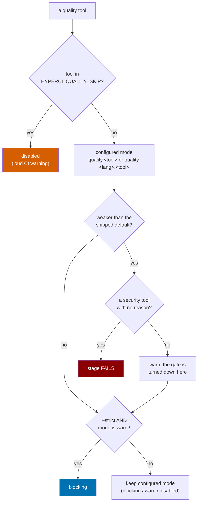

# Project:   HyperI CI
# File:      docs/quality-gate.md
# Purpose:   Reference for the quality stage - tools, modes, --strict, skip hatch
#
# License:   BUSL-1.1 - HYPERI PTY LIMITED
# Copyright: (c) 2026 HYPERI PTY LIMITED

# Quality gate

The quality stage runs a fixed set of tools and decides, per tool, whether a
finding is fatal. Two cross-language scanners (gitleaks, semgrep) run once at
the dispatch level; the rest run in the per-language handler. Each tool's
**effective mode** is resolved from config, an optional strict upgrade, and a
force-skip escape hatch, in that precedence.

Same code runs locally (`hyperi-ci check`) and in CI (`hyperi-ci run quality`).
The only difference is the local-vs-CI handling of a missing tool (below).

## Effective mode - how a tool's fate is decided

Bottom line: **skip beats strict beats configured mode.** A force-skip disables
the tool; otherwise strict upgrades a `warn` tool to `blocking`; otherwise the
configured mode stands.


```mermaid
flowchart TB
    T["a quality tool"] --> SK{"tool in<br/>HYPERCI_QUALITY_SKIP?"}
    SK -->|yes| D["disabled<br/>(loud CI warning)"]:::skip
    SK -->|no| M["configured mode<br/>quality.&lt;tool&gt; or quality.&lt;lang&gt;.&lt;tool&gt;"]
    M --> TD{"weaker than the<br/>shipped default?"}
    TD -->|no| ST
    TD -->|yes| SEC{"a security tool<br/>with no reason?"}
    SEC -->|yes| F["stage FAILS"]:::fail
    SEC -->|no| W["warn: the gate is<br/>turned down here"] --> ST
    ST{"--strict AND<br/>mode is warn?"}
    ST -->|yes| B["blocking"]:::block
    ST -->|no| K["keep configured mode<br/>(blocking / warn / disabled)"]
    classDef skip fill:#D55E00,color:#fff
    classDef block fill:#0072B2,color:#fff
    classDef fail fill:#8B0000,color:#fff
```

Resolution lives in `src/hyperi_ci/languages/quality_common.py`
(`resolve_tool_mode`, `resolve_cross_tool_mode`, `note_gate_downgrade`,
`apply_strict`, `is_skipped`) and is shared by the per-language handlers and
the dispatch-level gitleaks / semgrep modules, so the precedence is identical
everywhere.

## Modes

| Mode | Finding behaviour |
|---|---|
| `blocking` | A finding fails the stage (non-zero exit) |
| `warn` | A finding prints but does not fail |
| `disabled` | The tool does not run |

A tool may also fail the stage with **zero findings** when the tool itself
cannot do its job - a `blocking` scanner that is not actually scanning is not a
pass. Today that means gitleaks with a rule-less or canary-blinded config
(below); the mode still governs severity, so `warn` downgrades it to a warning.

Set per project in `.hyperi-ci.yaml` under `quality.<lang>.<tool>` (or
`quality.<tool>` for the cross-language `gitleaks` / `semgrep`); defaults live in
`src/hyperi_ci/config/defaults.yaml`.

## Relaxing a security gate

A repo may turn any gate down. A SECURITY gate turned down must say what it is waiting on, and the stage fails without it. The failure names the key and prints the YAML to paste:

```yaml
quality:
  python:
    pip_audit:
      mode: warn
      reason: "diskcache CVE-2025-69872 has no upstream fix; mitigated by pod isolation"
```

The security set is `gitleaks`, `semgrep`, `bandit`, `ruff_security`,
`pip_audit`, `audit`, `deny`, `osv_scanner`, `gosec`, `govulncheck`
(`SECURITY_TOOLS` in `quality_common.py`). Every
other tool - `vulture`, `ty`, `eslint`, `fmt`, `clippy`, `ruff` - keeps the bare
`tool: warn` string and only warns.

**"Turned down" is measured against that tool's own shipped default**, not
against `blocking`. semgrep, osv-scanner and ruff_security ship `warn`, bandit
ships `disabled`, so a repo writing `semgrep: warn` is agreeing with us and owes
no justification; `semgrep: disabled` is below the default and does.

| shipped | configured | security tool | outcome |
|---|---|---|---|
| blocking | warn / disabled | yes | reason REQUIRED, stage fails without one |
| warn | disabled | yes | reason REQUIRED, stage fails without one |
| warn | warn | yes | nothing - it matches the default |
| disabled | anything | yes | nothing is below `disabled` |
| any | anything weaker | no | the existing warning, never a failure |

Where a reason IS given it prints beside the downgrade warning on every run, so
six months later the decision can be re-checked rather than re-litigated. A YAML
comment does not count: hyperi-ci cannot read it into the log.

Two things this does not touch. `--strict` still upgrades `warn` to `blocking`,
and the requirement is evaluated on the CONFIGURED mode, so a local
`check --strict` reports the same config defect CI will rather than hiding it.
`HYPERCI_QUALITY_SKIP` still needs no reason - it exists for a CI that is
already broken.

The same rule has governed `quality.rust.feature_matrix`'s opt-out since it
shipped. Issue #250 closed the gap where dead-code coverage was held to a higher
standard than CVE scanning.

### Turning the whole stage off

`quality.enabled: false` drops every gate at once, security gates included, so it owes a reason too. It sits beside the switch, as it does for `feature_matrix`:

```yaml
quality:
  enabled: false
  reason: "security gates run in the org-level pipeline for this mirror"
```

Without one, the stage fails and names the security gates the repo loses: gitleaks, semgrep and its language's own. In CI that is the same `::error::` a single relaxed gate raises. A stated reason prints on every run.

`quality.reason` is safe to add before your runner reads it. Older versions ignore the key.

## Tools

| Tool | Scope | Where |
|---|---|---|
| gitleaks | cross-language secret scan | dispatch (`quality/gitleaks.py`) |
| semgrep | cross-language SAST (`--config auto`) | dispatch (`quality/semgrep.py`) |
| charset | typography a keyboard cannot type, ASCII-art | dispatch (`quality/charset.py`) |
| hadolint | Dockerfile lint GATE (shellcheck-on-`RUN`) | dispatch (`quality/hadolint.py`) |
| droast | Dockerfile ADVISORY (cache / dockerignore) | dispatch (`quality/droast.py`) |
| kubeconform | k8s manifest schema GATE | `lint-manifests` verb (`quality/kubeconform.py`) |
| kube-linter | k8s best-practice ADVISORY | `lint-manifests` verb (`quality/kube_linter.py`) |
| checkov | IaC security ADVISORY (k8s/helm/tf) | `lint-manifests` verb (`quality/checkov.py`) |
| compose-config | compose resolution GATE | `lint-compose` verb (`quality/compose_config.py`) |
| compose-pins | compose image-pin GATE | `lint-compose` verb (`quality/compose_pins.py`) |
| doc-paths | docs naming a file that is gone | dispatch + `lint-docs` (`quality/doc_paths.py`) |
| lychee | internal doc links + anchors, offline | dispatch + `lint-docs` (`quality/doc_links.py`) |
| mermaid-parse | fenced mermaid blocks, real grammar | dispatch + `lint-docs` (`quality/mermaid_parse.py`) |
| markdownlint-cli2 | mechanical markdown syntax | dispatch + `lint-docs` (`quality/markdownlint.py`) |
| docs-touched | source changed, no doc did (NEVER gates) | dispatch + `lint-docs` (`quality/docs_touched.py`) |
| ruff (lint, format, security, docstrings) | Python | `languages/python/quality.py` |
| ty | Python types | Python handler |
| pip-audit, bandit, vulture | Python | Python handler |
| clippy, rustfmt, cargo-audit/deny, osv-scanner | Rust | `languages/rust/quality.py` |
| eslint, prettier, tsc, npm audit, osv-scanner | TypeScript | `languages/typescript/quality.py` |
| gofmt, govet, golangci-lint, gosec, govulncheck | Go | `languages/golang/quality.py` |

semgrep and gitleaks moved to the dispatch level because their rulesets are
language-agnostic - running them once avoids the drift where only one handler
passed shared excludes.

**`quality.exclude_paths` takes names and paths.** A bare name (`data`, or `data/`) excludes every directory of that name at any depth. An entry with any other `/` (`docs/generated`) is a path from the repo root and is dropped unless it is a directory. An entry that excludes nothing gets one info line per run, not a warning, since it may guard a directory only some checkouts have.

**A Rust root-package workspace is checked whole.** Where the root Cargo.toml is both a `[package]` and a `[workspace]` with no `default-members`, clippy, cargo deny, the feature matrix and the rustdoc hint take `--workspace`, because cargo otherwise checks the root package alone (cargo fmt and cargo audit already cover every member). The feature matrix keeps its per-member `-p` in a workspace mixing lib and bin-only members, and adds nothing when `feature_matrix.extra_args` names a scope. `--all-features` then turns on every member's features, mutually exclusive ones included, as a virtual workspace already does. Narrow it with `quality.rust.features`, where `|` separates feature sets that run one after another.

**ruff is four keys, not one.** `quality.python.ruff` governs the LINT passes
only; the formatter is `quality.python.ruff_format`, the S rules are
`quality.python.ruff_security` and the D rules are
`quality.python.ruff_docstrings`, each resolved independently. Adopting the
formatter on an established tree reformats most of it at once, so deferring that
must not require relaxing the real lint gate. `ruff` and `ruff_format` default
to blocking, `ruff_security` and `ruff_docstrings` to warn.

**`ruff_security` is the bandit-class check.** It runs `ruff check --select S`
(flake8-bandit) over the Python source directories whatever the repo's own ruff
selects, since bandit ships `disabled`. `--select` on the command line drops the
repo's ruff `ignore` list for this pass; `per-file-ignores`, `# noqa` and
`quality.ignore` entries for `ruff` still apply. It is a security gate, so
`disabled` owes a `reason`.

**`ruff_docstrings` enforces the D rules whatever the repo selects**, the same way: `--select D` drops the repo's ruff `ignore` list. To accept one D rule, add a `quality.ignore` entry with tool `ruff` and its id (`D100`) and a reason, or use `per-file-ignores` or `# noqa`.

**Python source directories are detected, not configured.** ruff S and D, bandit, vulture and `--cov` scan `src/` when it holds a `.py` file. Otherwise they scan every top-level directory holding a `.py` file, apart from the test paths, hidden directories, `quality.exclude_paths`, the always-pruned set, and `docs`, `build`, `dist`, `env` and `*.egg-info`. Modules at the repo root (`setup.py`, `conftest.py`) are not source. With nothing found each of those tools logs `skipped, no Python source directory found` and the test stage runs without coverage. A project passing its own `--cov` (in `test.python.args` or pytest `addopts`) keeps its own source.

- A test path nested below the top level (`tests/unit/`) does not exclude its parent, so `.py` files beside it make `tests/` count as source. Set `quality.test_paths: [tests/]` or add it to `quality.exclude_paths`.
- A top-level symlink to a directory is followed and scanned like any other directory.

### charset exclusions

charset scans `src/`, `scripts/` and `.github/`. It skips the same directories as every other discovery here: `quality.exclude_paths` (a bare name or a repo-relative path) and the always-pruned set (`.git`, `node_modules`, `.venv`, ...).

Where a banned character is correct DATA -- a registry's official name in a TOML table -- list the file under `quality.charset_exclude`:

```yaml
quality:
  charset_exclude:
    - "src/*/data/**"
```

Each glob matches the WHOLE repo-relative path, and `**` spans directories. So `*.toml` only matches a top-level file, and `**/*.toml` matches at any depth. A value that is not a list of relative glob strings fails the stage. There is no inline pragma, because a comment would change the data or is not possible in JSON.

Every run that drops a file says so, per source:

```text
charset: 2 file(s) excluded (quality.charset_exclude: 1, quality.exclude_paths: 1)
```

### doc-paths: prescriptive directories

doc-paths cannot tell a stale path from a PRESCRIBED one. A standard saying a project's architecture doc belongs at docs/ARCHITECTURE.md names a file in the consumer's tree, and it is missing from the repo holding the standard because it should be. A repo whose docs tell other repos where to put things lists those directories:

```yaml
quality:
  doc_paths:
    mode: warn
    prescriptive:
      - standards
      - skills
```

- Empty by default, so a repo that sets nothing is checked as before.
- Each entry is a directory from the repo root, matched by whole segment: `docs` covers everything under `docs/`, `docs/api/` included, and never `docs-old/`. No globs.
- Only the inline-code rule skips those docs. Their link destinations are still checked, because a link is navigation within this repo. doc-links and markdownlint are not affected.
- A value that is not a list of repo-relative directories fails the check.
- The cost is real rot inside a listed directory: a standard naming this repo's own renamed file goes unreported. List the narrowest directories that prescribe.

Every run that skips a doc says so:

```text
doc-paths: inline-code paths not checked in 156 file(s) (quality.doc_paths.prescriptive)
```

### doc-paths: ignoring one known reference

`prescriptive` exempts a whole directory, which would also hide real drift added there later. A single reference that is right as written, such as a retired file named on purpose or a path in another repo, takes an HTML comment on its own line instead:

```markdown
The old config lived at `config/legacy.yaml` <!-- doc-paths: ignore -->, retired in v2.
```

The marker suppresses every path warning on that line. A path on another, unmarked line still reports. Every run that suppresses a reference says so:

```text
doc-paths: 3 reference(s) ignored by marker (doc-paths: ignore)
```

### Rust feature matrix: warnings

The feature matrix runs clippy on each feature alone (`cargo clippy --no-default-features`, then `cargo hack --each-feature --no-dev-deps clippy`). Code every combined build uses can be dead in one of those builds, and a lint can fire only when another feature's `cfg` is off. The main clippy pass sees neither, because it runs `--all-features`. The repo's clippy entries in `quality.ignore` apply to every feature set, and with `quality.rust.clippy: disabled` the matrix runs `cargo check` instead. `quality.rust.feature_matrix.warnings` decides what a warning or lint does. It ships `warn`, and `--strict` upgrades it. A compile error fails in every mode.

| Mode | Behaviour |
|---|---|
| `warn` | Each feature set that warned is named with its first warning or lint, a `::warning::` in CI. Clippy runs with `--cap-lints warn`, so a lint the repo sets to deny is named, not failed. |
| `blocking` | rustc denies warnings, and `cargo hack --keep-going` names every failing set in one run. |
| `disabled` | Same commands and environment as before, warnings unread. |

`warn` and `blocking` run cargo with `CARGO_TERM_COLOR=never` and strip any escapes that still arrive, since coloured output hides the lines the report is read from.

The deny is its own `target.'cfg(all())'` rustflags entry, passed with `--config`. Cargo joins all matching target entries, so the repo's `[target.*]` flags and the ARC runner's `CARGO_TARGET_*_RUSTFLAGS` survive. `RUSTFLAGS` would discard both, `--cfg` flags included. Where `RUSTFLAGS` or `CARGO_ENCODED_RUSTFLAGS` is already set, cargo reads only that, so the deny is appended there. A repo with only `[build] rustflags`, on a machine with no target entry, loses them for these two passes. They are not copied into the deny: cargo ignores `[build]` whenever any target entry matches, and a copy would add flags wherever one does.

New flags mean a new fingerprint: the first blocking run re-checks every dependency once, and both builds then stay cached.

### gitleaks config

If your repo has a `.gitleaks.toml` (or `ci/.gitleaks.toml`), hyperi-ci passes
it with `--config`. **It must name a source of rules**, or gitleaks scans every
byte, matches nothing, and reports "no leaks found" - a green gate that checked
nothing. That is not hypothetical; it is what issue #64 turned out to be.

A config with allowlists but no `[[rules]]` and no `[extend]` **replaces** the
default ruleset with an empty one rather than narrowing it:

```toml
# BLIND - allowlist only, no rules, no extend. Every scan passes.
[[allowlists]]
paths = ['''testdata/''']
```

```toml
# CORRECT - keep the default rules, then narrow them.
[extend]
useDefault = true

[[allowlists]]
paths = ['''testdata/''']
```

hyperi-ci refuses to report success from a rule-less scan: `blocking` fails the
stage, `warn` warns.

#### The canary

Reading the TOML only says where the rules come FROM. It cannot tell you that
`[allowlist] paths = ['''.*''']`, `regexes = ['''.*''']` or an `[extend]
disabledRules` entry has neutered an otherwise valid ruleset - all three report
"no leaks found" over a planted PAT.

So before the real scan, hyperi-ci runs the config against a **canary**: a
synthetic fixture carrying one planted secret per rule (`github-pat`,
`aws-access-token`), scanned with `gitleaks dir` through the config the real
scan is about to use. Cost is one extra invocation, about 0.6s.

The fixture is a bare filename with no directory part or extension and the
values are synthetic, so an allowlist aimed at real repo content cannot reach it
without being a catch-all. Two rules, not ten, because a planted value has to
survive living in a git repo - a well-formed Slack or Stripe token is rejected
by GitHub push protection, and working around that would mean hiding a secret
from a scanner on purpose.

**Three outcomes, not two**, because those two rules are gitleaks' OWN and a
config need not carry them:

| Canary result | Config's rule source | Outcome |
|---|---|---|
| planted secrets come back | any | pass - the config can report a secret |
| nothing comes back | `[extend] useDefault = true`, or no config at all | **fail** at the mode's severity - the rules were in scope and got suppressed |
| nothing comes back | own `[[rules]]`, or `[extend] path` | **could not determine** - warns, never blocks |

The third row would otherwise be a lie in either direction. A config bringing
only its own narrow rules never had `github-pat` in scope, so the canary has
measured its own fixture rather than the config: failing would hard-fail a repo
whose scanner is fine, and staying quiet would sell the canary's blind spot as
a pass. It says which, and leaves the real scan to run. An `[extend] path` is
not followed, so what the extended file brings is unknown here too.

It proves those two rules survive the config, not that every rule does: a
`disabledRules` entry naming some other rule still passes. It also says nothing
about `.gitleaksignore`, which is out of scope - the canary is scanned from its
own temporary directory.

`GITLEAKS_CONFIG` / `GITLEAKS_CONFIG_TOML` are honoured by gitleaks itself. A
repo config passed via `--config` beats them, but with no repo config they take
over silently - so hyperi-ci warns when one is set and there is nothing to
override it. Prefer a committed `.gitleaks.toml`: it gets reviewed.

## Container + k8s + IaC linting

Five tools cover three artefact classes, each with a **gate** (blocks) and an
**advisory** (warns, never blocks):

| Layer | Dockerfiles | k8s manifests | IaC |
|---|---|---|---|
| Gate (blocking) | hadolint | kubeconform | - |
| Advisory (warn) | droast | kube-linter | checkov (k8s/helm/kustomize/terraform) |

They deliver through two paths, because the target repos differ in kind:

- **Path A - the quality stage.** hadolint + droast auto-detect Dockerfiles
  inside `hyperi-ci run quality`, like gitleaks/semgrep. A repo with no
  Dockerfile just info-skips - no opt-out config needed.
- **Path B - the `lint-manifests` verb.** `hyperi-ci lint-manifests <dir>` runs
  kubeconform + kube-linter + checkov. Built for GitHub-Actions-native gitops /
  infra repos that have no `.hyperi-ci.yaml` and no language pipeline - the
  existing workflow calls the verb instead of adopting the whole pipeline. It
  renders Helm charts (`helm template`) for kubeconform, which validates
  RENDERED manifests.
- **Path C - the `lint-compose` verb.** `hyperi-ci lint-compose <dir>` runs
  compose-config + compose-pins over a repo whose deliverable IS the compose
  stack - no language pipeline for Path A, no chart or manifest for Path B.
  compose-config resolves each standalone file (placeholders injected for the
  keys the file declares mandatory, so the check stays hermetic); compose-pins
  reads every file statically and fails an `image:` that resolves to `latest`
  with nothing set.

## Documentation linting

`hyperi-ci lint-docs <dir>`, and the same five checks inside the quality stage.
All five default to `warn` and gate only where a repo has promoted one: a new
lint introduced as blocking on an existing tree fails every PR until the
backlog clears, so it lands at warn and is promoted per repo at zero
violations. doc-paths, lychee and mermaid-parse are deterministic and carry no
style opinion, so they are the ones ready to promote first.

lychee runs `--offline`, so it answers about THIS repo only. External links
fail for rate limits and outages that have nothing to do with the commit, and
that check is deliberately NOT built here - it belongs on a schedule.
mermaid-parse uses `mermaid.parse` via Node (`mermaid` + `linkedom`), never
`mmdc`, which needs headless Chrome and has exited 0 on syntax it could not
draw. Without Node the structural half still runs; a repo that has promoted the
check to blocking fails in CI rather than passing unproven.

On CI every tool is installed by hyperi-ci, pinned in `versions.yaml`. lychee is a digest-checked release tarball. markdownlint-cli2, mermaid and linkedom come from one `npm ci` against `src/hyperi_ci/config/node-tools/package-lock.json`, whose sha512 per package pins the whole tree. The runner's own `node` and `npm` do that install, and the GitHub-hosted and ARC native images both carry them. A tool already on PATH, or mermaid + linkedom in the repo's own `node_modules`, wins. Bumping one of the three npm pins means `uv run scripts/relock-node-tools.py` in the same commit, which resolves the tree as of 7 days ago so a transitive dependency gets the same soak as the pin. A transitive package with an advisory its parent pins past (lodash-es under chevrotain) gets a `versions.yaml` entry and a place in `NODE_OVERRIDES` in `quality/node_tools.py`, which renders it as an npm `overrides` entry. Relock the same way.

**Vale is not adopted.** The reasons recorded in hyperi-ai's
`standards/universal/documentation-structure.md` hold here: it is a string
matcher aimed at an intent problem, its Google/Microsoft packages encode
American English against a house style that is Australian, and a second prose
vocabulary is the drift that standard exists to prevent. General English usage
remains the one thing it would be right for, as its own build with a
maintained rule package - not a module of this dimension.

### Gate semantics

hadolint gates on **error severity only**: a blocking hadolint fails on an
error-level finding (a broken `RUN` shell caught by ShellCheck), while
warning/info (DL3008 apt-pin, DL4006 pipefail, ...) surface but never fail.
kubeconform fails on a schema-invalid manifest. droast, kube-linter and checkov
are advisory by default and never fail the build (checkov can be escalated to
`blocking` per repo once its findings are tuned).

### How findings surface (the layered stack)

Every tool parses its output into one shared surface (`quality/findings.py`):

- **GitHub annotations** - a *bounded* set of inline pointers, errors first.
  GitHub caps annotations at 10 error + 10 warning per step and silently drops
  the rest; the whole quality stage is one step, so that budget is shared across
  all tools. When it is exhausted the log says "+N more, see summary".
- **Job summary** - the *complete* findings list as a markdown table
  (`$GITHUB_STEP_SUMMARY`), bounded at 1000 rows (well past any real run) with a
  truncation note, so it stays under GitHub's 1MiB/step ceiling. The
  authoritative record.
- **SARIF** - opt-in via `--sarif <path>` on the verb. Writing the file is
  always safe; UPLOADING it into code scanning needs GitHub Code Security (a
  paid add-on on private repos), so the *workflow* does the upload, gated to
  where it is enabled - hyperi-ci never uploads and never triggers the "must
  enable" error.

### Config

Modes are the usual `blocking` / `warn` / `disabled` under `quality.<tool>`
(cross-language, top-level - not per-language). `quality.<tool>` may also be a
**dict** carrying a `mode` plus tool options:

```yaml
quality:
  hadolint: blocking          # or warn / disabled
  droast: warn
  kubeconform:
    mode: blocking
    schema_locations:         # extra CRD schema locations for kubeconform
      - /path/to/crd-schemas
  checkov:
    mode: warn
    frameworks: [kubernetes, helm, terraform]
    skip: [CKV_K8S_35]        # skip check IDs (e.g. an ExternalSecret false positive)
    skip_paths: ['.*/vendor/.*']  # extra path regexes to exclude (on top of .worktrees / .tmp)
```

### Coverage caveats (a green gate is not full proof)

- kubeconform runs with `-ignore-missing-schemas`: a CRD with no schema anywhere
  is **skipped**, not validated. A curated CRD schema location (the datreeio
  catalogue is included by default) covers the common operators; the rest are
  reported skipped, not green-lit.
- For multi-source ArgoCD apps, the rendered manifest uses **in-repo default
  values only** - the real cluster manifest depends on an external overlay, so a
  passing kubeconform gate validates the chart-under-defaults, not the deployed
  result.

### Does this break existing projects?

No, by design - the failure surface is deliberately narrow:

- **No Dockerfile, no k8s, no `.tf` -> nothing runs.** hadolint/droast auto-detect
  Dockerfiles and info-skip a repo with none. The k8s/IaC tools only run when you
  explicitly call `lint-manifests`. A plain Rust/Python library sees zero change.
- **The k8s/IaC tools never run in the normal quality stage.** kubeconform,
  kube-linter and checkov are *only* reachable through the `lint-manifests` verb
  (Path B). Bumping hyperi-ci does not add them to any language project's CI - a
  gitops repo has to opt in by calling the verb.
- **The one gate that auto-runs (hadolint) fails on ERROR severity only.** Routine
  Dockerfile noise (DL3008 unpinned apt, DL4006 pipefail, base-image pinning) is
  warning-tier and is surfaced, not failed. Only a genuine defect - chiefly a
  broken `RUN` shell caught by embedded ShellCheck - fails the build.
- **A missing tool never breaks the local loop.** `hyperi-ci check` warn-skips a
  linter that is not installed; in CI hadolint auto-installs, and if that install
  itself fails the stage does not crash (it reports and, for a blocking gate,
  fails rather than falsely pass).
- **Everything is opt-out** per repo: `quality.hadolint: disabled` (or `warn`),
  and the same for each tool.

**The one real behaviour change:** a project that *has* a Dockerfile whose hadolint
finds an **error-severity** issue will newly fail CI where it previously had no
Dockerfile check at all. That is the intended gate (a broken `RUN` is a real bug),
but it is a change - so on first adoption, run `hyperi-ci run quality` locally, or
set `quality.hadolint: warn` for a migration window, fix the findings, then flip it
back to `blocking`.

### Adopting it on a new or external project

- **A language project (Python/Rust/Go/TS) that already uses hyperi-ci** - nothing
  to do. hadolint + droast light up automatically the next time `run quality`
  executes, *iff* the repo has a Dockerfile. Tune with `quality.hadolint` /
  `quality.droast` if needed.
- **A brand-new project** - onboard it with `hyperi-ci init` / `/onboard` as usual;
  the linting is part of the quality stage it scaffolds. No extra wiring.
- **A gitops / infra repo (Helm charts, k8s manifests, `.tf`)** - even one that is
  GitHub-Actions-native with no `.hyperi-ci.yaml` - add one step to its workflow:
  `hyperi-ci lint-manifests .`. It needs `helm` on the runner for the kubeconform
  schema gate (kube-linter/checkov still run without it). A CRD-heavy cluster repo
  will want `quality.kubeconform.schema_locations` for its operators and a
  `quality.checkov.skip` list for known false positives (e.g. External-Secrets
  `ExternalSecret` CRs). The gitops scaffold (`hyperi-ci init-gitops`) ships a
  `validate.yaml` that already calls the verb.
- **An external / third-party project you are migrating in** - start every tool at
  `warn` (advisory) so the first run is a report, not a wall of failures; triage
  the findings; then promote hadolint (and, if wanted, checkov) to `blocking` once
  the repo is clean. The auto-detect + opt-out model means adoption is incremental,
  never all-or-nothing.

## --strict - a zero-warnings pre-push gate

`hyperi-ci check --strict` treats every `warn`-tier finding as `blocking`, so a
developer sees - and fixes or explicitly ignores - everything CI would surface
BEFORE the push, not after. It sets `HYPERCI_QUALITY_STRICT=1`, which
`apply_strict` reads.

`disabled` tools stay off (strict enforces warnings, it does not resurrect a
tool a project turned off). A tool that is not installed locally (and has no
`uv` fallback) is still warn-skipped even under `--strict` - strict enforces
what runs, not what your machine has; CI, where the tools are present, is the
backstop.

```bash
hyperi-ci check --strict --quick     # strict quality only, no tests
# -> non-zero if any tool has findings; fix or ignore each, then re-run
```

## HYPERCI_QUALITY_SKIP - the rare escape hatch

> **Note:** This is an EMERGENCY override, not the normal path. The reviewed,
> auditable way to silence a tool is the config (`quality.<tool>: disabled` or
> the `quality.ignore` list).

When a tool's false positive halts CI - a semgrep rule misfiring on a
dependency, an audit advisory with no fix yet - set `HYPERCI_QUALITY_SKIP` to
the tool name (comma-separated for several) to force it to `disabled` for the
blocked runs WITHOUT a config commit, then remove it once the real fix lands.

A force-skip is logged LOUDLY: a `warn()` line plus, in CI, a real GitHub
`::warning::` annotation that lands in the run summary (it does not hide inside
a collapsed log group) - so skipping a security scanner like gitleaks cannot
pass unnoticed.

In CI, set the `HYPERCI_QUALITY_SKIP` repo or org Actions variable; the four
reusable language workflows pass it through (empty variable = no-op). Only a
repo admin / org owner can set it.

```bash
# local one-off: skip semgrep for this run
HYPERCI_QUALITY_SKIP=semgrep hyperi-ci run quality
```

## Suppressing a specific rule (the reviewed path)

To silence one noisy rule permanently, use `quality.ignore` in `.hyperi-ci.yaml`
- it is committed, diffable, and carries a `reason`:

```yaml
quality:
  ignore:
    - tool: semgrep
      ids:
        - <full.rule.id>
      reason: "why this rule is noise here"
```

This is rule-scoped (not a path exclude), so the rest of the tool's coverage
stays active. `for_tool` in `src/hyperi_ci/quality/ignores.py` feeds these to
the tool's native ignore flag.

Semgrep's `python.lang.compatibility.*` rules are excluded automatically, with
no `quality.ignore` entry needed, for every rule whose target Python version
the project's own `requires-python` floor has already outgrown.

osv-scanner takes its ignores as a config file, and once it is handed one with `--config` it stops reading the repo's own `osv-scanner.toml` beside the lockfile. So hyperi-ci appends the `quality.ignore` and `deny.toml` ids to a copy of that file, outside the checkout, and the repo's file is never changed. Every setting in the repo's file is kept. Where both name the same id, the repo's entry wins and the generated one is dropped, because osv-scanner honours only the first. A repo file that cannot be extended (invalid TOML, or an inline `IgnoredVulns = [...]` array) stops the scan: it fails a `blocking` gate and warns under `warn`.

A lockfile that lists no packages makes osv-scanner exit 128. hyperi-ci reports that as NOT SCANNED, the same as a missing lockfile: a warning, neither a finding nor a clean result.

Only exit 1 is a finding. When osv.dev cannot be queried, v2.6.0 exits 127 and names the `vulnmatch/osvdev` matcher in its error, and it prints a zero-vulnerability summary that is not true. hyperi-ci reports that as NOT SCANNED too, and passes in both modes, the same policy as cargo-audit's unreachable advisory database. Exit 129 is mapped to the API failure in osv-scanner's source but not yet returned by it, and is handled the same way. Any other non-zero exit is a scanner error: it fails a `blocking` gate and warns under `warn`, and is never called a finding.

## Missing tool - local vs CI

A tool that is not installed and has no `uv`/`uvx` fallback:

- **In CI** (`CI` env set): a `blocking` tool FAILS - every tool must be
  present, and a silent skip would mask a coverage gap.
- **Locally**: it warn-skips and carries on, so `hyperi-ci check` still runs
  whatever IS installed and tells you what it skipped.

This matches the gitleaks stage's existing behaviour (`is_ci()` in
`src/hyperi_ci/common.py`).

When a tool IS missing, the message is actionable, not just "not found": a
single registry (`src/hyperi_ci/tools.py`) renders a Rust-style notice naming
what hyperi-ci needs the tool for and the exact install command(s) + docs URL.
`missing_tool_notice()` / `find_tool()` are used by gitleaks, semgrep, gh,
helm, aws, and the alint advisory below.

## Installed tool - pinned vs PATH

A tool on PATH at a version other than `versions.yaml` gives a local result CI would not.

- **semgrep and the Python tools** (vulture, bandit, ty, pip-audit) run the pin through `uvx` / `uv run --with` whenever `uv` is installed, whatever is on PATH. Without `uv` the PATH copy runs, with a warning naming the pin.
- **cargo-hack** is installed at the pin with `cargo install --locked --version`, and a different version is reinstalled over it.
- **cargo-audit, cargo-deny, osv-scanner, golangci-lint, gosec, govulncheck** are not installed locally. When the PATH copy's version is not the pin, the stage warns once per tool and names both. In CI the setup actions install and assert the pin, so the warning stays quiet there.

## Advisory (non-blocking) checks

Two hygiene nudges run in the quality stage. Neither can ever fail a build -
they surface a recommendation and carry on.

- **Deprecated-file check.** A packaged table
  (`src/hyperi_ci/config/deprecated-files.yaml`) maps a retired project file to
  the nudge shown if it is present (a `::warning::` in CI). Driver:
  `src/hyperi_ci/quality/deprecated_files.py`. Runs on `hyperi-ci check` and in
  CI. Currently flags a legacy `.releaserc.yaml`.
- **Repo-hygiene advisory (`alint`).** Optional, profile-aware repo hygiene via
  the external `alint` linter (missing `.gitignore` / `.editorconfig`, tracked
  build artefacts, absent lockfile, ...). hyperi-ci ships an opinionated default
  config (`src/hyperi_ci/config/alint/hyperi.alint.yml` - alint's own bundled
  baseline for our four languages, fact-gated) and passes it with `alint check
  -c`, so no per-repo `.alint.yml` is needed; a repo's own `.alint.yml` wins.
  The default is primary-language-scoped: alint's root-only manifest/lockfile
  rules (`go-mod-exists`, `node-package-json-exists`, ...) are disabled for
  every ecosystem EXCEPT the repo's resolved language, because the bundled
  `has_<lang>` facts match nested monorepo packages and would otherwise demand
  a secondary ecosystem's manifest at the repo root (issue #75 - a TS monorepo
  with `packages/*/go.mod` got a red `go-mod-exists`). Per-file rules
  (Trojan-Source, hygiene) stay active for every ecosystem. A Rust-primary repo with no bin target in any workspace member also gets `rust-cargo-lock-exists` off, since committing a library's `Cargo.lock` is the maintainer's call (https://blog.rust-lang.org/2023/08/29/committing-lockfiles/). A feature-gated bin still counts as an app. Implemented as a
  generated single-file layer that `extends:` the shipped default - alint
  0.13's repeatable `-c` only honours the first file (0.14 rejects a second
  outright), so two `-c` layers do not compose. The layer carries
  `allow_out_of_root: true`: it and the packaged default both live outside
  the linted repo, which alint 0.14's `extends:` confinement would otherwise
  reject. Controlled by `quality.alint` (`auto` = run if installed else
  info-skip; `enabled` = warn if missing; `disabled` = off). alint is not a
  hyperi-ci dependency; locally it info-skips (with an install hint) when
  absent, while in CI a missing alint is fetched as the pinned prebuilt
  binary (`tools.alint` in `src/hyperi_ci/config/versions.yaml`, static musl, exec'd by
  path - no sudo) so the advisory actually runs on vanilla runners.
  Driver: `src/hyperi_ci/quality/repo_advisor.py`.
