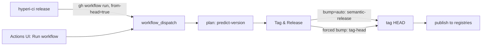

# Releasing on demand

`hyperi-ci push --release` is the normal release path: one CI run, one tag, one release, gated by the `Release: true` trailer. This page covers the cases it does not, and the rules for dispatching a release safely. The pipeline itself is [flow.md](flow.md).

## Release or retry without a junk `fix:`

`push --release` needs a release-worthy commit on HEAD. Two situations break that:

1. **A release run died before Tag & Release** (a transient failure, a container flake). No tag was cut, so `hyperi-ci release vX` has nothing to re-dispatch. `push --bump-patch` does nothing either, because `VERSION` on `main` already equals the target (#25, #35).
2. **You want to release HEAD now**, for docs- or refactor-only work, or without another `Release: true` push.

`hyperi-ci release` covers both (#35). The CLI only dispatches the workflow, and CI does the tagging and publishing. That works under branch protection and from the Actions UI.

| Command | What it dispatches | Use it to |
|---|---|---|
| `hyperi-ci release` | from-head, `bump=auto`: semantic-release picks the version, tags HEAD, publishes | finish a stuck release, or release HEAD when it has release-worthy commits |
| `hyperi-ci release --bump patch\|minor` | from-head with a forced bump: `tag-head` computes last + bump and tags HEAD via `gh api` | release HEAD with no release-worthy commit |
| `hyperi-ci release --version X.Y.Z` | from-head at an exact version, tagging HEAD directly | step past a taken or orphaned tag (#37) |
| `hyperi-ci release <tag>` | the existing tag, as an idempotent retry: publish handlers skip artefacts already in their registry | fill the registries a partial release missed |
| Actions UI -> Run workflow | the same modes, via the `tag` / `from-head` / `bump` inputs | release with no local checkout |

The plan job resolves the version on a dispatch too: semantic-release for `auto`, last + bump for a forced bump. So the build stamps the same version Tag & Release tags. `GITHUB_TOKEN` cuts the tag, and the CLI and the UI button run the same operation.

`push --publish` and `hyperi-ci publish` are old spellings. They still work and warn.

### Which ref a from-head dispatch releases from

The dispatch ref decides whether a from-head run releases (#471). `hyperi-ci release` dispatches on the default branch, but the Actions UI and `gh workflow run --ref` can pick any branch:

| Ref | `bump=auto` | forced `patch` / `minor` / `X.Y.Z` |
|---|---|---|
| main | releases | releases |
| declared prerelease branch (`beta`) | releases on the prerelease sequence (`1.2.0-beta.1`) | validate-only, warns -- a forced bump would cut a stable version |
| any other branch | validate-only, warns | validate-only, warns |

A `tag` dispatch re-publishes from any ref, because the tag already names the commit.

## Operating rules

### Do not dispatch a release while a merge is queued into that repo

A merge to `main` cancels the in-flight release run. A push and a from-head dispatch on `main` share one concurrency group, keyed on `github.ref`, with `cancel-in-progress: true`. Only a schedule, a validate-only dispatch and a `tag` dispatch get groups of their own (`concurrency:` in each `<lang>-ci.yml`). Land the merges, then dispatch.

Wait for the last merge's push run to appear in `gh run list` before you dispatch. GitHub registers a push run a few seconds after the merge, so a dispatch sent straight after can land first and then be cancelled. A `release <tag>` dispatch is safe.

The cancelled run leaves no tag and no artefacts, so recovery is another `hyperi-ci release`. The cost is the build time: 35-45 minutes per arch on a Tier 2 Rust release. Issue #228 has the measurements and the options.

### `push --release` drops the trailer when HEAD is already upstream

`push --release` amends HEAD with the `Release: true` trailer and then rebases. Where that commit is already on the remote, the rebase reports `skipped previously applied commit` and takes the upstream copy, which has no trailer. The push then says `Everything up-to-date` and no release runs.

Nothing warns. The tell is `Build: skipped` and `Release tail: skipped` on a run you expected to publish. Use `hyperi-ci release` instead, which dispatches from HEAD and needs no trailer commit.
