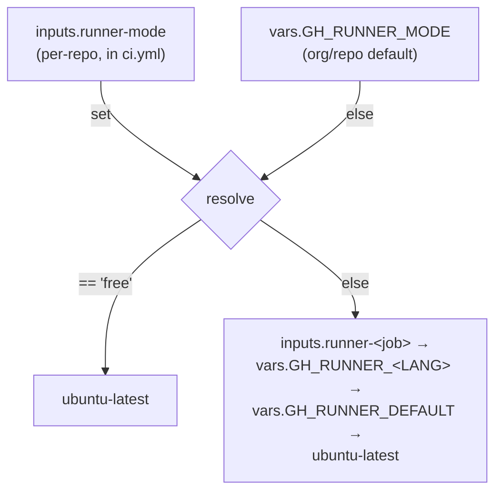
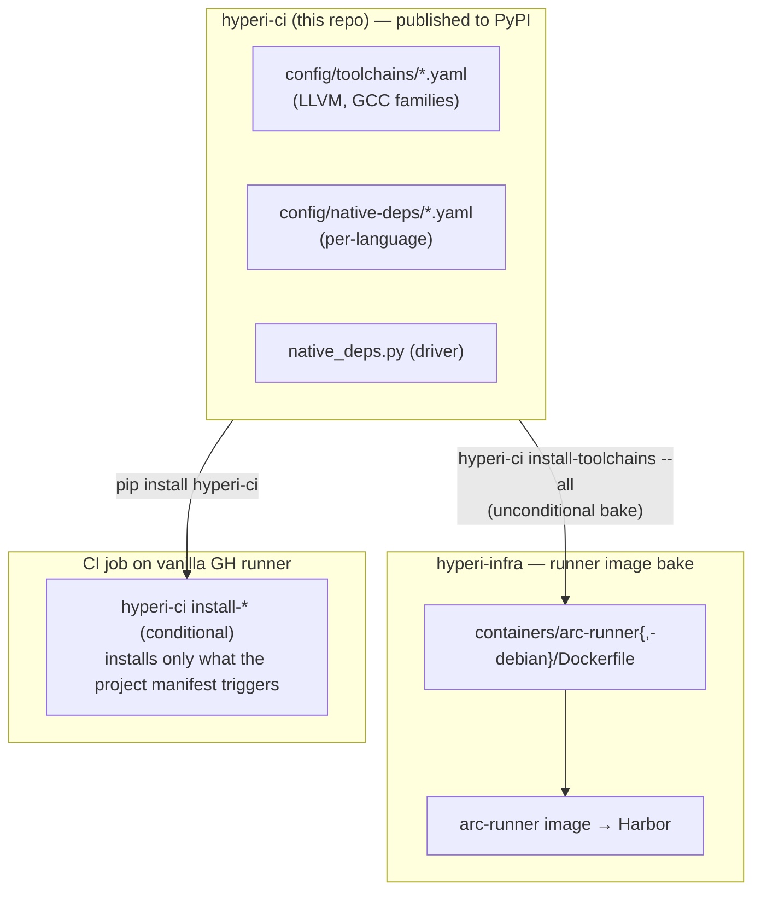
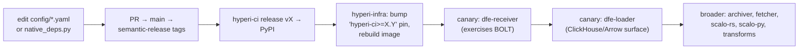

# Runners, dep-install SSOT, and build cache

Two execution modes, one dep-install code path, one persistent cache. CI runs
either on self-hosted ARC runners (DevEx cluster) or on GitHub-hosted runners,
and the same `hyperi-ci` install commands provision toolchains both at image
bake time and at CI time.

## Runner modes

| Mode | Runners | Cache | Toolchain |
|---|---|---|---|
| `self-hosted` | ARC runners on the DevEx RKE2 cluster | persistent NFS sccache/ccache | pre-baked in the runner image |
| `free` | GitHub-hosted `ubuntu-latest` | none between runs | installed per-job by `setup-runtime` |

`free` mode lets any GitHub org use hyperi-ci's reusable workflows with no
self-hosted infrastructure — builds just take longer (cold compile, per-job
toolchain install). Mode is resolved highest-wins:



`config/runners.yaml` is the runner SSOT (labels per architecture).

## Dep-install SSOT

**hyperi-ci is the single source of truth for all apt-driven dependency
installation.** One data format, one install code path, two invocation modes —
the runner image bakes deps via PyPI, CI jobs on vanilla runners install
on-demand via `pip install hyperi-ci`.



`scalo` is a runtime dep of hyperi-ci — bumping scalo means bumping
hyperi-ci at its next release.

### Two invocation modes

| Mode | Who | Behaviour |
|---|---|---|
| `install-toolchains --all` / `install-native-deps <lang> --all` | runner-image bake (hyperi-infra Dockerfile) | install every entry unconditionally; entries with `bake: false` are skipped |
| `install-toolchains` / `install-native-deps <lang>` | CI-time on vanilla runners | conditional — install only entries whose `patterns` match files in the project |

### YAML schema

Shared across `config/native-deps/*.yaml` (per-language conditional deps) and
`config/toolchains/*.yaml` (multi-version apt families):

```yaml
- name: <label for log lines>
  bake: true                        # optional, default true
  versions: [19, 20, 21, 22]        # optional; expands {V} into N entries
  patterns: ["Cargo.toml", "CMakeLists.txt"]   # substrings in manifest_files
  manifest_files: [Cargo.toml, CMakeLists.txt, .hyperi-ci.yaml]
  dpkg_check: clang-{V}             # skip if dpkg -s succeeds
  apt_repos:
    - key_url: https://apt.llvm.org/llvm-snapshot.gpg.key
      keyring: /usr/share/keyrings/llvm.gpg
      url: https://apt.llvm.org/${OS_CODENAME}/
      codename: llvm-toolchain-${OS_CODENAME}-{V}
  apt_packages: [clang-{V}, clang-tools-{V}, bolt-{V}]
```

| Placeholder | Source |
|---|---|
| `{V}` | per-version expansion (when `versions:` is set) |
| `${OS_CODENAME}` | `lsb_release -cs` or `OS_CODENAME` env |
| `${HYPERCI_LLVM_VERSION}` | env (default LLVM major); used by native-deps/rust.yaml for the BOLT pin |

### The `bake: false` flag — non-coinstallable toolsets

When an apt package declares `Conflicts: <package>-x.y`, only one version may be
installed at a time (on apt.llvm.org: `libc++-N-dev`, `libc++abi-N-dev`,
`libomp-N-dev`, `libunwind-N-dev`, `lldb-N`). Baking a default would lock out any
CI job needing a different version. Put those in a **single entry with
`bake: false`**: the runner image skips it (`--all` ignores `bake: false`), and
CI-time installs apply it conditionally when project patterns match. The pattern
applies to any toolset, not just LLVM.

## Split-runner multi-arch

Multi-arch builds use **native runners per architecture**, not
cross-compilation:

| Arch | Runner | Source var |
|---|---|---|
| x86_64 (amd64) | ARC self-hosted | `GH_RUNNER_RUST` / `GH_RUNNER_DEFAULT` |
| aarch64 (arm64) | GitHub `ubuntu-24.04-arm` | `GH_RUNNER_ARM64` |

**Why not cross-compile?** Cross-compilation with C/C++ deps (librdkafka, zlib,
openssl) needs a private sysroot with transitive dependency resolution — fragile,
each new native dep breaks differently. Native arm64 runners eliminate the whole
problem class.

**When does arm64 build?** Only on the `release` branch (GA). All other branches
(including `main`) build x64 only — dev-cycle builds stay fast and avoid arm64
runner cost.

| Branch | Architectures | Purpose |
|---|---|---|
| feature branches | x64 | development, PR validation |
| `main` | x64 | dev pre-releases |
| `release` | x64 + arm64 | GA |

Applies across languages: Rust/Go build native per arch; Python wheels and
TypeScript are arch-independent (single runner); Python Nuitka builds native.

## Build cache (Rust, C/C++)

Compilation caches persist across ephemeral runner pods via a shared NFS-backed
PersistentVolume — the primary mechanism for fast Rust/C++ builds.

| Variable | Value | Purpose |
|---|---|---|
| `SCCACHE_DIR` | `/mnt/cache/sccache` | sccache compilation cache (NFS) |
| `RUSTC_WRAPPER` | `sccache` | route rustc through sccache |
| `CCACHE_DIR` | `/mnt/cache/ccache` | C/C++ cache (NFS) |
| `CARGO_INCREMENTAL` | `0` | disabled — incompatible with sccache |
| `CARGO_REGISTRIES_CRATES_IO_PROTOCOL` | `sparse` | faster registry metadata |
| `LDFLAGS` | `-fuse-ld=mold` | mold linker (replaces slow ld.bfd) |

Package-manager metadata caches (Cargo registry, uv, pip, npm) use local
`emptyDir` volumes — metadata-heavy I/O performs poorly over NFS and repopulates
quickly. The cache is **disposable**: if the NFS volume is lost, the only impact
is slower first builds (which is why NFS `async` mode is used). A cold Rust build
with C deps takes much longer than a warm one — the cache is the difference.

uv caching (`setup-uv enable-cache`) is on only in `python-ci.yml`, where there
are real Python deps to cache. Non-Python workflows use uv solely to deliver
`uvx hyperi-ci`, so caching is off to avoid spurious "no cache files" warnings.

Infrastructure (PV/PVC, runner tiers, Dockerfile, Ansible) lives in
`hyperi-infra` (`k8s/`, `containers/arc-runner/`, `ansible/`). Runner tiers scale
to zero when idle and are ephemeral — one job per pod.

## Cross-compilation (legacy — dormant)

With the split-runner architecture, cross-compilation is no longer used for
standard multi-arch builds. The sysroot code stays in `build.py` but only
activates when a build target differs from the host arch — which never happens
with native runners. It remains for edge cases (e.g. RISC-V): builds native
first, installs only Multi-Arch-safe cross-compilers system-wide, assembles a
private sysroot under `/tmp/cross-sysroot/<arch>/` (no sudo), and wraps the
linker to force `-fuse-ld=bfd` + sysroot `-L`/`-rpath-link` flags. See
[LESSONS.md](../LESSONS.md) for the full rationale and gotchas.

## Operations (hyperi-infra)

Build + push runner images (Ubuntu + Debian variants):

```bash
env -C /projects/hyperi-infra \
  ansible-playbook -i ansible/inventories/prod/inventory.yml \
  ansible/playbooks/k8s-arc-runners.yml --tags image \
  -e harbor_admin_password=$(scripts/bao-admin kv get -field=admin_password kv/services/harbor)
```

New scale-set pods pick up `:latest` automatically (`imagePullPolicy: Always`)
— no Helm redeploy for image-only changes. Use `--tags deploy` for Helm-values
changes. Verify a YAML change without a rebuild:

```bash
OS_CODENAME=trixie uv run python -c "
from hyperi_ci.native_deps import _load_dep_groups
for g in _load_dep_groups('llvm', category='toolchains'):
    print(g.name, g.bake, g.apt_packages[:3])
"
uv run hyperi-ci install-toolchains --dry-run --project-dir /projects/dfe-receiver
```

## Rollout when a dep-install change lands



Each canary surfaces missing coverage or apt conflicts; iterate on the YAML.
