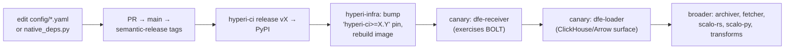

# ARC runner operations

The commands that rebuild the runner image, redeploy the scale sets, and carry a dep-install change out to the fleet.

What the image contains and the YAML that drives it are [runner-image.md](runner-image.md). Runner selection and the build cache are [runners.md](runners.md).

## Operations (hyperi-infra)

### Build + push runner images (one step)

```bash
env -C /projects/hyperi-infra \
  ansible-playbook -i ansible/inventories/prod/inventory.yml \
  ansible/playbooks/k8s-arc-runners.yml --tags image \
  -e harbor_admin_password=$(scripts/bao-admin kv get -field=admin_password kv/services/harbor)
```

Takes ~25-30 min. Builds both `arc-runner:latest` and `arc-runner-debian:latest`,
pushes to `harbor.devex.hyperi.io:8443`. New scale-set pods pick up the new image
automatically on next job spawn (`imagePullPolicy: Always`) - no Helm redeploy
needed for image-only changes.

### Is the build still going, or did it fail?

The playbook runs on infra, so a lost terminal tells you nothing. These three
answer it without one:

```bash
ssh ubuntu@infra.devex.hyperi.io 'pgrep -af "docker build"'
```

A matching line means a build is in flight. Ubuntu builds first, then Debian.
Empty output means it finished, OR the playbook errored -- that is the whole
reason for the second check rather than reading silence as success.

```bash
scripts/bao-admin kv get -field=admin_password kv/services/harbor
curl -u "admin:$PASSWORD" \
  'https://harbor.devex.hyperi.io:8443/api/v2.0/projects/library/repositories/arc-runner/artifacts?page_size=2'
```

Compare `.push_time` against when the rebuild started; repeat for
`arc-runner-debian`. No build running AND no fresh push means it errored, so
re-run the playbook.

### When the build fails

- **`E: held broken packages`** -- a new apt conflict in
  `install-toolchains --all`. The per-version install is one batched
  `apt-get install`, in `install_native_deps()` in `src/hyperi_ci/native_deps.py`.
- **`root is not in the sudoers file`** -- a Dockerfile `RUN` executes as root
  and `_sudo_prefix()` drops the `sudo` prefix there. This message means a
  STALE hyperi-ci is baked into the image.
- **A pin bump that does not take** -- Docker layer caching. Bump
  `'hyperi-ci>=X.Y'` to an exact version and rebuild that layer with
  `--no-cache`.

### Redeploy runner scale sets (Helm-values changes)

```bash
ansible-playbook -i ansible/inventories/prod/inventory.yml \
  ansible/playbooks/k8s-arc-runners.yml --tags deploy
```

### Verify healthy

```bash
ssh ubuntu@k8s-1.devex.hyperi.io
sudo kubectl -n arc-runners get pods
sudo kubectl -n arc-system get pods \
  -l app.kubernetes.io/component=runner-scale-set-listener
```

Scale-to-zero when idle - an empty `arc-runners` namespace is normal.

### Verify a YAML change without a full rebuild

```bash
OS_CODENAME=trixie uv run python -c "
from hyperi_ci.native_deps import _load_dep_groups
for g in _load_dep_groups('llvm', category='toolchains'):
    print(f'{g.name:30} bake={g.bake} packages={g.apt_packages[:3]}...')
"

uv run hyperi-ci install-toolchains --dry-run \
  --project-dir /projects/dfe-receiver
```

## Rollout when a dep-install change lands



Step by step:

1. **hyperi-ci**: branch, edit `config/*.yaml` or `native_deps.py`.
2. **hyperi-ci**: open PR, merge to main, semantic-release tags `vX.Y.Z`.
3. **hyperi-ci**: `hyperi-ci release vX.Y.Z` dispatches the release workflow to PyPI.
4. **hyperi-infra**: to force a Docker cache-miss, bump the `'hyperi-ci>=X.Y'`
   pin in BOTH `containers/arc-runner/Dockerfile` and
   `containers/arc-runner-debian/Dockerfile`, then commit and rebuild the image
   (see Operations above).
5. **canary**: `dfe-receiver` runs first. New pods pull `:latest`
   (`imagePullPolicy: Always`), so the next job uses the new image. Watch the
   BOLT flow specifically - cargo-pgo exercises most of the new surface.
6. **second canary**: `dfe-loader` - same shape, different deps
   (ClickHouse-client, Arrow, columnar), broader apt surface.
7. **broader rollout**: `dfe-archiver`, `dfe-fetcher`, `scalo-rs`, `scalo-py`,
   the transform projects.

Each canary surfaces missing coverage or apt conflicts - iterate on the YAML.
