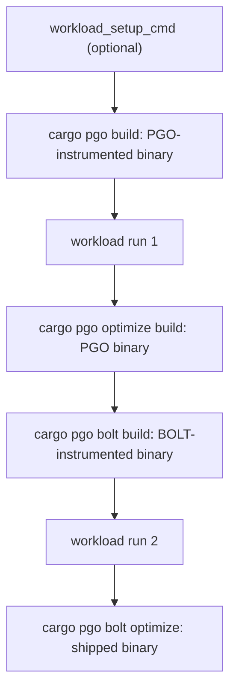

# Writing a PGO Workload for hyperi-ci

PGO (Profile-Guided Optimisation) records which code paths run hot under a workload, then rebuilds the binary with that knowledge. A good workload gives 10-20% speedup. A bad one teaches the compiler the wrong paths and the binary gets slower.

The opt-in config is in [`rust-tier2.md`](../languages/rust-tier2.md). Copy-paste starting points are in `templates/pgo-workload/`.

## Invocation contract

hyperi-ci appends the instrumented binary path to your `workload_cmd` as the first argument (`$1`). It also exports it as `HYPERCI_PGO_INSTRUMENTED_BINARY`, and exports `duration_secs` (default 300) as `PGO_WORKLOAD_DURATION_SECS`.

```yaml
build:
  rust:
    optimize:
      pgo:
        workload_cmd: "bash scripts/pgo-workload.sh"
```

With that config hyperi-ci runs:

```bash
bash scripts/pgo-workload.sh /path/to/target/<triple>/release/<binary>
```

A project with `scripts/pgo-workload.sh` and no `workload_cmd` gets that command by default. The script starts like this: <!-- doc-paths: ignore -->

```bash
#!/usr/bin/env bash
set -euo pipefail
RECEIVER_BIN="$1"
[[ -x "$RECEIVER_BIN" ]] || { echo "usage: $0 <binary>" >&2; exit 1; }
```

The workload runs twice, once per instrumented binary. It must stop by `PGO_WORKLOAD_DURATION_SECS`, and the wrapper kills it at that plus 600 seconds.



- `skip-optimize` drops PGO and BOLT for one run: [`rust-tier2.md`](../languages/rust-tier2.md) -> *Skipping optimisation for one run*.
- `optimize-tier: release` runs them on a run that publishes nothing: *Testing it in CI without a release* below.
- A prerelease off a branch proves a workload end to end without spending a stable version: [`prereleases.md`](../prereleases.md).

### aarch64: a BOLTed binary is not safe on Cortex-A53

llvm-bolt refuses the erratum 843419 veneers the aarch64 linker inserts. So the aarch64 BOLT steps link through a wrapper in `~/.cache/hyperi-ci/bolt-linker/` that drops `-Wl,--fix-cortex-a53-843419` and adds `-mno-fix-cortex-a53-843419`. It then execs `CARGO_TARGET_<TRIPLE>_LINKER`, else `aarch64-linux-gnu-gcc`, else `cc`.

HyperI binaries run on Graviton and Ampere-class cores, not the in-order A53 in phones and embedded parts. **If a deployment target ever includes Cortex-A53**, take PGO-only aarch64 builds. amd64 is unaffected.

## The Four Rules

### Rule 1 - Exercise data-processing hot paths, not startup

Drive what production drives most: parse, validate, transform, route, serialise, send. For a receiver that is HTTP POSTs with realistic bodies. For a loader it is Kafka messages run through to ClickHouse.

**Never profile startup, health checks or config loading.** They run once per process. A profile dominated by them makes the optimiser inline startup branches into the hot path, and production slows down.

```bash
# WRONG: this profile is 100% readiness checks
for _ in $(seq 1 1000); do
    curl -sf http://localhost:8080/health/ready
done

# WRONG: one request, so startup paths dominate the profile
curl -X POST http://localhost:8080/ -d '{"test":true}'

# RIGHT: sustained realistic load through the request pipeline
oha -z 300s -c 50 -m POST -T application/json \
    -D payload.json http://localhost:8080/
```

### Rule 2 - Realistic traffic mix

PGO optimises for whatever distribution the profile holds. If production is 80% GETs, an all-POST workload makes GETs slower. Match payload sizes and error rates too.

Keep the mix in a file such as `workload_mix.csv`, versioned beside the script, so a reviewer can check it.

### Rule 3 - Sustained duration, minimum 60s

Under 60 seconds the profile is noisy and startup-heavy. 300s is the default. Past 10 minutes the profile stops changing.

The floor is on the workload author. Nothing in the PGO stage measures how long the workload ran, so a script that exits after 10s ships a poor profile. The bundled templates hold to the floor. A script you write does not inherit that.

### Rule 4 - Deterministic and self-contained

The workload runs on a fresh CI runner. A remote API, live Kafka cluster or stale database that fails turns into a failed release build.

Use testcontainers, `docker run` or synthetic local data. Start Kafka or the database inside the workload script, and clean up in an `EXIT` trap.

## Profile quality

A good profile runs 60s or more and writes at least 1 MB of `.profraw` in total. Less means the workload missed the hot path. hyperi-ci checks neither, so only a corrupt profile fails, when cargo-pgo cannot merge it. Issue #133 covers failing a half-optimised release instead.

## Anti-patterns

On top of the four rules:

| Anti-pattern | Why it hurts |
|---|---|
| Hardcoded paths like `/home/me/data.json` | Missing on CI runners |
| The same payload every request | The branch predictor learns one case |
| Random payloads with no size distribution | Allocation pattern does not match production |
| An in-memory mock in place of Kafka or the DB | Skips the allocations those drivers make in production |

## Workload shapes

Each shape has a template in `templates/pgo-workload/`.

| Shape | How to drive it | Template |
|---|---|---|
| HTTP server | `oha`, `vegeta` or `wrk2`. Mix small, medium and batch payloads, with production's auth headers | `http-server.sh` |
| gRPC server | `ghz` for sustained load (`grpcurl` is too slow), or the tonic-generated client. Mix the unary and streaming calls the service has | `grpc-server.sh` |
| Kafka producer | HTTP or gRPC requests that trigger produce calls, in tight batches, against a real broker | `kafka-producer.sh` |
| Kafka consumer | Produce to the topic the binary consumes, so the profile covers consume -> process -> sink | `kafka-consumer.sh` |
| Multi-protocol | Each listener in production proportion, from a Rust driver in the same project | `multi-protocol.sh` |

For OTLP, Lumberjack, Fluent Forward and other unusual protocols, a Rust driver wins: it reuses the project's proto types and TLS config.

## Validating your workload locally

Test the pipeline locally before opting in. CI passes `--bin` for each shipped binary on every `cargo pgo` step, so a feature-gated driver in the same package never compiles against the profile. Do the same here:

```bash
cargo install cargo-pgo
rustup component add llvm-tools-preview

# 1. Instrument
cargo pgo build -- --bin <your-binary> --features jemalloc

# 2. Run your workload against the instrumented binary
bash scripts/pgo-workload.sh ./target/x86_64-unknown-linux-gnu/release/<your-binary>

# 3. Inspect profile size (at least 1 MB total)
ls -la target/pgo-profiles/*.profraw

# 4. Merge profiles
llvm-profdata merge -o target/pgo-profiles/merged.profdata target/pgo-profiles/*.profraw

# 5. Show top functions by coverage
llvm-profdata show --topn=20 target/pgo-profiles/merged.profdata
# Expected: request-handler and parsing functions at the top.
# Red flag: startup or config-loading functions at the top.

# 6. Build optimised
cargo pgo optimize build -- --bin <your-binary> --features jemalloc
```

If step 5 shows startup code at the top, drive more sustained traffic, or start the load only once the binary is ready.

### Testing it in CI without a release

The `optimize-tier: release` dispatch input builds Tier 2 on one validate-only run:

```bash
gh workflow run ci.yml --ref <branch> -f optimize-tier=release
```

Nothing is tagged or published. A bare dispatch builds both arches at Tier 2: the arm64 build on dfe-receiver took 52 minutes against about 4 at Tier 1 (issue #257).

- A dispatch that publishes nothing gets its own concurrency group per ref (`dispatch-<ref>`), so it cannot cancel a release on `main` or be cancelled by a push. A second such dispatch on the same ref cancels the first.
- Per-run input only, with no repo variable or config key, because every run would pay for it.
- It beats `skip-optimize`, with a warning, so the image label and release notes match the binary.
- The strict check applies: with a workload configured, a run where PGO or BOLT never reaches the binary fails. With no workload it builds Tier 1.
- `release` is the only value. Anything else fails the build.
- `hyperi-ci init` writes the input into a new `ci.yml`. An older one declares it under `workflow_dispatch.inputs` and forwards it under `with:`.

## Bisecting BOLT

A BOLT binary that misbehaves where the PGO-only one does not points at the optimise-stage flags. `bolt-optimize-args` replaces them for one validate-only run, so each bisect step is one dispatch:

```bash
gh workflow run ci.yml --ref <branch> -f optimize-tier=release \
  -f bolt-optimize-args="-reorder-blocks=ext-tsp -relocs -lite=1"
```

Start from `_CARGO_PGO_OPTIMIZE_BOLT_ARGS` in `src/hyperi_ci/languages/rust/pgo.py` and drop flags. It copies cargo-pgo's own defaults, and a unit test fails when `tools.cargo-pgo` is bumped until the copy is re-read.

- Debug only. A run that ships refuses it: tag or from-head dispatch, release-trailer push, tag ref.
- Needs `optimize-tier=release`, else the build refuses.
- Only the optimise stage changes. The flags go to llvm-bolt as given on every architecture, with no veneer option needed on aarch64.
- One token per flag, starting with `-`, a value as `-name=value`, from letters, digits and `_ . , : + = -`. No empty set: `-dyno-stats` alone is the nearest.
- The run carries a `::warning::` naming the flags.
- Rust callers only, declared and forwarded like `optimize-tier`.

## Reference implementation

dfe-receiver ships Tier 2 and is the template for multi-protocol services. Read the two files together:

- `scripts/pgo-workload.sh` <!-- doc-paths: ignore --> - orchestrator: Kafka container, binary lifecycle, cleanup trap
- `src/bin/pgo_driver.rs` <!-- doc-paths: ignore --> - the `pgo-driver` binary, behind `required-features = ["pgo-driver"]`, which drives each listener and reuses the project's Prometheus Remote Write and OTLP protobuf types
