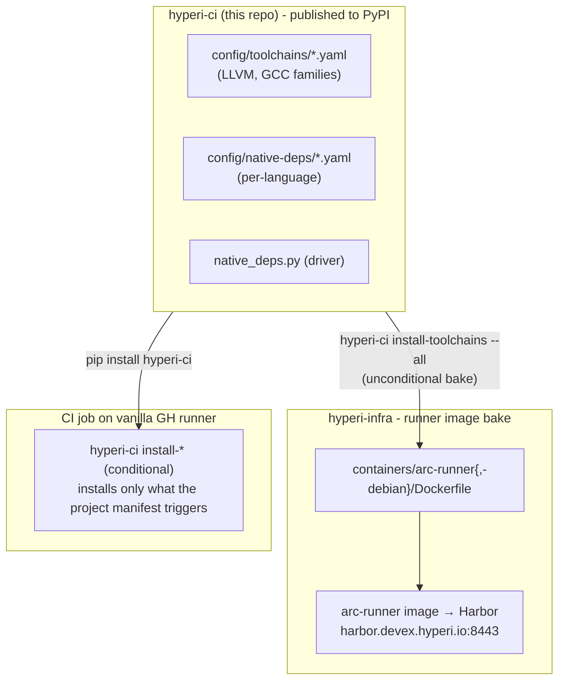

# Runner image and the dep-install SSOT

The same `hyperi-ci` install commands provision toolchains both at image bake time and at CI time. hyperi-ci is the single source of truth for all apt-driven dependency installation - runner image builds consume it via PyPI, CI jobs on vanilla GH runners consume it via `pip install hyperi-ci`.

Which runner a job lands on, and the cache it gets there, is [runners.md](runners.md). The commands that rebuild this image and roll a change out are [arc-operations.md](arc-operations.md).

## Dep-install SSOT

**hyperi-ci is the single source of truth for all apt-driven dependency
installation.** One data format, one install code path, two invocation modes -
the runner image bakes deps via PyPI, CI jobs on vanilla runners install
on-demand via `pip install hyperi-ci`.



`scalo` is a runtime dep of hyperi-ci (logger, config cascade) - bumping scalo
means bumping hyperi-ci at its next release.

## Two invocation modes

| Mode | Who uses it | Behaviour |
|---|---|---|
| `install-toolchains --all` / `install-native-deps <lang> --all` | runner-image bake (hyperi-infra Dockerfile) | Install every entry unconditionally. Ignores manifest patterns. Entries with `bake: false` are skipped (see below). |
| `install-toolchains` / `install-native-deps <lang>` | CI-time on vanilla `ubuntu-latest` or arm64 GH runners | Conditional. Install only entries whose `patterns` match files named in `manifest_files` in the project. |

## YAML schema

Shared across `config/native-deps/*.yaml` (per-language conditional deps) and
`config/toolchains/*.yaml` (multi-version apt families).

The fields that decide whether an entry fires:

```yaml
- name: <label for log lines>
  bake: true                        # optional, default true; see below
  versions: [19, 20, 21, 22, 23]    # optional; expands {V} into N entries
  patterns:                         # substrings searched in manifest_files
    - "Cargo.toml"
    - "CMakeLists.txt"
  manifest_files:                   # relative to project root
    - Cargo.toml
    - CMakeLists.txt
    - .hyperi-ci.yaml
  dpkg_check: clang-{V}             # skip if dpkg -s succeeds
```

The fields that say what it installs:

```yaml
  apt_repos:                        # optional repos to add before install
    - key_url: https://apt.llvm.org/llvm-snapshot.gpg.key
      keyring: /usr/share/keyrings/llvm.gpg
      url: https://apt.llvm.org/${OS_CODENAME}/
      codename: llvm-toolchain-${OS_CODENAME}-{V}
  apt_packages:
    - clang-{V}
    - clang-tools-{V}
    - bolt-{V}
```

| Placeholder | Source | Example |
|---|---|---|
| `{V}` | per-version expansion (when `versions:` is set) | `19`, `20`, `21`, `22`, `23` |
| `${OS_CODENAME}` | `lsb_release -cs` or `OS_CODENAME` env var | `noble`, `trixie`, `resolute` |
| `${HYPERCI_LLVM_VERSION}` | `HYPERCI_LLVM_VERSION` env var (default `23`) | used by native-deps/rust.yaml for the BOLT version pin |

## The `bake: false` flag - non-coinstallable toolsets

When an apt package declares `Conflicts: <package>-x.y`, only one version may be
installed at a time. Examples on apt.llvm.org: `libc++-N-dev`, `libc++abi-N-dev`,
`libomp-N-dev`, `libunwind-N-dev`, and `lldb-N` (via its `python3-lldb-N` dep).
Baking a default would lock out any CI job needing a different version.

Pattern: put the non-coinstallable packages in a **single entry with
`bake: false`**. It becomes install-on-demand only - the runner image skips it
(`--all` ignores `bake: false`), and CI-time installs apply it conditionally
when project patterns match.

```yaml
- name: llvm-non-coinstallable
  bake: false                       # skipped in --all; installed on-demand
  patterns: ["Cargo.toml", "CMakeLists.txt"]
  manifest_files: [Cargo.toml, CMakeLists.txt, .hyperi-ci.yaml]
  dpkg_check: libc++-22-dev
  apt_repos: [...]                  # apt.llvm.org for v22
  apt_packages:
    - lldb-22
    - libc++-22-dev
    - libc++abi-22-dev
    - libomp-22-dev
    - libunwind-22-dev
```

This pattern applies to any toolset - not just LLVM. Future families (GCC beta
versions, JDK preview builds, etc.) follow the same convention.

## What the runner image contains

The `containers/arc-runner/Dockerfile` (Ubuntu noble) and
`containers/arc-runner-debian/Dockerfile` (Debian trixie) both do:

```dockerfile
RUN pip install --no-cache-dir --break-system-packages 'hyperi-ci>=X.Y' && \
    OS_CODENAME=noble hyperi-ci install-toolchains --all
```

This produces the pre-baked toolchains below, per the shipped YAML.

### LLVM (coinstallable v19/20/21/22/23)

`clang-N`, `clang-tools-N`, `clangd-N`, `lld-N`, `llvm-N`, `llvm-N-dev`,
`llvm-N-tools`, `libclang-N-dev`, `libclang-rt-N-dev`, `bolt-N`

### GCC (coinstallable v13/14)

`gcc-N`, `g++-N`, `libstdc++-N-dev`

### Default `clang`, `lld`, `ld.lld` alternatives

Point at v19 (ClickHouse OSS compatibility). BOLT's cargo-pgo flow invokes the
unversioned `ld.lld`. hyperi-ci's `_ensure_llvm_bolt_available()` in
`languages/rust/pgo.py` shims versioned binaries into `~/.local/bin` at runtime
when a specific `HYPERCI_LLVM_VERSION` is requested.

### Skipped at image bake (install-on-demand)

`lldb-22`, `libc++-22-dev`, `libc++abi-22-dev`, `libomp-22-dev`,
`libunwind-22-dev` - the `bake: false` entries. Jobs that need them incur a
~5s apt-get at runtime. Projects that need a different version install theirs
themselves.

### Still baked inline in the Dockerfile

Bootstrap packages (`python3`, `python3-pip`, `curl`, `gnupg`,
`ca-certificates`), the internal CA chain, base apt packages (`build-essential`,
`cmake`, `ninja-build`, `mold`, ...), Python/Rust/Node runtimes, CI tool
binaries (`gh`, `hadolint`, `shellcheck`, `actionlint`), arm64 cross-compile
sources. Folding these into hyperi-ci is planned later-phase work.
