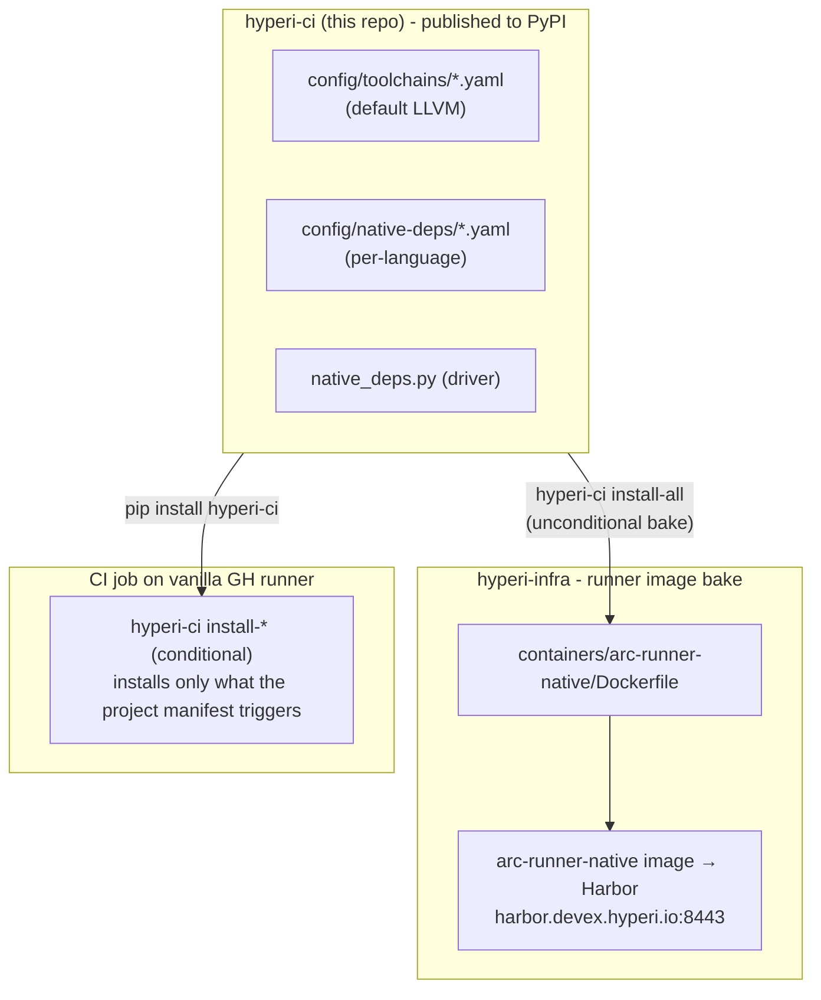

# Runner image and the dep-install SSOT

The same `hyperi-ci` install commands provision toolchains both at image bake time and at CI time. hyperi-ci is the single source of truth for all apt-driven dependency installation - runner image builds consume it via PyPI, CI jobs on vanilla GH runners consume it via `pip install hyperi-ci`.

Which runner a job lands on, and the cache it gets there, is [runners.md](runners.md). The commands that rebuild this image and roll a change out are [arc-operations.md](arc-operations.md).

## Dep-install SSOT

**hyperi-ci is the single source of truth for all apt-driven dependency
installation.** One data format, one install code path, two invocation modes -
the runner image bakes deps via PyPI, CI jobs on vanilla runners install
on-demand via `pip install hyperi-ci`.


```mermaid
flowchart TB
    subgraph HCI["hyperi-ci (this repo) - published to PyPI"]
        TC["config/toolchains/*.yaml<br/>(default LLVM)"]
        ND["config/native-deps/*.yaml<br/>(per-language)"]
        DRV["native_deps.py (driver)"]
    end
    subgraph INFRA["hyperi-infra - runner image bake"]
        DF["containers/arc-runner-native/Dockerfile"]
        IMG["arc-runner-native image → Harbor<br/>harbor.devex.hyperi.io:8443"]
    end
    subgraph CIJOB["CI job on vanilla GH runner"]
        AUTO["hyperi-ci install-* (conditional)<br/>installs only what the project manifest triggers"]
    end
    HCI -->|"hyperi-ci install-all<br/>(unconditional bake)"| DF --> IMG
    HCI -->|"pip install hyperi-ci"| AUTO
```

`scalo` is a runtime dep of hyperi-ci (logger, config cascade) - bumping scalo
means bumping hyperi-ci at its next release.

## Two invocation modes

| Mode | Who uses it | Behaviour |
|---|---|---|
| `install-all`, or `install-toolchains --all` / `install-native-deps <lang> --all` | runner-image bake (hyperi-infra Dockerfile) | Install every entry unconditionally. Ignores manifest patterns. Entries with `bake: false` are skipped (see below). |
| `install-toolchains` / `install-native-deps <lang>` | CI-time on vanilla `ubuntu-latest` or arm64 GH runners | Conditional. Install only entries whose `patterns` match files named in `manifest_files` in the project. |

## YAML schema

Shared across `config/native-deps/*.yaml` (per-language conditional deps) and
`config/toolchains/*.yaml` (the apt families the image bakes).

The `llvm-clang` entry from `native-deps/rust.yaml` shows every field. The ones that decide whether it fires:

```yaml
- name: llvm-clang                  # label for log lines
  patterns:                         # substrings searched in manifest_files
    - 'linker = "clang'
    - "linker=clang"
  manifest_files:                   # relative to project root; missing ones are skipped
    - .cargo/config.toml
    - .cargo/config
  dpkg_check: clang-${HYPERCI_LLVM_VERSION}   # skip if dpkg -s succeeds
```

The fields that say what it installs:

```yaml
  apt_repos:                        # optional repos to add before install
    - key_url: https://apt.llvm.org/llvm-snapshot.gpg.key
      keyring: /usr/share/keyrings/llvm.gpg
      key_fingerprint: 6084F3CF814B57C1CF12EFD515CF4D18AF4F7421
      url: https://apt.llvm.org/${OS_CODENAME}/
      codename: llvm-toolchain-${OS_CODENAME}-${HYPERCI_LLVM_VERSION}
  apt_packages:
    - clang-${HYPERCI_LLVM_VERSION}
```

One optional field: `bake: false` (below).

| Placeholder | Source | Example |
|---|---|---|
| `${OS_CODENAME}` | `lsb_release -cs` or `OS_CODENAME` env var | `noble`, `trixie`, `resolute` |
| `${HYPERCI_LLVM_VERSION}` | the designated LLVM major: `HYPERCI_LLVM_VERSION` env var, then `build.rust.llvm_version` in `.hyperi-ci.yaml`, then versions.yaml `runtimes.llvm` (`23`) | native-deps/rust.yaml, for the job-time bolt, lld and clang |
| `${HYPERCI_LLVM_DEFAULT}` | versions.yaml `runtimes.llvm` (`23`) alone | toolchains/llvm.yaml, so the bake never follows the env var or a project pin |

## The `bake: false` flag - non-coinstallable toolsets

When an apt package declares `Conflicts: <package>-x.y`, only one version may be
installed at a time, so baking one would lock out any CI job needing another.

Pattern: put the non-coinstallable packages in a **single entry with
`bake: false`**. It becomes install-on-demand only - the runner image skips it
(`--all` ignores `bake: false`), and CI-time installs apply it conditionally
when project patterns match. No shipped entry uses it today.

## What the runner image contains

Only hyperi-infra's `containers/arc-runner-native/Dockerfile` (Ubuntu noble) bakes from hyperi-ci. It runs the exact release `build.sh` resolved, from a throwaway uv environment, so hyperi-ci itself is not left in the image:

```dockerfile
RUN CI=true OS_CODENAME=noble \
    uvx --from "hyperi-ci==${HYPERI_CI_VERSION}" hyperi-ci install-all
```

`install-all` runs the language toolchains (rustup, Go, Node, Python), then `config/toolchains/`, then every language's `config/native-deps/`. The next step reads `runtime_version('llvm')` into `/etc/hyperi-llvm-version` and points the unversioned alternatives at that major. `arc-runner-vanilla` and `arc-runner-debian` carry no toolchain on purpose.

This produces the pre-baked toolchains below, per the shipped YAML.

### Language toolchains (`src/hyperi_ci/config/bootstrap.yaml`)

- Rust stable and nightly with `clippy` and `rustfmt`, through rustup-init at versions.yaml `tools.rustup`. No arm64 target: arm64 builds run on arm64 runners.
- sccache at versions.yaml `tools.sccache`. The image sets `RUSTC_WRAPPER=sccache`, and no CI step installs it.
- Go at versions.yaml `runtimes.go`, from go.dev.
- Node at versions.yaml `runtimes.node` through nvm at `tools.nvm`, the one major baked and the default on PATH.
- Python at versions.yaml `runtimes.python` through `uv python install`, into the image's `UV_PYTHON_INSTALL_DIR` (set image-side, never by hyperi-ci), so a job's `uvx hyperi-ci` finds it without a download.

rustup-init, sccache, the Go tarball and nvm's install.sh are each checked against their sha256 in versions.yaml before they run or are unpacked, and a mismatch fails the bake. Nothing asks the GitHub API which release is current, so the bake spends none of the anonymous rate limit.

cargo-audit, cargo-deny and cargo-nextest are not baked. The setup-rust-tools and setup-nextest composites install their versions.yaml pins on every Rust job, so a baked copy would never run.

### LLVM (the versions.yaml default only)

`clang-N`, `lld-N`, `llvm-N`, `llvm-N-dev`,
`llvm-N-tools`, `libclang-N-dev`, `libclang-rt-N-dev`, `bolt-N`

### GCC

hyperi-ci bakes none. The image's gcc is the distro default that the Dockerfile's `build-essential` brings (13 on noble).

### Default `clang`, `lld`, `ld.lld` alternatives

Point at the versions.yaml `runtimes.llvm` default, the one major the image bakes. Quality, test and a plain release build link with these. A PGO build
shims the designated major's `ld.lld-NN`, `clang-NN`, `clang++-NN`, `llvm-bolt-NN` and `merge-fdata-NN`
into `~/.local/bin` and puts it first on PATH, ahead of the image's own links. The
designated major is `HYPERCI_LLVM_VERSION`, then `build.rust.llvm_version` in
`.hyperi-ci.yaml`, then versions.yaml `runtimes.llvm`. The build log names it: `LLVM 23 (versions.yaml): ld.lld -> /usr/bin/ld.lld-23`.

The `clang` shim covers a project with `linker = "clang"`: the shimmed clang takes `ld.lld` from its own install before PATH, so a clang-driven link follows the designated major the same way a gcc-driven one does.

### Still baked inline in the Dockerfile

Compilers and headers the native-deps entries assume (`build-essential`, `cmake`, `ninja-build`, `ccache`, `pkg-config`, the autotools, `shellcheck`, `python3`), and pnpm plus the semantic-release plugins. Its arm64 cross gcc and ports sources are unused, because hyperi-ci does not cross-compile. The vanilla base supplies the internal CA chain, the docker CLI and uv. Folding these into hyperi-ci is planned later-phase work.
