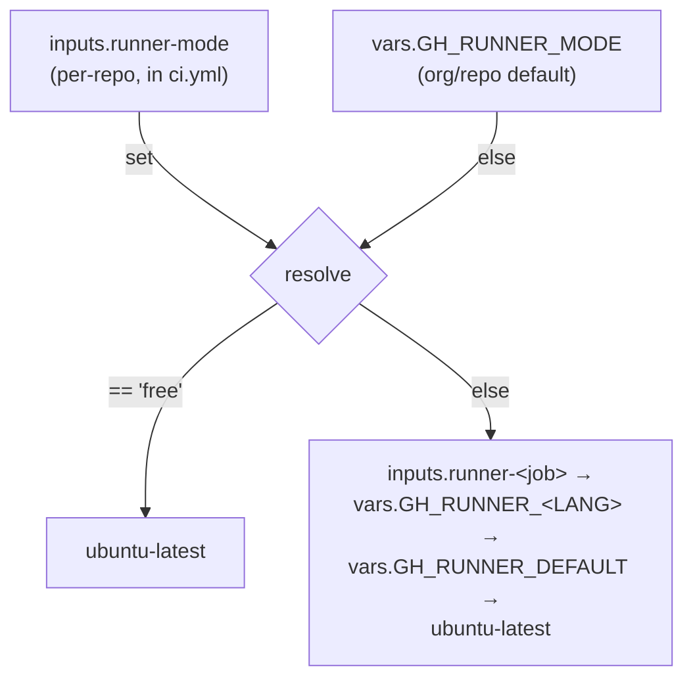
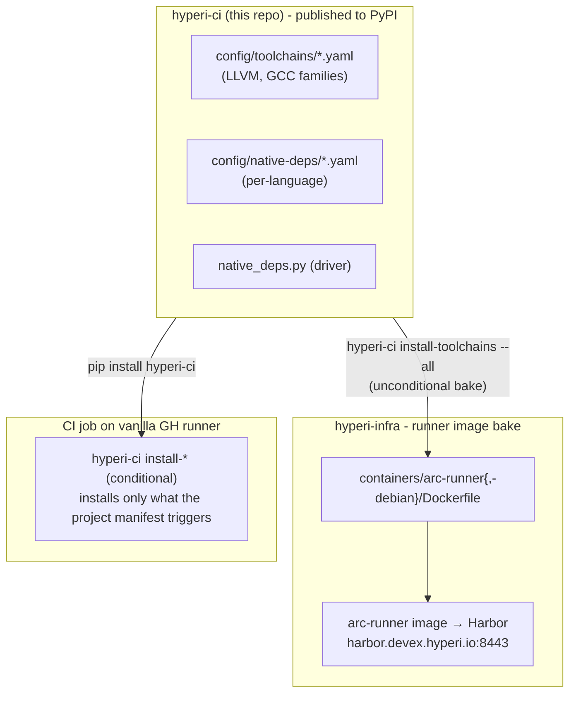
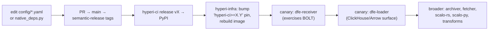

# Runners, dep-install SSOT, and build cache

Two execution modes, one dep-install code path, one persistent cache. CI runs
either on self-hosted ARC runners (Actions Runner Controller on the DevEx RKE2
cluster) or on GitHub-hosted runners, and the same `hyperi-ci` install commands
provision toolchains both at image bake time and at CI time. hyperi-ci is the
single source of truth for all apt-driven dependency installation - runner image
builds consume it via PyPI, CI jobs on vanilla GH runners consume it via
`pip install hyperi-ci`.

## Runner modes

| Mode | Runners | Cache | Toolchain |
|---|---|---|---|
| `self-hosted` | ARC runners on the DevEx RKE2 cluster | persistent NFS sccache/ccache | pre-baked in the runner image |
| `free` | GitHub-hosted `ubuntu-latest` | none between runs | installed per-job by `setup-runtime` |

`free` mode lets any GitHub org use hyperi-ci's reusable workflows with no
self-hosted infrastructure - builds just take longer (cold compile, per-job
toolchain install). Mode is resolved highest-wins:



`config/runners.yaml` is the runner SSOT (labels per architecture).

### Self-hosted runner tiers

ARC runner scale sets are sized in tiers. The k8s manifests in hyperi-infra
are the SSoT; the sizing, for reference:

| Tier | CPUs | RAM | maxRunners | Typical use |
|---|---|---|---|---|
| 2cpu | 2 | 4Gi | 20 | lint, test, publish, tag |
| 4cpu | 4 | 8Gi | 10 | Python / Node.js builds, small Rust crates |
| 8cpu | 8 | 16Gi | 5 | medium Rust / C++ builds, integration tests |
| 16cpu | 16 | 28Gi | 3 | large Rust / C++ release builds, ClickHouse |

## Dep-install SSOT

**hyperi-ci is the single source of truth for all apt-driven dependency
installation.** One data format, one install code path, two invocation modes -
the runner image bakes deps via PyPI, CI jobs on vanilla runners install
on-demand via `pip install hyperi-ci`.



`scalo` is a runtime dep of hyperi-ci (logger, config cascade) - bumping scalo
means bumping hyperi-ci at its next release.

### Two invocation modes

| Mode | Who uses it | Behaviour |
|---|---|---|
| `install-toolchains --all` / `install-native-deps <lang> --all` | runner-image bake (hyperi-infra Dockerfile) | Install every entry unconditionally. Ignores manifest patterns. Entries with `bake: false` are skipped (see below). |
| `install-toolchains` / `install-native-deps <lang>` | CI-time on vanilla `ubuntu-latest` or arm64 GH runners | Conditional. Install only entries whose `patterns` match files named in `manifest_files` in the project. |

### YAML schema

Shared across `config/native-deps/*.yaml` (per-language conditional deps) and
`config/toolchains/*.yaml` (multi-version apt families):

```yaml
- name: <label for log lines>
  bake: true                        # optional, default true; see below
  versions: [19, 20, 21, 22]        # optional; expands {V} into N entries
  patterns:                         # substrings searched in manifest_files
    - "Cargo.toml"
    - "CMakeLists.txt"
  manifest_files:                   # relative to project root
    - Cargo.toml
    - CMakeLists.txt
    - .hyperi-ci.yaml
  dpkg_check: clang-{V}             # skip if dpkg -s succeeds
  apt_repos:                        # optional repos to add before install
    - key_url: https://apt.llvm.org/llvm-snapshot.gpg.key
      keyring: /usr/share/keyrings/llvm.gpg
      url: https://apt.llvm.org/${OS_CODENAME}/
      codename: llvm-toolchain-${OS_CODENAME}-{V}
  apt_packages:
    - clang-{V}
    - clang-tools-{V}
    - bolt-{V}
```

| Placeholder | Source | Example |
|---|---|---|
| `{V}` | per-version expansion (when `versions:` is set) | `19`, `20`, `21`, `22` |
| `${OS_CODENAME}` | `lsb_release -cs` or `OS_CODENAME` env var | `noble`, `trixie`, `resolute` |
| `${HYPERCI_LLVM_VERSION}` | `HYPERCI_LLVM_VERSION` env var (default `22`) | used by native-deps/rust.yaml for the BOLT version pin |

### The `bake: false` flag - non-coinstallable toolsets

When an apt package declares `Conflicts: <package>-x.y`, only one version may be
installed at a time. Examples on apt.llvm.org: `libc++-N-dev`, `libc++abi-N-dev`,
`libomp-N-dev`, `libunwind-N-dev`, and `lldb-N` (via its `python3-lldb-N` dep).
Baking a default would lock out any CI job needing a different version.

Pattern: put the non-coinstallable packages in a **single entry with
`bake: false`**. It becomes install-on-demand only - the runner image skips it
(`--all` ignores `bake: false`), and CI-time installs apply it conditionally
when project patterns match.

```yaml
- name: llvm-non-coinstallable
  bake: false                       # skipped in --all; installed on-demand
  patterns: ["Cargo.toml", "CMakeLists.txt"]
  manifest_files: [Cargo.toml, CMakeLists.txt, .hyperi-ci.yaml]
  dpkg_check: libc++-22-dev
  apt_repos: [...]                  # apt.llvm.org for v22
  apt_packages:
    - lldb-22
    - libc++-22-dev
    - libc++abi-22-dev
    - libomp-22-dev
    - libunwind-22-dev
```

This pattern applies to any toolset - not just LLVM. Future families (GCC beta
versions, JDK preview builds, etc.) follow the same convention.

## What the runner image contains

The `containers/arc-runner/Dockerfile` (Ubuntu noble) and
`containers/arc-runner-debian/Dockerfile` (Debian trixie) both do:

```dockerfile
RUN pip install --no-cache-dir --break-system-packages 'hyperi-ci>=X.Y' && \
    OS_CODENAME=noble hyperi-ci install-toolchains --all
```

This produces the following pre-baked toolchains per the shipped YAML.

### LLVM (coinstallable v19/20/21/22)

`clang-N`, `clang-tools-N`, `clangd-N`, `lld-N`, `llvm-N`, `llvm-N-dev`,
`llvm-N-tools`, `libclang-N-dev`, `libclang-rt-N-dev`, `bolt-N`

### GCC (coinstallable v13/14)

`gcc-N`, `g++-N`, `libstdc++-N-dev`

### Default `clang`, `lld`, `ld.lld` alternatives

Point at v19 (ClickHouse OSS compatibility). BOLT's cargo-pgo flow invokes the
unversioned `ld.lld`. hyperi-ci's `_ensure_llvm_bolt_available()` in
`languages/rust/pgo.py` shims versioned binaries into `~/.local/bin` at runtime
when a specific `HYPERCI_LLVM_VERSION` is requested.

### Skipped at image bake (install-on-demand)

`lldb-22`, `libc++-22-dev`, `libc++abi-22-dev`, `libomp-22-dev`,
`libunwind-22-dev` - the `bake: false` entries. Jobs that need them incur a
~5s apt-get at runtime. Projects that need a different version install theirs
themselves.

### Still baked inline in the Dockerfile

Bootstrap packages (`python3`, `python3-pip`, `curl`, `gnupg`,
`ca-certificates`), the internal CA chain, base apt packages (`build-essential`,
`cmake`, `ninja-build`, `mold`, ...), Python/Rust/Node runtimes, CI tool
binaries (`gh`, `hadolint`, `shellcheck`, `actionlint`), arm64 cross-compile
sources. Folding these into hyperi-ci is planned later-phase work.

## Split-runner multi-arch

Multi-arch builds use **native runners per architecture**, not
cross-compilation:

| Arch | Runner | Source var |
|---|---|---|
| x86_64 (amd64) | ARC self-hosted | `GH_RUNNER_RUST` / `GH_RUNNER_DEFAULT` |
| aarch64 (arm64) | GitHub `ubuntu-24.04-arm` | `GH_RUNNER_ARM64` |

**Why not cross-compile?** Cross-compilation with C/C++ deps (librdkafka, zlib,
openssl) needs a private sysroot with transitive dependency resolution - fragile,
each new native dep breaks differently. Native arm64 runners eliminate the whole
problem class.

**When does arm64 build?** Only on a GA publish run (a `release`-channel
publish). Validate-only pushes, PRs, and prerelease channels build x64 only -
dev-cycle builds stay fast and avoid arm64 runner cost. The selection is
event/channel-driven (there is no `release` branch under single-versioning).

| Run | Architectures | Purpose |
|---|---|---|
| PR / feature-branch push | x64 | development, PR validation |
| push to `main`, no `Publish:` trailer | x64 | validate-only |
| GA publish (`Publish: true`, `release` channel) | x64 + arm64 | GA release |

Applies across languages: Rust/Go build native per arch. Python wheels and
TypeScript are arch-independent (single runner). Python Nuitka builds native.

## Build cache (Rust, C/C++)

Compilation caches persist across ephemeral runner pods via a shared NFS-backed
PersistentVolume - the primary mechanism for fast Rust/C++ builds.

| Variable | Value | Purpose |
|---|---|---|
| `SCCACHE_DIR` | `/mnt/cache/sccache` | sccache compilation cache (NFS) |
| `RUSTC_WRAPPER` | `sccache` | route rustc through sccache |
| `CCACHE_DIR` | `/mnt/cache/ccache` | C/C++ cache (NFS) |
| `CARGO_INCREMENTAL` | `0` | disabled - incompatible with sccache |
| `CARGO_REGISTRIES_CRATES_IO_PROTOCOL` | `sparse` | faster registry metadata |
| `LDFLAGS` | `-fuse-ld=mold` | mold linker (replaces slow ld.bfd) |

Package-manager metadata caches (Cargo registry, uv, pip, npm) use local
`emptyDir` volumes - metadata-heavy I/O performs poorly over NFS and repopulates
quickly. The cache is **disposable**: if the NFS volume is lost, the only impact
is slower first builds (which is why NFS `async` mode is used). A cold Rust build
with C deps takes much longer than a warm one - the cache is the difference.

uv caching (`setup-uv enable-cache`) is on only in `python-ci.yml`, where there
are real Python deps to cache. Non-Python workflows use uv solely to deliver
`uvx hyperi-ci`, so caching is off to avoid spurious "no cache files" warnings.

Rust `target/` persists in the pod `emptyDir` across the steps of a job. The
wrong-arch object-cleanup path (`_clean_stale_sys_crates()` in Rust `build.py`)
guards cache integrity for cross-compile edge cases - see
[lessons.md](../lessons.md) ("ARC Persistent Cache + Rust Cross-Compilation").

Infrastructure (PV/PVC, runner tiers, Dockerfile, Ansible) lives in
`hyperi-infra` (`k8s/`, `containers/arc-runner/`, `ansible/`). Runner tiers scale
to zero when idle and are ephemeral - one job per pod.

## Cross-compilation (legacy - dormant)

With the split-runner architecture, cross-compilation is no longer used for
standard multi-arch builds. The sysroot code stays in `build.py` but only
activates when a build target differs from the host arch - which never happens
with native runners. It remains for edge cases (e.g. RISC-V): builds native
first, installs only Multi-Arch-safe cross-compilers system-wide, assembles a
private sysroot under `/tmp/cross-sysroot/<arch>/` (no sudo), and wraps the
linker to force `-fuse-ld=bfd` + sysroot `-L`/`-rpath-link` flags. See
[lessons.md](../lessons.md) for the full rationale and gotchas.

## Operations (hyperi-infra)

### Build + push runner images (one step)

```bash
env -C /projects/hyperi-infra \
  ansible-playbook -i ansible/inventories/prod/inventory.yml \
  ansible/playbooks/k8s-arc-runners.yml --tags image \
  -e harbor_admin_password=$(scripts/bao-admin kv get -field=admin_password kv/services/harbor)
```

Takes ~25-30 min. Builds both `arc-runner:latest` and `arc-runner-debian:latest`,
pushes to `harbor.devex.hyperi.io:8443`. New scale-set pods pick up the new image
automatically on next job spawn (`imagePullPolicy: Always`) - no Helm redeploy
needed for image-only changes.

### Redeploy runner scale sets (Helm-values changes)

```bash
ansible-playbook -i ansible/inventories/prod/inventory.yml \
  ansible/playbooks/k8s-arc-runners.yml --tags deploy
```

### Verify healthy

```bash
ssh ubuntu@k8s-1.devex.hyperi.io
sudo kubectl -n arc-runners get pods
sudo kubectl -n arc-system get pods \
  -l app.kubernetes.io/component=runner-scale-set-listener
```

Scale-to-zero when idle - an empty `arc-runners` namespace is normal.

### Verify a YAML change without a full rebuild

```bash
OS_CODENAME=trixie uv run python -c "
from hyperi_ci.native_deps import _load_dep_groups
for g in _load_dep_groups('llvm', category='toolchains'):
    print(f'{g.name:30} bake={g.bake} packages={g.apt_packages[:3]}...')
"

uv run hyperi-ci install-toolchains --dry-run \
  --project-dir /projects/dfe-receiver
```

## Rollout when a dep-install change lands



Step by step:

1. **hyperi-ci**: branch, edit `config/*.yaml` or `native_deps.py`.
2. **hyperi-ci**: open PR, merge to main, semantic-release tags `vX.Y.Z`.
3. **hyperi-ci**: `hyperi-ci release vX.Y.Z` dispatches the publish workflow to PyPI.
4. **hyperi-infra**: to force a Docker cache-miss, bump the `'hyperi-ci>=X.Y'`
   pin in BOTH `containers/arc-runner/Dockerfile` and
   `containers/arc-runner-debian/Dockerfile`, then commit and rebuild the image
   (see Operations above).
5. **canary**: `dfe-receiver` runs first. New pods pull `:latest`
   (`imagePullPolicy: Always`), so the next job uses the new image. Watch the
   BOLT flow specifically - cargo-pgo exercises most of the new surface.
6. **second canary**: `dfe-loader` - same shape, different deps
   (ClickHouse-client, Arrow, columnar), broader apt surface.
7. **broader rollout**: `dfe-archiver`, `dfe-fetcher`, `scalo-rs`, `scalo-py`,
   the transform projects.

Each canary surfaces missing coverage or apt conflicts - iterate on the YAML.
