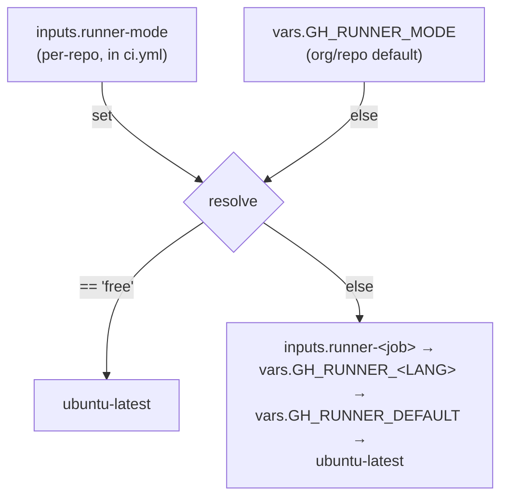

# Runners and the build environment

Two execution modes, one persistent cache. CI runs either on self-hosted ARC runners (Actions Runner Controller on the DevEx RKE2 cluster) or on GitHub-hosted runners.

What the runner image holds and how apt dependencies reach it -- the dep-install SSOT, the YAML schema, the `bake: false` flag -- is [runner-image.md](runner-image.md).

Rebuilding that image, redeploying the scale sets and rolling a dep-install change across the fleet are in [arc-operations.md](arc-operations.md).

## Runner modes

| Mode | Runners | Cache | Toolchain |
|---|---|---|---|
| `self-hosted` | ARC runners on the DevEx RKE2 cluster | persistent NFS sccache/ccache | pre-baked in the runner image |
| `free` | GitHub-hosted `ubuntu-latest` | none between runs | installed per-job by `setup-runtime` |

`free` mode lets any GitHub org use hyperi-ci's reusable workflows with no
self-hosted infrastructure - builds just take longer (cold compile, per-job
toolchain install). Mode is resolved highest-wins:


```mermaid
flowchart TD
    A["inputs.runner-mode<br/>(per-repo, in ci.yml)"] -->|set| R{resolve}
    B["vars.GH_RUNNER_MODE<br/>(org/repo default)"] -->|else| R
    R -->|"== 'free'"| F["ubuntu-latest"]
    R -->|else| S["inputs.runner-&lt;job&gt; →<br/>vars.GH_RUNNER_&lt;LANG&gt; →<br/>vars.GH_RUNNER_DEFAULT →<br/>ubuntu-latest"]
```

**The org variables are the SSoT for runner selection.** `GH_RUNNER_DEFAULT`,
`GH_RUNNER_<LANG>`, `GH_RUNNER_ARM64` and friends hold the actual values, and
they are the only thing that can hold them: GitHub evaluates `runs-on` before
any of our code runs, so a YAML file in this repo could never be consulted at
selection time. Change a runner with `gh variable set`, not a commit.

```bash
gh variable list --org hyperi-io          # what is set now
gh variable set GH_RUNNER_RUST --org hyperi-io --body arc-native-16cpu
```

A repo overrides the org default with a repo-level variable of the same name,
or per job with the `runner-quality` / `runner-build` workflow inputs.

`GH_RUNNER_CPP` is set org-wide to `arc-native-16cpu`. Nothing reads it yet -
there is no C++ reusable workflow, only the LLVM and GCC toolchains the native
image bakes - so a C++ job names it in `runs-on` directly. It is declared now so
the answer is already agreed when that workflow lands, rather than someone
picking a runner ad hoc.

`ubuntu-latest` is the last-resort literal in every expression. It is only
reached when the org variable is unset; with `GH_RUNNER_DEFAULT` set, every repo
gets a self-hosted runner without asking.

## The runner vocabulary

The self-hosted fleet is ARC scale sets carrying two axes:

| Axis | Value | Meaning |
|---|---|---|
| type | `vanilla` | stock runner + internal CA + docker CLI + uv. Fast start. |
| type | `native` | vanilla plus the compiler estate - rustup stable and nightly, the cargo tools, Go, Node, LLVM/GCC, the aarch64 cross toolchain, and the shared sccache/crate cache. |
| type | `debian` | vanilla, on Debian Trixie. For .deb builds, which have to happen on the distro they target. No toolchain. |
| size | `4cpu` | matches the stock GitHub ubuntu runner |
| size | `16cpu` | the step up |

**A job addresses a scale set by NAME, and the name states both axes:**

| Name | Use |
|---|---|
| `arc-vanilla-4cpu` | what a repo gets when it asks for nothing |
| `arc-vanilla-16cpu` | grunt without the compiler estate |
| `arc-native-4cpu` | a hyperi-ci project that is not Rust or C++: it wants the pre-baked toolchain, not sixteen cores to run ruff |
| `arc-native-16cpu` | Rust and C++ |
| `arc-debian-4cpu` | .deb packaging |
| `arc-debian-16cpu` | .deb packaging that needs the cores |

Not by label, and that is measured rather than assumed: a `runs-on` naming a
LABEL queues forever with the listener reporting `assigned job=0`, while the
same job naming the scale set spawns runner pods in seconds. GitHub holds the
scale set registration server-side and the listener reconnects to it, so the
labels on the Kubernetes resource are not what a job matches against.

The practical consequence: a `runs-on` value must be one of the names above,
exactly. **Anything else matches nothing and the job queues SILENTLY** - it does
not fail, it waits, which is a far worse thing to debug. The full deployed
matrix lives in hyperi-infra `ansible/playbooks/k8s-arc-runners.yml`.

The native image is ~21 GB either way, so prefer a vanilla set when nothing in
the compiler estate is actually needed.

## Self-hosted runner tiers

ARC runner scale sets are sized in tiers. The k8s manifests in hyperi-infra
are the SSoT; the sizing, for reference:

| Tier | CPUs | RAM | maxRunners | Typical use |
|---|---|---|---|---|
| 2cpu | 2 | 4Gi | 20 | lint, test, publish, tag |
| 4cpu | 4 | 8Gi | 10 | Python / Node.js builds, small Rust crates |
| 8cpu | 8 | 16Gi | 5 | medium Rust / C++ builds, integration tests |
| 16cpu | 16 | 28Gi | 3 | large Rust / C++ release builds, ClickHouse |

## Split-runner multi-arch

Multi-arch builds use **native runners per architecture**, not
cross-compilation:

| Arch | Runner | Source var |
|---|---|---|
| x86_64 (amd64) | ARC self-hosted | `GH_RUNNER_RUST` / `GH_RUNNER_DEFAULT` |
| aarch64 (arm64) | GitHub `ubuntu-24.04-arm` | `GH_RUNNER_ARM64` |

**Why not cross-compile?** Cross-compilation with C/C++ deps (librdkafka, zlib,
openssl) needs a private sysroot with transitive dependency resolution - fragile,
each new native dep breaks differently. Native arm64 runners eliminate the whole
problem class.

**When does arm64 build?** Only on a run that releases. The arm64 leg is added
when `will-release` is true (`rust-ci.yml`, *Generate build matrix*) - the
release channel plays no part. Every other run that builds stays x64, so the
dev cycle stays fast and skips the arm64 runner cost.

| Run | Architectures |
|---|---|
| PR with `branch-build`, or a validate-only dispatch | x64 |
| release run (`Release: true` trailer, or a release dispatch) | x64 + arm64 |

A push to main with no trailer builds nothing at all - `run-build` is
release-only, so no leg runs whatever the matrix says.

A Rust project narrows that with `build.rust.targets` in `.hyperi-ci.yaml`: the
release matrix carries a leg only for a listed target, so a project whose
release build does not fit `ubuntu-24.04-arm` lists `x86_64-unknown-linux-gnu`
alone and ships amd64. The build legs do not fail fast, so a leg that dies on
its runner leaves the other's artefact in place.

Applies across languages: Rust/Go build native per arch. Python wheels and
TypeScript are arch-independent (single runner). Python Nuitka builds native.

## Build cache (Rust, C/C++)

Compilation caches persist across ephemeral runner pods via a shared NFS-backed
PersistentVolume - the primary mechanism for fast Rust/C++ builds.

| Variable | Value | Purpose |
|---|---|---|
| `SCCACHE_DIR` | `/mnt/cache/sccache` | sccache compilation cache (NFS) |
| `RUSTC_WRAPPER` | `sccache` | route rustc through sccache |
| `CCACHE_DIR` | `/mnt/cache/ccache` | C/C++ cache (NFS) |
| `CARGO_INCREMENTAL` | `0` | disabled - incompatible with sccache |
| `CARGO_REGISTRIES_CRATES_IO_PROTOCOL` | `sparse` | faster registry metadata |
| `LDFLAGS` | `-fuse-ld=mold` | mold linker (replaces slow ld.bfd) |

Package-manager metadata caches (Cargo registry, uv, pip, npm) use local
`emptyDir` volumes - metadata-heavy I/O performs poorly over NFS and repopulates
quickly. The cache is **disposable**: if the NFS volume is lost, the only impact
is slower first builds (which is why NFS `async` mode is used). A cold Rust build
with C deps takes much longer than a warm one - the cache is the difference.

uv caching (`setup-uv enable-cache`) is on only in `python-ci.yml`, where there
are real Python deps to cache. Non-Python workflows use uv solely to deliver
`uvx hyperi-ci`, so caching is off to avoid spurious "no cache files" warnings.

Rust `target/` persists in the pod `emptyDir` across the steps of a job. The
wrong-arch object-cleanup path (`_clean_stale_sys_crates()` in Rust `build.py`)
guards cache integrity for cross-compile edge cases - see
[lessons.md](../lessons.md) ("ARC Persistent Cache + Rust Cross-Compilation").

Infrastructure (PV/PVC, runner tiers, Dockerfile, Ansible) lives in
`hyperi-infra` (`k8s/`, `containers/arc-runner/`, `ansible/`). Runner tiers scale
to zero when idle and are ephemeral - one job per pod.

## Cross-compilation (legacy - dormant)

With the split-runner architecture, cross-compilation is no longer used for
standard multi-arch builds. The sysroot code stays in `build.py` but only
activates when a build target differs from the host arch - which never happens
with native runners. It remains for edge cases (e.g. RISC-V): builds native
first, installs only Multi-Arch-safe cross-compilers system-wide, assembles a
private sysroot under `/tmp/cross-sysroot/<arch>/` (no sudo), and wraps the
linker to force `-fuse-ld=bfd` + sysroot `-L`/`-rpath-link` flags. See
[lessons.md](../lessons.md) for the full rationale and gotchas.
