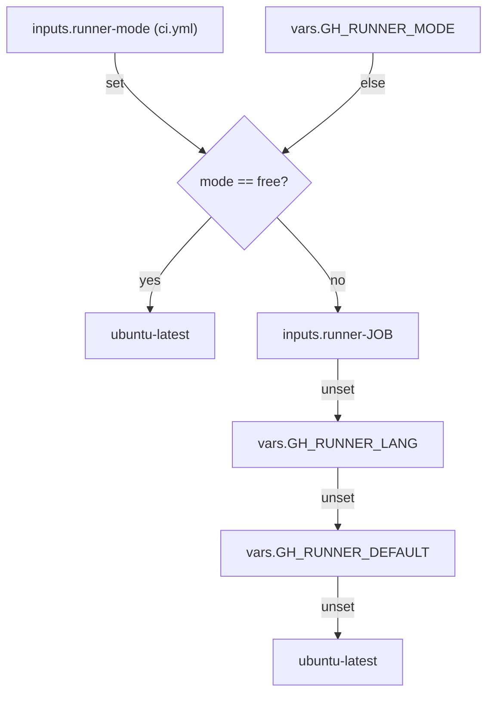

# Runners and the build environment

CI runs on self-hosted ARC runners (Actions Runner Controller on the DevEx RKE2 cluster) or on GitHub-hosted runners. What the runner image holds and how apt dependencies reach it is [runner-image.md](runner-image.md). Rebuilding it and redeploying the scale sets is [arc-operations.md](arc-operations.md).

## Runner policy

- x64 jobs run on ARC.
- arm64 jobs run on GitHub-hosted runners. ARC has no arm64 nodes.
- Anything else is a project-specific exception, set as a repo-level variable on that repo only.
- Every build ships x64 and arm64 by default: binaries, packages and GHCR images (`release.container.platforms` lists `linux/amd64` and `linux/arm64`). Single-arch is a project exception too.

The GitHub-hosted x64 larger runners exist so x64 can move off ARC with a variable change: [hosted-larger-runners.md](hosted-larger-runners.md). They are not the fix for a failing ARC job. Fix the ARC runner.

## Runner modes

| Mode | Runners | Cache | Toolchain |
|---|---|---|---|
| `self-hosted` | ARC runners on the DevEx RKE2 cluster | persistent NFS sccache/ccache | pre-baked in the runner image |
| `free` | GitHub-hosted `ubuntu-latest` | none between runs | installed per job by `setup-runtime` |

`free` lets any GitHub org use the reusable workflows with no self-hosted infrastructure, at the cost of cold compiles and per-job toolchain installs. Resolution, highest wins:


```mermaid
flowchart TD
    A["inputs.runner-mode (ci.yml)"] -->|set| R{"mode == free?"}
    B["vars.GH_RUNNER_MODE"] -->|else| R
    R -->|yes| F["ubuntu-latest"]
    R -->|no| J["inputs.runner-JOB"]
    J -->|unset| L["vars.GH_RUNNER_LANG"]
    L -->|unset| D["vars.GH_RUNNER_DEFAULT"]
    D -->|unset| U["ubuntu-latest"]
```

**The org variables are the SSoT for runner selection.** GitHub evaluates `runs-on` before any of our code runs, so no file in this repo can be consulted at selection time. Change a runner with `gh variable set`, not a commit:

```bash
gh variable list --org hyperi-io          # what is set now
gh variable set GH_RUNNER_RUST --org hyperi-io --body arc-native-16cpu
```

A repo overrides the org default with a repo-level variable of the same name, or per job with the `runner-quality` / `runner-build` workflow inputs. `ubuntu-latest` is reached only when the variables are unset. With `GH_RUNNER_DEFAULT` set, every repo gets a self-hosted runner without asking.

There is no C++ reusable workflow. The org `GH_RUNNER_CPP` variable is read by nothing, and #517 covers deleting it.

### Which chain each job takes

| Job | Chain | Why |
|---|---|---|
| Quality, Test, Build | renovate carve-out -> `free` -> `runner-<job>` input -> `GH_RUNNER_<LANG>` -> `GH_RUNNER_DEFAULT` -> `ubuntu-latest` | needs the language toolchain |
| Plan, Commit messages, Gate | `free` -> `GH_RUNNER_DEFAULT` -> `ubuntu-latest` | needs only git, python3 and uv, which vanilla carries. No renovate carve-out: `GH_RUNNER_RENOVATE` is a heavier set than the default |
| Release tail | `free` -> `GH_RUNNER_PUBLISH` -> `GH_RUNNER_DEFAULT` -> `ubuntu-latest` | see `_release-tail.yml` |
| arm64 build leg | `GH_RUNNER_ARM64` -> `ubuntu-24.04-arm` | `free` does not change it |

Plan reads `.hyperi-ci.yaml` inside the `predict-version` composite, which runs every config reader under `uv run --with pyyaml` (version: `tools.pyyaml` in `versions.yaml`). No image needs PyYAML or yq. A config that exists and cannot be read raises a `::warning::` naming the file, and its settings take their defaults.

If uv cannot install or cannot fetch PyYAML, the readers fall back to the runner's python3 with a `config readers` warning. A registry outage degrades Plan to defaults rather than failing it.

## The runner vocabulary

The self-hosted fleet is ARC scale sets on two axes:

| Axis | Value | Meaning |
|---|---|---|
| type | `vanilla` | stock runner + internal CA + docker CLI + uv. Fast start. |
| type | `native` | vanilla plus the compiler estate - rustup stable and nightly, the cargo tools, Go, Node, LLVM/GCC, the aarch64 cross toolchain, and the shared sccache/crate cache. |
| type | `debian` | vanilla on Debian Trixie, for .deb builds, which have to happen on the distro they target. No toolchain. |
| size | `4cpu` | matches the stock GitHub ubuntu runner |
| size | `8cpu`, `16cpu` | the steps up |

**A job addresses a scale set by NAME, `arc-<type>-<size>`**, for example:

| Name | Use |
|---|---|
| `arc-vanilla-4cpu` | what a repo gets when it asks for nothing |
| `arc-vanilla-16cpu` | grunt without the compiler estate |
| `arc-native-4cpu` | a hyperi-ci project that is not Rust: it wants the toolchain, not sixteen cores to run ruff |
| `arc-native-16cpu` | Rust |
| `arc-debian-4cpu` | .deb packaging |

All nine type and size pairs exist. The full deployed matrix, including legacy `arc-runner-*` names, is in hyperi-infra `ansible/playbooks/k8s-arc-runners.yml`.

A `runs-on` naming a LABEL queues forever with the listener reporting `assigned job=0`, because GitHub matches the scale-set registration, not the Kubernetes labels. **Any value that is not a set name queues SILENTLY.** It does not fail, it waits.

The native image is about 21 GB, so prefer a vanilla set when nothing in the compiler estate is needed.

## Self-hosted runner tiers

The hyperi-infra manifests are the SSoT, including each set's `maxRunners`. Sizing as read from the live AutoscalingRunnerSets on 2026-10-03:

| Tier | CPUs | RAM | Typical use |
|---|---|---|---|
| 4cpu | 4 | 8Gi | lint, test, publish, tag; Python / Node.js builds, small Rust crates |
| 8cpu | 8 | 16Gi | medium Rust builds, integration tests |
| 16cpu | 16 | 24Gi | large Rust release builds, ClickHouse |

There is no 2cpu tier. GitHub-hosted equivalents: [hosted-larger-runners.md](hosted-larger-runners.md).

cargo starts one rustc per CPU whatever the memory, and 16cpu has 1.5Gi per CPU. So every Rust stage caps `CARGO_BUILD_JOBS` at the memory limit over `build.rust.memory_per_job_gib` (default 2). That gives 12 jobs on 16cpu, 8 on 8cpu and 4 on 4cpu. A workspace with multi-GiB crates raises it (6 gives 4 jobs).

The limit comes from cgroup v2 `memory.max`, then cgroup v1 `memory.limit_in_bytes`, then total RAM, and the stage log names the source. `build.rust.jobs: <n>` fixes the count. `CARGO_BUILD_JOBS` already in the environment is never touched, and a cargo-config `[build] jobs` is left alone unless `build.rust.jobs` is set.

## Split-runner multi-arch

Multi-arch builds use a native runner per architecture:

| Arch | Runner | Source var |
|---|---|---|
| x86_64 (amd64) | ARC self-hosted | `GH_RUNNER_RUST` / `GH_RUNNER_DEFAULT` |
| aarch64 (arm64) | GitHub `ubuntu-24.04-arm` | `GH_RUNNER_ARM64` |

Cross-compiling with C/C++ deps (librdkafka, zlib, openssl) needs a private sysroot with transitive dependency resolution, and each new native dep breaks it differently. Native arm64 runners remove that class of failure.

The arm64 leg is added on every run that builds at all, when `run-build` is true (`rust-ci.yml`, *Generate build matrix*). The release channel plays no part, so arm64 code runs before the run meant to ship it (issue #249).

| Run | Architectures |
|---|---|
| PR with `branch-build`, or a validate-only dispatch | x64 + arm64 |
| release run (`Release: true` trailer, or a release dispatch) | x64 + arm64 |
| release-worthy push to main, no trailer | arm64 only |
| `chore:` / `docs:` push to main | nothing builds |

The arm64-only row is the parity check (`run-arm64-check`). A merge that WILL ship gets its arm64 leg compiled while a regression is still attributable, and nothing is published. `build.rust.arm64_on_main: false` opts out.

`build.rust.targets` in `.hyperi-ci.yaml` narrows the matrix to the listed targets. A project whose release build does not fit `ubuntu-24.04-arm` lists `x86_64-unknown-linux-gnu` alone and ships amd64. The legs do not fail fast, so one dying leaves the other's artefact in place.

Go builds native per arch too. Python wheels and TypeScript are arch-independent and use one runner.

## Build cache (Rust, C/C++)

Compilation caches persist across ephemeral runner pods on a shared NFS-backed PersistentVolume.

| Variable | Value | Purpose |
|---|---|---|
| `SCCACHE_DIR` | `/mnt/cache/sccache` | sccache compilation cache (NFS) |
| `RUSTC_WRAPPER` | `sccache` | route rustc through sccache. The profile-use PGO and BOLT steps set `""`, because sccache loses a reply carrying a crate's missing-profile warnings and cargo waits forever |
| `CCACHE_DIR` | `/mnt/cache/ccache` | C/C++ cache (NFS) |
| `CARGO_INCREMENTAL` | `0` | incompatible with sccache. The `cargo llvm-cov` test run sets `1`, because with it off llvm-cov reports "mismatched data" for cross-crate-inlined functions. That run also sets `RUSTC_WRAPPER=""` |
| `CARGO_REGISTRIES_CRATES_IO_PROTOCOL` | `sparse` | faster registry metadata |
| `LDFLAGS` | `-fuse-ld=mold` | mold linker in place of ld.bfd |

Package-manager metadata caches (Cargo registry, uv, pip, npm) use local `emptyDir` volumes, because metadata-heavy I/O is slow over NFS. The NFS cache is disposable: losing it costs slower first builds, which is why it mounts `async`.

Of the language workflows, only `python-ci.yml` sets `enable-uv-cache` on the `setup-runtime` composite. The others use uv only to run `uvx hyperi-ci`.

Rust `target/` persists in the pod `emptyDir` across a job's steps, and `_clean_stale_sys_crates()` in Rust `build.py` removes wrong-arch objects from it. The PV/PVC, Dockerfile and Ansible live in hyperi-infra (`k8s/`, `containers/arc-runner/`, `ansible/`). Runners are ephemeral, one job per pod, and scale to zero when idle.

## Cross-compilation (legacy - dormant)

The sysroot code in `build.py` runs only when a build target differs from the host arch, which native runners never hit. It stays for edge cases such as RISC-V, and builds a private sysroot under `.tmp/cross-sysroot/` in the workspace. Rationale and gotchas: [lessons.md](../lessons.md).
