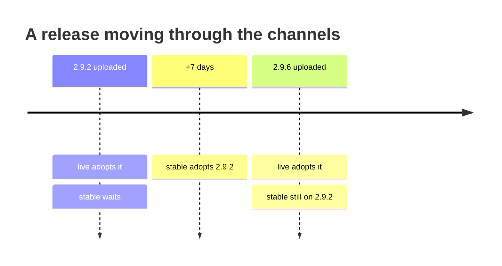

# Self-update: channels, freeze, and the gates

hyperi-ci keeps itself current. Every invocation may check PyPI, upgrade the
installed tool, and re-exec your command in the new binary -- so the CLI on a
laptop matches the one baked into the runner image without anyone remembering
to upgrade.

Which release it aims at is the **channel's** decision. Same two names as
hyperi-ai, so one mental model covers both tools:

| Channel | Takes | For |
|---|---|---|
| `live` (default) | the newest release on PyPI, as soon as it exists | keeping up; what maintainers run |
| `stable` | the newest release aged past the 7-day cooldown | a machine that should not move under you |

```bash
hyperi-ci autoupdate                      # status (JSON)
hyperi-ci autoupdate channel              # print the current channel + source
hyperi-ci autoupdate channel stable       # opt into the soak window
hyperi-ci autoupdate disable              # stop auto-update, keep the channel
hyperi-ci autoupdate freeze               # kill-switch: nothing updates
hyperi-ci autoupdate unfreeze
hyperi-ci upgrade                         # upgrade now, to the channel's release
hyperi-ci upgrade 2.9.4                   # install exactly this (see below)
```

## It is a package, not a clone

hyperi-ai's `live` follows its clone's `main` HEAD, so a commit is available the
moment it lands. hyperi-ci is a PyPI package: `live` means the newest
**published release**. Neither channel sees unreleased commits.

`stable` ages releases by **PyPI upload time**, not tag date -- the soak window
measured at the point a consumer can observe it, namely when the artefact became
installable. Same 7 days as the Actions pin cooldown in
[dependencies/DEPS-PINNING.md](dependencies/deps-pinning.md).



While `stable` lags, the upgrade installs that exact version
(`uv tool install --force --refresh hyperi-ci==2.9.2`), which lands in uv's
receipt as a pin -- so a hand-run `uv tool upgrade hyperi-ci` will answer
"Nothing to upgrade" until the lag clears. Once the soak catches up, the
resolved target is the newest release again and the plain `@latest` form is
used, leaving no pin behind.

Switching to `stable` while already ahead of the soak window does **not** roll
the install back. The channel holds the version still; it never downgrades. Only
an explicit `hyperi-ci upgrade <version>` installs something older.

## Where the state lives

`~/.config/hyperi-ci/channel.json` -- the channel and the enable flag --
plus `~/.config/hyperi-ci/frozen` for the kill-switch.

With no channel of its own, hyperi-ci reads **hyperi-ai's**
(`~/.config/hyperi-ai/channel.json`) as the default, because a machine that has
configured that has already stated its intent. The read is one-way: hyperi-ci
never writes into hyperi-ai's config, and `hyperi-ci autoupdate channel ...`
always wins locally. `autoupdate status` reports `channel_source` as
`hyperi-ci`, `hyperi-ai` or `default` so an inherited choice is visible.

hyperi-ai's two retired names for `live`, `edge` and `nightly`, are accepted and
normalised. Installs that predate the renames still have them in that file.

Freeze spans both tools: hyperi-ci treats hyperi-ai's `frozen` flag as its own,
because a frozen machine means nothing should move. `unfreeze` clears only
hyperi-ci's flag and says so when the sibling's is still set.

## The gates

Auto-update runs only when every gate passes, in this precedence:

| Gate | Blocks when | Notes |
|---|---|---|
| `recursion-guard` | `_HYPERCI_UPGRADING=1` | set on the re-exec |
| `explicit-command` | the command is `upgrade` or `autoupdate` | managing it is not using it |
| `frozen` | either tool's freeze flag is set | outranks every opt-in below |
| `env-disabled` | `HYPERCI_AUTO_UPDATE=false` | what CI images set |
| `ci` | a CI environment, without `HYPERCI_AUTO_UPDATE=true` | |
| `disabled` | `autoupdate disable` was run | `HYPERCI_AUTO_UPDATE=true` overrides it |
| `recently-checked` | the last check was under 4 hours ago | |

`autoupdate status` reports the first gate that blocks as `blocked_by`, from the
`frozen` row down. It deliberately skips the top two: they describe the command
you just typed rather than the machine's configuration, so reporting them would
answer a question nobody asked.

`HYPERCI_AUTO_UPDATE` still works and still wins over the stored flag, being the
more immediate statement. `autoupdate disable` is the discoverable equivalent
for a workstation.

## An explicit version is not a pin

`hyperi-ci upgrade 2.9.4` installs 2.9.4 and warns, because auto-update clears
the receipt pin it leaves and moves back to the channel target within 4 hours.
To hold a version, hold auto-update: `hyperi-ci autoupdate freeze`.

## Failure modes worth knowing

All three were live, all three are now covered by tests.

**A zero exit code is not evidence.** `uv tool upgrade` exits 0 when it declines
to act, so the upgrade path confirms the version by re-reading it from the
installer (`uv tool list` / `pip show`) rather than from `__version__` -- a
process upgrading itself still has the old one imported. That is why
`autoupdate status` reports `running` and `installed` separately. No timestamp
is written on an unconfirmed upgrade: writing one is what let a stuck install go
quiet for four hours at a time.

**`@latest` resolves against uv's cached index.** PyPI served 2.9.6 while
`tool install --force hyperi-ci@latest` installed 2.9.5, and only `--refresh`
saw it. Both uv paths carry `--refresh`. pip has no index-only refresh, so it is
left alone and the post-check reports stale metadata instead.

`hyperi-ci upgrade` deliberately does not re-exec. It has no original command to
carry on with, and re-exec'ing meant running `upgrade` again in the new binary --
which, in a binary old enough to trust a zero exit code, re-execs on every
"Nothing to upgrade" and never terminates.
