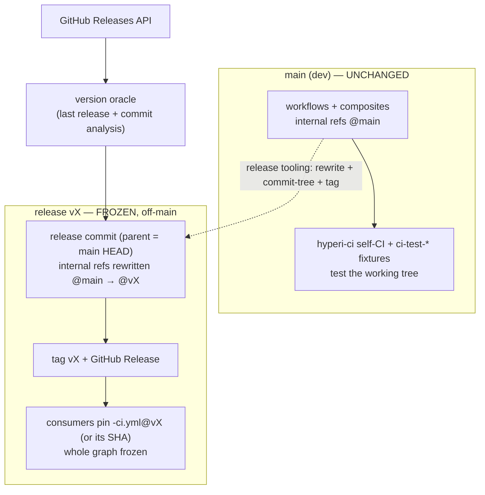

# Atomic frozen CI graph (issue #31, Phase 2 — "A-decouple")

**Status:** spec for review. Phase 1 (interface backward-compat gate) shipped
2026-05-29. This is the structural fix.

## Goal

Pinning `<lang>-ci.yml@<ref>` freezes the **entire transitive graph**
(sibling reusable workflows + composites) to that release. A breaking change
on `main` can never retroactively break a pinned consumer. Dev on `main` stays
on `@main` (testable, unchanged loop). No tag-orphaning.

## Why "A-decouple"

Two past bugs share one root — **coupling correctness to a mutable git ref**:

- tag-orphaning: version oracle trusted *tags reachable from main*.
- #31: the workflow graph trusts *`@main` siblings*.

A-decouple removes the reachability coupling, which fixes #31 **and** immunises
against the orphaning class for good. The cost is reworking the version oracle
(load-bearing) — hence spec-first.

## Design — two tracks

- **main is never rewritten.** The frozen graph is a release commit whose parent
  is main HEAD, reachable only via the tag. `git commit-tree` builds it; we push
  the **tag**, not a branch.
- **Consumers** pin one ref; its internals are `@vX`, so the graph is atomic +
  auditable. Renovate digest-pins the caller as today.

## Components

1. **Version oracle (release-based).** Replace the `semantic-release --dry-run`
   in `predict-version` with: read last release from the GitHub Releases API →
   list commits since its target SHA → apply the conventional-commit
   `releaseRules` (reuse the SSoT in `setup-semantic-release/default.releaserc.json`)
   → emit `next-version`. No git-tag reachability anywhere.
2. **Internal-ref freezer.** `hyperi-ci freeze-internals <vX>` rewrites every
   `hyperi-io/hyperi-ci/.github/(workflows|actions)/<name>@main` → `@vX`, then
   **verifies zero `@main` internal refs remain** (a missed ref = a floating
   hole). Deterministic; mirrors the `update-versions.py` rewrite style.
3. **Release tagger (off-main).** Build the release commit (main tree + frozen
   internals, parent = main HEAD), tag `vX`, push the tag, create the GitHub
   Release. Replaces semantic-release's tag step. `@semantic-release/*` retained
   only for notes generation, or dropped if the oracle emits notes.
4. **Wiring.** `_release-tail` / the release job calls oracle → freezer →
   tagger. The Phase 1 interface gate stays (defence in depth within a line).

## Phasing

- **2a** — build + unit-test the oracle; **parity-test** it against the current
  semantic-release output over real history (must agree before swap).
- **2b** — `freeze-internals` + the zero-`@main` verification; unit-tested.
- **2c** — off-main tagger behind a flag; validate on `ci-test-*`: pin a fixture
  to release vX, land a **breaking** internal change on main, confirm the fixture
  **still runs green** (proves frozen).
- **2d** — cut the first frozen release; migrate consumer pins (Renovate);
  retire the semantic-release tag step.

## Risks

| Risk | Mitigation |
|---|---|
| Oracle replaces load-bearing semantic-release | parity-test vs current output before swap; reuse the same releaseRules SSoT |
| A missed `@main` ref leaves a floating hole | freezer verifies zero internal `@main` remain; the Phase 1 gate is a second net |
| Off-main release commit pruned | it's tag-reachable; never prune; don't-delete-tags rule already in force |
| GH Releases API as version SSoT | hyperi-ci publish already creates a GH Release per version |

## Acceptance (from #31)

Pin a `ci-test-*` fixture to `<lang>-ci.yml@vX`; land a breaking internal change
on hyperi-ci `main`; the fixture run is **unaffected** (reproducible, green).
And no consumer breakage is possible from `main` drift.

## Interactions

- **Phase 1 gate** stays — cheap protection against accidental interface breaks
  even within a release line.
- **Renovate** unchanged (digest-pins the caller; org PR-only policy holds).
- **/deps (`update-versions.py`)** unchanged for external action pins; the new
  freezer handles *internal* hyperi-ci refs (a different concern).
- **Zero-config tagger** unchanged for consumers; this is purely how hyperi-ci
  tags *itself*.
