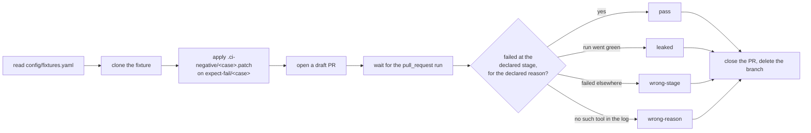

# Negative cases - proving a gate BLOCKS, not just that it passes

A sweep over clean fixtures shows a gate passes on clean input. It cannot tell a
blocking gate from a warn-only one, or from a gate that never ran: all three are
the same green tick. `scripts/negative-cases.py` runs trees that DO carry the
defect and refuses the ones that go green.

## What a case is

Data on the fixture's `main`, under `.ci-negative/`, never a long-lived bad
branch. Two files per case:

| File | What it holds |
|---|---|
| `<case>.patch` | the diff that plants the failure, applied to `main` |
| `<case>.yaml` | `expect`, `stage`, `reason`, and the branch to use |

```yaml
case: hadolint-error
patch: hadolint-error.patch
branch: expect-fail/hadolint-error
expect: fail
stage: quality
reason: hadolint
```

Keeping the defect as a patch means `main` stays clean, so Dependabot never
opens a PR against a deliberately vulnerable manifest.

`config/fixtures.yaml` marks the fixtures that carry cases with
`negative_cases: true`, and the runner reads that SSoT rather than a list of its
own. A fixture marked there with no readable contract is reported as a problem,
not skipped - otherwise the fleet reports a gate as proven by nothing.

## What the runner does



`leaked`, `wrong-stage` and `wrong-reason` are all RED through
`sweep-fleet.py`'s `sweep_verdict`, which is the one place a fleet verdict is
decided. A case that could not be read, or whose run was cancelled, is
INCONCLUSIVE rather than either.

## A PULL REQUEST, not a push

hyperi-ci's plan job sets `run-checks=false` for a push to a non-main branch,
and skips the quality job for a non-bumping commit type. So a bare branch push
finishes green in seconds having run no gate, which the runner would read as a
leak. Measured on `ci-test-manifests`: the push run for `expect-fail/hadolint-error`
concluded SUCCESS while the pull_request run on the same commit failed at
Quality. The runner therefore opens a draft PR and reads that run, and commits
with a release-worthy `fix:` type.

A fixture job outside the reusable workflow is not gated that way. The
`lint-manifests` case fails on a push as well, but the runner still goes through
a PR so every case is read the same way.

## Matching the declared stage

GitHub reports a job's DISPLAY name, never its YAML key, so `stage` is matched by
word against the failed job's name, and then against the names of the steps that
failed inside it. `quality` matches `ci / Quality`; `lint-manifests` matches the
failed step `Lint manifests, charts and IaC`. Only FAILED steps count - a job
that died before reaching the gate did not run the gate.

## Where it runs

In the `Fleet sweep` workflow, not on every PR: the full fleet is nine fixtures,
four of them on 16-cpu ARC runners, and putting that on every PR was rejected on
cost. The negative job runs even when the sweep itself is red, because a red
sweep is when "do the gates still block" matters most.

By hand:

```bash
uv run scripts/negative-cases.py --dry-run
uv run scripts/negative-cases.py --only ci-test-manifests
uv run scripts/negative-cases.py --case hadolint-error --keep
```

## Testing a gate that has not shipped yet

A fixture takes its workflows from `@main` the moment they merge, but its CLI
from PyPI on release. A case for a CLI-side gate still in a branch therefore
fails for the wrong reason until the CLI is pinned:

```bash
uv run scripts/negative-cases.py --cli-branch fix/my-gate
```

That sets `HYPERCI_INSTALL_OVERRIDE` on each fixture for the run and puts the
previous value back afterwards - `ci-test-manifests` carries a permanent one
pinning `@main`, and deleting it would change what the fixture runs. The sweep's
own App has no `variables: write`, so `--cli-branch` is a developer command, the
same split as `scripts/rehearse-branch.py`.

## Never repair one

Everything under `.ci-negative/`, and every `expect-fail/*` branch, is a
DELIBERATE failure with a DO-NOT-FIX header. Repairing one silently disarms the
gate it proves. [CONTRIBUTING.md](../../CONTRIBUTING.md#for-coding-agents) makes
that binding on coding agents.
