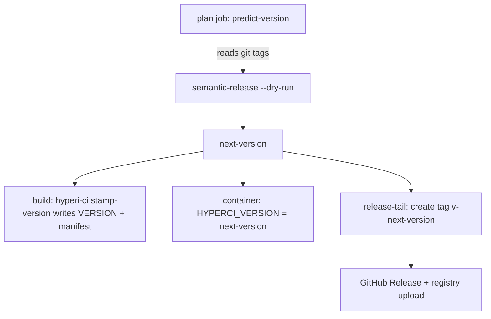

<!--
Project:   HyperI CI
File:      docs/versioning.md
Purpose:   Where a version comes from, and which files are outputs

License:   BUSL-1.1 — HYPERI PTY LIMITED
Copyright: (c) 2026 HYPERI PTY LIMITED
-->

# Versioning

## The git tag is the only truth

A `v*` git tag says a version was released. Nothing else does. Tag-on-publish
means a tag exists iff the artefact is in the registry, so the tag list is the
release history -- the same convention kubernetes, rust and python use.

Everything else that carries a version number is an **output**:

| File | Written by | Read as truth? |
|------|-----------|----------------|
| `VERSION` | `hyperi-ci stamp-version`, at build time | No |
| `CHANGELOG.md` | `@semantic-release/changelog`, at release time | No |
| `Cargo.toml` / `pyproject.toml` / `package.json` version | `stamp-version`, at build time | Only to seed a tag-less repo |
| The git tag | `tag-head` / semantic-release, at publish time | **Yes** |

Reading an output as an input is what issue #85 was about: `VERSION` froze at
`2.3.10` in May 2026 across 14 repos, and every code path that fell back to it
computed from a value dozens of releases stale.

## What resolves a version, and when



`HYPERCI_VERSION` carries the plan job's answer to every downstream job, so all
of them agree. `common.resolve_release_version` is the single reader:
`HYPERCI_VERSION` -> `VERSION` (written moments earlier by the stamp step) ->
latest `v*` tag. Do not re-implement it per stage.

## A repo with no tags

Exactly one question a tag cannot answer: what should the FIRST tag be?

The answer comes from what the project already declares about itself --
`pyproject.toml` `[project] version`, `Cargo.toml` `[package] version` (or
`[workspace.package]`), `package.json` `version`. A project with nothing to
declare (Go has no manifest version; a `dynamic = ["version"]` Python project
has no static one) starts at **`0.1.0`**: no declaration means no stability
promise, and semver reserves `0.x` for that.

```bash
hyperi-ci seed-version            # 0.1.0
hyperi-ci seed-version --source   # 0.1.0	default
hyperi-ci seed-tag --dry-run      # what it would create, and from where
hyperi-ci seed-tag                # create it
```

`hyperi-ci init` seeds the tag automatically (`--no-seed-tag` to skip). It is
idempotent: a repo with any `v*` tag already has its truth, and seeding declines
rather than adding a second opinion.

The seed tag is a **starting marker, not a release** -- its message says so.
The first publish bumps from it, so tag-on-publish stays honest: no seed tag
ever claims an artefact.

The same value feeds the first release. On a tag-less repo `predict-version`
ships it verbatim (semantic-release would otherwise default to `1.0.0`), while
the forced `--bump patch|minor` paths bump *from* it -- a bump is a bump, even
against a declared start.

## VERSION

A generated artefact. `hyperi-ci stamp-version <version>` writes it before the
build so the compiled binary embeds the right number (`CARGO_PKG_VERSION`, Go's
`-ldflags -X`, `importlib.metadata.version`).

It **is** committed back, by CI, at the end of a successful publish -- the
`Commit rendered release artefacts` step in `_release-tail.yml`, which runs
`hyperi-ci release-commit`. Never edit it by hand; the next release overwrites
whatever you write.

That commit-back is deliberately not `@semantic-release/git`, which did the job
until May 2026 and was dropped because it created the release tag **on its own
bot commit**: a later force-push orphaned the tag, and the next release
recomputed the same version and died on `tag vX already exists` (issue #37).

`release-commit` avoids that by construction:

- it runs **after** the tag exists, at the real commit;
- it only ever adds an **untagged** commit, so no tag can point at
  machine-authored history;
- it writes through the GitHub Git Data API, so it works from the
  `persist-credentials: false` checkout;
- it never force-updates the ref, so a concurrent push is a retry rather than an
  overwrite;
- an identical tree is a no-op, so a re-run adds nothing.

The build back-end no longer depends on the file being present or fresh.
`build_version()` in `version_source.py` resolves `HYPERCI_VERSION` -> `VERSION`
-> latest `v*` tag -> seed version, so a fresh clone builds and the run's
predicted version always wins.

To see what a checkout would release:

```bash
git describe --tags --abbrev=0     # the last released version
hyperi-ci --version                # what this checkout would build as, if editable
```

## CHANGELOG.md

Rendered by `@semantic-release/changelog` during the release, and committed back
by the same `release-commit` step. Release notes also appear on the **GitHub
Releases page**, one per tag.

Entries below 2.4.0 predate the plugin removal; the gap between 2.3.10 and the
version that restored this is not recoverable from the file, only from the
Releases page.

## After the release lands

Two steps close the loop, both idempotent and both `continue-on-error` -- a
notification must never turn an already-shipped release red:

| Step | What it does |
|------|--------------|
| `release-notify --outcome success` | Comments on every issue and PR referenced by the commits in the release |
| `release-notify --outcome failure` | Opens (or reuses) a `release-failure` issue naming the run and the retry command |

These replace what `@semantic-release/github`'s `success` / `fail` steps would
do; that plugin is never loaded, being the other half of the #37 pair.

Slack is off unless `notify.slack.webhook_env` names an environment variable
holding a webhook URL. The URL never goes in config -- config is committed.

## Before the release starts

`hyperi-ci preflight` runs in the plan job on a publish run: semantic-release's
`verifyConditions` equivalent. It checks only the destinations the project
actually publishes to, and blocks only where the handler hard-fails without the
credential.

| Destination | Missing credential |
|-------------|--------------------|
| crates.io | **blocks** -- `cargo publish` cannot authenticate |
| npm | **blocks** -- `npm publish` cannot authenticate |
| PyPI | warns -- the upload falls back to OIDC trusted publishing |
| Cloudflare R2 | warns -- binaries reach GitHub Releases but not downloads.hyperi.io |

A Rust binary app is never asked for a crates.io token: its publish handler
returns early whatever `destinations_oss.cargo` says. Outside CI the whole check
is a no-op.

## Forcing a release

Commits that aren't release-worthy under conventional-commits rules still
sometimes need to ship (a docs-only PR, a forced rebuild):

```bash
hyperi-ci push --bump-patch    # +0.0.1 from the latest tag
hyperi-ci push --bump-minor    # +0.1.0 from the latest tag
hyperi-ci publish --version 2.9.10   # explicit, to step past a taken tag
```

Major bumps are excluded on purpose -- they need a human-written breaking-change
footer.

## See also

- [architecture.md](architecture.md) -- the job graph these versions flow through
- [flow.md](flow.md) -- the publish sequence end to end
- [migration/onboarding.md](migration/onboarding.md) -- adopting hyperi-ci
