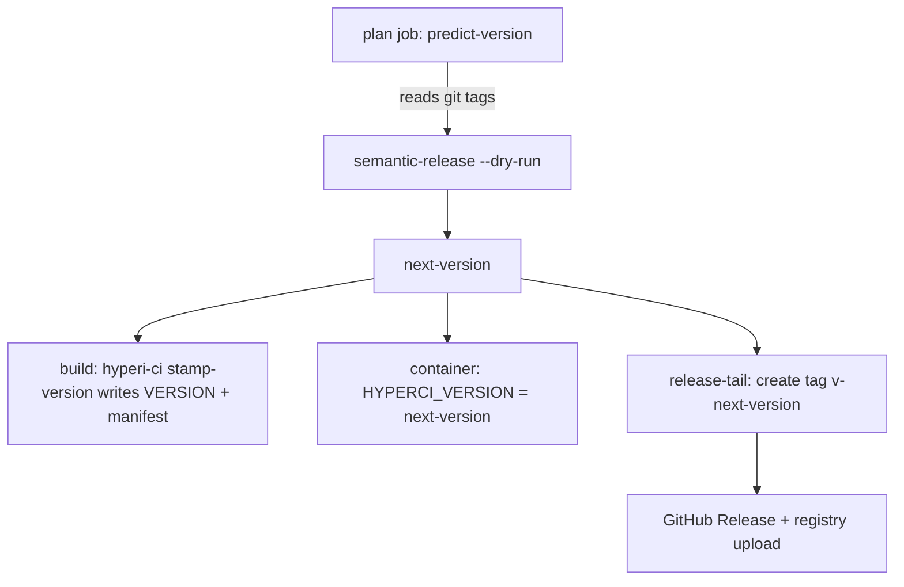

<!--
Project:   HyperI CI
File:      docs/versioning.md
Purpose:   Where a version comes from, and which files are outputs

License:   BUSL-1.1 — HYPERI PTY LIMITED
Copyright: (c) 2026 HYPERI PTY LIMITED
-->

# Versioning

## The git tag is the only truth

A `v*` git tag says a version was released. Nothing else does. Tag-on-publish
means a tag exists iff the artefact is in the registry, so the tag list is the
release history -- the same convention kubernetes, rust and python use.

Everything else that carries a version number is an **output**:

| File | Written by | Read as truth? |
|------|-----------|----------------|
| `VERSION` | `hyperi-ci stamp-version`, at build time | No |
| `CHANGELOG.md` | Nothing, since May 2026 | No |
| `Cargo.toml` / `pyproject.toml` / `package.json` version | `stamp-version`, at build time | Only to seed a tag-less repo |
| The git tag | `tag-head` / semantic-release, at publish time | **Yes** |

Reading an output as an input is what issue #85 was about: `VERSION` froze at
`2.3.10` in May 2026 across 14 repos, and every code path that fell back to it
computed from a value dozens of releases stale.

## What resolves a version, and when



`HYPERCI_VERSION` carries the plan job's answer to every downstream job, so all
of them agree. `common.resolve_release_version` is the single reader:
`HYPERCI_VERSION` -> `VERSION` (written moments earlier by the stamp step) ->
latest `v*` tag. Do not re-implement it per stage.

## A repo with no tags

Exactly one question a tag cannot answer: what should the FIRST tag be?

The answer comes from what the project already declares about itself --
`pyproject.toml` `[project] version`, `Cargo.toml` `[package] version` (or
`[workspace.package]`), `package.json` `version`. A project with nothing to
declare (Go has no manifest version; a `dynamic = ["version"]` Python project
has no static one) starts at **`0.1.0`**: no declaration means no stability
promise, and semver reserves `0.x` for that.

```bash
hyperi-ci seed-version            # 0.1.0
hyperi-ci seed-version --source   # 0.1.0	default
hyperi-ci seed-tag --dry-run      # what it would create, and from where
hyperi-ci seed-tag                # create it
```

`hyperi-ci init` seeds the tag automatically (`--no-seed-tag` to skip). It is
idempotent: a repo with any `v*` tag already has its truth, and seeding declines
rather than adding a second opinion.

The seed tag is a **starting marker, not a release** -- its message says so.
The first publish bumps from it, so tag-on-publish stays honest: no seed tag
ever claims an artefact.

The same value feeds the first release. On a tag-less repo `predict-version`
ships it verbatim (semantic-release would otherwise default to `1.0.0`), while
the forced `--bump patch|minor` paths bump *from* it -- a bump is a bump, even
against a declared start.

## VERSION

A generated artefact. `hyperi-ci stamp-version <version>` writes it before the
build so the compiled binary embeds the right number (`CARGO_PKG_VERSION`, Go's
`-ldflags -X`, `importlib.metadata.version`).

It is **not** committed back after a release. Until May 2026 the
`@semantic-release/git` plugin did that; it was dropped because it tagged its
own bot commit, and a later force-push orphaned that tag, so the next release
recomputed the same version and died on `tag vX already exists` (issue #37).

So the copy committed in git is stale in every repo, and that is expected. Do
not read it, do not hand-edit it, and do not treat it as the project's version.
To see what a checkout would release, ask the tool:

```bash
git describe --tags --abbrev=0     # the last released version
hyperi-ci --version                # the CLI's own version, and its checkout if editable
```

Remaining work on this (issue #85): stopping the file being committed at all
needs each repo's build back-end to take its version from somewhere else first
-- hyperi-ci's own `pyproject.toml` declares
`[tool.hatch.version] path = "VERSION"`, so deleting the file breaks `uv build`
outright.

## CHANGELOG.md

Release notes live on the **GitHub Releases page**, one per tag, generated by
semantic-release at publish time.

The committed `CHANGELOG.md` stopped being written by the same plugin removal,
so it covers 2.3.10 and earlier only. It carries a header saying so.

## Forcing a release

Commits that aren't release-worthy under conventional-commits rules still
sometimes need to ship (a docs-only PR, a forced rebuild):

```bash
hyperi-ci push --bump-patch    # +0.0.1 from the latest tag
hyperi-ci push --bump-minor    # +0.1.0 from the latest tag
hyperi-ci publish --version 2.9.10   # explicit, to step past a taken tag
```

Major bumps are excluded on purpose -- they need a human-written breaking-change
footer.

## See also

- [architecture.md](architecture.md) -- the job graph these versions flow through
- [flow.md](flow.md) -- the publish sequence end to end
- [migration/onboarding.md](migration/onboarding.md) -- adopting hyperi-ci
